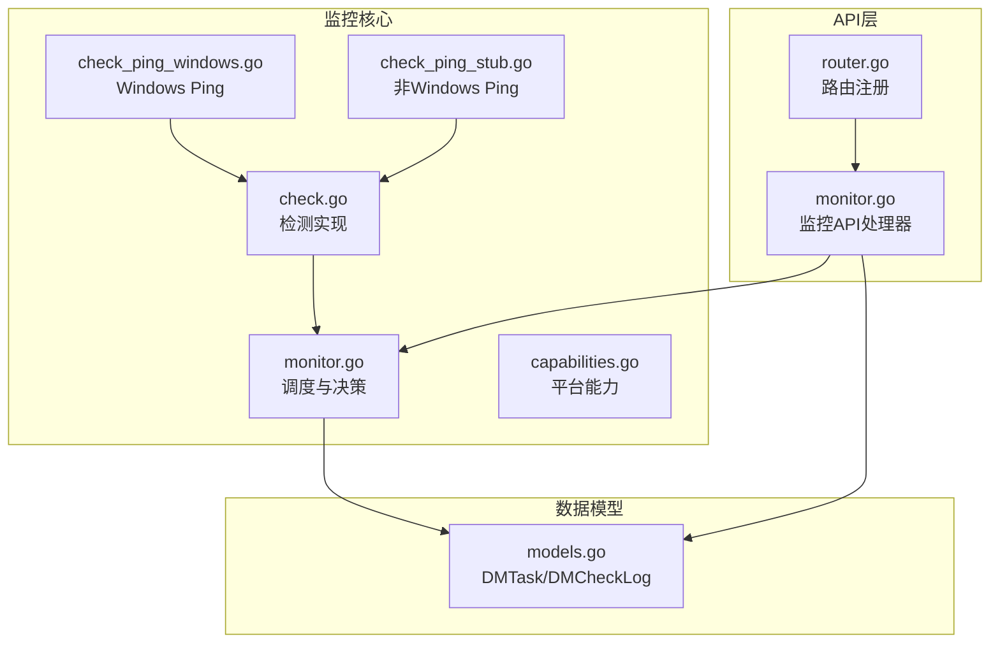
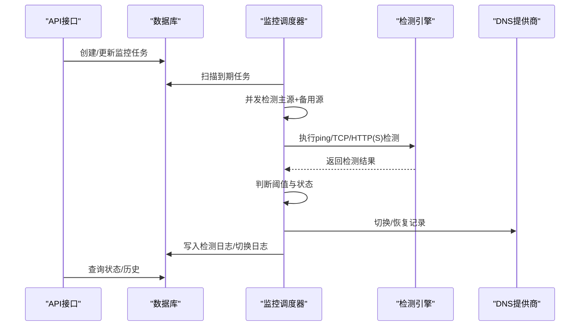
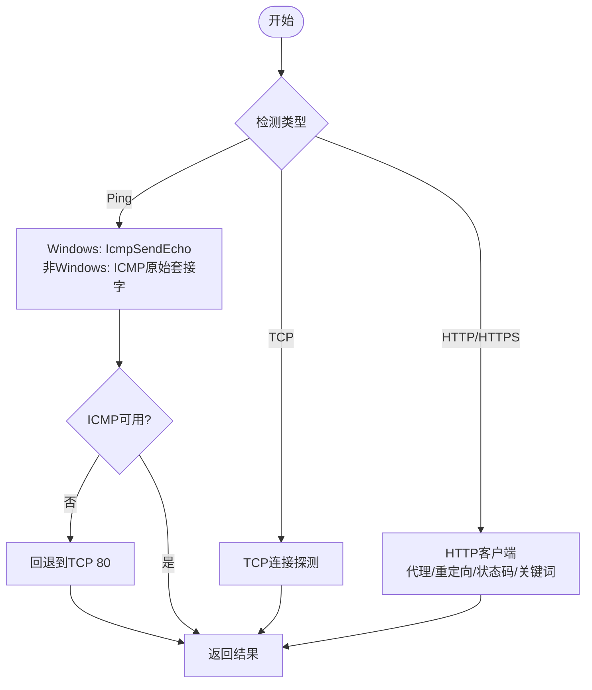
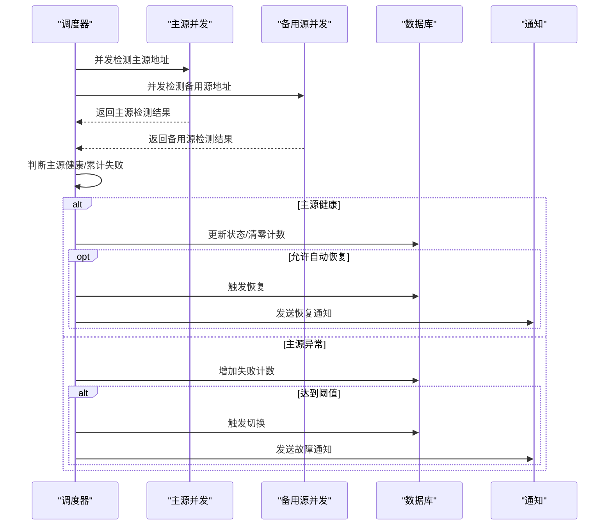
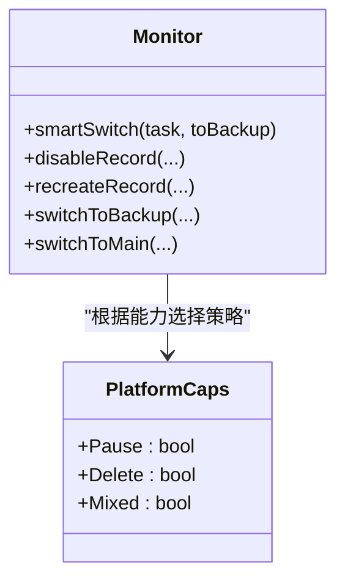
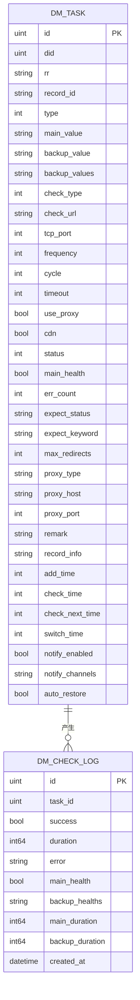
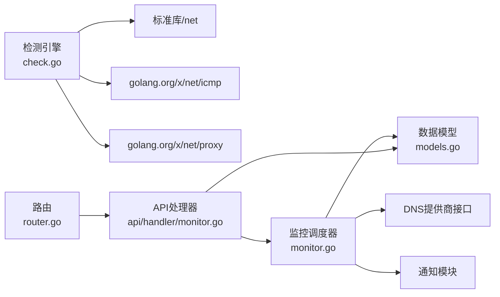

# 健康检查机制

<cite>
**本文档引用的文件**
- [check.go](file://main/internal/monitor/check.go)
- [check_ping_stub.go](file://main/internal/monitor/check_ping_stub.go)
- [check_ping_windows.go](file://main/internal/monitor/check_ping_windows.go)
- [monitor.go](file://main/internal/monitor/monitor.go)
- [capabilities.go](file://main/internal/monitor/capabilities.go)
- [models.go](file://main/internal/models/models.go)
- [monitor.go](file://main/internal/api/handler/monitor.go)
- [router.go](file://main/internal/api/router.go)
</cite>

## 目录
1. [简介](#简介)
2. [项目结构](#项目结构)
3. [核心组件](#核心组件)
4. [架构总览](#架构总览)
5. [详细组件分析](#详细组件分析)
6. [依赖关系分析](#依赖关系分析)
7. [性能考量](#性能考量)
8. [故障排查指南](#故障排查指南)
9. [结论](#结论)
10. [附录](#附录)

## 简介
本文件系统性阐述健康检查机制的设计与实现，涵盖以下方面：
- 支持的检测类型：ping检测、TCP连接检测、HTTP/HTTPS检测的工作原理与实现细节
- 每种检测类型的参数配置：超时设置、端口配置、URL参数、期望状态码、重定向控制、代理配置等
- 并发检测机制：如何同时对主源和备用源进行健康检查
- 检测结果处理逻辑：成功/失败判断、错误信息收集、性能指标统计
- 配置最佳实践与故障排查指南

## 项目结构
健康检查相关代码主要位于以下模块：
- 监控核心：main/internal/monitor
- 数据模型：main/internal/models
- API接口：main/internal/api/handler
- 路由定义：main/internal/api/router.go

**图表来源**
- [check.go:1-370](file://main/internal/monitor/check.go#L1-L370)
- [check_ping_windows.go:1-95](file://main/internal/monitor/check_ping_windows.go#L1-L95)
- [check_ping_stub.go:1-11](file://main/internal/monitor/check_ping_stub.go#L1-L11)
- [monitor.go:1-1022](file://main/internal/monitor/monitor.go#L1-L1022)
- [capabilities.go:1-34](file://main/internal/monitor/capabilities.go#L1-L34)
- [models.go:122-178](file://main/internal/models/models.go#L122-L178)
- [monitor.go:1-1148](file://main/internal/api/handler/monitor.go#L1-L1148)
- [router.go:74-84](file://main/internal/api/router.go#L74-L84)

**章节来源**
- [monitor.go:1-114](file://main/internal/monitor/monitor.go#L1-L114)
- [models.go:122-178](file://main/internal/models/models.go#L122-L178)
- [monitor.go:74-84](file://main/internal/api/handler/monitor.go#L74-L84)
- [router.go:14-163](file://main/internal/api/router.go#L14-L163)

## 核心组件
- 检测引擎：提供跨平台的ping、TCP、HTTP/HTTPS检测能力
- 监控调度器：定时扫描任务、并发执行检测、决策切换/恢复
- 平台能力适配：根据DNS提供商能力选择最优切换策略
- 数据持久化：任务配置、检测日志、切换日志
- API接口：任务管理、状态查询、历史统计

**章节来源**
- [check.go:47-370](file://main/internal/monitor/check.go#L47-L370)
- [monitor.go:45-114](file://main/internal/monitor/monitor.go#L45-L114)
- [capabilities.go:1-34](file://main/internal/monitor/capabilities.go#L1-L34)
- [models.go:122-178](file://main/internal/models/models.go#L122-L178)
- [monitor.go:106-155](file://main/internal/api/handler/monitor.go#L106-L155)

## 架构总览
健康检查的整体流程如下：
- API接收任务配置，写入数据库
- 监控服务按频率扫描到期任务
- 并发检测主源与备用源
- 根据检测结果与阈值触发切换或恢复
- 记录检测日志与切换日志，提供状态查询与历史统计

**图表来源**
- [monitor.go:130-318](file://main/internal/monitor/monitor.go#L130-L318)
- [check.go:47-370](file://main/internal/monitor/check.go#L47-L370)
- [models.go:122-178](file://main/internal/models/models.go#L122-L178)
- [monitor.go:106-155](file://main/internal/api/handler/monitor.go#L106-L155)

## 详细组件分析

### 检测引擎（Ping/TCP/HTTP(S)）
- Ping检测
  - Windows：使用原生IcmpSendEcho API，内核级调用，可靠性高
  - 非Windows：使用golang.org/x/net/icmp原始套接字
  - 回退机制：当ICMP不可用时回退到TCP 80端口探测
- TCP检测
  - 基于net.Dialer，支持自定义超时
- HTTP/HTTPS检测
  - 支持HTTP/SOCKS5代理，支持环境代理
  - 支持重定向控制（跟随/禁止/限制次数）
  - 支持期望状态码（多值）、响应正文关键词匹配
  - 支持CDN场景下的HostIP改写

**图表来源**
- [check.go:47-163](file://main/internal/monitor/check.go#L47-L163)
- [check_ping_windows.go:13-77](file://main/internal/monitor/check_ping_windows.go#L13-L77)
- [check_ping_stub.go:7-10](file://main/internal/monitor/check_ping_stub.go#L7-L10)

**章节来源**
- [check.go:47-370](file://main/internal/monitor/check.go#L47-L370)
- [check_ping_windows.go:1-95](file://main/internal/monitor/check_ping_windows.go#L1-L95)
- [check_ping_stub.go:1-11](file://main/internal/monitor/check_ping_stub.go#L1-L11)

### 并发检测与决策
- 并发策略
  - 主源与备用源分别使用WaitGroup并发执行
  - 每个地址一个goroutine，互不影响
- 结果聚合
  - 主源任一失败即判定主源整体失败
  - 备用源聚合健康映射，便于后续选择
- 决策逻辑
  - 主源健康：若处于故障态且允许自动恢复，则尝试恢复
  - 主源异常：累计失败次数达到阈值后触发切换
  - 切换/恢复后记录日志并发送通知

**图表来源**
- [monitor.go:154-318](file://main/internal/monitor/monitor.go#L154-L318)
- [models.go:122-178](file://main/internal/models/models.go#L122-L178)

**章节来源**
- [monitor.go:154-318](file://main/internal/monitor/monitor.go#L154-L318)

### 平台能力适配
不同DNS提供商支持的能力不同，影响切换策略：
- 暂停记录：某些平台支持直接暂停，否则回退到删除
- 删除记录：大多数平台支持删除
- 混合记录：支持A+CNAME混合记录的平台可采用更灵活策略

**图表来源**
- [capabilities.go:1-34](file://main/internal/monitor/capabilities.go#L1-L34)
- [monitor.go:376-443](file://main/internal/monitor/monitor.go#L376-L443)

**章节来源**
- [capabilities.go:1-34](file://main/internal/monitor/capabilities.go#L1-L34)
- [monitor.go:376-443](file://main/internal/monitor/monitor.go#L376-L443)

### API与配置
- 任务配置字段
  - 基础：域名ID、RR、记录ID、类型、主源、备用源、检测类型、URL、端口、频率、周期、超时
  - HTTP(S)：期望状态码、期望关键词、最大重定向、代理类型/主机/端口/凭据、是否使用环境代理、CDN模式
  - 其他：自动恢复、通知开关、备注、记录信息
- API接口
  - 创建/更新/删除/启用/切换/批量创建
  - 获取概览、状态、历史、可用率统计
  - 查看任务列表、日志、实时解析状态

**图表来源**
- [models.go:122-178](file://main/internal/models/models.go#L122-L178)
- [monitor.go:157-206](file://main/internal/api/handler/monitor.go#L157-L206)

**章节来源**
- [models.go:122-178](file://main/internal/models/models.go#L122-L178)
- [monitor.go:157-206](file://main/internal/api/handler/monitor.go#L157-L206)
- [monitor.go:106-155](file://main/internal/api/handler/monitor.go#L106-L155)

## 依赖关系分析
- 检测引擎依赖标准库与第三方库（golang.org/x/net/icmp、golang.org/x/net/proxy）
- 监控调度器依赖数据库模型、DNS提供商接口、通知模块
- API层依赖监控服务与数据库访问层

**图表来源**
- [check.go:3-20](file://main/internal/monitor/check.go#L3-L20)
- [monitor.go:3-17](file://main/internal/monitor/monitor.go#L3-L17)
- [monitor.go:3-23](file://main/internal/api/handler/monitor.go#L3-L23)
- [router.go:14-163](file://main/internal/api/router.go#L14-L163)

**章节来源**
- [check.go:3-20](file://main/internal/monitor/check.go#L3-L20)
- [monitor.go:3-17](file://main/internal/monitor/monitor.go#L3-L17)
- [monitor.go:3-23](file://main/internal/api/handler/monitor.go#L3-L23)
- [router.go:14-163](file://main/internal/api/router.go#L14-L163)

## 性能考量
- 并发优化
  - 主源与备用源并发执行，缩短整体检测时间
  - WaitGroup保证结果聚合与资源回收
- 超时与重定向
  - 合理设置超时，避免长时间阻塞
  - HTTP重定向限制，防止无限跳转
- 日志与统计
  - 限制历史点数量，避免接口响应缓慢
  - 仅统计可见范围内的可用率，提高准确性

[本节为通用性能建议，无需特定文件引用]

## 故障排查指南
- 常见问题定位
  - Ping失败：检查目标IP可达性、防火墙策略、ICMP权限；观察回退到TCP 80的结果
  - TCP失败：确认端口开放、超时设置合理、网络连通性
  - HTTP(S)失败：检查URL、代理配置、重定向链路、期望状态码、关键词匹配
- 参数校验
  - 频率过短导致频繁检测，建议≥10秒
  - 超时过短导致误判，建议≥2秒
  - 重定向次数建议≤3，避免复杂链路
- 平台差异
  - 某些平台不支持暂停，会回退到删除策略
  - CDN场景下需启用CDN模式并正确设置HostIP
- 日志与监控
  - 查看检测日志与切换日志，定位失败原因
  - 使用可用率统计评估稳定性趋势

**章节来源**
- [check.go:24-37](file://main/internal/monitor/check.go#L24-L37)
- [monitor.go:130-318](file://main/internal/monitor/monitor.go#L130-L318)
- [monitor.go:26-27](file://main/internal/api/handler/monitor.go#L26-L27)
- [monitor.go:789-808](file://main/internal/api/handler/monitor.go#L789-L808)

## 结论
该健康检查机制通过跨平台检测、并发执行、平台能力适配与完善的日志统计，实现了对DNS主备源的自动化监控与切换。合理配置参数与遵循最佳实践，可显著提升系统的可用性与稳定性。

[本节为总结性内容，无需特定文件引用]

## 附录

### 检测类型与参数详解
- Ping检测
  - 参数：目标IP、超时（秒）
  - 行为：Windows原生API；非Windows使用ICMP原始套接字；不可用时回退TCP 80
- TCP检测
  - 参数：主机/IP、端口、超时（秒）
  - 行为：基于net.Dialer建立连接
- HTTP/HTTPS检测
  - 参数：URL、超时（秒）、期望状态码（逗号分隔）、期望关键词、最大重定向、代理类型/主机/端口/凭据、是否使用环境代理、CDN模式
  - 行为：支持HTTP/SOCKS5代理；限制重定向；匹配状态码与关键词；CDN场景改写HostIP

**章节来源**
- [check.go:24-37](file://main/internal/monitor/check.go#L24-L37)
- [check.go:47-370](file://main/internal/monitor/check.go#L47-L370)
- [monitor.go:320-374](file://main/internal/monitor/monitor.go#L320-L374)

### 并发检测与结果处理
- 并发策略：主源与备用源分别并发，每个地址独立goroutine
- 成功/失败判断：主源任一失败即整体失败；备用源聚合健康映射
- 错误信息收集：记录首个失败地址及错误详情
- 性能指标统计：记录主/备检测耗时、总耗时、错误摘要

**章节来源**
- [monitor.go:154-244](file://main/internal/monitor/monitor.go#L154-L244)

### 配置最佳实践
- 频率：建议≥10秒，避免过度检测
- 超时：建议≥2秒，兼顾准确性与及时性
- 重定向：建议≤3，避免复杂链路
- 代理：优先明确代理配置，必要时使用环境代理
- CDN：启用CDN模式并正确设置HostIP
- 自动恢复：仅在确认切换后可恢复的场景启用

**章节来源**
- [monitor.go:208-263](file://main/internal/api/handler/monitor.go#L208-L263)
- [monitor.go:294-371](file://main/internal/api/handler/monitor.go#L294-L371)
- [monitor.go:605-707](file://main/internal/api/handler/monitor.go#L605-L707)