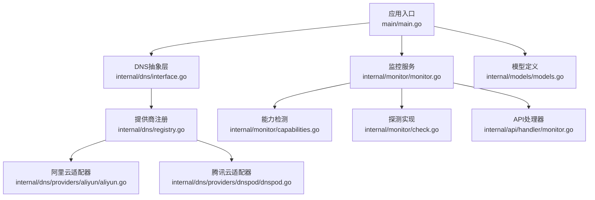
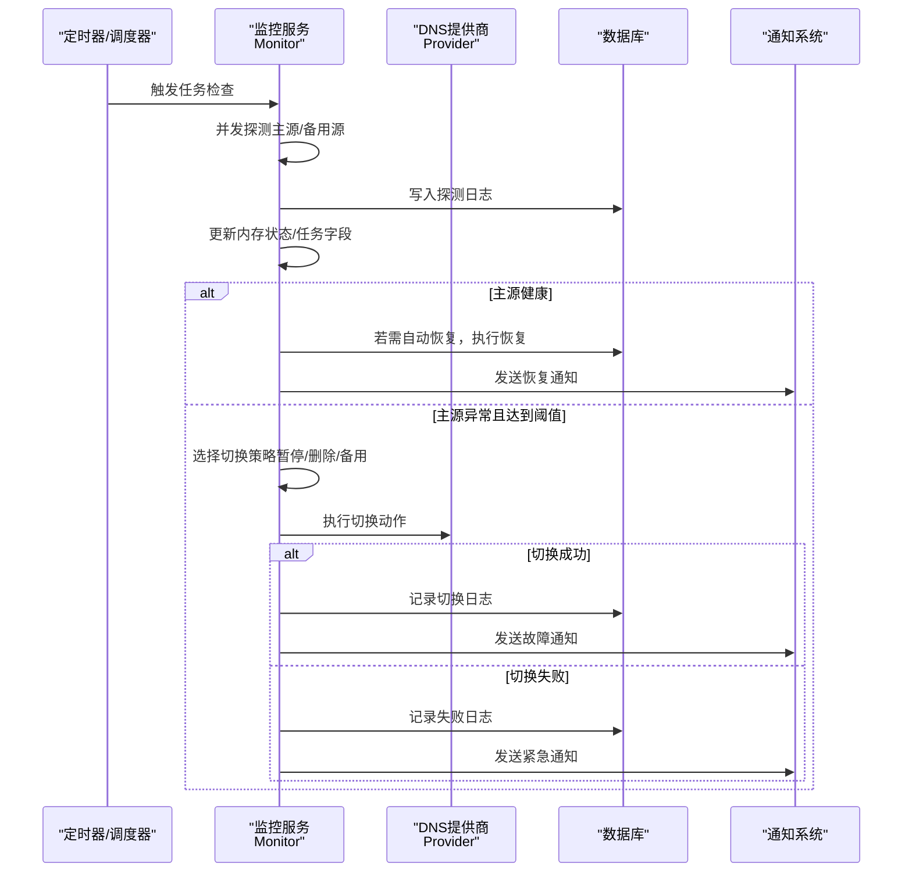
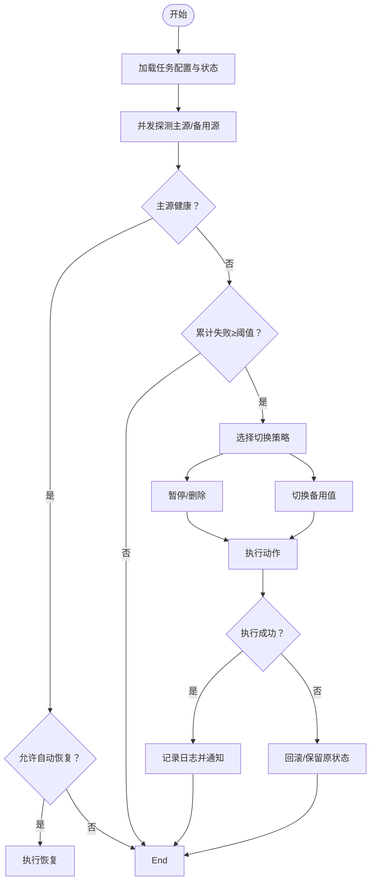
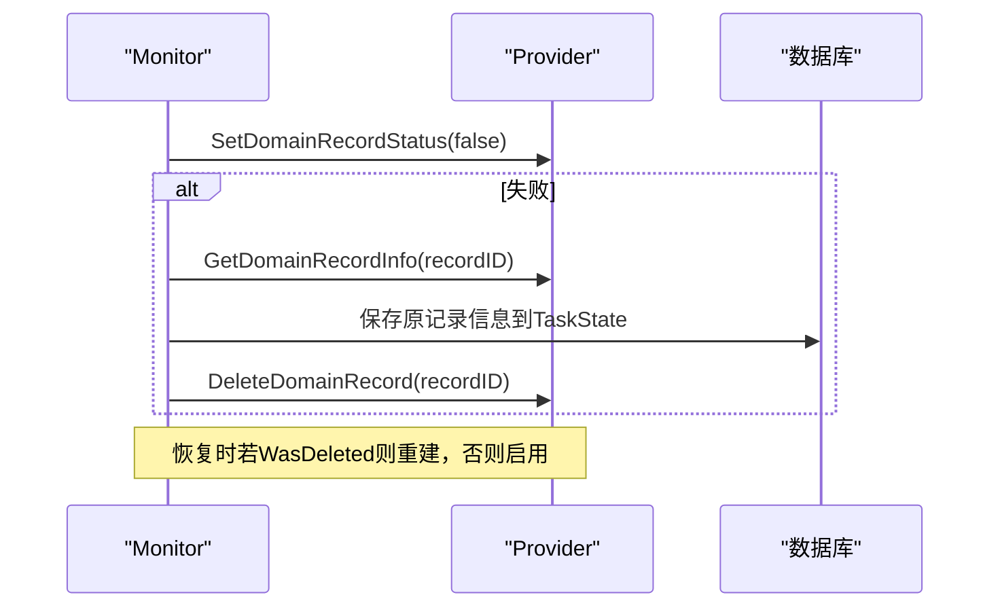
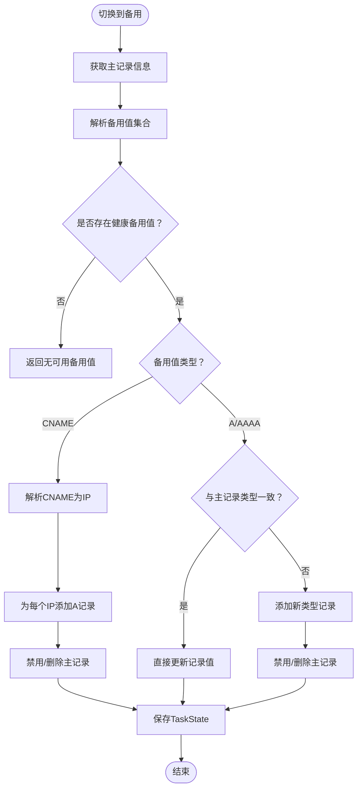
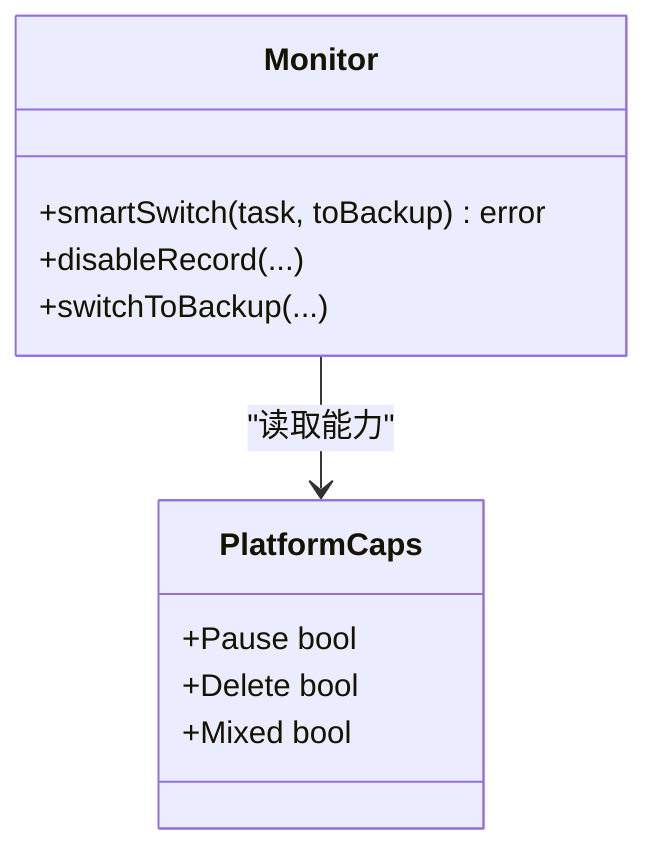
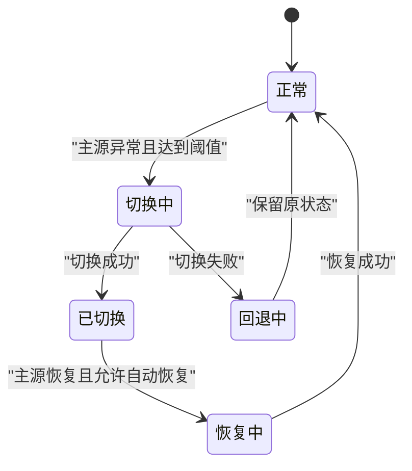
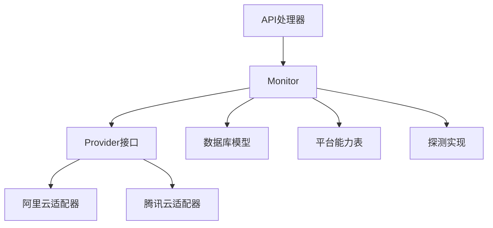

# 故障切换逻辑

<cite>
**本文引用的文件**
- [main.go](file://main/main.go)
- [interface.go](file://main/internal/dns/interface.go)
- [registry.go](file://main/internal/dns/registry.go)
- [monitor.go](file://main/internal/monitor/monitor.go)
- [capabilities.go](file://main/internal/monitor/capabilities.go)
- [check.go](file://main/internal/monitor/check.go)
- [models.go](file://main/internal/models/models.go)
- [aliyun.go](file://main/internal/dns/providers/aliyun/aliyun.go)
- [dnspod.go](file://main/internal/dns/providers/dnspod/dnspod.go)
- [monitor.go（API处理器）](file://main/internal/api/handler/monitor.go)
</cite>

## 目录
1. [简介](#简介)
2. [项目结构](#项目结构)
3. [核心组件](#核心组件)
4. [架构总览](#架构总览)
5. [详细组件分析](#详细组件分析)
6. [依赖关系分析](#依赖关系分析)
7. [性能考量](#性能考量)
8. [故障排查指南](#故障排查指南)
9. [结论](#结论)
10. [附录](#附录)

## 简介
本技术文档围绕“故障切换逻辑”展开，系统性阐述智能切换算法的实现原理、决策流程与回滚策略，覆盖三种切换策略（暂停/恢复、删除/重建、切换备用值）、DNS提供商能力检测机制、状态管理与CNAME特殊处理、以及切换失败的回滚与错误处理。文档同时提供可视化图示，帮助读者快速理解各模块之间的交互关系。

## 项目结构
本项目采用分层与功能模块化组织，核心与监控相关的关键目录如下：
- main/main.go：应用入口，初始化数据库、缓存、监控、任务管理器等
- main/internal/dns：DNS抽象层与各厂商适配器注册
- main/internal/monitor：容灾监控与切换逻辑
- main/internal/models：数据库模型定义（DMTask、DMCheckLog、DMLog等）
- main/internal/api/handler：对外API处理器（任务创建、切换、查询等）

**图示来源**
- [main.go:52-147](file://main/main.go#L52-L147)
- [interface.go:40-86](file://main/internal/dns/interface.go#L40-L86)
- [registry.go:17-56](file://main/internal/dns/registry.go#L17-L56)
- [monitor.go:46-114](file://main/internal/monitor/monitor.go#L46-L114)
- [capabilities.go:10-33](file://main/internal/monitor/capabilities.go#L10-L33)
- [check.go:47-130](file://main/internal/monitor/check.go#L47-L130)
- [models.go:122-164](file://main/internal/models/models.go#L122-L164)
- [aliyun.go:14-49](file://main/internal/dns/providers/aliyun/aliyun.go#L14-L49)
- [dnspod.go:14-49](file://main/internal/dns/providers/dnspod/dnspod.go#L14-L49)
- [monitor.go（API处理器）:440-485](file://main/internal/api/handler/monitor.go#L440-L485)

**章节来源**
- [main.go:52-147](file://main/main.go#L52-L147)

## 核心组件
- DNS抽象层与提供商注册
  - 抽象接口Provider定义了统一的增删改查、状态控制、线路与最小TTL等能力
  - 提供商注册中心负责工厂函数与配置导出，支持多厂商动态扩展
- 容灾监控服务
  - 周期性扫描到期任务，异步并发探测主源与备用源，生成健康状态
  - 基于阈值与状态进行智能切换/恢复，记录日志并发送通知
- 数据模型
  - DMTask：监控任务配置与状态
  - DMCheckLog：探测历史
  - DMLog：切换/恢复日志
- 探测与能力检测
  - 支持Ping/TCP/HTTP/HTTPS探测，具备代理、重定向、状态码与关键词校验
  - 平台能力表决定是否支持暂停、删除、A/CNAME混合等

**章节来源**
- [interface.go:40-125](file://main/internal/dns/interface.go#L40-L125)
- [registry.go:17-56](file://main/internal/dns/registry.go#L17-L56)
- [monitor.go:46-114](file://main/internal/monitor/monitor.go#L46-L114)
- [models.go:122-187](file://main/internal/models/models.go#L122-L187)
- [check.go:24-370](file://main/internal/monitor/check.go#L24-L370)
- [capabilities.go:10-33](file://main/internal/monitor/capabilities.go#L10-L33)

## 架构总览
下图展示从任务触发到切换执行的端到端流程，包括探测、决策、执行与回滚路径。

**图示来源**
- [monitor.go:130-318](file://main/internal/monitor/monitor.go#L130-L318)
- [monitor.go:376-443](file://main/internal/monitor/monitor.go#L376-L443)
- [monitor.go:445-670](file://main/internal/monitor/monitor.go#L445-L670)
- [monitor.go:735-791](file://main/internal/monitor/monitor.go#L735-L791)

## 详细组件分析

### 智能切换算法与决策过程
- 决策输入
  - 任务配置：主值、备用值、探测类型、频率、阈值、超时、CDN、代理等
  - 平台能力：是否支持暂停、删除、A/CNAME混合
  - 实时健康状态：主源健康、备用源健康映射
- 决策规则
  - 主源健康：若处于切换状态且允许自动恢复，则执行恢复
  - 主源异常：累计失败次数达到阈值后，进入切换流程
  - 切换策略选择：依据平台能力与记录类型（A/AAAA/CNAME）选择最优路径
- 执行与回滚
  - 成功：更新任务状态、记录日志、发送通知
  - 失败：记录失败日志、发送紧急通知、保留原状态以便后续人工干预

**图示来源**
- [monitor.go:257-318](file://main/internal/monitor/monitor.go#L257-L318)
- [monitor.go:376-443](file://main/internal/monitor/monitor.go#L376-L443)
- [monitor.go:445-670](file://main/internal/monitor/monitor.go#L445-L670)

**章节来源**
- [monitor.go:130-318](file://main/internal/monitor/monitor.go#L130-L318)
- [monitor.go:376-443](file://main/internal/monitor/monitor.go#L376-L443)

### 切换策略详解

#### 策略一：暂停/恢复（优先暂停，不支持则删除）
- 执行路径
  - 暂停：调用SetDomainRecordStatus(false)
  - 失败回退：GetDomainRecordInfo获取原记录信息，DeleteDomainRecord删除
- 恢复路径
  - 若原记录被删除：recreateRecord按原记录信息重建
  - 若原记录存在：SetDomainRecordStatus(true)启用

**图示来源**
- [monitor.go:445-484](file://main/internal/monitor/monitor.go#L445-L484)
- [monitor.go:486-519](file://main/internal/monitor/monitor.go#L486-L519)

**章节来源**
- [monitor.go:445-484](file://main/internal/monitor/monitor.go#L445-L484)
- [monitor.go:486-519](file://main/internal/monitor/monitor.go#L486-L519)

#### 策略二：删除/重建
- 执行路径
  - 备用：GetDomainRecordInfo保存原记录信息，DeleteDomainRecord删除
  - 恢复：recreateRecord按原记录信息重建，更新record_id
- 适用场景
  - 平台不支持暂停或暂停失败时的兜底方案

**章节来源**
- [monitor.go:418-433](file://main/internal/monitor/monitor.go#L418-L433)
- [monitor.go:486-519](file://main/internal/monitor/monitor.go#L486-L519)

#### 策略三：切换备用值（A/AAAA/CNAME）
- 执行路径
  - 备用：选择首个健康备用值；若为CNAME，解析为IP并添加A记录，禁用/删除主记录
  - 备用值为IP：类型一致直接UpdateDomainRecord；类型不一致则添加新记录并禁用/删除主记录
  - 恢复：清理备用记录，若原记录被删除则recreateRecord，否则启用或回写主值
- CNAME特殊处理
  - isCNAME判断是否为域名
  - resolveCNAME递归解析至IP，支持深度限制
  - 备用为CNAME时，会为每个解析到的IP添加A记录作为备用

**图示来源**
- [monitor.go:521-628](file://main/internal/monitor/monitor.go#L521-L628)
- [monitor.go:963-1003](file://main/internal/monitor/monitor.go#L963-L1003)
- [check.go:360-369](file://main/internal/monitor/check.go#L360-L369)

**章节来源**
- [monitor.go:521-628](file://main/internal/monitor/monitor.go#L521-L628)
- [monitor.go:963-1003](file://main/internal/monitor/monitor.go#L963-L1003)
- [check.go:360-369](file://main/internal/monitor/check.go#L360-L369)

### DNS提供商能力检测机制
- 能力矩阵
  - 不同提供商支持的能力不同，例如暂停、删除、A/CNAME混合等
  - 通过GetPlatformCaps(providerType)返回PlatformCaps
- 选择策略
  - 智能切换smartSwitch根据PlatformCaps选择最优路径
  - 若暂停不可用则回退到删除

**图示来源**
- [capabilities.go:3-8](file://main/internal/monitor/capabilities.go#L3-L8)
- [capabilities.go:28-33](file://main/internal/monitor/capabilities.go#L28-L33)
- [monitor.go:376-443](file://main/internal/monitor/monitor.go#L376-L443)

**章节来源**
- [capabilities.go:10-33](file://main/internal/monitor/capabilities.go#L10-L33)
- [monitor.go:376-443](file://main/internal/monitor/monitor.go#L376-L443)

### 状态管理与持久化
- TaskState
  - 记录切换过程中的关键状态：备份记录ID、原值、被删除记录的类型/线路/TTL/MX/备注、是否曾被删除
- 持久化
  - saveTaskState将TaskState序列化写入DMTask.record_info
  - 恢复时根据TaskState决定重建还是启用
- 恢复流程
  - 清理备用记录
  - 若WasDeleted则recreateRecord
  - 否则启用或回写主值

**图示来源**
- [monitor.go:31-43](file://main/internal/monitor/monitor.go#L31-L43)
- [monitor.go:895-899](file://main/internal/monitor/monitor.go#L895-L899)
- [monitor.go:630-670](file://main/internal/monitor/monitor.go#L630-L670)

**章节来源**
- [monitor.go:31-43](file://main/internal/monitor/monitor.go#L31-L43)
- [monitor.go:895-899](file://main/internal/monitor/monitor.go#L895-L899)
- [monitor.go:630-670](file://main/internal/monitor/monitor.go#L630-L670)

### CNAME记录的特殊处理与IP解析机制
- CNAME识别
  - isCNAME基于是否为IP、是否包含逗号、是否包含点号判断
- 递归解析
  - resolveCNAME对CNAME进行递归解析，支持最大深度限制
  - resolveToAddrs将值解析为可检测的IP列表，若解析失败则回退为原始值
- 备用CNAME处理
  - 解析得到IP后，为每个IP添加A记录作为备用
  - 禁用/删除主记录，确保切换生效

**章节来源**
- [monitor.go:991-1003](file://main/internal/monitor/monitor.go#L991-L1003)
- [monitor.go:963-989](file://main/internal/monitor/monitor.go#L963-L989)
- [monitor.go:950-961](file://main/internal/monitor/monitor.go#L950-L961)
- [check.go:342-354](file://main/internal/monitor/check.go#L342-L354)

### 切换失败的回滚策略与错误处理
- 回滚策略
  - 暂停失败：回退到删除并保存原记录信息
  - 备用CNAME解析失败：返回错误，保留原状态
  - 备用值类型不一致：添加新记录并禁用/删除主记录，失败时保留原状态
- 错误处理
  - 记录失败日志与通知（紧急告警）
  - 保持任务状态不变，等待人工干预或再次尝试

**章节来源**
- [monitor.go:445-484](file://main/internal/monitor/monitor.go#L445-L484)
- [monitor.go:521-628](file://main/internal/monitor/monitor.go#L521-L628)
- [monitor.go:735-791](file://main/internal/monitor/monitor.go#L735-L791)

## 依赖关系分析
- 组件耦合
  - Monitor依赖Provider接口以屏蔽具体厂商差异
  - Monitor依赖数据库模型进行状态持久化与日志记录
  - API处理器依赖Monitor执行手动切换与查询
- 外部依赖
  - 各DNS提供商SDK（如阿里云、腾讯云）
  - 通知渠道（邮件、Telegram、Webhook、Discord、Bark、企业微信）

**图示来源**
- [monitor.go:46-114](file://main/internal/monitor/monitor.go#L46-L114)
- [interface.go:40-86](file://main/internal/dns/interface.go#L40-L86)
- [registry.go:17-56](file://main/internal/dns/registry.go#L17-L56)
- [aliyun.go:14-49](file://main/internal/dns/providers/aliyun/aliyun.go#L14-L49)
- [dnspod.go:14-49](file://main/internal/dns/providers/dnspod/dnspod.go#L14-L49)
- [monitor.go（API处理器）:440-485](file://main/internal/api/handler/monitor.go#L440-L485)

**章节来源**
- [monitor.go:46-114](file://main/internal/monitor/monitor.go#L46-L114)
- [interface.go:40-86](file://main/internal/dns/interface.go#L40-L86)
- [registry.go:17-56](file://main/internal/dns/registry.go#L17-L56)
- [aliyun.go:14-49](file://main/internal/dns/providers/aliyun/aliyun.go#L14-L49)
- [dnspod.go:14-49](file://main/internal/dns/providers/dnspod/dnspod.go#L14-L49)
- [monitor.go（API处理器）:440-485](file://main/internal/api/handler/monitor.go#L440-L485)

## 性能考量
- 并发探测
  - 主源与备用源分别并发探测，缩短整体检测时间
- 超时与重试
  - 探测超时与最大重试次数可配置，避免长时间阻塞
- 日志与通知
  - 探测日志与通知异步写入，降低对主流程影响
- 状态缓存
  - 内存中缓存ResolveStatus，减少重复计算

[本节为通用性能建议，无需特定文件引用]

## 故障排查指南
- 常见问题定位
  - 切换未发生：检查任务状态、阈值、频率、探测类型与代理配置
  - 切换失败：查看DMLog与通知内容，确认平台能力与记录类型
  - 恢复失败：确认原记录是否被删除，必要时手动重建
- 关键日志与指标
  - DMCheckLog：主/备健康、耗时、错误信息
  - DMLog：切换/恢复动作与错误摘要
  - 通知：故障/恢复/紧急告警
- 快速修复步骤
  - 手动切换：通过API触发ManualSwitch
  - 重置状态：清空record_info或调整record_id
  - 校验配置：检查Provider能力、TTL、线路映射

**章节来源**
- [monitor.go:735-791](file://main/internal/monitor/monitor.go#L735-L791)
- [monitor.go:901-909](file://main/internal/monitor/monitor.go#L901-L909)
- [monitor.go（API处理器）:440-485](file://main/internal/api/handler/monitor.go#L440-L485)

## 结论
本系统通过统一的DNS抽象层与平台能力检测，实现了面向多厂商的智能故障切换。其核心优势在于：
- 策略自适应：根据平台能力与记录类型自动选择最优切换路径
- 状态可追溯：完整的TaskState与日志体系便于审计与回滚
- 并发高效：异步并发探测与执行，降低整体延迟
- 可观测性强：丰富的探测日志与通知机制，便于运维与应急处置

## 附录
- 关键模型字段说明
  - DMTask：包含任务类型、主/备值、探测类型、频率、阈值、超时、CDN、代理、通知开关、自动恢复等
  - DMCheckLog：记录每次探测的成功、耗时、主/备健康、错误信息
  - DMLog：记录切换/恢复动作与错误摘要
- API参考
  - 手动切换：SwitchMonitorTask
  - 查询状态：GetMonitorStatus、GetMonitorHistory、GetMonitorUptime

**章节来源**
- [models.go:122-187](file://main/internal/models/models.go#L122-L187)
- [monitor.go（API处理器）:440-485](file://main/internal/api/handler/monitor.go#L440-L485)