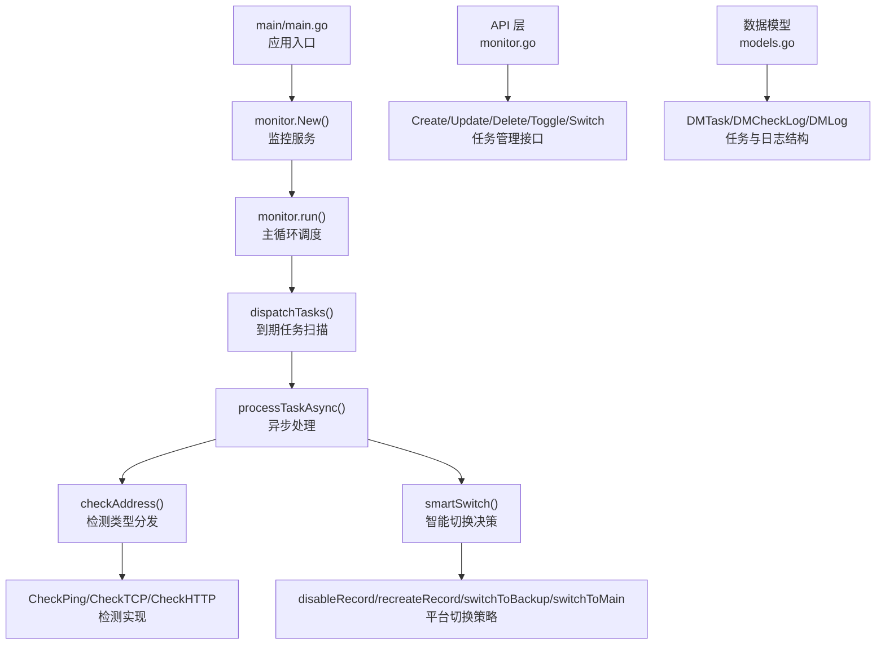
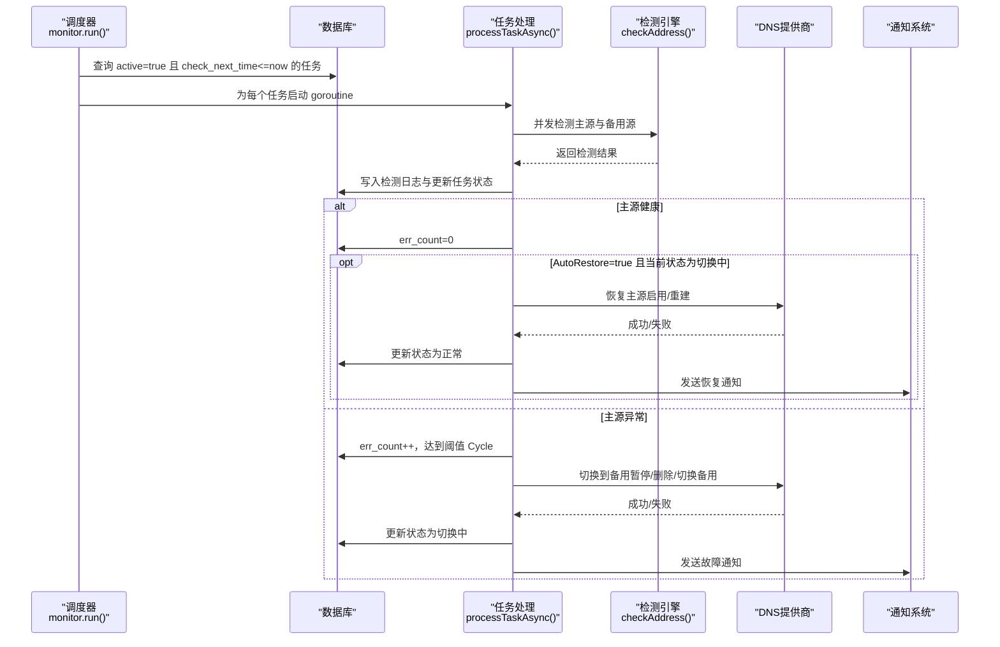
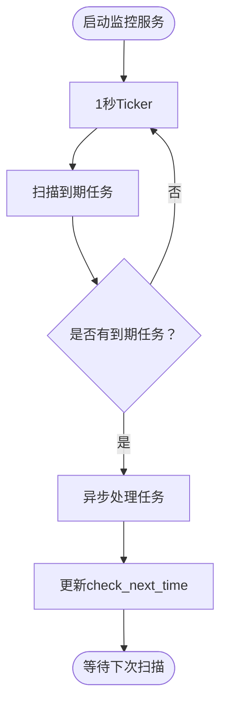
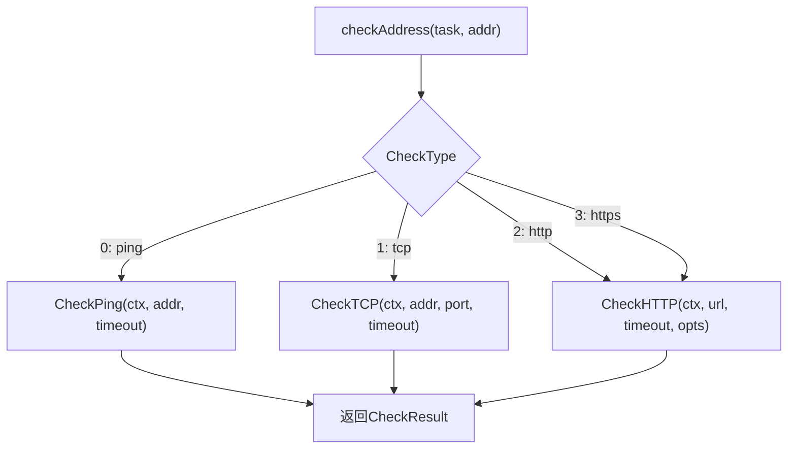
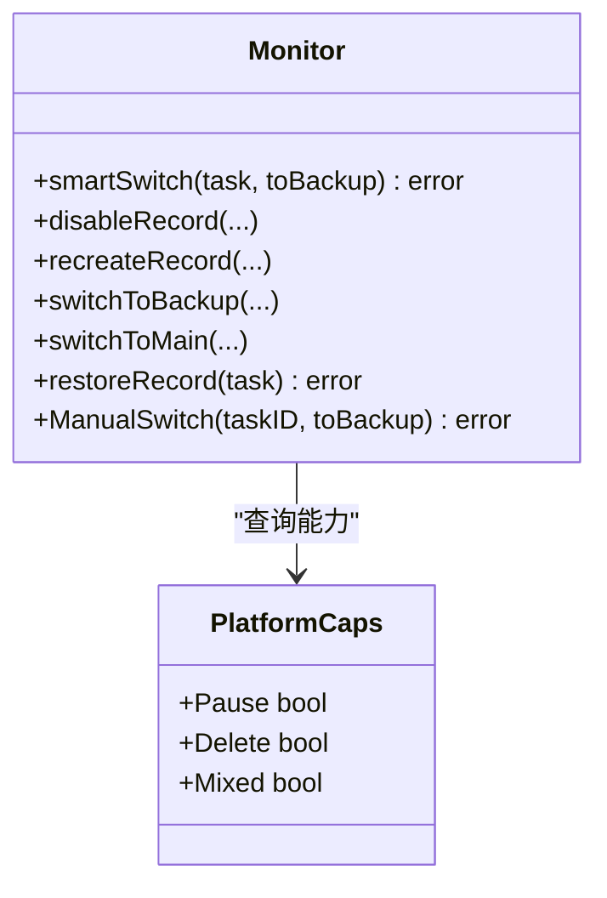
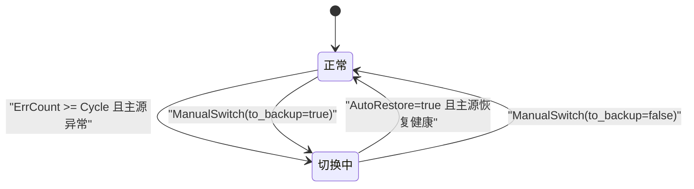
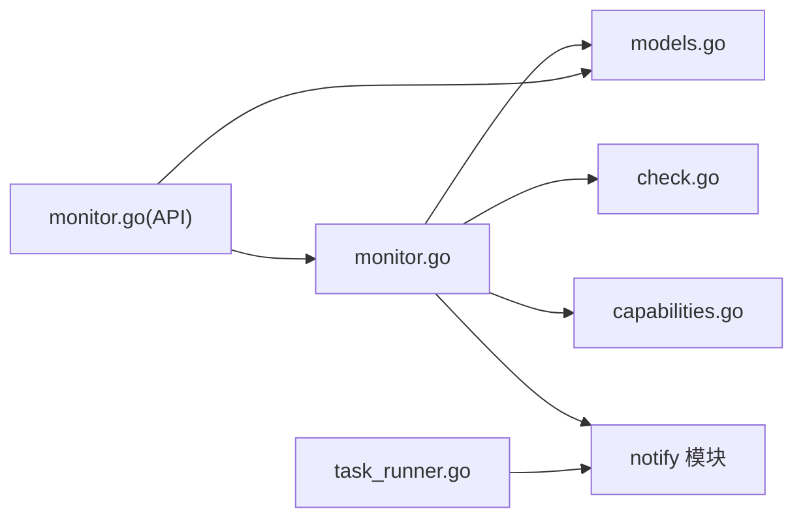

# 监控任务管理

<cite>
**本文档引用的文件**
- [main.go](file://main/main.go)
- [monitor.go](file://main/internal/monitor/monitor.go)
- [check.go](file://main/internal/monitor/check.go)
- [capabilities.go](file://main/internal/monitor/capabilities.go)
- [check_ping_windows.go](file://main/internal/monitor/check_ping_windows.go)
- [check_ping_stub.go](file://main/internal/monitor/check_ping_stub.go)
- [monitor.go](file://main/internal/api/handler/monitor.go)
- [task_runner.go](file://main/internal/service/task_runner.go)
- [models.go](file://main/internal/models/models.go)
</cite>

## 目录
1. [简介](#简介)
2. [项目结构](#项目结构)
3. [核心组件](#核心组件)
4. [架构总览](#架构总览)
5. [详细组件分析](#详细组件分析)
6. [依赖关系分析](#依赖关系分析)
7. [性能考量](#性能考量)
8. [故障排查指南](#故障排查指南)
9. [结论](#结论)
10. [附录](#附录)

## 简介
本文件面向监控任务管理功能，系统性阐述监控任务的创建、配置与生命周期管理，解释不同任务类型的差异与适用场景，详述任务调度机制（频率、超时、错误计数与恢复阈值），说明任务状态管理与状态转换逻辑，并给出任务配置参数详解与最佳实践示例。监控任务支持多种检测类型（ping、tcp、http、https），并针对不同DNS平台提供智能切换策略（暂停/恢复、删除/重建、切换备用值）。

## 项目结构
监控任务管理位于后端Go模块中，核心文件分布如下：
- 后端入口与启动：main/main.go
- 监控服务与调度：main/internal/monitor/monitor.go
- 检测实现：main/internal/monitor/check.go、check_ping_windows.go、check_ping_stub.go
- 平台能力映射：main/internal/monitor/capabilities.go
- API处理：main/internal/api/handler/monitor.go
- 数据模型：main/internal/models/models.go
- 后台任务管理（证书等）：main/internal/service/task_runner.go

图示来源
- [main.go:52-107](file://main/main.go#L52-L107)
- [monitor.go:94-152](file://main/internal/monitor/monitor.go#L94-L152)
- [monitor.go:154-318](file://main/internal/monitor/monitor.go#L154-L318)
- [check.go:47-370](file://main/internal/monitor/check.go#L47-L370)
- [monitor.go:376-443](file://main/internal/monitor/monitor.go#L376-L443)
- [monitor.go:445-707](file://main/internal/monitor/monitor.go#L445-L707)
- [monitor.go:709-731](file://main/internal/monitor/monitor.go#L709-L731)
- [models.go:122-187](file://main/internal/models/models.go#L122-L187)

章节来源
- [main.go:52-107](file://main/main.go#L52-L107)
- [monitor.go:94-152](file://main/internal/monitor/monitor.go#L94-L152)
- [monitor.go:154-318](file://main/internal/monitor/monitor.go#L154-L318)
- [models.go:122-187](file://main/internal/models/models.go#L122-L187)

## 核心组件
- 监控服务（Monitor）：负责任务调度、并发检测、状态更新与智能切换。
- 检测引擎（CheckPing/CheckTCP/CheckHTTP）：跨平台ICMP、TCP与HTTP(S)检测实现。
- 平台能力（PlatformCaps）：定义不同DNS平台对暂停、删除、混合记录的支持能力。
- API处理器（monitor.go）：提供任务的增删改查、开关、手动切换与状态查询接口。
- 数据模型（DMTask/DMCheckLog/DMLog）：任务、检测日志与切换日志的数据结构。
- 后台任务管理（TaskRunner）：负责证书续期、部署与到期通知等定时任务（与监控任务协同）。

章节来源
- [monitor.go:45-91](file://main/internal/monitor/monitor.go#L45-L91)
- [check.go:24-46](file://main/internal/monitor/check.go#L24-L46)
- [capabilities.go:3-34](file://main/internal/monitor/capabilities.go#L3-L34)
- [monitor.go:157-182](file://main/internal/monitor/monitor.go#L157-L182)
- [models.go:122-187](file://main/internal/models/models.go#L122-L187)
- [task_runner.go:24-43](file://main/internal/service/task_runner.go#L24-L43)

## 架构总览
监控任务管理采用“定时扫描 + 并发检测 + 智能切换”的架构模式。主循环以1秒为粒度扫描到期任务，异步并发检测主源与备用源，依据错误计数与阈值进行状态转换与通知，最终通过DNS提供商API执行切换或恢复动作。

图示来源
- [monitor.go:94-152](file://main/internal/monitor/monitor.go#L94-L152)
- [monitor.go:154-318](file://main/internal/monitor/monitor.go#L154-L318)
- [monitor.go:376-443](file://main/internal/monitor/monitor.go#L376-L443)
- [monitor.go:735-791](file://main/internal/monitor/monitor.go#L735-L791)

## 详细组件分析

### 监控服务与调度
- 启动与停止：Start()创建上下文与等待组，Stop()取消并等待。
- 主循环：1秒ticker扫描到期任务，60秒ticker更新运行状态。
- 任务分发：dispatchTasks()查询到期任务，更新下一次检查时间并异步处理。
- 并发控制：processing sync.Map防止同一任务并发执行。
- 超时控制：processTaskAsync()为整个检测过程设置超时（timeout+10秒）。

图示来源
- [monitor.go:64-114](file://main/internal/monitor/monitor.go#L64-L114)
- [monitor.go:131-152](file://main/internal/monitor/monitor.go#L131-L152)

章节来源
- [monitor.go:64-114](file://main/internal/monitor/monitor.go#L64-L114)
- [monitor.go:131-152](file://main/internal/monitor/monitor.go#L131-L152)

### 检测引擎
- 检测类型分发：checkAddress()根据CheckType路由到对应检测方法。
- Ping检测：Windows使用原生ICMP API，非Windows使用golang.org/x/net/icmp；失败时回退到TCP 80。
- TCP检测：基于net.Dialer，超时由任务timeout决定。
- HTTP/HTTPS检测：支持代理（HTTP/SOCKS5）、重定向限制、期望状态码与关键词校验；支持HostIP伪装（CDN场景）。

图示来源
- [monitor.go:320-356](file://main/internal/monitor/monitor.go#L320-L356)
- [check.go:47-178](file://main/internal/monitor/check.go#L47-L178)
- [check.go:210-338](file://main/internal/monitor/check.go#L210-L338)

章节来源
- [monitor.go:320-356](file://main/internal/monitor/monitor.go#L320-L356)
- [check.go:47-178](file://main/internal/monitor/check.go#L47-L178)
- [check.go:210-338](file://main/internal/monitor/check.go#L210-L338)

### 智能切换与任务类型
- 任务类型（Type）：
  - 0：暂停/恢复（优先暂停，不支持则删除）
  - 1：删除/重建（删除主记录并保存原始信息，恢复时重建）
  - 2：切换备用值（主源IP/CNAME切换到备用值，必要时添加辅助记录）
- 切换策略：
  - disableRecord：优先SetDomainRecordStatus(false)，失败则DeleteDomainRecord。
  - recreateRecord：根据RecordInfo重建被删除的记录。
  - switchToBackup：CNAME解析为IP并添加A记录，或直接更新/添加备用记录；主记录类型不一致时采用删除+新建策略。
  - switchToMain：清理备用记录，恢复主记录（启用/重建/更新值）。
- 平台能力：GetPlatformCaps()返回Pause/Delete/Mixed能力，影响切换回退策略。

图示来源
- [monitor.go:376-443](file://main/internal/monitor/monitor.go#L376-L443)
- [monitor.go:445-707](file://main/internal/monitor/monitor.go#L445-L707)
- [capabilities.go:28-33](file://main/internal/monitor/capabilities.go#L28-L33)

章节来源
- [monitor.go:376-443](file://main/internal/monitor/monitor.go#L376-L443)
- [monitor.go:445-707](file://main/internal/monitor/monitor.go#L445-L707)
- [capabilities.go:28-33](file://main/internal/monitor/capabilities.go#L28-L33)

### 任务状态管理与转换
- 状态（Status）：0 正常，1 切换中。
- 错误计数（ErrCount）与恢复阈值（Cycle）：连续失败达到阈值触发切换；主源恢复后若AutoRestore=true则自动恢复。
- 时间戳字段：AddTime、CheckTime、CheckNextTime、SwitchTime、FaultTime、RecoverTime。
- 通知：故障/切换失败/恢复分别触发不同通知模板。

图示来源
- [monitor.go:268-318](file://main/internal/monitor/monitor.go#L268-L318)
- [monitor.go:677-707](file://main/internal/monitor/monitor.go#L677-L707)

章节来源
- [monitor.go:268-318](file://main/internal/monitor/monitor.go#L268-L318)
- [monitor.go:677-707](file://main/internal/monitor/monitor.go#L677-L707)

### API与任务管理
- 任务创建：CreateMonitorTask，支持批量创建（BatchCreateMonitorTasks）。
- 任务更新：UpdateMonitorTask，支持动态调整频率、阈值、超时、通知等。
- 任务删除与开关：DeleteMonitorTask、ToggleMonitorTask。
- 手动切换：SwitchMonitorTask，支持自动判断方向或指定方向。
- 状态查询：GetMonitorStatus、GetMonitorOverview、GetMonitorHistory、GetMonitorUptime。

章节来源
- [monitor.go:157-263](file://main/internal/api/handler/monitor.go#L157-L263)
- [monitor.go:294-402](file://main/internal/api/handler/monitor.go#L294-L402)
- [monitor.go:435-485](file://main/internal/api/handler/monitor.go#L435-L485)
- [monitor.go:709-800](file://main/internal/api/handler/monitor.go#L709-L800)

### 数据模型与日志
- DMTask：任务定义，包含检测类型、目标、端口、URL、频率、阈值、超时、通知、自动恢复等。
- DMCheckLog：检测历史，记录主/备用健康状态、耗时与错误。
- DMLog：切换日志，记录切换/恢复动作与错误信息。

章节来源
- [models.go:122-187](file://main/internal/models/models.go#L122-L187)

## 依赖关系分析
- 监控服务依赖数据库（GORM）与DNS提供商接口，通过Provider抽象屏蔽平台差异。
- 检测引擎依赖网络栈与代理库，支持HTTP/SOCKS5代理与HostIP伪装。
- 通知系统依赖系统配置（SysConfig）加载渠道配置。
- API层依赖鉴权中间件与权限控制，确保任务操作的域级与子域级权限。

图示来源
- [monitor.go:1-1022](file://main/internal/monitor/monitor.go#L1-L1022)
- [models.go:1-200](file://main/internal/models/models.go#L1-L200)
- [check.go:1-370](file://main/internal/monitor/check.go#L1-L370)
- [capabilities.go:1-34](file://main/internal/monitor/capabilities.go#L1-L34)
- [monitor.go:1-1148](file://main/internal/api/handler/monitor.go#L1-L1148)
- [task_runner.go:1-889](file://main/internal/service/task_runner.go#L1-L889)

章节来源
- [monitor.go:1-1022](file://main/internal/monitor/monitor.go#L1-L1022)
- [monitor.go:1-1148](file://main/internal/api/handler/monitor.go#L1-L1148)
- [task_runner.go:1-889](file://main/internal/service/task_runner.go#L1-L889)

## 性能考量
- 并发检测：主源与备用源均并发检测，缩短整体检测时间；注意合理设置timeout与频率，避免过度并发导致资源争用。
- 超时与重试：检测超时包含任务timeout+10秒缓冲；HTTP重定向限制与关键词校验避免无效流量。
- 日志与状态：检测日志与ResolveStatus内存缓存减少数据库压力；状态更新批量写入。
- 平台能力：优先使用暂停能力，失败时回退删除，减少不必要的记录变更。

[本节为通用指导，无需特定文件引用]

## 故障排查指南
- 检测失败排查
  - 检查CheckType与目标配置（IP/域名、端口、URL）。
  - 查看DMCheckLog中的错误信息与状态码。
  - 若使用代理，确认代理类型、主机、端口与凭据。
- 切换失败排查
  - 检查平台能力（Pause/Delete/Mixed）与实际API返回。
  - 查看DMLog中的错误信息与切换方向。
  - 确认RecordInfo是否正确保存，以便恢复时重建记录。
- 通知问题排查
  - 检查SysConfig中通知渠道配置（邮件/Telegram/Webhook/Discord/Bark/企业微信）。
  - 确认任务NotifyEnabled与NotifyChannels设置。
- 性能问题排查
  - 检查Frequency与Timeout设置，避免过于频繁或过短的超时。
  - 监控CPU与网络使用，适当降低并发或增加频率。

章节来源
- [monitor.go:735-891](file://main/internal/monitor/monitor.go#L735-L891)
- [monitor.go:901-921](file://main/internal/monitor/monitor.go#L901-L921)
- [monitor.go:949-1022](file://main/internal/monitor/monitor.go#L949-L1022)

## 结论
监控任务管理通过“定时扫描 + 并发检测 + 智能切换”实现了高可用的容灾保障。不同任务类型覆盖了从简单暂停到复杂备用值切换的多种场景，结合平台能力与通知系统，能够快速定位问题并自动恢复。建议在生产环境中合理设置频率、阈值与超时，并充分利用通知与日志进行持续优化。

[本节为总结，无需特定文件引用]

## 附录

### 任务配置参数详解
- 基础参数
  - domain_id：域名ID
  - rr：记录名称（@ 表示裸域）
  - record_id：DNS记录ID
  - type：任务类型（0: 暂停/恢复；1: 删除/重建；2: 切换备用值）
  - main_value：主源值（IP或域名）
  - backup_value/backup_values：备用值（支持多个，逗号分隔）
  - remark：备注
- 检测参数
  - check_type：检测类型（0: ping；1: tcp；2: http；3: https）
  - check_url：HTTP/HTTPS URL（为空时自动生成）
  - tcp_port：TCP端口（默认80）
  - expect_status：期望状态码（逗号分隔）
  - expect_keyword：期望关键词
  - max_redirects：重定向限制（-1: 不跟随；0: 默认跟随3次）
  - use_proxy/cdn：是否使用代理与CDN场景
  - proxy_type/host/port/username/password：代理配置
- 调度与阈值
  - frequency：检测频率（秒）
  - cycle：连续失败阈值（达到此值触发切换）
  - timeout：检测超时（秒）
  - auto_restore：主源恢复后自动恢复
  - notify_enabled：是否启用通知
  - notify_channels：通知渠道数组（mail/webhook/discord/bark/wechat）

章节来源
- [monitor.go:157-263](file://main/internal/api/handler/monitor.go#L157-L263)
- [monitor.go:265-371](file://main/internal/api/handler/monitor.go#L265-L371)
- [models.go:122-164](file://main/internal/models/models.go#L122-L164)

### 任务类型与适用场景
- 暂停/恢复（type=0）
  - 适用：需要临时屏蔽主源但保留记录，平台支持暂停优先。
  - 场景：维护窗口、临时降级。
- 删除/重建（type=1）
  - 适用：完全移除主源记录，恢复时重建。
  - 场景：彻底切换或记录结构变更。
- 切换备用值（type=2）
  - 适用：主源IP/CNAME切换到备用值，必要时添加辅助记录。
  - 场景：主源故障但记录类型一致或需要CNAME解析。

章节来源
- [monitor.go:445-707](file://main/internal/monitor/monitor.go#L445-L707)
- [capabilities.go:28-33](file://main/internal/monitor/capabilities.go#L28-L33)

### 调度机制与阈值
- 频率（frequency）：任务下次检查时间在每次执行后更新为 now + frequency。
- 超时（timeout）：检测超时为任务timeout+10秒，避免任务处理阻塞。
- 错误计数（err_count）与恢复阈值（cycle）：连续失败达到阈值触发切换；主源恢复后若AutoRestore=true则自动恢复。
- 状态转换：正常/切换中，手动切换支持自动方向判断。

章节来源
- [monitor.go:131-152](file://main/internal/monitor/monitor.go#L131-L152)
- [monitor.go:268-318](file://main/internal/monitor/monitor.go#L268-L318)
- [monitor.go:677-707](file://main/internal/monitor/monitor.go#L677-L707)

### 最佳实践与常见配置示例
- 频率与阈值
  - 建议频率≥30秒，阈值≥3，避免误报与抖动。
- 检测类型选择
  - 内网/专线：tcp 80/443
  - 外网/公网：http/https，设置expect_status与expect_keyword
  - CDN场景：启用cdn与hostIP伪装
- 通知配置
  - 在SysConfig中配置邮件/Telegram/Webhook/Discord/Bark/企业微信，确保notify_enabled与notify_channels正确。
- 平台能力
  - 优先使用支持暂停的平台；不支持时自动回退删除。
- 日志与监控
  - 定期查看DMCheckLog与DMLog，关注错误趋势与切换频率。

章节来源
- [monitor.go:735-891](file://main/internal/monitor/monitor.go#L735-L891)
- [monitor.go:949-1022](file://main/internal/monitor/monitor.go#L949-L1022)
- [monitor.go:157-263](file://main/internal/api/handler/monitor.go#L157-L263)