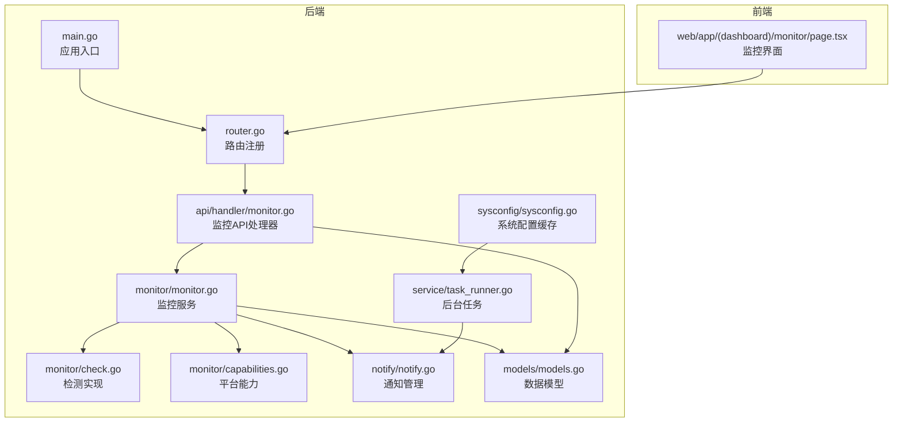
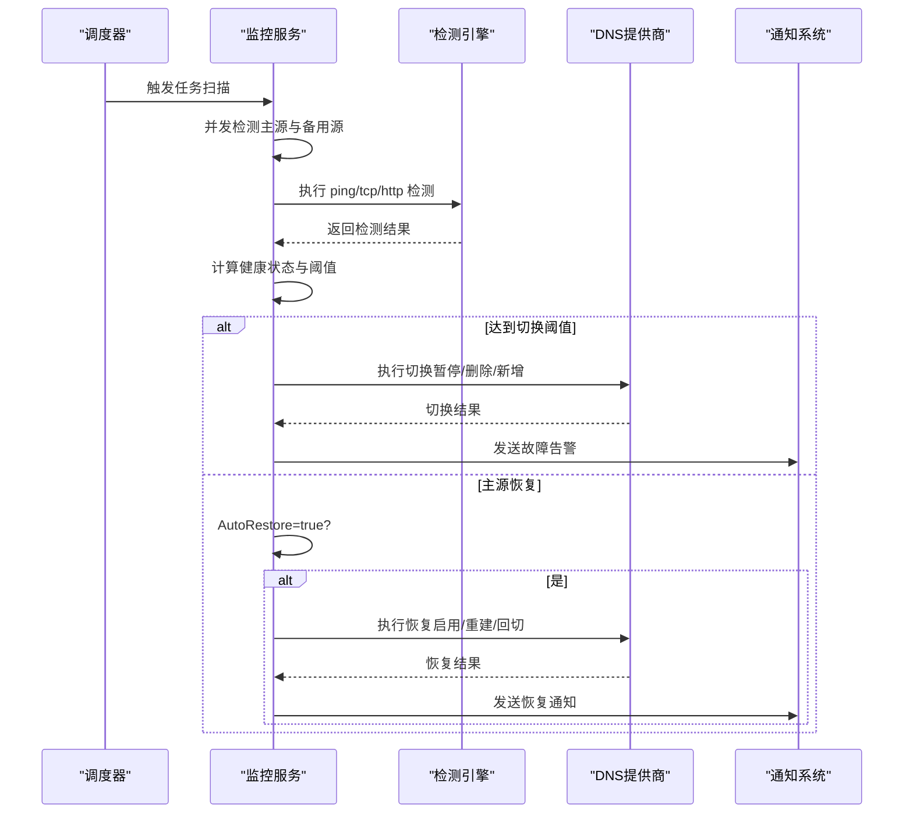
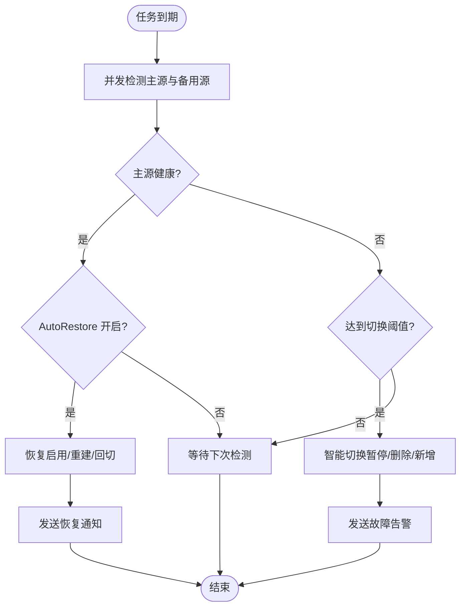
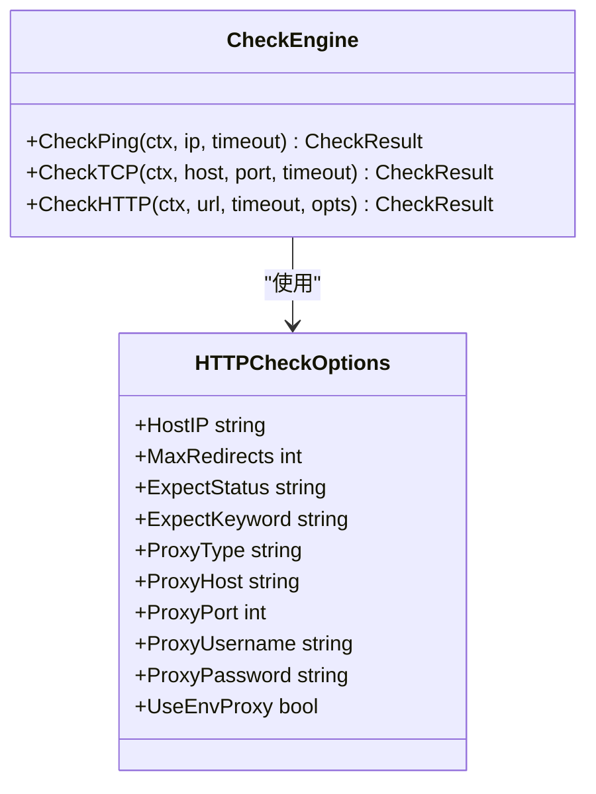
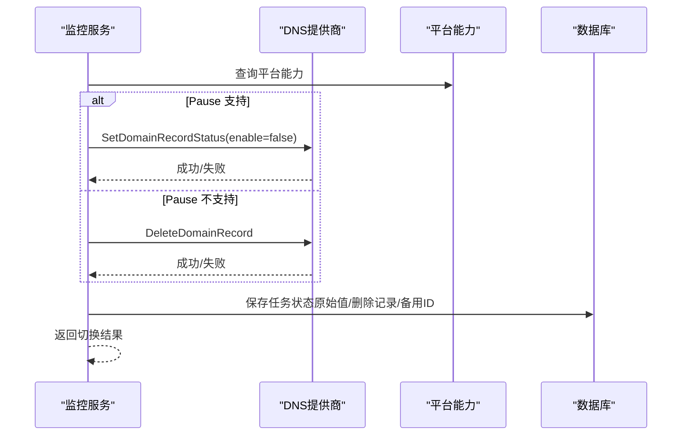
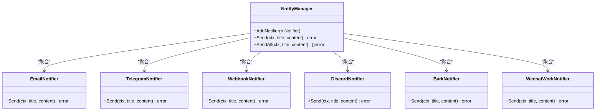
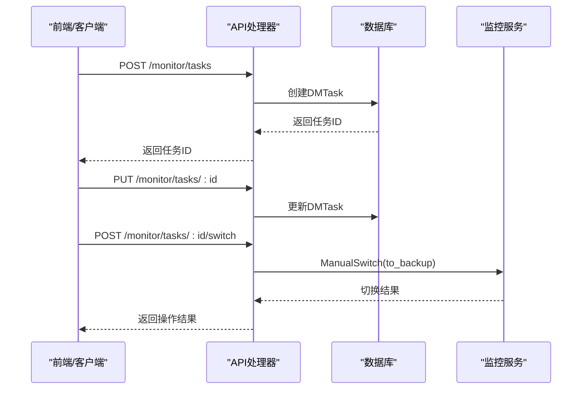
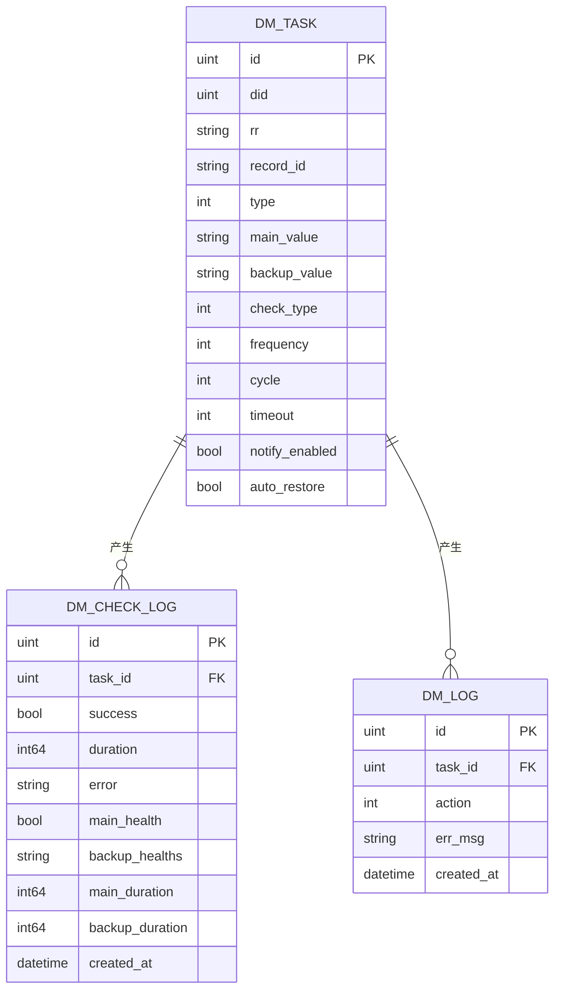
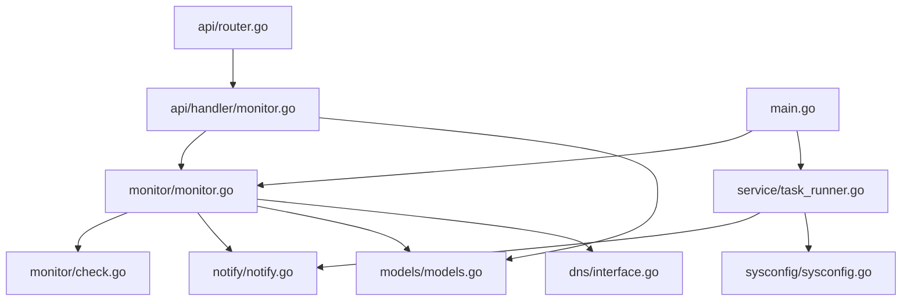

# 监控告警系统

<cite>
**本文档引用的文件**
- [main.go](file://main/main.go)
- [monitor.go](file://main/internal/monitor/monitor.go)
- [check.go](file://main/internal/monitor/check.go)
- [capabilities.go](file://main/internal/monitor/capabilities.go)
- [check_ping_windows.go](file://main/internal/monitor/check_ping_windows.go)
- [check_ping_stub.go](file://main/internal/monitor/check_ping_stub.go)
- [notify.go](file://main/internal/notify/notify.go)
- [monitor.go](file://main/internal/api/handler/monitor.go)
- [router.go](file://main/internal/api/router.go)
- [models.go](file://main/internal/models/models.go)
- [interface.go](file://main/internal/dns/interface.go)
- [sysconfig.go](file://main/internal/sysconfig/sysconfig.go)
- [task_runner.go](file://main/internal/service/task_runner.go)
</cite>

## 目录
1. [简介](#简介)
2. [项目结构](#项目结构)
3. [核心组件](#核心组件)
4. [架构总览](#架构总览)
5. [详细组件分析](#详细组件分析)
6. [依赖关系分析](#依赖关系分析)
7. [性能考量](#性能考量)
8. [故障排查指南](#故障排查指南)
9. [结论](#结论)
10. [附录](#附录)

## 简介
本系统是一个基于 DNS 的容灾监控与告警平台，具备多维度健康检测（ping、TCP、HTTP/HTTPS）、智能故障切换与自动恢复、多渠道通知（邮件、Telegram、Webhook、Discord、Bark、企业微信）、任务管理与历史记录、性能指标采集与可视化等功能。系统通过定时调度与并发检测，实现对主源与备用源的实时评估，并在达到阈值时自动进行切换，恢复时自动回切，同时记录详细的检测日志与切换日志，便于审计与问题定位。

## 项目结构
系统采用后端 Go 语言开发，前端为 Next.js 应用，API 通过 Gin 框架提供 REST 接口，数据库使用 GORM，监控服务独立运行并在主程序启动时初始化。

**图表来源**
- [main.go:52-147](file://main/main.go#L52-L147)
- [router.go:14-274](file://main/internal/api/router.go#L14-L274)
- [monitor.go:45-114](file://main/internal/monitor/monitor.go#L45-L114)
- [check.go:47-370](file://main/internal/monitor/check.go#L47-L370)
- [capabilities.go:1-34](file://main/internal/monitor/capabilities.go#L1-L34)
- [notify.go:17-569](file://main/internal/notify/notify.go#L17-L569)
- [models.go:122-187](file://main/internal/models/models.go#L122-L187)
- [sysconfig.go:18-46](file://main/internal/sysconfig/sysconfig.go#L18-L46)
- [task_runner.go:24-161](file://main/internal/service/task_runner.go#L24-L161)

**章节来源**
- [main.go:52-147](file://main/main.go#L52-L147)
- [router.go:73-83](file://main/internal/api/router.go#L73-L83)

## 核心组件
- 监控服务：负责任务调度、并发检测、决策切换与恢复、通知发送、状态记录与历史采集。
- 检测引擎：支持 ping（跨平台）、TCP、HTTP/HTTPS（含代理、重定向、状态码与关键词校验）。
- 平台能力：根据 DNS 服务商能力（暂停/删除/混合记录）选择最优切换策略。
- 通知系统：统一管理邮件、Telegram、Webhook、Discord、Bark、企业微信等多渠道。
- API 层：提供任务创建、更新、删除、开关、手动切换、历史查询、可用率统计等接口。
- 数据模型：定义监控任务、检测日志、切换日志、系统配置等数据结构。
- 系统配置缓存：为后台任务提供高效配置读取，降低数据库压力。
- 后台任务：证书续期、到期通知等定时任务（与监控协同）。

**章节来源**
- [monitor.go:45-114](file://main/internal/monitor/monitor.go#L45-L114)
- [check.go:24-370](file://main/internal/monitor/check.go#L24-L370)
- [capabilities.go:3-34](file://main/internal/monitor/capabilities.go#L3-L34)
- [notify.go:17-569](file://main/internal/notify/notify.go#L17-L569)
- [models.go:122-187](file://main/internal/models/models.go#L122-L187)
- [sysconfig.go:18-46](file://main/internal/sysconfig/sysconfig.go#L18-L46)
- [task_runner.go:24-161](file://main/internal/service/task_runner.go#L24-L161)

## 架构总览
系统采用“服务化 + API + 前端”的分层架构。监控服务独立运行，定时扫描到期任务，异步并发检测主源与备用源，依据阈值与平台能力进行智能切换与恢复，并记录检测日志与切换日志。通知系统根据任务配置与系统全局配置，向多个渠道发送告警或恢复消息。API 层提供完整的任务生命周期管理与历史查询能力，前端通过路由与接口展示监控概览、历史曲线与可用率统计。

**图表来源**
- [monitor.go:130-318](file://main/internal/monitor/monitor.go#L130-L318)
- [check.go:47-370](file://main/internal/monitor/check.go#L47-L370)
- [capabilities.go:28-33](file://main/internal/monitor/capabilities.go#L28-L33)
- [notify.go:333-364](file://main/internal/notify/notify.go#L333-L364)

## 详细组件分析

### 监控服务与任务调度
- 启动与停止：监控服务在应用启动时初始化并启动主循环，使用 ticker 每秒扫描到期任务，每60秒更新运行状态。
- 任务调度：并发检测主源与备用源，防止同一任务重复执行，自动更新下次检测时间。
- 决策逻辑：主源健康时若开启自动恢复，则在恢复后自动回切；主源异常达到阈值时先发通知再尝试切换。
- 状态与日志：实时解析状态内存缓存，检测日志入库，切换日志入库，支持历史查询与可用率统计。

**图表来源**
- [monitor.go:130-318](file://main/internal/monitor/monitor.go#L130-L318)

**章节来源**
- [monitor.go:63-128](file://main/internal/monitor/monitor.go#L63-L128)
- [monitor.go:130-318](file://main/internal/monitor/monitor.go#L130-L318)

### 检测类型与实现
- Ping：跨平台实现，Windows 使用原生 API，其他平台使用 ICMP 原始套接字；不可用时回退到 TCP 80。
- TCP：基于 net.Dialer，支持超时控制。
- HTTP/HTTPS：支持代理（HTTP/SOCKS5）、重定向限制、期望状态码与关键词匹配、HostIP 指定（CDN 场景）。
- 备用值解析：CNAME 自动解析为 A 记录并添加备用 A 记录，避免类型不一致导致的切换失败。

**图表来源**
- [check.go:24-370](file://main/internal/monitor/check.go#L24-L370)

**章节来源**
- [check.go:47-370](file://main/internal/monitor/check.go#L47-L370)
- [check_ping_windows.go:13-95](file://main/internal/monitor/check_ping_windows.go#L13-L95)
- [check_ping_stub.go:7-11](file://main/internal/monitor/check_ping_stub.go#L7-L11)

### 故障切换与自动恢复
- 平台能力：不同 DNS 服务商支持的能力不同（暂停、删除、混合记录），系统根据能力选择最优策略。
- 切换策略：
  - 暂停/恢复：优先尝试暂停，失败则删除记录。
  - 删除/重建：删除主记录并重建，或恢复时启用/重建。
  - 切换备用：主记录类型与备用值类型一致时直接更新，否则删除/新建并禁用/删除主记录。
- 状态持久化：记录原始值、删除记录信息、备用记录 ID 列表，确保恢复时可精确回切。

**图表来源**
- [monitor.go:376-443](file://main/internal/monitor/monitor.go#L376-L443)
- [monitor.go:445-520](file://main/internal/monitor/monitor.go#L445-L520)
- [capabilities.go:28-33](file://main/internal/monitor/capabilities.go#L28-L33)

**章节来源**
- [monitor.go:376-670](file://main/internal/monitor/monitor.go#L376-L670)
- [capabilities.go:3-34](file://main/internal/monitor/capabilities.go#L3-L34)

### 多渠道通知系统
- 通知渠道：邮件（SMTP）、Telegram、Webhook、Discord、Bark、企业微信。
- 配置加载：从系统配置缓存层按需读取，支持运行时更新。
- 发送策略：统一管理器聚合多个渠道，任一失败不影响整体发送（可扩展为并行/串行策略）。
- 事件类型：故障告警、切换失败告警、恢复通知。

**图表来源**
- [notify.go:333-364](file://main/internal/notify/notify.go#L333-L364)
- [notify.go:536-568](file://main/internal/notify/notify.go#L536-L568)

**章节来源**
- [notify.go:17-569](file://main/internal/notify/notify.go#L17-L569)
- [monitor.go:733-791](file://main/internal/monitor/monitor.go#L733-L791)
- [sysconfig.go:27-46](file://main/internal/sysconfig/sysconfig.go#L27-L46)

### 监控任务的创建、配置与管理
- 创建任务：支持多种检测类型（ping、tcp、http、https），可配置频率、阈值、超时、代理、CDN、期望状态码与关键词等。
- 更新任务：支持动态修改检测参数、通知开关与通道、自动恢复等。
- 删除与开关：支持按任务 ID 删除与启用/禁用。
- 手动切换：支持手动切换到备用或恢复主源，并记录日志。
- 批量创建：基于子域名记录批量生成监控任务。
- 权限控制：基于用户模块权限与域名权限，限制任务可见与操作范围。

**图表来源**
- [monitor.go:157-182](file://main/internal/api/handler/monitor.go#L157-L182)
- [monitor.go:294-371](file://main/internal/api/handler/monitor.go#L294-L371)
- [monitor.go:435-485](file://main/internal/api/handler/monitor.go#L435-L485)
- [monitor.go:605-707](file://main/internal/api/handler/monitor.go#L605-L707)

**章节来源**
- [monitor.go:106-155](file://main/internal/api/handler/monitor.go#L106-L155)
- [monitor.go:157-371](file://main/internal/api/handler/monitor.go#L157-L371)
- [monitor.go:435-485](file://main/internal/api/handler/monitor.go#L435-L485)
- [monitor.go:605-707](file://main/internal/api/handler/monitor.go#L605-L707)

### 历史记录与性能指标
- 检测历史：记录每次检测的成功/失败、耗时、主源与备用源健康状态、错误信息等。
- 切换日志：记录切换/恢复动作、错误信息与时间戳。
- 可用率统计：支持24小时、7天、30天的可用率与平均时延统计。
- 前端展示：提供历史曲线与可用率卡片，支持时间窗口限制与反转排序。

**图表来源**
- [models.go:122-187](file://main/internal/models/models.go#L122-L187)

**章节来源**
- [monitor.go:789-807](file://main/internal/api/handler/monitor.go#L789-L807)
- [models.go:166-187](file://main/internal/models/models.go#L166-L187)

### 扩展性与自定义检测
- 平台能力扩展：通过平台能力映射表增加新的 DNS 服务商支持，自动适配切换策略。
- 检测类型扩展：检测引擎支持代理、重定向、状态码与关键词校验，便于扩展自定义 HTTP 行为。
- 通知渠道扩展：通知管理器支持任意 Notifier 实现，新增渠道只需实现 Send 方法。
- 配置缓存：系统配置缓存层为后台任务提供高效读取，便于扩展更多后台任务。

**章节来源**
- [capabilities.go:10-33](file://main/internal/monitor/capabilities.go#L10-L33)
- [check.go:209-338](file://main/internal/monitor/check.go#L209-L338)
- [notify.go:29-32](file://main/internal/notify/notify.go#L29-L32)
- [sysconfig.go:27-46](file://main/internal/sysconfig/sysconfig.go#L27-L46)

## 依赖关系分析

**图表来源**
- [monitor.go:1-19](file://main/internal/monitor/monitor.go#L1-L19)
- [check.go:1-20](file://main/internal/monitor/check.go#L1-L20)
- [notify.go:1-15](file://main/internal/notify/notify.go#L1-L15)
- [models.go:1-8](file://main/internal/models/models.go#L1-L8)
- [interface.go:1-4](file://main/internal/dns/interface.go#L1-L4)
- [monitor.go:1-19](file://main/internal/api/handler/monitor.go#L1-L19)
- [router.go:14-274](file://main/internal/api/router.go#L14-L274)
- [main.go:14-46](file://main/main.go#L14-L46)
- [task_runner.go:3-19](file://main/internal/service/task_runner.go#L3-L19)
- [sysconfig.go:3-9](file://main/internal/sysconfig/sysconfig.go#L3-L9)

**章节来源**
- [monitor.go:1-19](file://main/internal/monitor/monitor.go#L1-L19)
- [check.go:1-20](file://main/internal/monitor/check.go#L1-L20)
- [notify.go:1-15](file://main/internal/notify/notify.go#L1-L15)
- [models.go:1-8](file://main/internal/models/models.go#L1-L8)
- [interface.go:1-4](file://main/internal/dns/interface.go#L1-L4)
- [monitor.go:1-19](file://main/internal/api/handler/monitor.go#L1-L19)
- [router.go:14-274](file://main/internal/api/router.go#L14-L274)
- [main.go:14-46](file://main/main.go#L14-L46)
- [task_runner.go:3-19](file://main/internal/service/task_runner.go#L3-L19)
- [sysconfig.go:3-9](file://main/internal/sysconfig/sysconfig.go#L3-L9)

## 性能考量
- 并发检测：主源与备用源并发检测，减少整体检测时间。
- 超时控制：每个检测任务独立超时，避免阻塞后续任务。
- 日志入库：检测日志异步入库，避免阻塞主流程。
- 配置缓存：后台任务通过系统配置缓存层读取配置，降低数据库压力。
- 历史数据限制：前端历史接口限制最大返回点数，避免大查询拖慢响应。

[本节为通用指导，无需具体文件引用]

## 故障排查指南
- 监控服务未启动：确认应用启动日志中包含监控服务启动信息。
- 任务未执行：检查任务 active 状态、check_next_time 是否到期、是否被并发处理标记。
- 切换失败：查看切换日志与检测日志，确认平台能力与记录类型是否匹配；检查 DNS 服务商 API 权限与配额。
- 通知失败：检查系统配置中的通知渠道配置是否完整，查看通知发送错误日志。
- 前端无数据：确认历史接口的时间窗口与任务 ID 正确，检查 maxMonitorHistoryPoints 限制。

**章节来源**
- [monitor.go:63-91](file://main/internal/monitor/monitor.go#L63-L91)
- [monitor.go:130-152](file://main/internal/monitor/monitor.go#L130-L152)
- [monitor.go:733-791](file://main/internal/monitor/monitor.go#L733-L791)
- [monitor.go:789-807](file://main/internal/api/handler/monitor.go#L789-L807)

## 结论
本监控告警系统通过多维度检测、智能切换与恢复、多渠道通知以及完善的任务管理与历史记录，实现了对 DNS 主源的高可用保障。其模块化设计与平台能力抽象使其易于扩展新的检测类型与通知渠道，适合在复杂网络环境中提供稳定可靠的容灾监控服务。

[本节为总结性内容，无需具体文件引用]

## 附录

### 配置示例与最佳实践
- 邮件通知：配置 SMTP 主机、端口、认证方式、发件人与收件人，建议使用 STARTTLS 或 SSL。
- Telegram：配置 Bot Token 与 Chat ID，支持 HTML 格式消息。
- Webhook：配置 URL、方法、头信息与模板，模板中可使用 {title} 与 {content} 占位符。
- Discord：配置 Webhook URL，支持 Embed 格式。
- Bark：配置服务器地址与设备 Key。
- 企业微信：配置 Webhook URL，使用 Markdown 格式。
- 最佳实践：
  - 频率与阈值：根据业务 SLA 调整检测频率与连续失败阈值，避免误报与漏报。
  - 代理与 CDN：HTTP 检测支持代理与 HostIP 指定，适用于 CDN 场景。
  - 自动恢复：在主源恢复后自动回切，减少人工干预。
  - 多渠道通知：至少配置两种通知渠道，确保告警可达。

**章节来源**
- [notify.go:34-190](file://main/internal/notify/notify.go#L34-L190)
- [notify.go:217-266](file://main/internal/notify/notify.go#L217-L266)
- [notify.go:267-331](file://main/internal/notify/notify.go#L267-L331)
- [notify.go:366-413](file://main/internal/notify/notify.go#L366-L413)
- [notify.go:415-455](file://main/internal/notify/notify.go#L415-L455)
- [notify.go:457-501](file://main/internal/notify/notify.go#L457-L501)