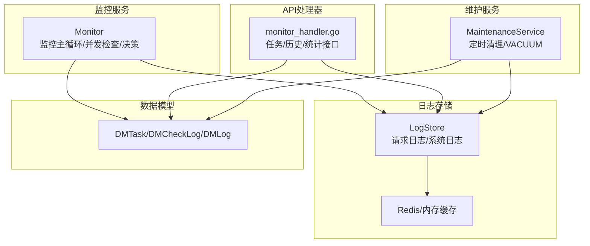
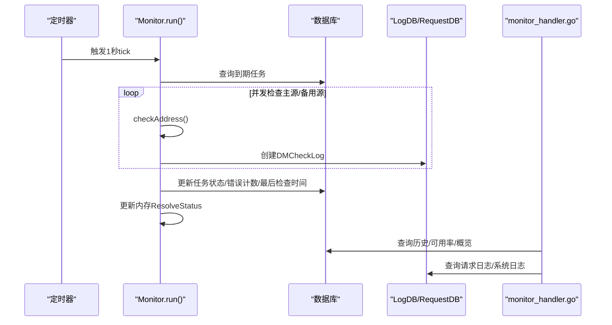
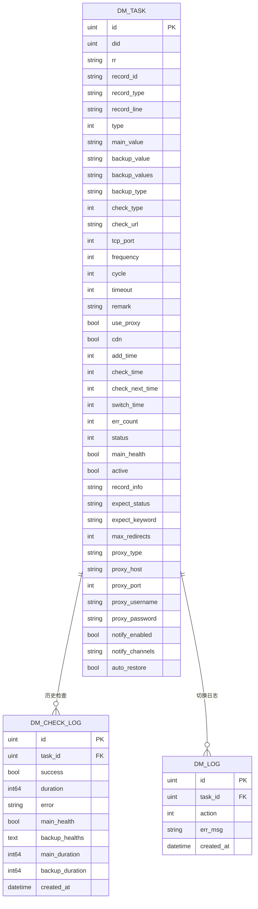
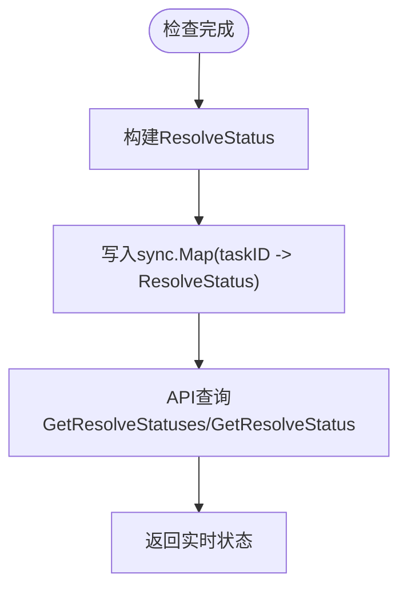
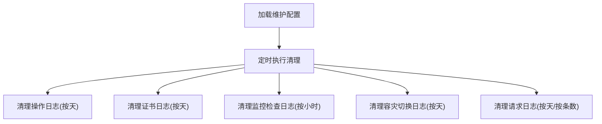
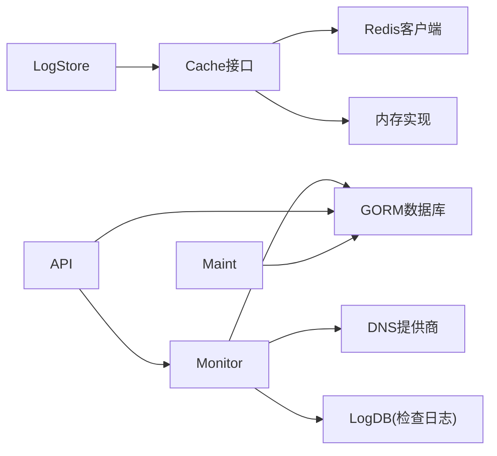

# 监控数据存储

<cite>
**本文引用的文件**
- [monitor.go](file://main/internal/monitor/monitor.go)
- [store.go](file://main/internal/logstore/store.go)
- [models.go](file://main/internal/models/models.go)
- [monitor_handler.go](file://main/internal/api/handler/monitor.go)
- [maintenance.go](file://main/internal/database/maintenance.go)
- [log_cleanup.go](file://main/internal/service/log_cleanup.go)
- [cache.go](file://main/internal/cache/cache.go)
- [logs_handler.go](file://main/internal/api/handler/logs.go)
</cite>

## 目录
1. [简介](#简介)
2. [项目结构](#项目结构)
3. [核心组件](#核心组件)
4. [架构总览](#架构总览)
5. [详细组件分析](#详细组件分析)
6. [依赖分析](#依赖分析)
7. [性能考虑](#性能考虑)
8. [故障排查指南](#故障排查指南)
9. [结论](#结论)
10. [附录](#附录)

## 简介
本文件面向监控数据存储功能，系统性阐述监控检查日志的存储结构与数据模型、实时解析状态的内存存储与同步策略、历史记录管理（保留策略、清理机制、查询接口）、监控统计数据的采集与存储、备份与恢复策略以及性能优化措施，并提供查询与分析方法。目标读者既包括开发人员，也包括需要理解系统运作的运维与产品人员。

## 项目结构
监控数据存储涉及以下关键模块：
- 监控服务：负责周期性扫描任务、并发健康检查、决策切换/恢复、持久化检查日志与状态更新
- 日志存储：统一的请求日志与系统日志存储，支持内存与Redis后端
- 数据模型：定义监控任务、检查日志、切换日志等结构
- API处理器：提供监控任务管理、历史查询、可用率统计等接口
- 维护服务：定时清理历史日志、数据库优化与VACUUM
- 缓存层：抽象通用缓存接口，支持Redis与内存两种后端

图示来源
- [monitor.go:94-152](file://main/internal/monitor/monitor.go#L94-L152)
- [store.go:38-55](file://main/internal/logstore/store.go#L38-L55)
- [models.go:122-187](file://main/internal/models/models.go#L122-L187)
- [monitor_handler.go:106-155](file://main/internal/api/handler/monitor.go#L106-L155)
- [maintenance.go:100-133](file://main/internal/database/maintenance.go#L100-L133)

章节来源
- [monitor.go:94-152](file://main/internal/monitor/monitor.go#L94-L152)
- [store.go:38-55](file://main/internal/logstore/store.go#L38-L55)
- [models.go:122-187](file://main/internal/models/models.go#L122-L187)
- [monitor_handler.go:106-155](file://main/internal/api/handler/monitor.go#L106-L155)
- [maintenance.go:100-133](file://main/internal/database/maintenance.go#L100-L133)

## 核心组件
- 监控服务（Monitor）：主循环扫描到期任务，使用并发等待组对主源与备用源进行健康检查，保存检查日志，更新任务状态，维护实时解析状态内存表，触发通知与切换/恢复
- 日志存储（LogStore）：统一请求日志与系统日志的存储，支持Redis或内存后端，提供分页查询、过滤、统计缓存、按条数/天数清理
- 数据模型（Models）：定义监控任务（DMTask）、检查日志（DMCheckLog）、切换日志（DMLog）等结构，包含字段如任务ID、检测结果、耗时、错误信息、主/备健康状态等
- API处理器（monitor_handler.go）：提供任务列表、创建/更新/删除、手动切换、历史查询、可用率统计、概览等接口
- 维护服务（MaintenanceService）：按配置定期清理历史日志（按小时/天数），执行数据库VACUUM与优化
- 缓存层（Cache）：抽象通用缓存接口，支持Redis与内存实现，为日志存储提供List操作

章节来源
- [monitor.go:45-91](file://main/internal/monitor/monitor.go#L45-L91)
- [store.go:38-55](file://main/internal/logstore/store.go#L38-L55)
- [models.go:122-187](file://main/internal/models/models.go#L122-L187)
- [monitor_handler.go:106-155](file://main/internal/api/handler/monitor.go#L106-L155)
- [maintenance.go:100-133](file://main/internal/database/maintenance.go#L100-L133)
- [cache.go:15-31](file://main/internal/cache/cache.go#L15-L31)

## 架构总览
监控数据存储的总体流程如下：
- 监控服务周期性扫描到期任务，对主源与备用源并发检查
- 将每次检查的结果持久化到检查日志表，并更新任务状态
- 将实时解析状态写入内存映射，供API查询
- 历史日志由维护服务按配置定期清理
- API提供历史查询、可用率统计、概览等接口

图示来源
- [monitor.go:94-152](file://main/internal/monitor/monitor.go#L94-L152)
- [monitor.go:222-244](file://main/internal/monitor/monitor.go#L222-L244)
- [monitor.go:257-318](file://main/internal/monitor/monitor.go#L257-L318)
- [monitor_handler.go:728-760](file://main/internal/api/handler/monitor.go#L728-L760)
- [monitor_handler.go:762-806](file://main/internal/api/handler/monitor.go#L762-L806)

## 详细组件分析

### 监控检查日志与数据模型
- 数据模型
  - DMTask：监控任务表，包含任务ID、域名ID、记录ID、主/备值、检查类型、频率、阈值、超时、通知开关、自动恢复等字段
  - DMCheckLog：监控检查历史表，包含任务ID、检测结果（成功/失败）、耗时、错误信息、主/备健康状态、主/备耗时、创建时间等
  - DMLog：容灾切换日志表，记录切换/恢复动作与错误信息
- 字段说明
  - 任务ID：DMCheckLog.task_id
  - 检测结果：DMCheckLog.success（布尔）
  - 耗时：DMCheckLog.duration（毫秒），主/备分别有主耗时与备耗时字段
  - 错误信息：DMCheckLog.error（最大长度限制）
  - 主/备健康状态：DMCheckLog.main_health、DMCheckLog.backup_healths（JSON字符串）
  - 时间戳：DMCheckLog.created_at
  - 任务状态：DMTask.err_count、main_health、status、check_time、check_next_time、fault_time、switch_time、recover_time等

图示来源
- [models.go:122-187](file://main/internal/models/models.go#L122-L187)

章节来源
- [models.go:122-187](file://main/internal/models/models.go#L122-L187)

### 实时解析状态的内存存储与同步策略
- 内存存储结构
  - 使用并发安全的映射存储每个任务的实时解析状态，键为任务ID，值为ResolveStatus对象
  - ResolveStatus包含任务ID、主值、主健康状态、备用值健康映射、最后检查时间、最后错误信息
- 同步策略
  - 写入：在每次检查完成后，将最新状态写入内存映射
  - 读取：API通过GetResolveStatuses/GetResolveStatus获取实时状态
  - 并发控制：使用sync.Map保证并发安全；处理任务时使用processing map防止同一任务并发执行
  - 生命周期：任务停止或重启时，内存状态会随着Monitor实例的生命周期而失效，重启后由后续检查填充

图示来源
- [monitor.go:21-29](file://main/internal/monitor/monitor.go#L21-L29)
- [monitor.go:709-731](file://main/internal/monitor/monitor.go#L709-L731)
- [monitor.go:130-152](file://main/internal/monitor/monitor.go#L130-L152)

章节来源
- [monitor.go:21-29](file://main/internal/monitor/monitor.go#L21-L29)
- [monitor.go:709-731](file://main/internal/monitor/monitor.go#L709-L731)
- [monitor.go:130-152](file://main/internal/monitor/monitor.go#L130-L152)

### 历史记录管理：保留策略、清理机制与查询接口
- 保留策略
  - 操作日志：按天数保留（默认90天）
  - 证书日志：按天数保留（默认60天）
  - 监控检查日志：按小时保留（默认72小时）
  - 容灾切换日志：按天数保留（默认60天）
  - 请求日志：按天数保留（默认7天），同时按条数保留成功/错误日志（默认2000/1000条）
- 清理机制
  - 维护服务每小时执行一次清理，按配置删除过期记录
  - 请求日志还支持按条数清理成功/错误日志
  - 支持手动清理请求日志（按条数保留）
- 查询接口
  - 历史查询：按任务ID与时间段查询检查日志，限制最大返回点数以避免性能问题
  - 可用率统计：按24h/7d/30d计算成功率与平均响应时间
  - 概览：统计任务总数、活跃数、健康数、故障数、切换次数、故障次数、运行状态等

图示来源
- [maintenance.go:201-250](file://main/internal/database/maintenance.go#L201-L250)
- [maintenance.go:252-271](file://main/internal/database/maintenance.go#L252-L271)
- [monitor_handler.go:728-806](file://main/internal/api/handler/monitor.go#L728-L806)

章节来源
- [maintenance.go:14-26](file://main/internal/database/maintenance.go#L14-L26)
- [maintenance.go:201-250](file://main/internal/database/maintenance.go#L201-L250)
- [maintenance.go:252-271](file://main/internal/database/maintenance.go#L252-L271)
- [monitor_handler.go:728-806](file://main/internal/api/handler/monitor.go#L728-L806)

### 监控统计数据的收集与存储
- 统计指标
  - 成功率：按时间段统计成功/总次数，计算百分比
  - 平均响应时间：按时间段统计成功记录的平均耗时
  - 故障次数：统计切换/故障事件数量
- 存储位置
  - 检查日志表（DMCheckLog）：用于计算成功率与平均耗时
  - 切换日志表（DMLog）：用于统计切换/故障事件
  - 系统配置表（SysConfig）：运行时间与运行次数等运行状态
- 接口实现
  - 历史查询接口：按任务ID与时间段返回检查日志
  - 可用率接口：按24h/7d/30d计算成功率与平均耗时
  - 概览接口：统计任务与运行状态

章节来源
- [monitor_handler.go:728-806](file://main/internal/api/handler/monitor.go#L728-L806)
- [monitor_handler.go:528-602](file://main/internal/api/handler/monitor.go#L528-L602)
- [models.go:166-187](file://main/internal/models/models.go#L166-L187)

### 数据备份与恢复策略
- 备份
  - SQLite数据库：通过VACUUM与文件系统备份实现
  - Redis：可通过RDB/AOF持久化与外部备份工具实现
- 恢复
  - SQLite：恢复备份文件后重启服务即可
  - Redis：恢复RDB/AOF后重启Redis与应用
- 建议
  - 定期执行VACUUM与备份
  - 对Redis配置持久化策略
  - 对关键日志表（如DMCheckLog）进行周期性导出

章节来源
- [maintenance.go:288-325](file://main/internal/database/maintenance.go#L288-L325)
- [cache.go:47-86](file://main/internal/cache/cache.go#L47-L86)

### 性能优化措施
- 并发与批处理
  - 主源/备用源并发检查，减少整体耗时
  - 每64次写入再统一裁剪日志列表，降低Redis写入压力
- 缓存与统计
  - 请求日志统计使用轻量JSON解析与互斥合并重算，配合2分钟缓存
  - 维护统计短时缓存，避免频繁COUNT
- 查询限制
  - 监控历史接口限制最大返回点数，避免大数据量拖慢接口
- 存储后端
  - 优先使用Redis作为日志存储后端，提升吞吐与稳定性

章节来源
- [monitor.go:170-218](file://main/internal/monitor/monitor.go#L170-L218)
- [store.go:70-77](file://main/internal/logstore/store.go#L70-L77)
- [store.go:193-249](file://main/internal/logstore/store.go#L193-L249)
- [monitor_handler.go:25-26](file://main/internal/api/handler/monitor.go#L25-L26)

### 查询与分析方法
- 实时状态
  - 通过API获取所有任务的实时解析状态，包含主/备健康、最后检查时间、最后错误信息
- 历史与统计
  - 按任务ID与时间段查询检查日志，计算24h/7d/30d可用率与平均耗时
  - 查询容灾切换日志，了解切换/恢复事件
- 日志分析
  - 请求日志支持关键词、方法、错误标记、日期范围过滤，支持分页
  - 系统日志支持关键词、动作、域名过滤

章节来源
- [monitor.go:709-731](file://main/internal/monitor/monitor.go#L709-L731)
- [monitor_handler.go:728-806](file://main/internal/api/handler/monitor.go#L728-L806)
- [monitor_handler.go:487-526](file://main/internal/api/handler/monitor.go#L487-L526)
- [store.go:83-125](file://main/internal/logstore/store.go#L83-L125)
- [store.go:283-320](file://main/internal/logstore/store.go#L283-L320)

## 依赖分析
- 组件耦合
  - Monitor依赖数据库与DNS提供商，用于任务状态更新与记录切换
  - LogStore依赖缓存层，支持Redis与内存后端
  - API处理器依赖Monitor与数据库，提供查询与统计接口
  - 维护服务依赖数据库，统一清理与优化
- 外部依赖
  - Redis客户端（go-redis）用于高性能缓存
  - GORM用于SQLite数据库访问
  - Gin用于API路由与中间件

图示来源
- [monitor.go:3-17](file://main/internal/monitor/monitor.go#L3-L17)
- [store.go:3-14](file://main/internal/logstore/store.go#L3-L14)
- [cache.go:3-13](file://main/internal/cache/cache.go#L3-L13)
- [monitor_handler.go:3-23](file://main/internal/api/handler/monitor.go#L3-L23)
- [maintenance.go:3-12](file://main/internal/database/maintenance.go#L3-L12)

章节来源
- [monitor.go:3-17](file://main/internal/monitor/monitor.go#L3-L17)
- [store.go:3-14](file://main/internal/logstore/store.go#L3-L14)
- [cache.go:3-13](file://main/internal/cache/cache.go#L3-L13)
- [monitor_handler.go:3-23](file://main/internal/api/handler/monitor.go#L3-L23)
- [maintenance.go:3-12](file://main/internal/database/maintenance.go#L3-L12)

## 性能考虑
- 并发检查：主源与备用源并发执行，缩短单次检查耗时
- 写入节流：日志写入每64次批量裁剪，降低Redis写入压力
- 统计缓存：请求日志统计使用互斥合并与短期缓存，避免全表扫描
- 查询限制：监控历史接口限制最大返回点数，避免大数据量影响响应
- 后端选择：Redis作为日志存储后端，具备更好的吞吐与稳定性

章节来源
- [monitor.go:170-218](file://main/internal/monitor/monitor.go#L170-L218)
- [store.go:70-77](file://main/internal/logstore/store.go#L70-L77)
- [store.go:193-249](file://main/internal/logstore/store.go#L193-L249)
- [monitor_handler.go:25-26](file://main/internal/api/handler/monitor.go#L25-L26)

## 故障排查指南
- 监控服务未运行
  - 检查运行时间与运行次数配置，确认服务已启动
- 日志清理异常
  - 检查维护配置项（保留天数/小时数），确认清理任务正常执行
- Redis不可用
  - 检查Redis连接配置，确认连接成功；若失败将回退到内存缓存
- 请求日志过多导致性能问题
  - 调整请求日志保留条数配置，或启用Redis后端
- 切换/恢复失败
  - 查看容灾切换日志，定位具体错误原因

章节来源
- [monitor_handler.go:528-602](file://main/internal/api/handler/monitor.go#L528-L602)
- [maintenance.go:201-250](file://main/internal/database/maintenance.go#L201-L250)
- [cache.go:74-85](file://main/internal/cache/cache.go#L74-L85)
- [log_cleanup.go:65-127](file://main/internal/service/log_cleanup.go#L65-L127)

## 结论
本系统通过并发检查、内存实时状态、统一日志存储与定时维护，实现了高效稳定的监控数据存储与查询。通过合理的保留策略、清理机制与性能优化，既能满足实时监控需求，又能控制存储成本与系统开销。建议在生产环境中启用Redis后端、合理配置保留策略，并定期执行VACUUM与备份。

## 附录
- 关键接口
  - 获取监控任务列表与概览
  - 创建/更新/删除/切换监控任务
  - 查询监控历史与可用率
  - 查询请求日志与系统日志
- 关键配置
  - 维护配置：各日志保留天数/小时数、请求日志保留条数、VACUUM间隔
  - 缓存配置：Redis连接参数、连接池大小、键前缀

章节来源
- [monitor_handler.go:106-155](file://main/internal/api/handler/monitor.go#L106-L155)
- [monitor_handler.go:208-263](file://main/internal/api/handler/monitor.go#L208-L263)
- [monitor_handler.go:487-526](file://main/internal/api/handler/monitor.go#L487-L526)
- [monitor_handler.go:728-806](file://main/internal/api/handler/monitor.go#L728-L806)
- [maintenance.go:14-26](file://main/internal/database/maintenance.go#L14-L26)
- [cache.go:36-45](file://main/internal/cache/cache.go#L36-L45)