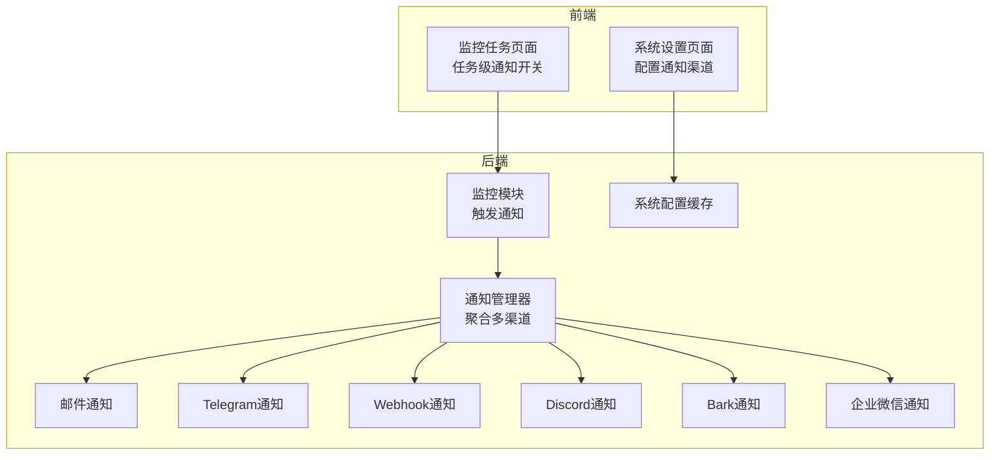
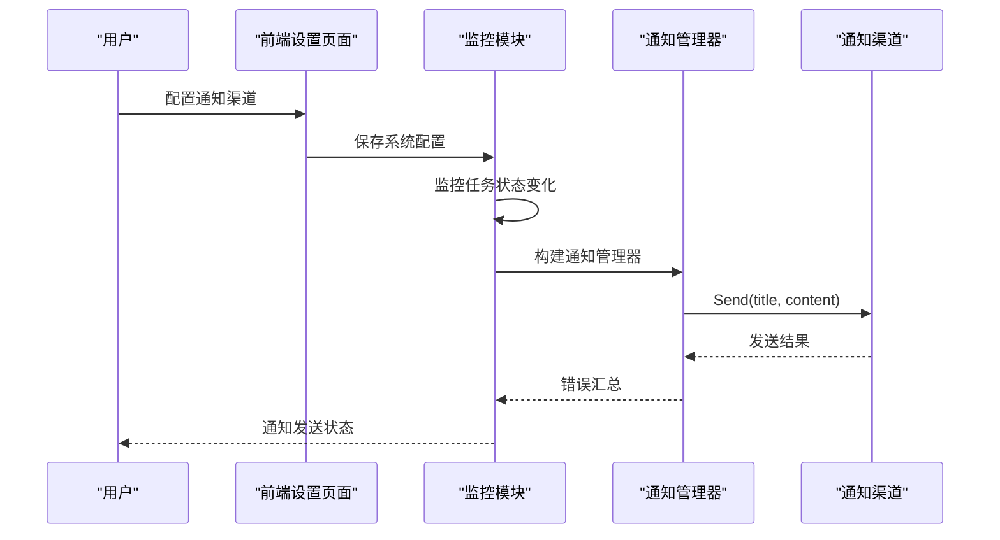
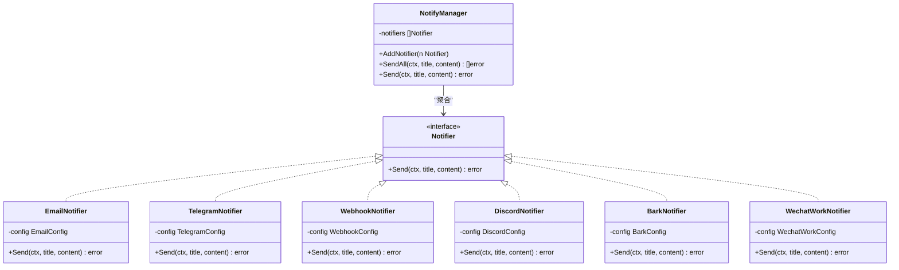
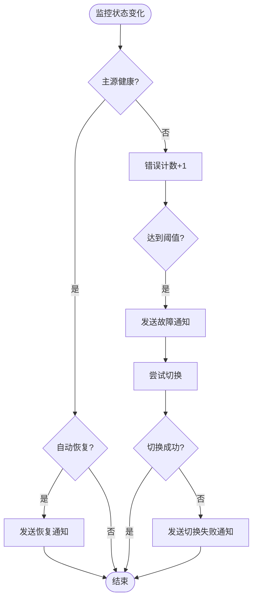
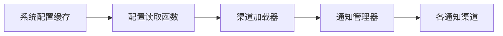

# 通知系统

<cite>
**本文档引用的文件**
- [notify.go](file://main/internal/notify/notify.go)
- [templates.go](file://main/internal/notify/templates.go)
- [monitor.go](file://main/internal/monitor/monitor.go)
- [sysconfig.go](file://main/internal/sysconfig/sysconfig.go)
- [page.tsx](file://web/app/(dashboard)/dashboard/settings/page.tsx)
- [page.tsx](file://web/app/(dashboard)/dashboard/monitor/page.tsx)
</cite>

## 目录
1. [简介](#简介)
2. [项目结构](#项目结构)
3. [核心组件](#核心组件)
4. [架构总览](#架构总览)
5. [详细组件分析](#详细组件分析)
6. [依赖关系分析](#依赖关系分析)
7. [性能考虑](#性能考虑)
8. [故障排查指南](#故障排查指南)
9. [结论](#结论)
10. [附录](#附录)

## 简介
本通知系统为 DNSPlane 提供多渠道通知能力，支持邮件、Telegram 机器人、Webhook、Discord、Bark 和企业微信等多种通知方式。系统通过统一的管理器模式聚合多个通知渠道，实现故障告警、切换失败、自动恢复等事件的实时通知。同时提供丰富的模板渲染能力，支持多种业务场景的邮件通知，并具备系统级与任务级的配置控制，便于灵活扩展与运维。

## 项目结构
通知系统主要分布在以下模块：
- 后端核心：`main/internal/notify`（通知渠道实现与模板）
- 监控触发：`main/internal/monitor`（监控任务触发通知）
- 系统配置缓存：`main/internal/sysconfig`（后台任务读取配置）
- 前端配置界面：`web/app/(dashboard)/dashboard/settings`（系统通知配置）
- 前端任务配置界面：`web/app/(dashboard)/dashboard/monitor`（任务级通知开关）

图表来源
- [notify.go:333-364](file://main/internal/notify/notify.go#L333-L364)
- [monitor.go:793-891](file://main/internal/monitor/monitor.go#L793-L891)
- [sysconfig.go:27-46](file://main/internal/sysconfig/sysconfig.go#L27-L46)

章节来源
- [notify.go:1-569](file://main/internal/notify/notify.go#L1-L569)
- [monitor.go:257-909](file://main/internal/monitor/monitor.go#L257-L909)
- [sysconfig.go:1-47](file://main/internal/sysconfig/sysconfig.go#L1-L47)
- [page.tsx](file://web/app/(dashboard)/dashboard/settings/page.tsx#L1000-L1204)
- [page.tsx](file://web/app/(dashboard)/dashboard/monitor/page.tsx#L1831-L1856)

## 核心组件
- 通知接口与管理器
  - 统一的 `Notifier` 接口，所有渠道实现 `Send(ctx, title, content)` 方法
  - `NotifyManager` 聚合多个通知渠道，支持批量发送与错误收集
- 通知渠道实现
  - 邮件：支持 SSL/TLS/Plain 三种传输方式，多种认证方式
  - Telegram：基于官方 Bot API 的 HTML 格式消息
  - Webhook：支持自定义方法、头、内容类型与模板变量替换
  - Discord：使用 Embed 结构化消息
  - Bark：基于 GET 请求的轻量推送
  - 企业微信：基于 Webhook 的 Markdown 消息
- 模板系统
  - 提供多种业务邮件模板：密码重置、TOTP 重置、证书到期、部署成功/失败、域名到期、验证码等
- 触发机制
  - 监控模块根据任务状态变化触发通知，支持系统级与任务级配置

章节来源
- [notify.go:29-364](file://main/internal/notify/notify.go#L29-L364)
- [templates.go:1-543](file://main/internal/notify/templates.go#L1-L543)
- [monitor.go:756-791](file://main/internal/monitor/monitor.go#L756-L791)

## 架构总览
通知系统采用“配置驱动 + 管理器聚合”的架构：
- 配置来源：系统设置（全局）与任务配置（局部）
- 配置缓存：后台任务通过缓存层读取系统配置，降低数据库压力
- 通知触发：监控模块在故障、切换失败、自动恢复等事件发生时构建通知管理器并发送
- 渠道扩展：新增渠道只需实现 `Notifier` 接口并通过工厂函数注册

图表来源
- [monitor.go:756-791](file://main/internal/monitor/monitor.go#L756-L791)
- [notify.go:333-364](file://main/internal/notify/notify.go#L333-L364)

## 详细组件分析

### 通知管理器与渠道
- 管理器职责
  - 聚合多个通知渠道
  - 支持批量发送与错误收集
  - 提供单次发送与批量发送两种模式
- 渠道特性
  - 邮件：支持多种加密与认证方式，自动判断 TLS/SSL/Plain
  - Telegram：HTML 格式消息，支持超时控制
  - Webhook：支持自定义模板变量替换与请求头
  - Discord：Embed 结构化消息，颜色与描述可配置
  - Bark：轻量 GET 请求，支持自定义服务器
  - 企业微信：Markdown 消息，支持超时控制

图表来源
- [notify.go:29-364](file://main/internal/notify/notify.go#L29-L364)

章节来源
- [notify.go:17-568](file://main/internal/notify/notify.go#L17-L568)

### 通知模板系统
- 模板类型
  - 密码重置、TOTP 重置、管理员重置
  - 证书到期、部署成功/失败、域名到期
  - 验证码邮件
- 模板渲染
  - 提供纯文本标题与 HTML 正文
  - 支持动态参数注入（用户名、链接、过期时间等）
  - 邮件模板采用完整的 HTML 结构，包含样式与提示信息

章节来源
- [templates.go:8-543](file://main/internal/notify/templates.go#L8-L543)

### 通知触发流程
- 触发条件
  - 故障告警：主源连续失败达到阈值
  - 切换失败：自动切换失败
  - 自动恢复：主源恢复健康并满足自动恢复条件
- 触发逻辑
  - 监控模块根据任务状态变化构建标题与正文
  - 从系统配置加载通知渠道，支持任务级指定渠道
  - 使用管理器并发发送，记录发送结果与错误

图表来源
- [monitor.go:257-296](file://main/internal/monitor/monitor.go#L257-L296)
- [monitor.go:756-791](file://main/internal/monitor/monitor.go#L756-L791)

章节来源
- [monitor.go:257-909](file://main/internal/monitor/monitor.go#L257-L909)

### 配置与界面
- 系统级配置（全局）
  - 邮件：SMTP 主机、端口、用户名、密码、发件人、收件人、加密方式、认证方式
  - Telegram：Bot Token、Chat ID
  - Webhook：URL、方法、头、内容类型、模板
  - Discord：Webhook URL
  - Bark：服务器地址、Device Key
  - 企业微信：Webhook URL
- 任务级配置（局部）
  - 开启/关闭通知
  - 指定通知渠道集合（email、telegram、webhook、discord、bark、wechat）

章节来源
- [notify.go:512-519](file://main/internal/notify/notify.go#L512-L519)
- [page.tsx](file://web/app/(dashboard)/dashboard/settings/page.tsx#L1000-L1204)
- [page.tsx](file://web/app/(dashboard)/dashboard/monitor/page.tsx#L1831-L1856)

## 依赖关系分析
- 配置缓存层
  - 后台任务通过 `sysconfig.GetValue` 读取系统配置，带缓存与 TTL 控制
  - 配置更新后可主动失效缓存，保证一致性
- 通知渠道注册
  - 通过 `LoadNotifiersFromConfig` 或 `LoadNotifiersWithGetter` 从配置映射中自动注册可用渠道
- 监控触发
  - 监控模块根据任务状态变化构建通知管理器，支持任务级渠道覆盖

图表来源
- [sysconfig.go:27-46](file://main/internal/sysconfig/sysconfig.go#L27-L46)
- [notify.go:526-534](file://main/internal/notify/notify.go#L526-L534)

章节来源
- [sysconfig.go:1-47](file://main/internal/sysconfig/sysconfig.go#L1-L47)
- [notify.go:503-568](file://main/internal/notify/notify.go#L503-L568)
- [monitor.go:793-891](file://main/internal/monitor/monitor.go#L793-L891)

## 性能考虑
- 超时控制
  - 所有外部 HTTP 请求均设置 30 秒超时，避免阻塞
- 并发发送
  - 管理器并发发送多个渠道，提升整体送达效率
- 缓存读取
  - 后台任务通过缓存层读取系统配置，减少数据库压力
- 轻量通道
  - Bark 采用 GET 请求，开销较小
- 错误隔离
  - 批量发送时收集各渠道错误，不影响其他渠道发送

## 故障排查指南
- 常见问题定位
  - 邮件发送失败：检查 SMTP 主机、端口、加密方式、认证方式与网络连通性
  - Telegram 发送失败：确认 Bot Token 与 Chat ID 是否正确，API 返回状态码
  - Webhook 发送失败：检查 URL、方法、头、内容类型与模板变量替换
  - Discord 发送失败：确认 Webhook URL 有效，Embed 结构正确
  - Bark 发送失败：确认服务器地址与 Device Key，检查网络可达性
  - 企业微信发送失败：确认 Webhook URL 有效，Markdown 内容格式正确
- 日志与调试
  - 监控模块在发送前记录上下文，在发送失败时输出详细错误
  - 建议开启系统日志查看通知发送状态
- 配置核验
  - 使用前端“测试”按钮快速验证各渠道配置
  - 确认系统级与任务级通知开关状态一致

章节来源
- [notify.go:58-190](file://main/internal/notify/notify.go#L58-L190)
- [notify.go:236-265](file://main/internal/notify/notify.go#L236-L265)
- [notify.go:295-331](file://main/internal/notify/notify.go#L295-L331)
- [notify.go:384-413](file://main/internal/notify/notify.go#L384-L413)
- [notify.go:437-455](file://main/internal/notify/notify.go#L437-L455)
- [notify.go:475-501](file://main/internal/notify/notify.go#L475-L501)
- [monitor.go:783-790](file://main/internal/monitor/monitor.go#L783-L790)

## 结论
通知系统以简洁的接口设计与强大的扩展能力，实现了多渠道、高可靠的通知机制。通过系统级与任务级配置结合，既能满足全局统一通知策略，又能灵活覆盖特定任务需求。模板系统与触发流程的清晰分离，使得业务场景下的通知内容定制变得简单高效。建议在生产环境中结合缓存与超时控制，持续监控各渠道可用性，并定期进行测试验证。

## 附录

### 通知配置键清单
- 邮件：mail_host, mail_port, mail_user, mail_password, mail_from, mail_recv, mail_secure, mail_tls
- Telegram：tgbot_token, tgbot_chatid
- Webhook：webhook_url
- Discord：discord_webhook
- Bark：bark_url, bark_key
- 企业微信：wechat_webhook

章节来源
- [notify.go:512-519](file://main/internal/notify/notify.go#L512-L519)

### 新增通知渠道步骤
- 实现 `Notifier` 接口：定义配置结构体与 `Send(ctx, title, content)` 方法
- 注册渠道工厂：在 `LoadNotifiersFromConfig` 中根据配置键判断并创建实例
- 前端配置：在系统设置页面增加对应配置项与测试按钮
- 测试验证：使用测试按钮验证渠道可用性

章节来源
- [notify.go:29-364](file://main/internal/notify/notify.go#L29-L364)
- [notify.go:503-568](file://main/internal/notify/notify.go#L503-L568)
- [page.tsx](file://web/app/(dashboard)/dashboard/settings/page.tsx#L1000-L1204)