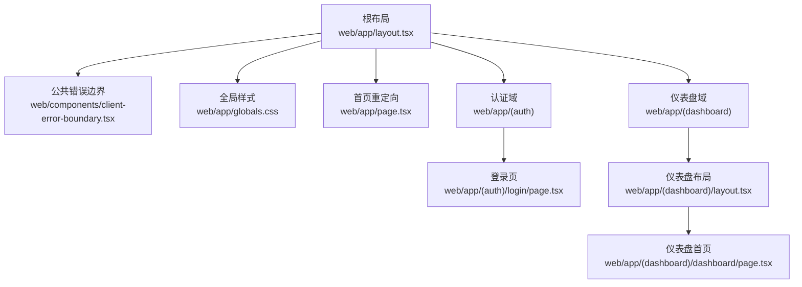
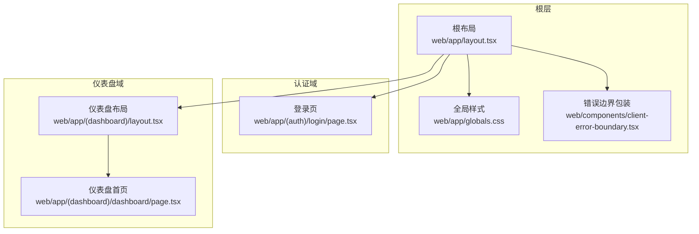
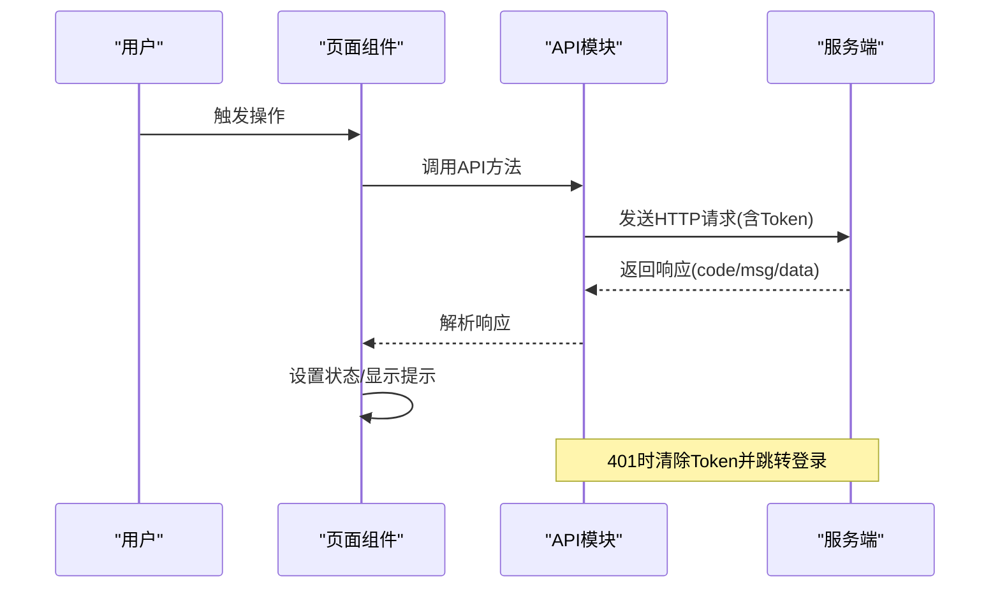
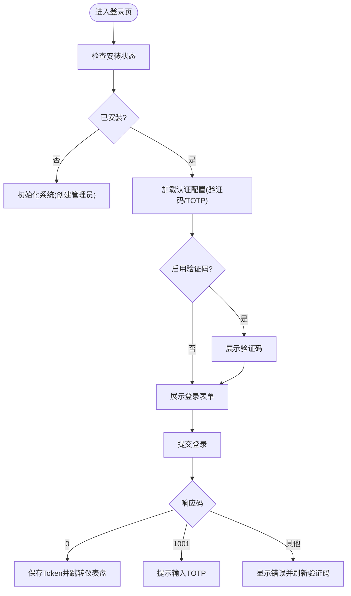
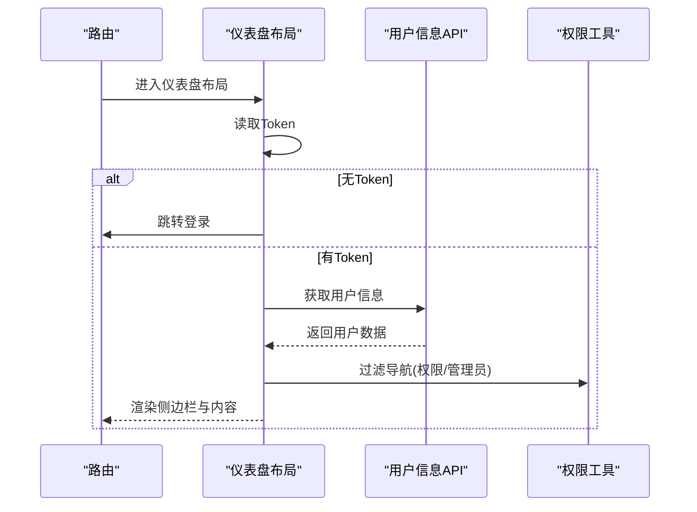
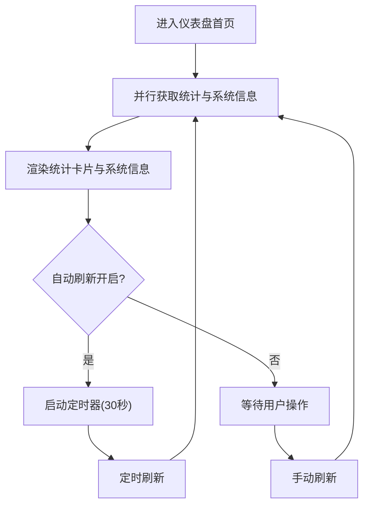
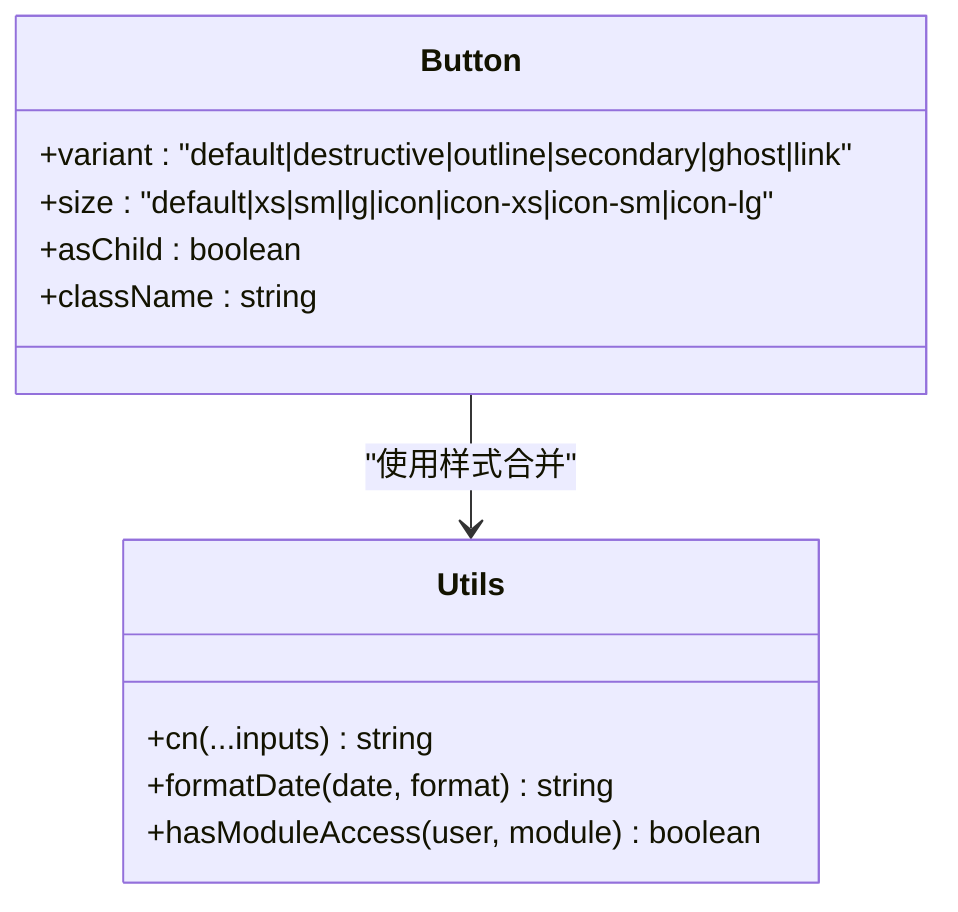
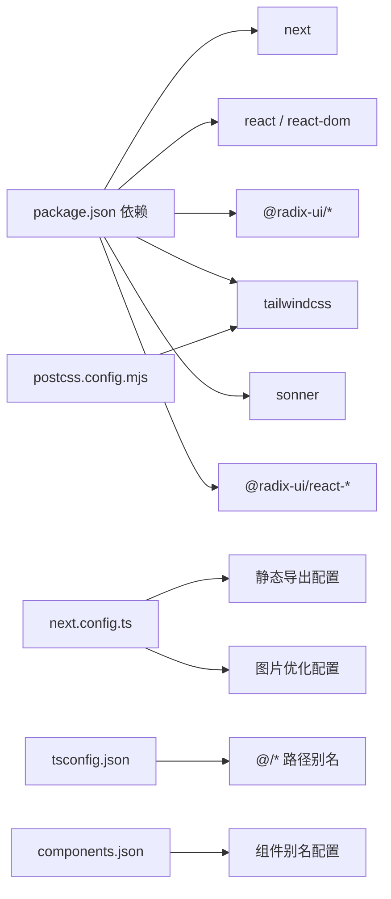

# 前端架构

<cite>
**本文档引用的文件**
- [web/app/layout.tsx](file://web/app/layout.tsx)
- [web/app/page.tsx](file://web/app/page.tsx)
- [web/app/(auth)/login/page.tsx](file://web/app/(auth)/login/page.tsx)
- [web/app/(dashboard)/layout.tsx](file://web/app/(dashboard)/layout.tsx)
- [web/app/(dashboard)/dashboard/page.tsx](file://web/app/(dashboard)/dashboard/page.tsx)
- [web/components/ui/button.tsx](file://web/components/ui/button.tsx)
- [web/lib/api.ts](file://web/lib/api.ts)
- [web/lib/utils.ts](file://web/lib/utils.ts)
- [web/app/globals.css](file://web/app/globals.css)
- [web/package.json](file://web/package.json)
- [web/next.config.ts](file://web/next.config.ts)
- [web/tsconfig.json](file://web/tsconfig.json)
- [web/postcss.config.mjs](file://web/postcss.config.mjs)
- [web/components.json](file://web/components.json)
- [web/components/client-error-boundary.tsx](file://web/components/client-error-boundary.tsx)
</cite>

## 目录
1. [引言](#引言)
2. [项目结构](#项目结构)
3. [核心组件](#核心组件)
4. [架构总览](#架构总览)
5. [详细组件分析](#详细组件分析)
6. [依赖关系分析](#依赖关系分析)
7. [性能考虑](#性能考虑)
8. [故障排除指南](#故障排除指南)
9. [结论](#结论)
10. [附录](#附录)

## 引言
本文件面向DNSPlane前端团队与相关利益方，系统性梳理基于Next.js的应用架构设计，覆盖app目录结构、页面路由体系、组件库设计模式、状态与数据流管理、路由与权限控制、构建配置与性能优化策略，并提供组件设计规范与开发最佳实践建议。文档以仓库现有实现为依据，确保可追溯性与可操作性。

## 项目结构
DNSPlane前端采用Next.js app目录结构，结合分组路由与客户端布局，形成清晰的业务域划分与共享布局层。关键目录与文件职责如下：
- app目录：按业务域组织页面与布局，使用分组路由实现嵌套布局与权限控制
- components目录：基于Radix UI与Tailwind CSS的可复用UI组件库
- lib目录：API封装、工具函数与类型定义
- 样式系统：Tailwind CSS + 自定义CSS变量与动画，支持深色/浅色主题
- 构建配置：Next.js配置、TypeScript配置、PostCSS配置

**图表来源**
- [web/app/layout.tsx:1-34](file://web/app/layout.tsx#L1-L34)
- [web/app/page.tsx:1-19](file://web/app/page.tsx#L1-L19)
- [web/app/(auth)/login/page.tsx](file://web/app/(auth)/login/page.tsx#L1-L292)
- [web/app/(dashboard)/layout.tsx](file://web/app/(dashboard)/layout.tsx#L1-L391)
- [web/app/(dashboard)/dashboard/page.tsx](file://web/app/(dashboard)/dashboard/page.tsx#L1-L578)

**章节来源**
- [web/app/layout.tsx:1-34](file://web/app/layout.tsx#L1-L34)
- [web/app/page.tsx:1-19](file://web/app/page.tsx#L1-L19)
- [web/app/(auth)/login/page.tsx](file://web/app/(auth)/login/page.tsx#L1-L292)
- [web/app/(dashboard)/layout.tsx](file://web/app/(dashboard)/layout.tsx#L1-L391)
- [web/app/(dashboard)/dashboard/page.tsx](file://web/app/(dashboard)/dashboard/page.tsx#L1-L578)

## 核心组件
- 组件库设计模式
  - 基于Radix UI的语义化组件，通过class-variance-authority实现变体与尺寸系统
  - 使用Tailwind CSS进行样式组合，支持暗色主题与CSS变量
  - 组件导出统一的变体接口，便于在不同场景下复用
- 样式系统与主题管理
  - 通过CSS自定义属性与Tailwind theme配置，实现主题变量与暗色模式
  - 在全局样式中定义动画、渐变、玻璃态等通用样式
- 错误处理与边界
  - 客户端错误边界包装，确保页面级错误不崩溃整页
  - 全局错误处理器与通知提示集成

**章节来源**
- [web/components/ui/button.tsx:1-65](file://web/components/ui/button.tsx#L1-L65)
- [web/app/globals.css:1-435](file://web/app/globals.css#L1-L435)
- [web/components/client-error-boundary.tsx:1-8](file://web/components/client-error-boundary.tsx#L1-L8)

## 架构总览
DNSPlane前端采用“根布局 + 分组路由 + 客户端布局”的三层结构：
- 根布局负责全局上下文（主题、通知、错误边界）
- 分组路由将认证与仪表盘域隔离，分别管理各自的布局与导航
- 客户端布局负责用户态校验、权限过滤与侧边栏导航

**图表来源**
- [web/app/layout.tsx:1-34](file://web/app/layout.tsx#L1-L34)
- [web/app/(auth)/login/page.tsx](file://web/app/(auth)/login/page.tsx#L1-L292)
- [web/app/(dashboard)/layout.tsx](file://web/app/(dashboard)/layout.tsx#L1-L391)
- [web/app/(dashboard)/dashboard/page.tsx](file://web/app/(dashboard)/dashboard/page.tsx#L1-L578)

## 详细组件分析

### API封装与数据流
- 设计要点
  - 统一的ApiClient类封装fetch请求，内置Token管理与401自动登出逻辑
  - 按业务域拆分API模块（认证、账户、域名、监控、证书、用户、日志、系统、仪表盘、TOTP、OAuth、请求日志）
  - 所有API返回统一的响应结构，便于前端统一处理
- 错误处理
  - 401响应自动清除Token并跳转登录
  - 业务错误码与消息统一透传，配合toast提示
- 加载状态
  - 页面级加载骨架屏与按钮级加载态，提升交互反馈

**图表来源**
- [web/lib/api.ts:1-686](file://web/lib/api.ts#L1-L686)

**章节来源**
- [web/lib/api.ts:1-686](file://web/lib/api.ts#L1-L686)

### 登录流程与认证控制
- 流程概述
  - 首次访问检查安装状态，若未安装则进入初始化流程
  - 已安装时根据系统配置决定是否启用验证码与TOTP
  - 登录成功后写入Token并跳转仪表盘
- 安全机制
  - 支持验证码与TOTP双重校验
  - 旧版OAuth回调参数清理，避免泄露

**图表来源**
- [web/app/(auth)/login/page.tsx](file://web/app/(auth)/login/page.tsx#L1-L292)
- [web/lib/api.ts:1-686](file://web/lib/api.ts#L1-L686)

**章节来源**
- [web/app/(auth)/login/page.tsx](file://web/app/(auth)/login/page.tsx#L1-L292)

### 仪表盘布局与权限控制
- 导航与权限
  - 导航项支持模块权限与管理员级别过滤
  - 子菜单展开状态与当前路由联动
- 用户态与安全
  - 首次进入拉取用户信息，未登录或鉴权失败自动跳转登录
  - 旧版OAuth回调参数清理
- 侧边栏与头部
  - 移动端抽屉式导航，桌面端固定侧边栏
  - 头部用户下拉菜单提供个人中心与退出登录

**图表来源**
- [web/app/(dashboard)/layout.tsx](file://web/app/(dashboard)/layout.tsx#L1-L391)
- [web/lib/utils.ts:118-129](file://web/lib/utils.ts#L118-L129)

**章节来源**
- [web/app/(dashboard)/layout.tsx](file://web/app/(dashboard)/layout.tsx#L1-L391)
- [web/lib/utils.ts:118-129](file://web/lib/utils.ts#L118-L129)

### 仪表盘首页与数据聚合
- 数据聚合
  - 并行请求统计与系统信息，首屏快速渲染
  - 支持手动刷新与自动刷新（页面可见性感知）
- 展示设计
  - 统计卡片、状态徽章、进度条等UI组件组合
  - 系统信息卡片展示运行环境与资源使用

**图表来源**
- [web/app/(dashboard)/dashboard/page.tsx](file://web/app/(dashboard)/dashboard/page.tsx#L1-L578)

**章节来源**
- [web/app/(dashboard)/dashboard/page.tsx](file://web/app/(dashboard)/dashboard/page.tsx#L1-L578)

### 组件库设计与复用性
- Button组件
  - 通过变体与尺寸系统实现高度复用
  - 支持作为子元素容器（asChild）以保持语义正确
- 样式系统
  - Tailwind CSS + class-variance-authority + CSS变量
  - 组件样式与主题解耦，便于扩展与定制

**图表来源**
- [web/components/ui/button.tsx:1-65](file://web/components/ui/button.tsx#L1-L65)
- [web/lib/utils.ts:1-129](file://web/lib/utils.ts#L1-L129)

**章节来源**
- [web/components/ui/button.tsx:1-65](file://web/components/ui/button.tsx#L1-L65)
- [web/lib/utils.ts:1-129](file://web/lib/utils.ts#L1-L129)

## 依赖关系分析
- 依赖关系
  - 组件库依赖Radix UI与Tailwind CSS，提供基础UI能力
  - API模块集中管理后端接口，页面组件仅关注业务逻辑
  - 样式系统通过CSS变量与Tailwind theme实现主题一致性
- 构建与工具链
  - Next.js 16 + React 19 + TypeScript
  - PostCSS + Tailwind CSS
  - shadcn/ui配置用于组件别名与生成

**图表来源**
- [web/package.json:1-53](file://web/package.json#L1-L53)
- [web/next.config.ts:1-16](file://web/next.config.ts#L1-L16)
- [web/tsconfig.json:1-35](file://web/tsconfig.json#L1-L35)
- [web/postcss.config.mjs:1-8](file://web/postcss.config.mjs#L1-L8)
- [web/components.json:1-23](file://web/components.json#L1-L23)

**章节来源**
- [web/package.json:1-53](file://web/package.json#L1-L53)
- [web/next.config.ts:1-16](file://web/next.config.ts#L1-L16)
- [web/tsconfig.json:1-35](file://web/tsconfig.json#L1-L35)
- [web/postcss.config.mjs:1-8](file://web/postcss.config.mjs#L1-L8)
- [web/components.json:1-23](file://web/components.json#L1-L23)

## 性能考虑
- 代码分割与懒加载
  - Next.js app目录天然支持路由级代码分割
  - 页面组件标记'use client'以启用客户端状态与交互
- 构建与输出
  - 静态导出配置适用于CDN分发与离线部署
  - 图片未优化配置适配静态站点需求
- 样式与主题
  - CSS变量与Tailwind原子类减少重复样式，提升构建效率
  - 暗色模式通过CSS类切换，避免运行时计算成本
- 数据加载
  - 仪表盘首页使用并行请求与骨架屏，改善首屏体验
  - 自动刷新基于页面可见性监听，降低后台消耗

**章节来源**
- [web/next.config.ts:1-16](file://web/next.config.ts#L1-L16)
- [web/app/(dashboard)/dashboard/page.tsx](file://web/app/(dashboard)/dashboard/page.tsx#L1-L578)
- [web/app/globals.css:1-435](file://web/app/globals.css#L1-L435)

## 故障排除指南
- 登录失败
  - 检查验证码/TOTP配置与后端状态
  - 确认Token写入与清理逻辑
- 401自动登出
  - 确认Token存储与请求头携带
  - 排查跨域与CORS配置
- 页面空白或加载卡住
  - 检查仪表盘数据请求与并行调用
  - 查看控制台错误与网络请求
- 样式异常
  - 确认CSS变量与Tailwind配置
  - 检查组件别名与shadcn配置

**章节来源**
- [web/lib/api.ts:1-686](file://web/lib/api.ts#L1-L686)
- [web/app/(auth)/login/page.tsx](file://web/app/(auth)/login/page.tsx#L1-L292)
- [web/app/(dashboard)/dashboard/page.tsx](file://web/app/(dashboard)/dashboard/page.tsx#L1-L578)
- [web/app/globals.css:1-435](file://web/app/globals.css#L1-L435)

## 结论
DNSPlane前端以Next.js app目录为核心，结合分组路由与客户端布局，实现了清晰的业务域分离与强一致的主题与样式系统。通过统一的API封装、权限过滤与错误处理机制，保障了用户体验与安全性。建议在后续迭代中持续完善类型约束、测试覆盖与性能监控，以支撑更大规模的业务演进。

## 附录
- 组件设计规范
  - 变体与尺寸：优先使用组件提供的标准变体，避免直接内联样式
  - 语义化：使用asChild保持DOM语义，避免破坏可访问性
  - 主题一致性：通过CSS变量与Tailwind类组合，避免硬编码颜色
- 开发最佳实践
  - 页面组件标记'use client'，仅在必要时启用客户端状态
  - API调用集中处理错误与加载态，避免分散逻辑
  - 导航与权限：统一通过工具函数过滤，确保一致性