# 后端架构

<cite>
**本文引用的文件**
- [main.go](file://main/main.go)
- [router.go](file://main/internal/api/router.go)
- [config.go](file://main/internal/config/config.go)
- [logger.go](file://main/internal/logger/logger.go)
- [auth.go](file://main/internal/api/middleware/auth.go)
- [logger_mw.go](file://main/internal/api/middleware/logger.go)
- [recovery_mw.go](file://main/internal/api/middleware/recovery.go)
- [audit_mw.go](file://main/internal/api/middleware/audit.go)
- [database.go](file://main/internal/database/database.go)
- [cache.go](file://main/internal/cache/cache.go)
- [task_runner.go](file://main/internal/service/task_runner.go)
- [models.go](file://main/internal/models/models.go)
- [sysconfig.go](file://main/internal/sysconfig/sysconfig.go)
- [store.go](file://main/internal/logstore/store.go)
- [go.mod](file://main/go.mod)
</cite>

## 目录
1. [简介](#简介)
2. [项目结构](#项目结构)
3. [核心组件](#核心组件)
4. [架构总览](#架构总览)
5. [详细组件分析](#详细组件分析)
6. [依赖分析](#依赖分析)
7. [性能考虑](#性能考虑)
8. [故障排查指南](#故障排查指南)
9. [结论](#结论)

## 简介
本文件面向DNSPlane后端架构，聚焦Go应用的整体设计与实现细节，覆盖入口初始化流程、模块导入与依赖注入模式、API路由与中间件链、配置管理、错误处理与日志、服务生命周期与优雅停机、以及关键组件的交互关系与数据流。文档旨在帮助开发者与运维人员快速理解系统设计与运行机制。

## 项目结构
后端采用“入口文件 + 内部模块”的分层组织方式：
- 入口层：main/main.go 负责初始化配置、数据库、缓存、日志、监控、任务与HTTP服务。
- API层：main/internal/api 提供路由与中间件，组织REST接口。
- 业务支撑层：config、logger、database、cache、service、sysconfig、logstore、models 等模块提供配置、日志、数据库、缓存、任务、系统配置缓存、日志存储与数据模型。
- 前端静态资源：通过embed打包进二进制，由路由层统一托管。

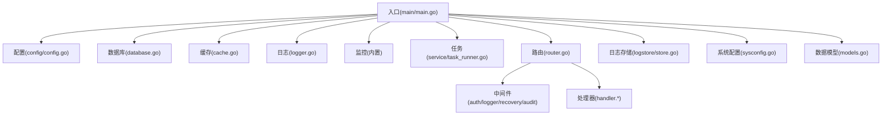

图示来源
- [main.go:52-147](file://main/main.go#L52-L147)
- [router.go:14-274](file://main/internal/api/router.go#L14-L274)
- [config.go:82-161](file://main/internal/config/config.go#L82-L161)
- [database.go:73-149](file://main/internal/database/database.go#L73-L149)
- [cache.go:47-94](file://main/internal/cache/cache.go#L47-L94)
- [logger.go:395-456](file://main/internal/logger/logger.go#L395-L456)
- [task_runner.go:36-94](file://main/internal/service/task_runner.go#L36-L94)
- [logstore.go:42-50](file://main/internal/logstore/store.go#L42-L50)
- [sysconfig.go:27-46](file://main/internal/sysconfig/sysconfig.go#L27-L46)
- [models.go:9-357](file://main/internal/models/models.go#L9-L357)

章节来源
- [main.go:52-147](file://main/main.go#L52-L147)
- [router.go:14-274](file://main/internal/api/router.go#L14-L274)

## 核心组件
- 入口与生命周期管理：main/main.go 负责加载配置、初始化数据库/缓存/验证码/日志、注册数据库回调、启动监控与后台任务、构建HTTP服务并监听信号实现优雅停机。
- 配置系统：config/config.go 提供配置加载、默认值、持久化与只读访问，支持配置文件不存在时自动生成默认配置。
- 日志系统：logger/logger.go 提供结构化日志、文件轮转、控制台彩色输出、后台清理与全局日志函数。
- 数据库：database/database.go 支持SQLite/MySQL，自动迁移、连接池优化、WAL模式、独立日志与请求日志数据库、GORM回调记录SQL与耗时。
- 缓存：cache/cache.go 支持Redis与内存两种后端，自动降级，提供键空间前缀与列表操作。
- 路由与中间件：router.go 组织REST路由，中间件链包括恢复、日志、CORS、鉴权、审计等。
- 任务系统：service/task_runner.go 提供证书续期、部署执行、到期通知、失败重试与锁释放等后台任务。
- 日志存储：logstore/store.go 提供请求日志与系统日志的高性能列表存储，支持Redis或内存后端。
- 系统配置缓存：sysconfig.go 提供SysConfig的带缓存读取，避免频繁DB访问。
- 数据模型：models.go 定义用户、账户、域名、证书、日志、定时任务等核心实体。

章节来源
- [main.go:52-147](file://main/main.go#L52-L147)
- [config.go:82-161](file://main/internal/config/config.go#L82-L161)
- [logger.go:43-305](file://main/internal/logger/logger.go#L43-L305)
- [database.go:73-469](file://main/internal/database/database.go#L73-L469)
- [cache.go:47-309](file://main/internal/cache/cache.go#L47-L309)
- [router.go:14-274](file://main/internal/api/router.go#L14-L274)
- [task_runner.go:24-889](file://main/internal/service/task_runner.go#L24-L889)
- [logstore.go:35-440](file://main/internal/logstore/store.go#L35-L440)
- [sysconfig.go:17-46](file://main/internal/sysconfig/sysconfig.go#L17-L46)
- [models.go:9-357](file://main/internal/models/models.go#L9-L357)

## 架构总览
下图展示从入口到各子系统的整体交互：

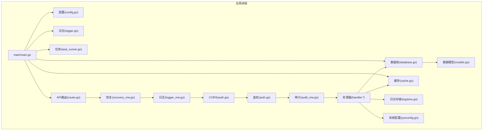

图示来源
- [main.go:52-147](file://main/main.go#L52-L147)
- [router.go:14-274](file://main/internal/api/router.go#L14-L274)
- [auth.go:124-199](file://main/internal/api/middleware/auth.go#L124-L199)
- [logger_mw.go:156-231](file://main/internal/api/middleware/logger.go#L156-L231)
- [recovery_mw.go:21-74](file://main/internal/api/middleware/recovery.go#L21-L74)
- [audit_mw.go:21-88](file://main/internal/api/middleware/audit.go#L21-L88)
- [database.go:73-149](file://main/internal/database/database.go#L73-L149)
- [cache.go:47-94](file://main/internal/cache/cache.go#L47-L94)
- [logger.go:395-456](file://main/internal/logger/logger.go#L395-L456)
- [task_runner.go:36-94](file://main/internal/service/task_runner.go#L36-L94)
- [logstore.go:42-50](file://main/internal/logstore/store.go#L42-L50)
- [sysconfig.go:27-46](file://main/internal/sysconfig/sysconfig.go#L27-L46)
- [models.go:9-357](file://main/internal/models/models.go#L9-L357)

## 详细组件分析

### 入口与生命周期管理
- 初始化流程
  - 解析命令行参数（配置文件路径）
  - 加载配置并校验
  - 初始化数据库（SQLite/MySQL）、日志数据库与请求日志数据库
  - 初始化缓存（Redis可选，失败回退内存）
  - 初始化行为验证码资源
  - 初始化日志存储
  - 注册数据库查询回调（记录SQL、耗时、影响行数与错误）
  - 设置Gin运行模式
  - 启动监控与后台任务管理器
  - 启动数据库维护（清理、VACUUM、索引优化）
  - 启动请求日志清理服务
  - 构建路由并启动HTTP服务
  - 监听系统信号，优雅关闭HTTP服务
- 依赖注入模式
  - 全局共享：数据库连接、缓存实例、日志记录器、监控器、任务运行器
  - 路由与中间件通过包导入与函数调用建立依赖，处理器通过数据库/缓存/日志等全局实例访问能力

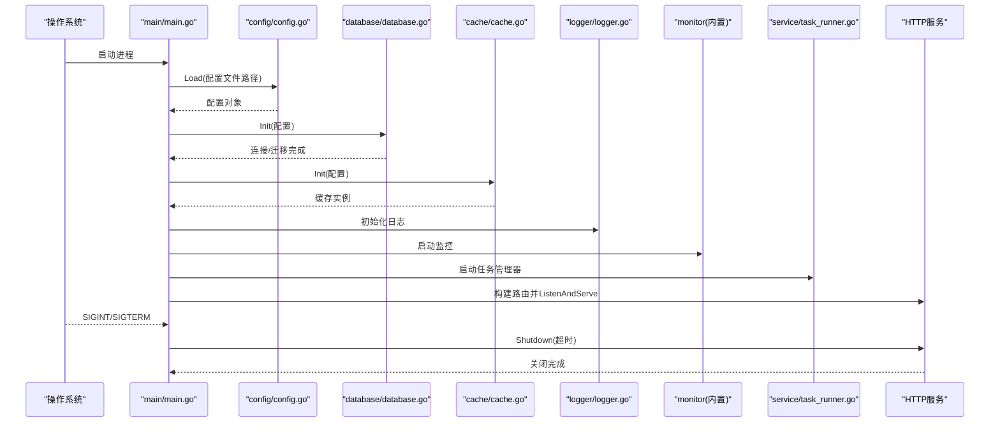

图示来源
- [main.go:52-147](file://main/main.go#L52-L147)
- [config.go:82-122](file://main/internal/config/config.go#L82-L122)
- [database.go:73-149](file://main/internal/database/database.go#L73-L149)
- [cache.go:47-94](file://main/internal/cache/cache.go#L47-L94)
- [logger.go:395-456](file://main/internal/logger/logger.go#L395-L456)
- [task_runner.go:36-94](file://main/internal/service/task_runner.go#L36-L94)

章节来源
- [main.go:52-147](file://main/main.go#L52-L147)

### API路由与中间件链
- 路由组织
  - Gin引擎新建，关闭尾随斜杠与固定路径重定向
  - 全局中间件：恢复、日志、CORS
  - /api 前缀分组，公开接口与认证接口分组
  - 静态资源托管：根路径与404兜底，支持动态路由映射
- 中间件链执行顺序
  - 恢复中间件：捕获panic，区分客户端断开与真实异常，记录结构化日志并返回500
  - 日志中间件：过滤静态资源与HEAD请求，控制台彩色输出，结构化文件日志，慢请求告警
  - CORS中间件：基于系统配置与同源策略，仅允许白名单来源
  - 鉴权中间件：HttpOnly Cookie + Bearer Token双重校验，JWT解析，用户权限注入，Token即将过期提示
  - 审计中间件：对写操作异步记录操作日志，跳过敏感与只读接口

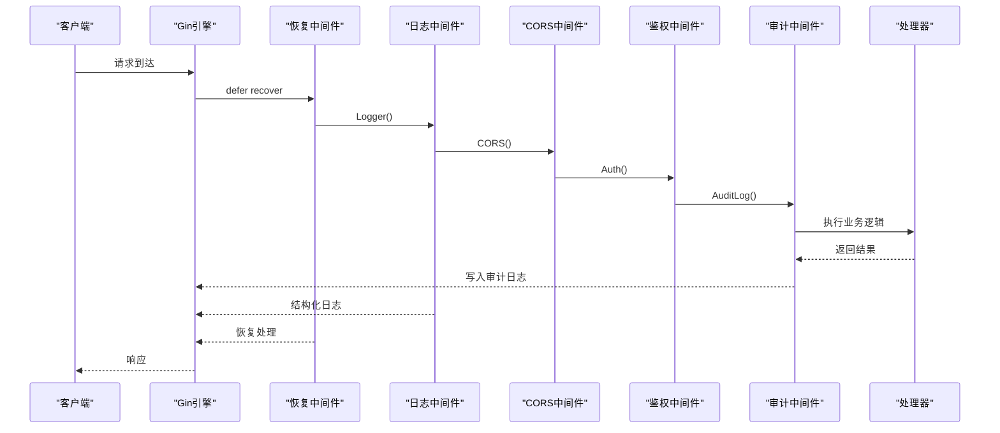

图示来源
- [router.go:14-274](file://main/internal/api/router.go#L14-L274)
- [logger_mw.go:156-231](file://main/internal/api/middleware/logger.go#L156-L231)
- [auth.go:124-199](file://main/internal/api/middleware/auth.go#L124-L199)
- [audit_mw.go:21-88](file://main/internal/api/middleware/audit.go#L21-L88)
- [recovery_mw.go:21-74](file://main/internal/api/middleware/recovery.go#L21-L74)

章节来源
- [router.go:14-274](file://main/internal/api/router.go#L14-L274)
- [logger_mw.go:156-231](file://main/internal/api/middleware/logger.go#L156-L231)
- [auth.go:124-199](file://main/internal/api/middleware/auth.go#L124-L199)
- [audit_mw.go:21-88](file://main/internal/api/middleware/audit.go#L21-L88)
- [recovery_mw.go:21-74](file://main/internal/api/middleware/recovery.go#L21-L74)

### 配置管理系统
- 配置结构
  - server、database、jwt、proxy、log_cleanup、redis 等字段
- 加载与默认值
  - 读取配置文件，不存在则生成随机JWT密钥并保存默认配置
  - 提供Get/Save访问器
- 运行时配置更新
  - 通过系统配置缓存层（sysconfig）读取与失效，避免频繁DB访问
  - 任务系统根据配置动态调整检查周期与通知策略

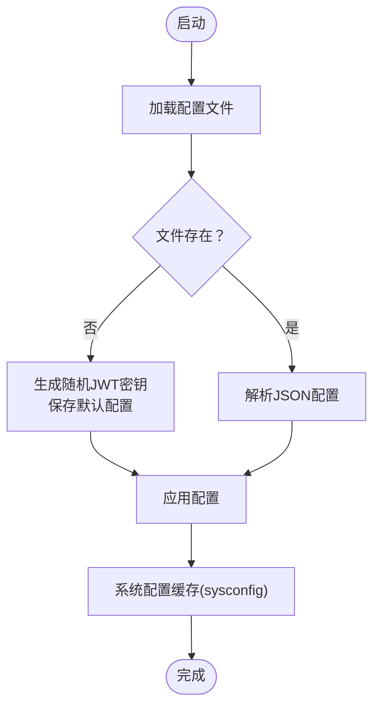

图示来源
- [config.go:82-161](file://main/internal/config/config.go#L82-L161)
- [sysconfig.go:27-46](file://main/internal/sysconfig/sysconfig.go#L27-L46)

章节来源
- [config.go:82-161](file://main/internal/config/config.go#L82-L161)
- [sysconfig.go:27-46](file://main/internal/sysconfig/sysconfig.go#L27-L46)

### 错误处理与日志记录
- 全局异常捕获
  - 恢复中间件捕获panic，识别客户端断开与真实异常，记录结构化日志并返回500
- 日志系统
  - 结构化日志、文件轮转、后台清理、控制台彩色输出
  - HTTP请求日志与普通日志分离，避免重复输出
- 审计日志
  - 对写操作异步记录，跳过敏感接口，包含用户、动作、域名、耗时、状态码等

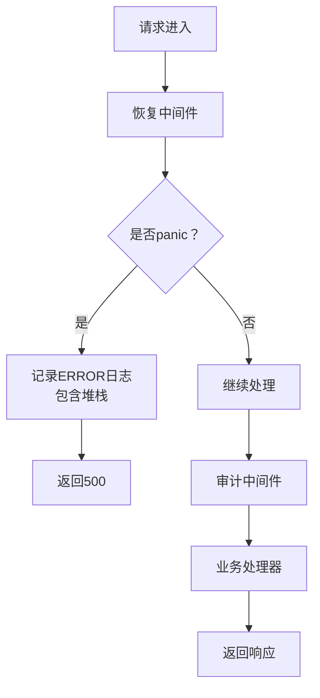

图示来源
- [recovery_mw.go:21-74](file://main/internal/api/middleware/recovery.go#L21-L74)
- [logger_mw.go:156-231](file://main/internal/api/middleware/logger.go#L156-L231)
- [audit_mw.go:21-88](file://main/internal/api/middleware/audit.go#L21-L88)
- [logger.go:43-305](file://main/internal/logger/logger.go#L43-L305)

章节来源
- [recovery_mw.go:21-74](file://main/internal/api/middleware/recovery.go#L21-L74)
- [logger_mw.go:156-231](file://main/internal/api/middleware/logger.go#L156-L231)
- [audit_mw.go:21-88](file://main/internal/api/middleware/audit.go#L21-L88)
- [logger.go:43-305](file://main/internal/logger/logger.go#L43-L305)

### 服务启动与关闭生命周期
- 启动阶段
  - 初始化配置、数据库、缓存、日志、监控、任务与日志存储
  - 构建路由并启动HTTP服务
- 关闭阶段
  - 监听SIGINT/SIGTERM，执行context超时关闭HTTP服务
  - 关闭数据库连接、缓存连接池、日志文件句柄

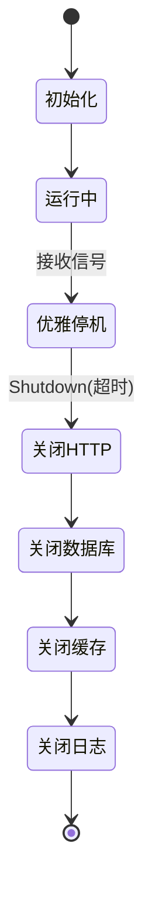

图示来源
- [main.go:52-147](file://main/main.go#L52-L147)
- [database.go:322-339](file://main/internal/database/database.go#L322-L339)
- [cache.go:88-94](file://main/internal/cache/cache.go#L88-L94)
- [logger.go:447-456](file://main/internal/logger/logger.go#L447-L456)

章节来源
- [main.go:52-147](file://main/main.go#L52-L147)
- [database.go:322-339](file://main/internal/database/database.go#L322-L339)
- [cache.go:88-94](file://main/internal/cache/cache.go#L88-L94)
- [logger.go:447-456](file://main/internal/logger/logger.go#L447-L456)

### 数据库与缓存
- 数据库
  - 支持SQLite/MySQL，自动迁移、WAL优化、连接池配置
  - 独立日志数据库与请求日志数据库，迁移旧表数据
  - GORM回调记录SQL、耗时、影响行数与错误，便于诊断
- 缓存
  - Redis可选，失败回退内存缓存
  - 支持键空间前缀、列表操作、JSON序列化、过期与清理

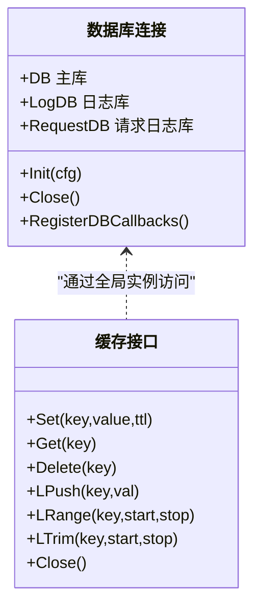

图示来源
- [database.go:20-149](file://main/internal/database/database.go#L20-L149)
- [cache.go:15-94](file://main/internal/cache/cache.go#L15-L94)

章节来源
- [database.go:20-149](file://main/internal/database/database.go#L20-L149)
- [cache.go:15-94](file://main/internal/cache/cache.go#L15-L94)

### 任务系统与通知
- 任务管理器
  - 定时检查证书续期与部署任务，失败重试（指数退避），释放超时锁
  - 每日检查域名与证书到期并发送通知
- 通知渠道
  - 通过系统配置缓存层加载通知配置，支持多种通知渠道

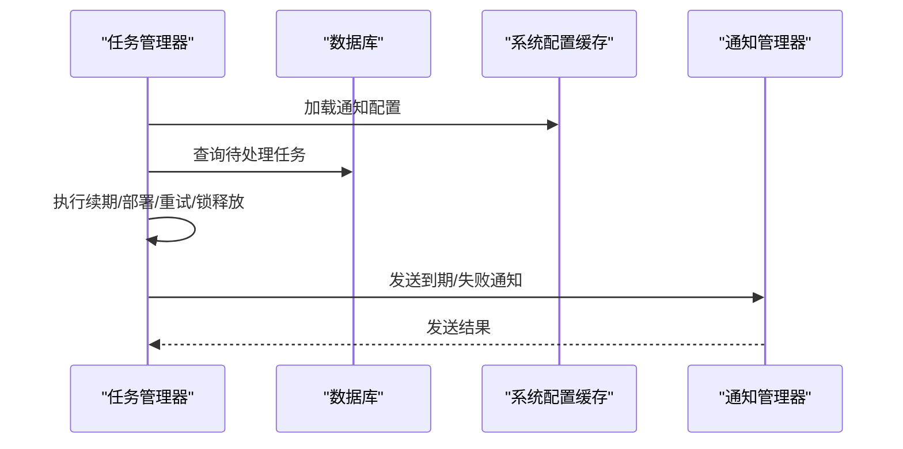

图示来源
- [task_runner.go:36-94](file://main/internal/service/task_runner.go#L36-L94)
- [task_runner.go:163-182](file://main/internal/service/task_runner.go#L163-L182)
- [task_runner.go:255-291](file://main/internal/service/task_runner.go#L255-L291)
- [task_runner.go:643-747](file://main/internal/service/task_runner.go#L643-L747)
- [sysconfig.go:27-46](file://main/internal/sysconfig/sysconfig.go#L27-L46)

章节来源
- [task_runner.go:36-94](file://main/internal/service/task_runner.go#L36-L94)
- [task_runner.go:163-182](file://main/internal/service/task_runner.go#L163-L182)
- [task_runner.go:255-291](file://main/internal/service/task_runner.go#L255-L291)
- [task_runner.go:643-747](file://main/internal/service/task_runner.go#L643-L747)
- [sysconfig.go:27-46](file://main/internal/sysconfig/sysconfig.go#L27-L46)

### 日志存储与审计
- 请求日志
  - 使用缓存列表存储，支持Redis或内存后端，定期裁剪与统计缓存
  - 支持按关键字、方法、错误标志、时间范围过滤与分页
- 系统日志
  - 审计日志异步写入，支持关键字、动作、域名过滤与分页

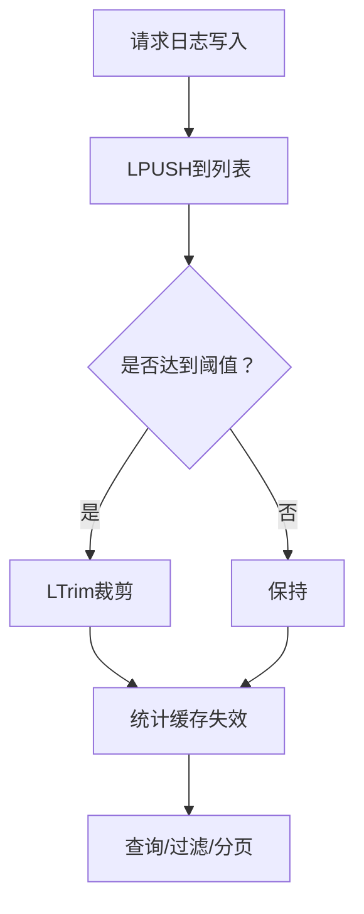

图示来源
- [logstore.go:59-125](file://main/internal/logstore/store.go#L59-L125)
- [logstore.go:193-249](file://main/internal/logstore/store.go#L193-L249)
- [audit_mw.go:74-87](file://main/internal/api/middleware/audit.go#L74-L87)

章节来源
- [logstore.go:59-125](file://main/internal/logstore/store.go#L59-L125)
- [logstore.go:193-249](file://main/internal/logstore/store.go#L193-L249)
- [audit_mw.go:74-87](file://main/internal/api/middleware/audit.go#L74-L87)

## 依赖分析
- 模块耦合
  - 入口层对配置、数据库、缓存、日志、任务与路由有强依赖
  - API层通过中间件与处理器间接依赖数据库、缓存、日志与系统配置
  - 任务系统依赖数据库、通知与系统配置缓存
- 外部依赖
  - Gin、GORM、Redis SDK、JWT等第三方库

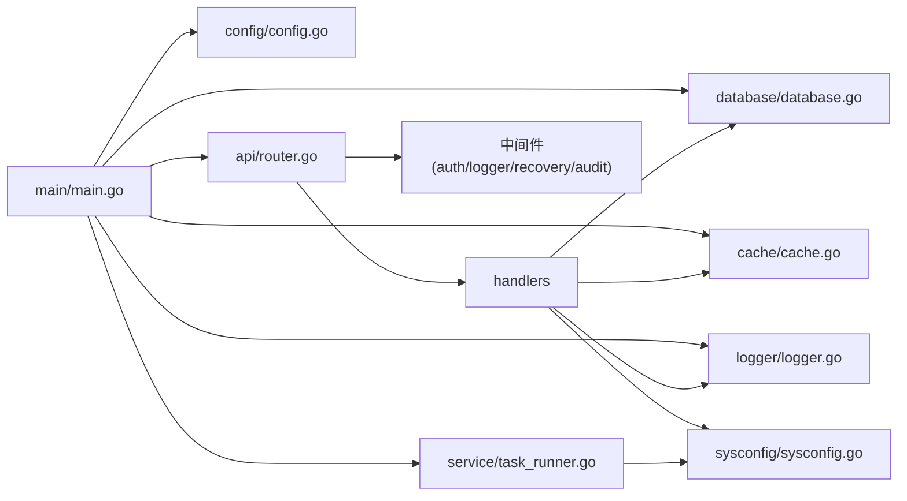

图示来源
- [main.go:52-147](file://main/main.go#L52-L147)
- [router.go:14-274](file://main/internal/api/router.go#L14-L274)
- [auth.go:124-199](file://main/internal/api/middleware/auth.go#L124-L199)
- [logger_mw.go:156-231](file://main/internal/api/middleware/logger.go#L156-L231)
- [recovery_mw.go:21-74](file://main/internal/api/middleware/recovery.go#L21-L74)
- [audit_mw.go:21-88](file://main/internal/api/middleware/audit.go#L21-L88)
- [database.go:73-149](file://main/internal/database/database.go#L73-L149)
- [cache.go:47-94](file://main/internal/cache/cache.go#L47-L94)
- [logger.go:395-456](file://main/internal/logger/logger.go#L395-L456)
- [task_runner.go:36-94](file://main/internal/service/task_runner.go#L36-L94)
- [sysconfig.go:27-46](file://main/internal/sysconfig/sysconfig.go#L27-L46)

章节来源
- [main.go:52-147](file://main/main.go#L52-L147)
- [router.go:14-274](file://main/internal/api/router.go#L14-L274)
- [go.mod:1-96](file://main/go.mod#L1-96)

## 性能考虑
- 数据库
  - SQLite启用WAL、调整连接池、缓存大小与mmap，提升并发读性能
  - MySQL设置合理连接池参数，提高连接复用
- 缓存
  - Redis优先，失败回退内存缓存；键空间前缀避免多环境冲突
- 日志
  - 文件轮转与后台清理，避免磁盘膨胀；请求日志与普通日志分离
- 任务系统
  - 指数退避重试、锁释放与超时保护，避免资源占用
- 路由与中间件
  - 过滤静态资源与HEAD请求，减少日志与处理开销

## 故障排查指南
- 服务器启动失败
  - 检查配置文件路径与权限，确认数据库连接参数正确
  - 查看日志文件与控制台输出，定位初始化阶段错误
- HTTP服务无法关闭
  - 确认信号处理与Shutdown超时设置，检查是否有长时间阻塞请求
- 数据库迁移失败
  - 检查数据库权限与驱动版本，查看迁移错误日志
- 缓存不可用
  - 检查Redis连接参数与网络连通性，确认回退到内存缓存
- 任务未执行或重复执行
  - 检查任务管理器状态、锁状态与重试策略，查看通知配置

章节来源
- [main.go:52-147](file://main/main.go#L52-L147)
- [logger.go:173-228](file://main/internal/logger/logger.go#L173-L228)
- [database.go:145-231](file://main/internal/database/database.go#L145-L231)
- [cache.go:71-85](file://main/internal/cache/cache.go#L71-L85)
- [task_runner.go:477-503](file://main/internal/service/task_runner.go#L477-L503)

## 结论
DNSPlane后端采用清晰的分层架构与模块化设计，入口层集中初始化与生命周期管理，API层通过中间件链实现横切关注点，业务支撑层提供配置、日志、数据库、缓存、任务与日志存储等基础设施。系统具备完善的错误处理与日志记录机制，支持优雅停机与资源清理，适合在生产环境中稳定运行。