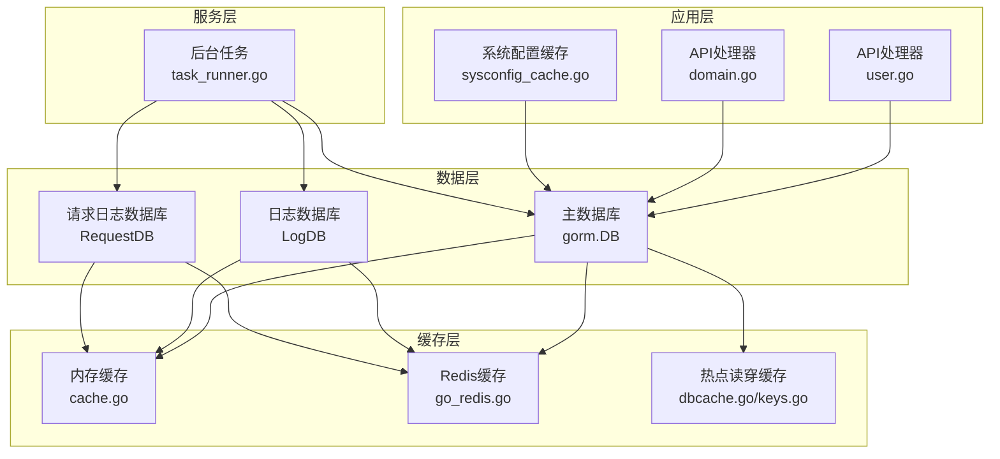
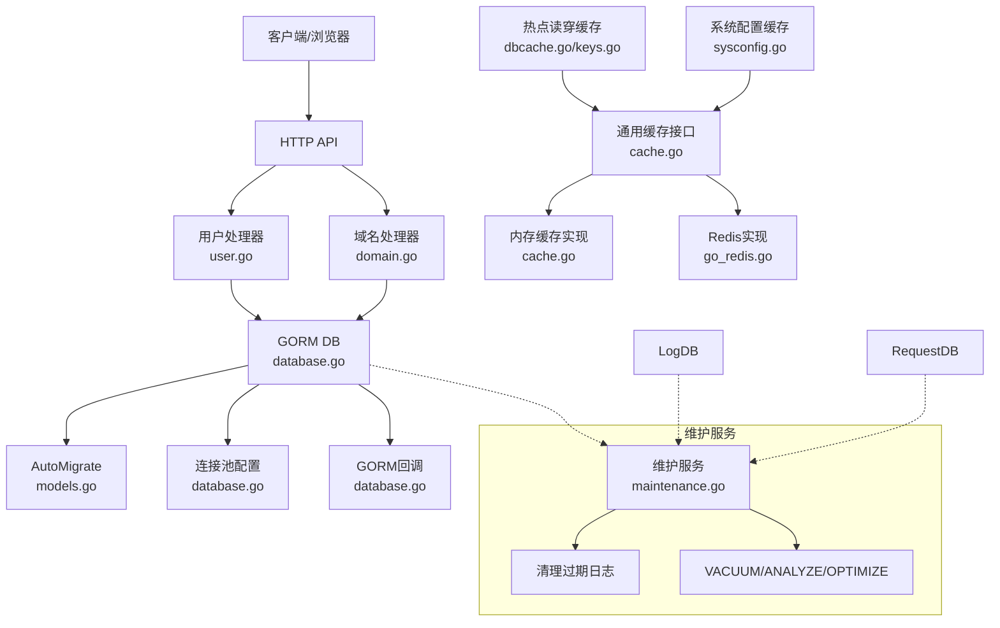
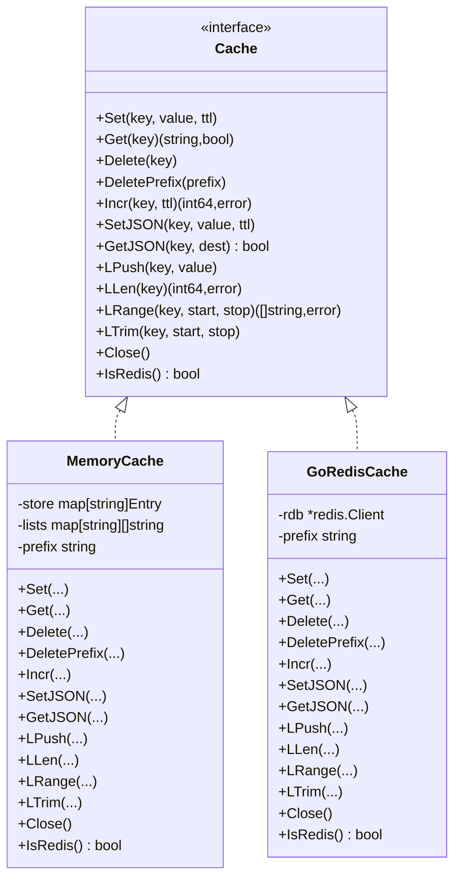
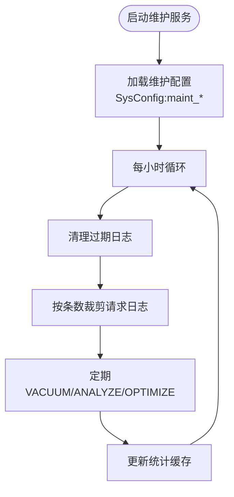
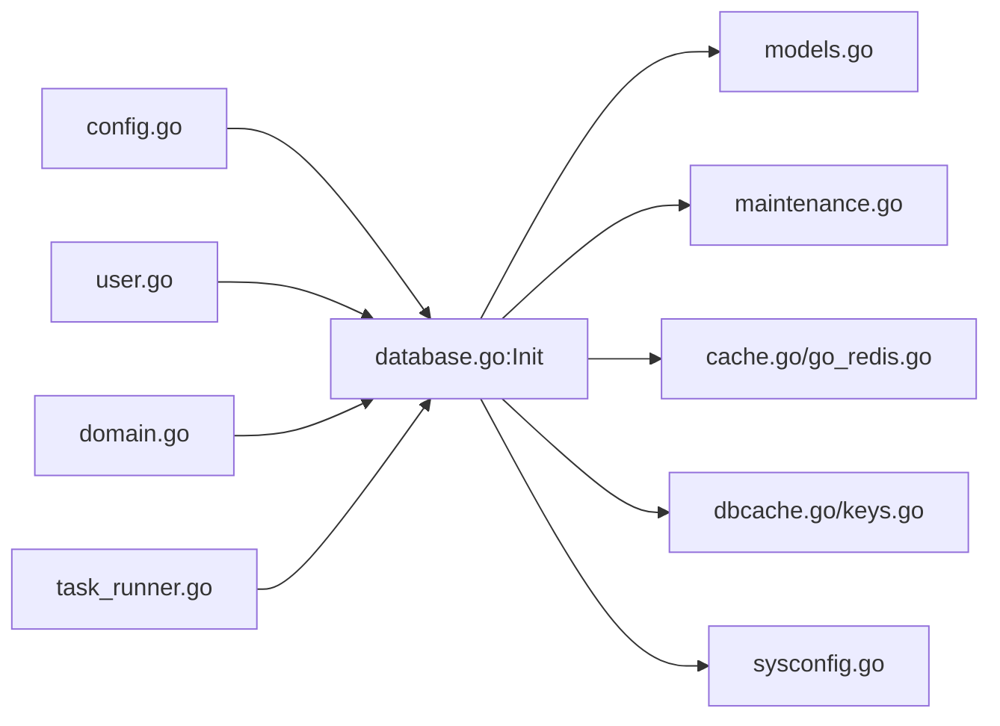

# 数据库设计

<cite>
**本文引用的文件**
- [database.go](file://main/internal/database/database.go)
- [maintenance.go](file://main/internal/database/maintenance.go)
- [models.go](file://main/internal/models/models.go)
- [config.go](file://main/internal/config/config.go)
- [cache.go](file://main/internal/cache/cache.go)
- [go_redis.go](file://main/internal/cache/go_redis.go)
- [dbcache.go](file://main/internal/dbcache/dbcache.go)
- [keys.go](file://main/internal/dbcache/keys.go)
- [user.go](file://main/internal/api/handler/user.go)
- [domain.go](file://main/internal/api/handler/domain.go)
- [task_runner.go](file://main/internal/service/task_runner.go)
- [sysconfig.go](file://main/internal/sysconfig/sysconfig.go)
- [sysconfig_cache.go](file://main/internal/api/handler/sysconfig_cache.go)
</cite>

## 目录
1. [简介](#简介)
2. [项目结构](#项目结构)
3. [核心组件](#核心组件)
4. [架构总览](#架构总览)
5. [详细组件分析](#详细组件分析)
6. [依赖分析](#依赖分析)
7. [性能考量](#性能考量)
8. [故障排查指南](#故障排查指南)
9. [结论](#结论)
10. [附录](#附录)

## 简介
本文件面向DNSPlane项目的数据库设计，围绕以下目标展开：  
- 数据库模型设计：实体关系图、字段定义与约束规则  
- GORM ORM使用模式：模型定义、关联关系与查询优化  
- 数据库连接池与事务管理策略  
- 数据缓存机制：内存缓存与Redis缓存的使用场景  
- 数据库维护任务：自动清理、索引优化与性能监控  
- 数据迁移与版本管理策略  
- 数据库性能优化建议与最佳实践  

## 项目结构
数据库相关代码主要分布在如下模块：
- 数据库初始化与连接池：database包
- 数据模型定义：models包
- 维护与清理：maintenance包
- 缓存层：cache包（内存/Redis）、dbcache包（热点读穿缓存）
- 配置：config包
- 业务使用示例：API处理器与后台任务



图表来源
- [database.go:73-149](file://main/internal/database/database.go#L73-L149)
- [models.go:9-357](file://main/internal/models/models.go#L9-L357)
- [maintenance.go:100-197](file://main/internal/database/maintenance.go#L100-L197)
- [cache.go:47-86](file://main/internal/cache/cache.go#L47-L86)
- [dbcache.go:14-69](file://main/internal/dbcache/dbcache.go#L14-L69)
- [sysconfig.go:27-46](file://main/internal/sysconfig/sysconfig.go#L27-L46)

章节来源
- [database.go:73-149](file://main/internal/database/database.go#L73-L149)
- [models.go:9-357](file://main/internal/models/models.go#L9-L357)
- [maintenance.go:100-197](file://main/internal/database/maintenance.go#L100-L197)
- [cache.go:47-86](file://main/internal/cache/cache.go#L47-L86)
- [dbcache.go:14-69](file://main/internal/dbcache/dbcache.go#L14-L69)
- [sysconfig.go:27-46](file://main/internal/sysconfig/sysconfig.go#L27-L46)

## 核心组件
- 数据库连接与初始化：支持SQLite/WAL与MySQL，分别配置连接池与SQLite优化参数
- 数据模型：涵盖用户、账户、域名、权限、日志、证书、容灾、定时任务等
- 维护服务：自动清理过期日志、定期VACUUM与统计缓存
- 缓存层：通用Cache接口，支持内存与Redis后端；提供热点读穿缓存与系统配置缓存
- 查询追踪与回调：GORM回调记录SQL、耗时、影响行数与错误，便于诊断

章节来源
- [database.go:73-149](file://main/internal/database/database.go#L73-L149)
- [models.go:9-357](file://main/internal/models/models.go#L9-L357)
- [maintenance.go:100-197](file://main/internal/database/maintenance.go#L100-L197)
- [cache.go:15-31](file://main/internal/cache/cache.go#L15-L31)
- [dbcache.go:14-69](file://main/internal/dbcache/dbcache.go#L14-L69)

## 架构总览
DNSPlane采用“主数据库 + 独立日志库 + 独立请求日志库”的三库分离设计，配合GORM回调与维护服务，实现高性能与可维护性。



图表来源
- [database.go:73-149](file://main/internal/database/database.go#L73-L149)
- [database.go:367-404](file://main/internal/database/database.go#L367-L404)
- [maintenance.go:100-197](file://main/internal/database/maintenance.go#L100-L197)
- [cache.go:15-31](file://main/internal/cache/cache.go#L15-L31)
- [dbcache.go:14-69](file://main/internal/dbcache/dbcache.go#L14-L69)
- [sysconfig.go:27-46](file://main/internal/sysconfig/sysconfig.go#L27-L46)

## 详细组件分析

### 数据库模型设计与ER图
- 用户(User)：用户名唯一、密码哈希、API Key、权限JSON、TOTP等
- 第三方绑定(UserOAuth)：每用户每提供商一条记录，索引组合保证唯一性
- DNS账户(Account)：关联用户、类型、名称、配置文本
- 域名(Domain)：关联账户、名称唯一索引、第三方ID、记录数、备注、检查状态
- 域名备注(DomainNote)：用户维度的独立备注，联合索引保证唯一
- 权限(Permission)：用户对域名的子域名限制、只读、过期时间
- 日志(Log)：操作日志，包含实体类型/ID、前后数据JSON、UA/IP
- 容灾任务(DMTask)：主备切换策略、探测类型、频率、周期、超时、代理等
- 容灾检查日志(DMCheckLog)：探测结果、主备健康度、耗时
- 容灾切换日志(DMLog)：切换动作与错误信息
- 证书账户(CertAccount)：证书提供商账户，支持部署标记
- 证书订单(CertOrder)：ACME流程状态、到期时间、重试、锁、链与私钥
- 证书域名(CertDomain)：订单与域名映射
- 证书部署(CertDeploy)：部署任务状态、重试、日志、最后执行时间
- 证书CNAME(CertCNAME)：CNAME代理映射
- 定时任务(ScheduleTask)：按周期修改记录
- 系统配置(SysConfig)：键值配置
- 优选IP(OptimizeIP)：CDN优选任务
- 请求日志(RequestLog)：API请求详情、错误栈、DB查询记录

```mermaid
erDiagram
USER {
uint id PK
string username UK
string password
string email
bool is_api
string api_key
int level
int status
text permissions
bool totp_open
string totp_secret
string reset_token
string reset_type
datetime reset_expire
datetime reg_time
datetime last_time
int64 github_id
datetime created_at
datetime updated_at
datetime deleted_at
}
USER_OAUTH {
uint id PK
uint user_id IK1
string provider UK2
string provider_user_id IK
string provider_name
string provider_email
string provider_avatar
text access_token
text refresh_token
datetime expires_at
datetime created_at
datetime updated_at
}
ACCOUNT {
uint id PK
uint uid IK
string type
string name
text config
string remark
datetime created_at
datetime updated_at
datetime deleted_at
}
DOMAIN {
uint id PK
uint aid IK
string name IK
string third_id
bool is_hide
bool is_sso
int record_count
string remark
bool is_notice
datetime reg_time
datetime expire_time
datetime check_time
datetime notice_time
int check_status
datetime created_at
datetime updated_at
datetime deleted_at
}
DOMAIN_NOTE {
uint id PK
uint uid IK1 UK
uint did IK2 UK
string remark
datetime created_at
datetime updated_at
}
PERMISSION {
uint id PK
uint uid IK
uint did IK
string domain
string sub
bool read_only
datetime expire_time
datetime created_at
}
LOG {
uint id PK
uint uid
string username
string action
string entity
uint entity_id
string domain
string data
text before_data
text after_data
string ip
string user_agent
datetime created_at
}
DM_TASK {
uint id PK
uint did IK
string rr
string record_id
string record_type
string record_line
int type
string main_value
string backup_value
string backup_values
string backup_type
int check_type
string check_url
int tcp_port
int frequency
int cycle
int timeout
string remark
bool use_proxy
bool cdn
int64 add_time
int64 check_time
int64 check_next_time
int64 switch_time
int err_count
int status
bool main_health
bool active
string record_info
string expect_status
string expect_keyword
int max_redirects
string proxy_type
string proxy_host
int proxy_port
string proxy_username
string proxy_password
bool notify_enabled
text notify_channels
bool auto_restore
}
DM_CHECK_LOG {
uint id PK
uint task_id IK
bool success
int64 duration
string error
bool main_health
text backup_healths
int64 main_duration
int64 backup_duration
datetime created_at
}
DM_LOG {
uint id PK
uint task_id IK
int action
string err_msg
datetime created_at
}
CERT_ACCOUNT {
uint id PK
uint uid IK
string type
string name
text config
text ext
string remark
bool is_deploy
datetime created_at
datetime updated_at
datetime deleted_at
}
CERT_ORDER {
uint id PK
uint aid
string key_type
string key_size
string process_id
datetime issue_time
datetime expire_time
string issuer
int status
string error
bool is_auto
int retry
int retry2
datetime retry_time
bool is_lock
datetime lock_time
bool is_send
text info
text dns
text fullchain
text private_key
datetime renew_fail_notice_at
datetime expire_notice_at
datetime created_at
datetime updated_at
}
CERT_DOMAIN {
uint id PK
uint oid IK
string domain
int sort
}
CERT_DEPLOY {
uint id PK
uint uid IK
uint aid
uint oid
datetime issue_time
text config
string remark
datetime last_time
string process_id
int status
string error
bool active
int retry
int max_retry
int retry_delay
datetime retry_time
bool is_lock
datetime lock_time
bool is_send
text info
text log_content
datetime created_at
datetime updated_at
}
CERT_CNAME {
uint id PK
string domain
uint did
string rr
int status
datetime created_at
}
SCHEDULE_TASK {
uint id PK
uint did IK
string rr
string record_id
int type
int cycle
int switch_type
string switch_date
string switch_time
string value
string line
int64 add_time
int64 update_time
int64 next_time
bool active
string record_info
string remark
}
SYS_CONFIG {
string key PK
text value
}
OPTIMIZE_IP {
uint id PK
uint did IK
string rr
int type
string ip_type
int cdn_type
int recordnum
int ttl
string remark
datetime addtime
datetime updatetime
int status
string errmsg
bool active
}
REQUEST_LOG {
uint id PK
string request_id IK
string error_id IK
uint user_id IK
string username
string method
string path
string query
text body
text headers
string ip
string user_agent
int status_code
text response
int64 duration
bool is_error
string error_msg
text error_stack
text db_queries
int64 db_query_time
text extra
datetime created_at
}
USER ||--o{ USER_OAUTH : "绑定"
USER ||--o{ ACCOUNT : "拥有"
ACCOUNT ||--o{ DOMAIN : "拥有"
USER ||--o{ PERMISSION : "授予"
DOMAIN ||--o{ DOMAIN_NOTE : "备注"
DOMAIN ||--o{ DM_TASK : "监控"
DM_TASK ||--o{ DM_LOG : "日志"
DM_TASK ||--o{ DM_CHECK_LOG : "检查日志"
CERT_ACCOUNT ||--o{ CERT_DEPLOY : "部署"
CERT_ORDER ||--o{ CERT_DOMAIN : "包含"
CERT_DEPLOY ||--o{ CERT_ORDER : "对应"
DOMAIN ||--o{ CERT_CNAME : "CNAME代理"
DOMAIN ||--o{ SCHEDULE_TASK : "定时任务"
DOMAIN ||--o{ OPTIMIZE_IP : "优选IP"
```

图表来源
- [models.go:9-357](file://main/internal/models/models.go#L9-L357)

章节来源
- [models.go:9-357](file://main/internal/models/models.go#L9-L357)

### GORM ORM使用模式与查询优化
- 模型定义：使用标签声明主键、索引、长度与默认值，如唯一索引、组合索引、TEXT字段、DeletedAt软删除索引等
- 关联关系：通过外键字段与GORM命名约定建立一对多/一对一关系，如Account-Domain、Domain-DMTask等
- 查询优化：
  - 使用索引字段过滤（如domain、uid、task_id、created_at等）
  - 分页查询结合Offset/Limit，避免全表扫描
  - 使用Join减少N+1查询（如域名列表聚合账户类型）
  - 使用Pluck/Count减少数据传输
  - 使用原生SQL与批量写入（如维护服务中的批量迁移与清理）

章节来源
- [models.go:9-357](file://main/internal/models/models.go#L9-L357)
- [domain.go:105-131](file://main/internal/api/handler/domain.go#L105-L131)
- [user.go:24-45](file://main/internal/api/handler/user.go#L24-L45)
- [maintenance.go:199-271](file://main/internal/database/maintenance.go#L199-L271)

### 数据库连接池与事务管理
- 连接池配置：
  - MySQL：最大连接数、空闲连接、最大空闲时长、连接生命周期
  - SQLite：WAL模式、PRAGMA优化、并发读连接池（最大打开/空闲、生命周期）
- 事务管理：项目未显式使用GORM事务封装，业务层通过批量写入与原子操作实现一致性；后台任务通过“加锁-更新-解锁”模式避免并发冲突

章节来源
- [database.go:61-71](file://main/internal/database/database.go#L61-L71)
- [database.go:49-59](file://main/internal/database/database.go#L49-L59)
- [database.go:80-103](file://main/internal/database/database.go#L80-L103)
- [task_runner.go:336-345](file://main/internal/service/task_runner.go#L336-L345)

### 数据缓存机制
- 通用缓存接口：统一Set/Get/Delete/Incr/List等能力，支持内存与Redis后端
- 内存缓存：基于map的线程安全实现，带TTL与定期清理
- Redis缓存：基于go-redis，支持SCAN批量删除与LIST操作
- 热点读穿缓存：dbcache包提供GetOrSetJSON与批量失效，适用于高频读取的列表类数据
- 系统配置缓存：sysconfig包封装SysConfig读取，带60秒TTL与失效



图表来源
- [cache.go:15-31](file://main/internal/cache/cache.go#L15-L31)
- [cache.go:96-118](file://main/internal/cache/cache.go#L96-L118)
- [go_redis.go:12-27](file://main/internal/cache/go_redis.go#L12-L27)

章节来源
- [cache.go:47-86](file://main/internal/cache/cache.go#L47-L86)
- [go_redis.go:12-138](file://main/internal/cache/go_redis.go#L12-L138)
- [dbcache.go:14-69](file://main/internal/dbcache/dbcache.go#L14-L69)
- [keys.go:10-59](file://main/internal/dbcache/keys.go#L10-L59)
- [sysconfig.go:27-46](file://main/internal/sysconfig/sysconfig.go#L27-L46)

### 数据库维护任务
- 维护配置：通过SysConfig表动态配置各类日志保留天数/小时数、请求日志保留条数、VACUUM间隔等
- 自动清理：按配置清理操作日志、证书日志、监控检查日志、容灾日志与请求日志（按天与按条数）
- 压缩与优化：WAL Checkpoint、ANALYZE、PRAGMA optimize、VACUUM，并恢复WAL模式
- 统计缓存：短时缓存数据库统计，避免频繁COUNT



图表来源
- [maintenance.go:110-197](file://main/internal/database/maintenance.go#L110-L197)
- [maintenance.go:201-271](file://main/internal/database/maintenance.go#L201-L271)
- [maintenance.go:275-325](file://main/internal/database/maintenance.go#L275-L325)
- [maintenance.go:342-393](file://main/internal/database/maintenance.go#L342-L393)

章节来源
- [maintenance.go:110-197](file://main/internal/database/maintenance.go#L110-L197)
- [maintenance.go:201-271](file://main/internal/database/maintenance.go#L201-L271)
- [maintenance.go:275-325](file://main/internal/database/maintenance.go#L275-L325)
- [maintenance.go:342-393](file://main/internal/database/maintenance.go#L342-L393)

### 数据迁移与版本管理
- AutoMigrate：启动时对核心模型执行迁移
- 旧数据迁移：将主库中的logs、cert_logs、request_logs迁移至独立数据库并清理旧表
- GitHub ID迁移：将旧字段迁移至UserOAuth表

章节来源
- [database.go:233-292](file://main/internal/database/database.go#L233-L292)
- [database.go:151-231](file://main/internal/database/database.go#L151-L231)
- [database.go:260-278](file://main/internal/database/database.go#L260-L278)

### 查询追踪与诊断
- GORM回调：在Query/Create/Update/Delete/Row/Raw阶段记录SQL、耗时、影响行数与错误
- 上下文注入：WithXXXContext将Gin上下文注入GORM，回调仅在请求追踪开启时记录
- 用途：定位慢查询、异常SQL与错误堆栈

章节来源
- [database.go:367-404](file://main/internal/database/database.go#L367-L404)
- [database.go:406-473](file://main/internal/database/database.go#L406-L473)
- [database.go:352-365](file://main/internal/database/database.go#L352-L365)

## 依赖分析
- API处理器依赖database包提供的DB/LogDB/RequestDB与WithContext
- 后台任务依赖database包进行定时任务与锁控制
- 缓存层被业务广泛使用，包括系统配置缓存与热点读穿缓存
- 配置层决定数据库驱动与路径，影响初始化行为



图表来源
- [config.go:45-65](file://main/internal/config/config.go#L45-L65)
- [database.go:73-149](file://main/internal/database/database.go#L73-L149)
- [maintenance.go:100-197](file://main/internal/database/maintenance.go#L100-L197)
- [cache.go:47-86](file://main/internal/cache/cache.go#L47-L86)
- [dbcache.go:14-69](file://main/internal/dbcache/dbcache.go#L14-L69)
- [sysconfig.go:27-46](file://main/internal/sysconfig/sysconfig.go#L27-L46)
- [user.go:24-45](file://main/internal/api/handler/user.go#L24-L45)
- [domain.go:105-131](file://main/internal/api/handler/domain.go#L105-L131)
- [task_runner.go:164-182](file://main/internal/service/task_runner.go#L164-L182)

章节来源
- [config.go:45-65](file://main/internal/config/config.go#L45-L65)
- [database.go:73-149](file://main/internal/database/database.go#L73-L149)
- [maintenance.go:100-197](file://main/internal/database/maintenance.go#L100-L197)
- [cache.go:47-86](file://main/internal/cache/cache.go#L47-L86)
- [dbcache.go:14-69](file://main/internal/dbcache/dbcache.go#L14-L69)
- [sysconfig.go:27-46](file://main/internal/sysconfig/sysconfig.go#L27-L46)
- [user.go:24-45](file://main/internal/api/handler/user.go#L24-L45)
- [domain.go:105-131](file://main/internal/api/handler/domain.go#L105-L131)
- [task_runner.go:164-182](file://main/internal/service/task_runner.go#L164-L182)

## 性能考量
- 连接池与SQLite优化：WAL、PRAGMA优化、高并发读连接池
- 索引与查询：为高频过滤字段建立索引，避免SELECT *，使用Pluck/Count
- 批量操作：维护服务与迁移使用批量写入与分批处理
- 缓存策略：系统配置与热点读穿缓存降低DB压力
- 统计缓存：维护统计短时缓存，减少COUNT开销
- VACUUM与ANALYZE：定期压缩与统计更新，保持查询计划最优

## 故障排查指南
- 慢查询定位：启用请求追踪，查看回调记录的SQL与耗时
- 日志清理异常：检查维护配置键与清理逻辑，确认数据库连接可用
- 缓存不可用：Redis连接失败将回退到内存缓存，检查地址与认证
- 数据迁移失败：关注旧表迁移与AutoMigrate错误，必要时手动清理残留表
- 锁竞争：后台任务使用“加锁-更新-解锁”，检查锁超时与重试策略

章节来源
- [database.go:367-404](file://main/internal/database/database.go#L367-L404)
- [maintenance.go:110-197](file://main/internal/database/maintenance.go#L110-L197)
- [cache.go:47-86](file://main/internal/cache/cache.go#L47-L86)
- [database.go:151-231](file://main/internal/database/database.go#L151-L231)
- [task_runner.go:477-503](file://main/internal/service/task_runner.go#L477-L503)

## 结论
DNSPlane采用清晰的三库分离、完善的GORM模型与回调、灵活的缓存层以及自动化维护策略，在保证功能完整性的同时兼顾性能与可维护性。建议持续关注索引与查询计划、缓存命中率与维护周期，以进一步提升系统稳定性与吞吐能力。

## 附录
- 配置项参考：数据库驱动、主机、端口、用户名、密码、文件路径、日志库与请求日志库路径
- 维护配置键：以maint_开头的SysConfig键，用于控制日志保留与VACUUM间隔
- 缓存键前缀：syscfg:用于系统配置缓存；dbcache模块提供业务级前缀与失效方法

章节来源
- [config.go:45-65](file://main/internal/config/config.go#L45-L65)
- [maintenance.go:28-44](file://main/internal/database/maintenance.go#L28-L44)
- [sysconfig.go:18-21](file://main/internal/sysconfig/sysconfig.go#L18-L21)
- [keys.go:10-59](file://main/internal/dbcache/keys.go#L10-L59)