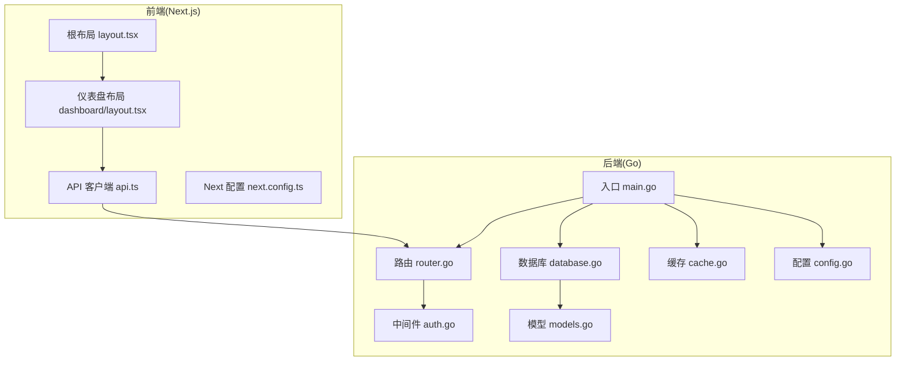
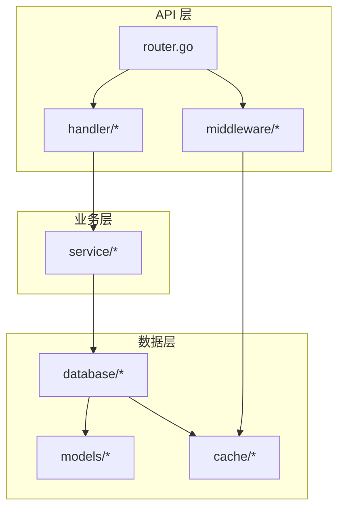
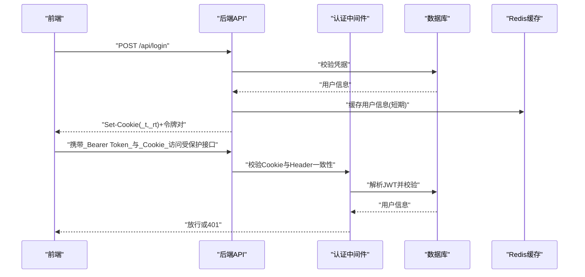
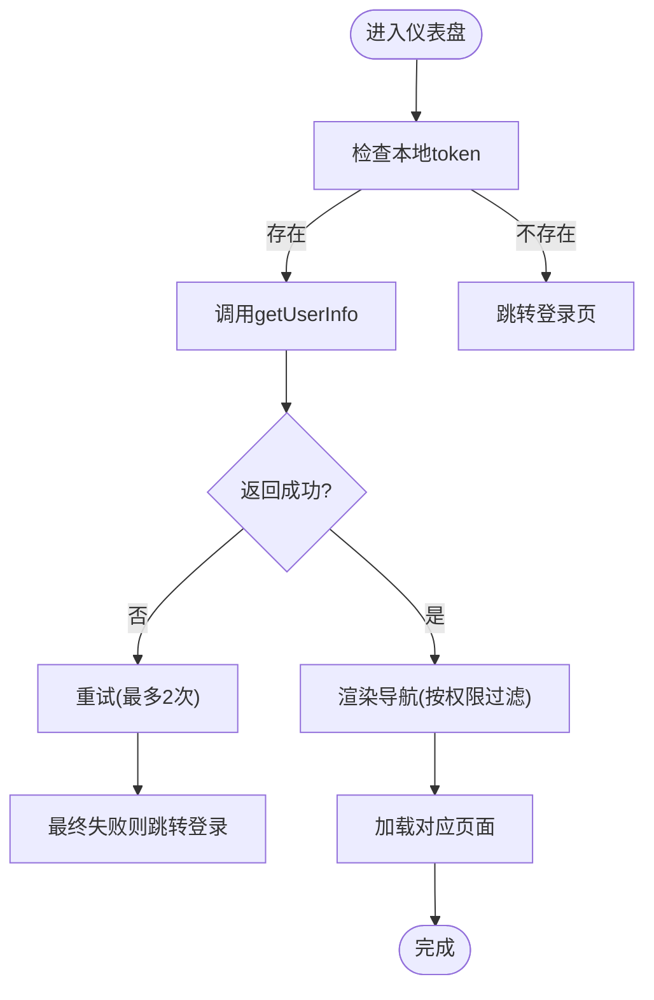
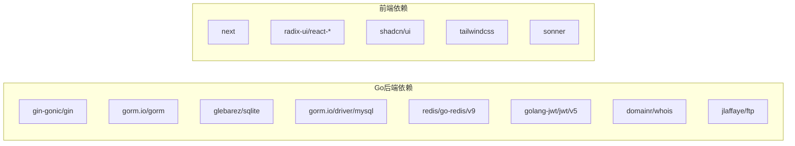

# 系统架构

<cite>
**本文引用的文件**
- [main.go](file://main/main.go)
- [router.go](file://main/internal/api/router.go)
- [auth.go](file://main/internal/api/middleware/auth.go)
- [config.go](file://main/internal/config/config.go)
- [database.go](file://main/internal/database/database.go)
- [models.go](file://main/internal/models/models.go)
- [cache.go](file://main/internal/cache/cache.go)
- [api.ts](file://web/lib/api.ts)
- [layout.tsx](file://web/app/layout.tsx)
- [dashboard/layout.tsx](file://web/app/(dashboard)/layout.tsx)
- [next.config.ts](file://web/next.config.ts)
- [go.mod](file://main/go.mod)
- [README.md](file://README.md)
- [REDIS_AND_DBCACHE.md](file://main/docs/REDIS_AND_DBCACHE.md)
</cite>

## 目录
1. [简介](#简介)
2. [项目结构](#项目结构)
3. [核心组件](#核心组件)
4. [架构总览](#架构总览)
5. [详细组件分析](#详细组件分析)
6. [依赖分析](#依赖分析)
7. [性能考量](#性能考量)
8. [故障排查指南](#故障排查指南)
9. [结论](#结论)
10. [附录](#附录)

## 简介
DNSPlane 是一个基于 Go 的现代化 DNS 管理系统，提供多平台 DNS 管理、SSL 证书申请与部署、容灾监控与切换、多用户权限管理等能力。系统采用前后端分离架构：后端使用 Gin 框架提供 REST API，并内置静态资源托管；前端使用 Next.js 16 构建 SPA，通过统一的 API 客户端与后端交互。

## 项目结构
项目分为两大部分：
- 后端（Go）：位于 main/ 目录，包含 API 层、业务中间件、数据库层、缓存、DNS 适配器、证书模块、监控与通知等。
- 前端（Next.js）：位于 web/ 目录，包含页面路由、组件库、UI 组件、工具库与构建配置。



图表来源
- [main.go:1-148](file://main/main.go#L1-L148)
- [router.go:1-275](file://main/internal/api/router.go#L1-L275)
- [auth.go:124-199](file://main/internal/api/middleware/auth.go#L124-L199)
- [config.go:12-161](file://main/internal/config/config.go#L12-L161)
- [database.go:73-149](file://main/internal/database/database.go#L73-L149)
- [models.go:1-357](file://main/internal/models/models.go#L1-L357)
- [cache.go:47-94](file://main/internal/cache/cache.go#L47-L94)
- [layout.tsx:14-34](file://web/app/layout.tsx#L14-L34)
- [dashboard/layout.tsx:77-391](file://web/app/(dashboard)/layout.tsx#L77-L391)
- [api.ts:1-686](file://web/lib/api.ts#L1-L686)
- [next.config.ts:1-16](file://web/next.config.ts#L1-L16)

章节来源
- [README.md:14-41](file://README.md#L14-L41)
- [go.mod:1-96](file://main/go.mod#L1-L96)

## 核心组件
- 入口与生命周期：main/main.go 负责加载配置、初始化数据库与缓存、注册中间件、启动后台任务与维护服务、构建路由并启动 HTTP 服务。
- 路由与控制器：main/internal/api/router.go 定义 REST API 路由分组与静态资源托管规则，处理前端 SPA 的动态路由回退。
- 认证与授权：main/internal/api/middleware/auth.go 实现基于 JWT 的短期访问令牌与长期刷新令牌机制，支持 HttpOnly Cookie 与 Bearer Token 双重校验，并提供权限模块过滤。
- 配置管理：main/internal/config/config.go 提供服务器、数据库、JWT、代理、日志清理、Redis 等配置的加载与保存。
- 数据层：main/internal/database/database.go 支持 SQLite/MySQL，独立初始化主库与日志/请求日志库，自动迁移与数据初始化，提供 GORM 回调记录 SQL 查询详情。
- 模型定义：main/internal/models/models.go 定义用户、账户、域名、证书、监控、日志等核心数据模型。
- 缓存：main/internal/cache/cache.go 提供统一 Cache 接口，优先使用 Redis，失败时回退内存缓存，支持键值与列表操作。
- 前端 API 客户端：web/lib/api.ts 封装统一的请求方法、鉴权头、错误处理与重定向逻辑。
- 前端布局与导航：web/app/layout.tsx 与 web/app/(dashboard)/layout.tsx 提供全局布局、错误边界、进度条与仪表盘导航。

章节来源
- [main.go:52-147](file://main/main.go#L52-L147)
- [router.go:14-275](file://main/internal/api/router.go#L14-L275)
- [auth.go:124-464](file://main/internal/api/middleware/auth.go#L124-L464)
- [config.go:82-161](file://main/internal/config/config.go#L82-L161)
- [database.go:73-469](file://main/internal/database/database.go#L73-L469)
- [models.go:9-357](file://main/internal/models/models.go#L9-L357)
- [cache.go:15-309](file://main/internal/cache/cache.go#L15-L309)
- [api.ts:9-101](file://web/lib/api.ts#L9-L101)
- [layout.tsx:14-34](file://web/app/layout.tsx#L14-L34)
- [dashboard/layout.tsx:77-391](file://web/app/(dashboard)/layout.tsx#L77-L391)

## 架构总览
系统采用分层架构：
- 表现层（前端 Next.js）：SPA 页面、组件与 API 客户端。
- 业务层（后端 Gin）：路由、中间件、控制器（handler）与业务逻辑编排。
- 数据访问层（GORM + SQLite/MySQL）：模型映射、迁移、查询回调与数据库优化。

前后端分离通过统一的 REST API 通信，前端通过 web/lib/api.ts 发起请求，后端通过 Gin 路由与中间件处理请求与响应。

```mermaid
graph TB
FE["前端 Next.js<br/>SPA + 组件库"]
API["后端 API(Gin)<br/>路由/中间件"]
AUTH["认证中间件<br/>JWT + Cookie"]
CTRL["控制器/处理器<br/>业务编排"]
SVC["业务服务<br/>领域逻辑"]
ORM["数据访问(GORM)<br/>SQLite/MySQL"]
REDIS["缓存 Redis/内存"]
FE --> |"HTTP"/api"| API
API --> AUTH
AUTH --> CTRL
CTRL --> SVC
SVC --> ORM
API --> REDIS
AUTH --> REDIS
```

图表来源
- [router.go:14-162](file://main/internal/api/router.go#L14-L162)
- [auth.go:124-199](file://main/internal/api/middleware/auth.go#L124-L199)
- [database.go:73-149](file://main/internal/database/database.go#L73-L149)
- [cache.go:47-94](file://main/internal/cache/cache.go#L47-L94)
- [api.ts:33-99](file://web/lib/api.ts#L33-L99)

## 详细组件分析

### 后端模块化组织
- API 层：集中于 main/internal/api，包含 router.go、handler/*、middleware/*。路由按功能分组（认证、用户、账户、域名、监控、证书、系统等），并提供静态资源托管与 SPA 回退。
- 业务逻辑层：由 handler/* 与 service/* 组成，负责具体业务编排与调用数据访问层。
- 数据访问层：database/* 提供数据库初始化、迁移、连接池优化与查询回调；models/* 定义数据模型；cache/* 提供缓存抽象与实现。



图表来源
- [router.go:14-162](file://main/internal/api/router.go#L14-L162)
- [database.go:73-149](file://main/internal/database/database.go#L73-L149)
- [models.go:9-357](file://main/internal/models/models.go#L9-L357)
- [cache.go:47-94](file://main/internal/cache/cache.go#L47-L94)

章节来源
- [router.go:14-275](file://main/internal/api/router.go#L14-L275)
- [README.md:14-41](file://README.md#L14-L41)

### 认证与授权流程
- 登录与会话：前端调用登录接口，后端生成短期访问令牌与长期刷新令牌，分别加密写入 HttpOnly Cookie；随后的请求通过 Authorization 头与 Cookie 双重校验。
- 令牌刷新：使用刷新令牌换取新的令牌对，并通过 JTI 轮转与一次性使用策略防重放。
- 权限控制：中间件根据用户权限模块过滤导航与菜单项，确保前端仅展示有权限的功能。



图表来源
- [auth.go:124-199](file://main/internal/api/middleware/auth.go#L124-L199)
- [auth.go:295-317](file://main/internal/api/middleware/auth.go#L295-L317)
- [auth.go:374-413](file://main/internal/api/middleware/auth.go#L374-L413)
- [dashboard/layout.tsx:102-160](file://web/app/(dashboard)/layout.tsx#L102-L160)

章节来源
- [auth.go:124-464](file://main/internal/api/middleware/auth.go#L124-L464)
- [dashboard/layout.tsx:102-160](file://web/app/(dashboard)/layout.tsx#L102-L160)

### 数据库设计与 ORM 使用
- 数据库驱动：支持 SQLite 与 MySQL，自动迁移核心模型，独立初始化日志与请求日志数据库。
- 查询回调：注册 GORM 查询/增删改/原生 SQL 回调，记录 SQL、耗时、影响行数与错误，注入到请求上下文，便于审计与诊断。
- 连接池优化：针对 SQLite/WAL 模式与 MySQL 设置最大连接数、空闲连接、生命周期等参数。
- 模型覆盖：用户、账户、域名、证书、监控、日志、系统配置等核心实体。

```mermaid
erDiagram
USER {
uint id PK
string username UK
string password
string email
boolean is_api
string api_key
int level
int status
string permissions
boolean totp_open
string totp_secret
string reset_token
string reset_type
datetime reset_expire
datetime reg_time
datetime last_time
bigint github_id
datetime created_at
datetime updated_at
datetime deleted_at
}
ACCOUNT {
uint id PK
uint uid FK
string type
string name
text config
string remark
datetime created_at
datetime updated_at
datetime deleted_at
}
DOMAIN {
uint id PK
uint aid FK
string name
string third_id
boolean is_hide
boolean is_sso
int record_count
string remark
boolean is_notice
datetime reg_time
datetime expire_time
datetime check_time
datetime notice_time
int check_status
datetime created_at
datetime updated_at
datetime deleted_at
}
CERT_ACCOUNT {
uint id PK
uint uid FK
string type
string name
text config
text ext
string remark
boolean is_deploy
datetime created_at
datetime updated_at
datetime deleted_at
}
CERT_ORDER {
uint id PK
uint aid FK
string key_type
string key_size
string process_id
datetime issue_time
datetime expire_time
string issuer
int status
string error
boolean is_auto
int retry
int retry2
datetime retry_time
boolean is_lock
datetime lock_time
boolean is_send
text info
text dns
text fullchain
text private_key
datetime renew_fail_notice_at
datetime expire_notice_at
datetime created_at
datetime updated_at
}
CERT_DEPLOY {
uint id PK
uint uid FK
uint aid FK
uint oid FK
datetime issue_time
text config
string remark
datetime last_time
string process_id
int status
string error
boolean active
int retry
int max_retry
int retry_delay
datetime retry_time
boolean is_lock
datetime lock_time
boolean is_send
text info
text log_content
datetime created_at
datetime updated_at
}
DM_TASK {
uint id PK
uint did FK
string rr
string record_id
string record_type
string record_line
int type
string main_value
string backup_value
string backup_values
string backup_type
int check_type
string check_url
int tcp_port
int frequency
int cycle
int timeout
string remark
boolean use_proxy
boolean cdn
bigint add_time
bigint check_time
bigint check_next_time
bigint switch_time
int err_count
int status
boolean main_health
boolean active
string record_info
string expect_status
string expect_keyword
int max_redirects
string proxy_type
string proxy_host
int proxy_port
string proxy_username
string proxy_password
boolean notify_enabled
text notify_channels
boolean auto_restore
}
LOG {
uint id PK
uint uid FK
string username
string action
string entity
uint entity_id
string domain
string data
text before_data
text after_data
string ip
string user_agent
datetime created_at
}
REQUEST_LOG {
uint id PK
string request_id
string error_id
uint user_id
string username
string method
string path
string query
text body
text headers
string ip
string user_agent
int status_code
text response
int duration
boolean is_error
string error_msg
text error_stack
text db_queries
int db_query_time
text extra
datetime created_at
}
SYS_CONFIG {
string key PK
text value
}
USER ||--o{ ACCOUNT : "拥有"
USER ||--o{ CERT_ACCOUNT : "拥有"
USER ||--o{ CERT_DEPLOY : "拥有"
USER ||--o{ LOG : "产生"
ACCOUNT ||--o{ DOMAIN : "管理"
DOMAIN ||--o{ DM_TASK : "关联"
CERT_ACCOUNT ||--o{ CERT_ORDER : "拥有"
CERT_ORDER ||--o{ CERT_DEPLOY : "触发"
```



图表来源
- [models.go:9-357](file://main/internal/models/models.go#L9-L357)

章节来源
- [database.go:73-292](file://main/internal/database/database.go#L73-L292)
- [models.go:9-357](file://main/internal/models/models.go#L9-L357)

### 前端路由与组件架构
- 路由系统：Next.js App Router，支持动态路由与并行路由组，仪表盘布局通过 (dashboard) 组隔离页面。
- 组件与UI：基于 Radix UI 与 shadcn/ui，提供基础组件与主题切换。
- API 客户端：封装统一的请求方法、鉴权头、错误处理与重定向逻辑，支持分页与查询参数。
- 布局与导航：根布局提供全局错误边界与通知；仪表盘布局提供侧边栏导航、用户下拉菜单与权限过滤。



图表来源
- [dashboard/layout.tsx:102-160](file://web/app/(dashboard)/layout.tsx#L102-L160)
- [api.ts:112-123](file://web/lib/api.ts#L112-L123)

章节来源
- [layout.tsx:14-34](file://web/app/layout.tsx#L14-L34)
- [dashboard/layout.tsx:77-391](file://web/app/(dashboard)/layout.tsx#L77-L391)
- [api.ts:9-101](file://web/lib/api.ts#L9-L101)

### 静态资源与SPA回退
- 后端通过嵌入文件系统将前端构建产物打包进二进制，路由在 NoRoute 中尝试读取静态文件，支持 SPA 动态路由回退（如 /dashboard/domains/[id]/ 回退到 /dashboard/domains/_/index.html）。

章节来源
- [router.go:164-271](file://main/internal/api/router.go#L164-L271)

## 依赖分析
- Go 后端依赖：Gin Web 框架、GORM ORM、SQLite/MySQL 驱动、Redis 客户端、JWT、WHOIS、FTP 等第三方库。
- 前端依赖：Next.js 16、Radix UI、shadcn/ui、TailwindCSS、QRCode、Sonner 等。



图表来源
- [go.mod:5-28](file://main/go.mod#L5-L28)

章节来源
- [go.mod:1-96](file://main/go.mod#L1-L96)

## 性能考量
- 数据库优化
  - SQLite：启用 WAL 模式、调整同步级别、缓存大小、忙等待超时、内存临时存储与映射内存，提升并发读性能。
  - 连接池：SQLite 最大打开连接数与空闲连接数、MySQL 最大连接数与生命周期配置。
- 缓存策略
  - Redis/内存缓存：统一 Cache 接口，支持键值与列表操作；认证用户信息短期缓存降低数据库压力。
  - 读穿缓存：dbcache 对热点只读接口做短期 JSON 缓存，并在写操作后显式失效，保证最终一致。
- 前端性能
  - Next.js 16 + Turbopack 开发体验；生产构建输出静态站点，减少运行时负担。
  - API 客户端统一错误处理与重定向，避免重复请求与无效重试。

章节来源
- [database.go:34-71](file://main/internal/database/database.go#L34-L71)
- [cache.go:47-94](file://main/internal/cache/cache.go#L47-L94)
- [REDIS_AND_DBCACHE.md:1-28](file://main/docs/REDIS_AND_DBCACHE.md#L1-L28)
- [next.config.ts:1-16](file://web/next.config.ts#L1-L16)

## 故障排查指南
- 认证相关
  - 401 未登录：前端检测到 401 自动清除本地 token 并跳转登录页。
  - Token 不一致/过期：中间件双重校验失败或 JWT 过期，需刷新或重新登录。
- 数据库问题
  - 连接失败：检查数据库驱动、DSN 与文件路径；确认迁移成功与初始化管理员账户。
  - 查询性能：关注 GORM 回调记录的 SQL 与耗时，定位慢查询。
- 缓存问题
  - Redis 连接失败：回退内存缓存，确认连接参数与网络可达性。
  - 缓存命中率低：检查 TTL 与失效策略，评估热点数据缓存范围。
- 前端问题
  - SPA 路由 404：确认后端静态资源托管与 NoRoute 回退逻辑。
  - API 调用异常：检查请求头、鉴权与错误处理分支。

章节来源
- [auth.go:124-199](file://main/internal/api/middleware/auth.go#L124-L199)
- [api.ts:59-69](file://web/lib/api.ts#L59-L69)
- [database.go:73-149](file://main/internal/database/database.go#L73-L149)
- [cache.go:71-85](file://main/internal/cache/cache.go#L71-L85)

## 结论
DNSPlane 通过清晰的分层架构与前后端分离设计，实现了可扩展、高性能且易维护的 DNS 管理系统。后端以 Gin 为核心，结合 GORM 与 Redis/内存缓存，提供稳定的数据访问与缓存能力；前端基于 Next.js 提供现代化用户体验与良好的开发体验。系统边界明确，组件关系清晰，具备良好的可扩展性与可运维性。

## 附录
- 部署与构建
  - 前端构建后复制到后端嵌入目录，后端编译时将前端静态资源打包进二进制。
- 配置要点
  - server.host/port、database.driver、jwt.secret、redis.enable/addr 等关键配置项。

章节来源
- [README.md:56-71](file://README.md#L56-L71)
- [README.md:76-96](file://README.md#L76-L96)
- [config.go:82-161](file://main/internal/config/config.go#L82-L161)