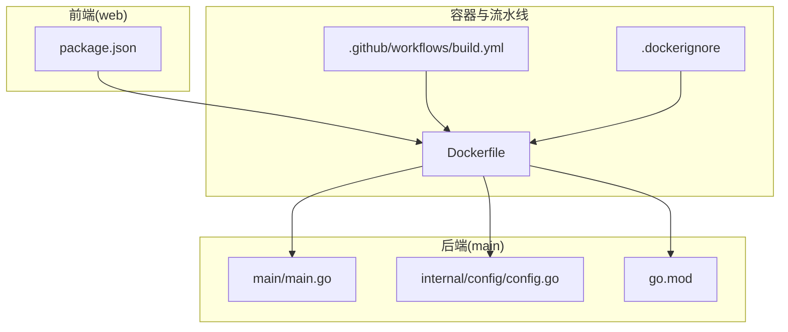
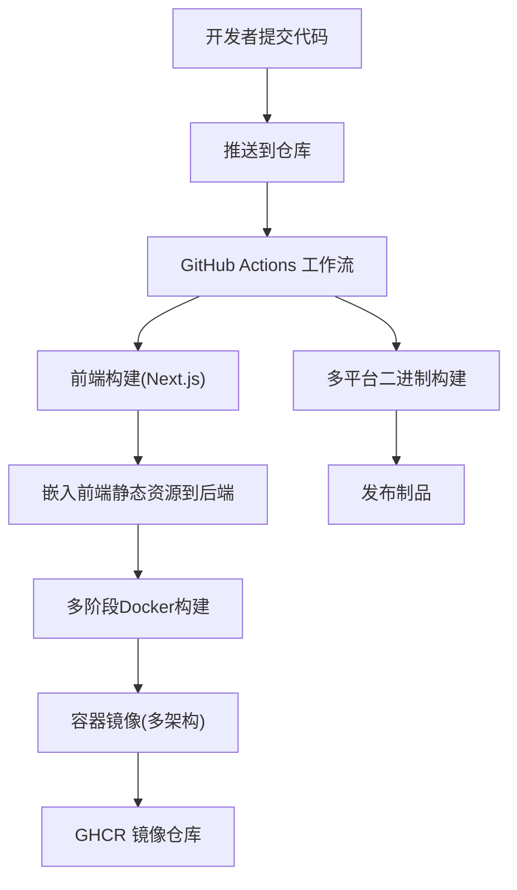
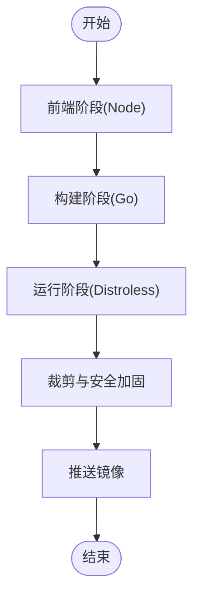
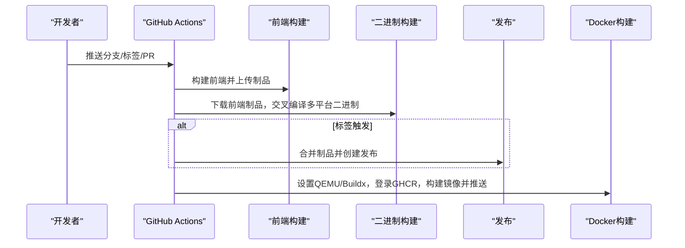
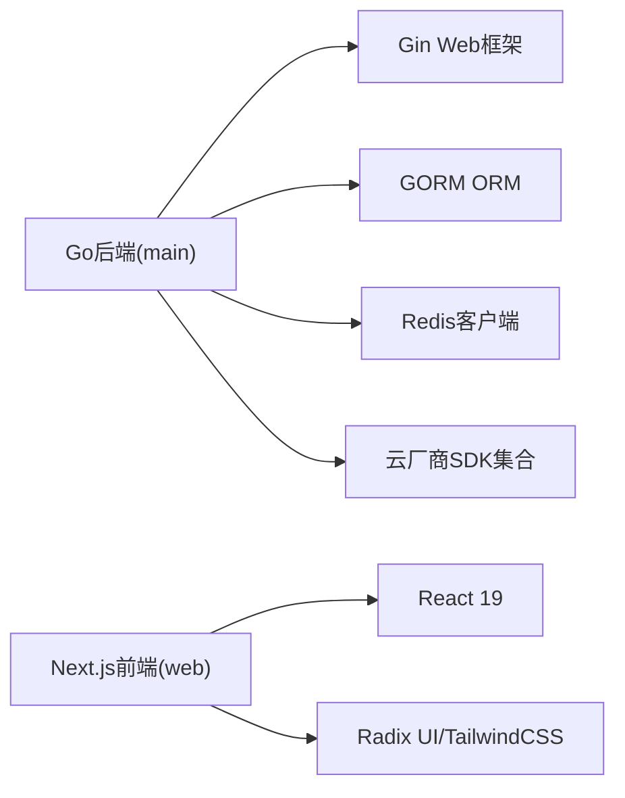

# 部署架构

<cite>
**本文引用的文件**
- [Dockerfile](file://Dockerfile)
- [.dockerignore](file://.dockerignore)
- [.github/workflows/build.yml](file://.github/workflows/build.yml)
- [main/main.go](file://main/main.go)
- [main/go.mod](file://main/go.mod)
- [main/internal/config/config.go](file://main/internal/config/config.go)
- [main/internal/cert/deploy/config.go](file://main/internal/cert/deploy/config.go)
- [web/package.json](file://web/package.json)
- [README.md](file://README.md)
</cite>

## 目录
1. [简介](#简介)
2. [项目结构](#项目结构)
3. [核心组件](#核心组件)
4. [架构总览](#架构总览)
5. [详细组件分析](#详细组件分析)
6. [依赖关系分析](#依赖关系分析)
7. [性能考量](#性能考量)
8. [故障排查指南](#故障排查指南)
9. [结论](#结论)
10. [附录](#附录)

## 简介
本文件面向DNSPlane的部署与运维团队，提供从容器化打包、多阶段构建、镜像优化，到CI/CD流水线、环境配置管理、高可用与负载均衡、监控与日志收集，以及部署最佳实践的完整说明。内容基于仓库中的实际代码与配置文件进行梳理，确保可操作性与可追溯性。

## 项目结构
DNSPlane采用前后端分离的单体式部署模式：后端为Go应用，内置嵌入式前端静态资源；前端为Next.js应用，通过构建脚本将产物复制到后端目录中，最终由后端统一提供服务。

图表来源
- [Dockerfile:1-34](file://Dockerfile#L1-L34)
- [.dockerignore:1-7](file://.dockerignore#L1-L7)
- [.github/workflows/build.yml:1-181](file://.github/workflows/build.yml#L1-L181)
- [main/main.go:1-148](file://main/main.go#L1-L148)
- [main/go.mod:1-96](file://main/go.mod#L1-L96)
- [main/internal/config/config.go:1-161](file://main/internal/config/config.go#L1-L161)
- [web/package.json:1-53](file://web/package.json#L1-L53)

章节来源
- [README.md:14-40](file://README.md#L14-L40)
- [Dockerfile:1-34](file://Dockerfile#L1-L34)
- [.dockerignore:1-7](file://.dockerignore#L1-L7)
- [.github/workflows/build.yml:1-181](file://.github/workflows/build.yml#L1-L181)
- [main/main.go:1-148](file://main/main.go#L1-L148)
- [main/go.mod:1-96](file://main/go.mod#L1-L96)
- [main/internal/config/config.go:1-161](file://main/internal/config/config.go#L1-L161)
- [web/package.json:1-53](file://web/package.json#L1-L53)

## 核心组件
- 应用入口与生命周期
  - 后端入口负责加载配置、初始化数据库与缓存、注册监控与后台任务、启动HTTP服务，并处理优雅停机信号。
- 配置管理
  - 默认配置包含服务器监听地址、数据库驱动与路径、JWT密钥与过期时间、日志清理策略等；支持从外部配置文件覆盖默认值。
- 嵌入式前端
  - 前端构建产物被同步至后端目录，运行时由后端统一提供静态资源。
- 证书部署适配
  - 提供多种部署器分类与配置注册机制，便于扩展不同平台/服务器的证书部署能力。

章节来源
- [main/main.go:52-147](file://main/main.go#L52-L147)
- [main/internal/config/config.go:82-161](file://main/internal/config/config.go#L82-L161)
- [main/internal/cert/deploy/config.go:1-50](file://main/internal/cert/deploy/config.go#L1-L50)

## 架构总览
下图展示DNSPlane的容器化部署与CI/CD集成关系：前端在构建阶段被打包并嵌入后端，随后由多阶段Dockerfile产出精简镜像；GitHub Actions在推送分支或标签时触发构建与镜像推送。

图表来源
- [.github/workflows/build.yml:1-181](file://.github/workflows/build.yml#L1-L181)
- [Dockerfile:1-34](file://Dockerfile#L1-L34)

## 详细组件分析

### 容器化与镜像构建
- 多阶段构建策略
  - Web阶段：在构建平台使用Node镜像安装依赖并执行CI构建，输出静态资源。
  - Builder阶段：在构建平台使用Go镜像交叉编译后端，注入前端静态资源。
  - 运行阶段：基于distroless静态镜像，仅拷贝二进制，非root运行，暴露8080端口。
- 镜像优化要点
  - 使用CGO禁用与链接器标志裁剪体积。
  - 多架构支持：在CI中按需构建linux/amd64, linux/arm64, linux/arm/v7。
  - 构建缓存：利用GitHub Actions缓存与Buildx缓存提升效率。
- 构建上下文与忽略规则
  - .dockerignore排除了.git、.github、node_modules、.next、out与文档，减少无关文件进入镜像。

图表来源
- [Dockerfile:1-34](file://Dockerfile#L1-L34)
- [.dockerignore:1-7](file://.dockerignore#L1-L7)

章节来源
- [Dockerfile:1-34](file://Dockerfile#L1-L34)
- [.dockerignore:1-7](file://.dockerignore#L1-L7)

### CI/CD流水线（GitHub Actions）
- 触发条件
  - 推送主分支或master分支、打标签、拉取请求、手动触发。
- 作业分工
  - 前端作业：安装Node.js，执行CI构建，上传嵌入式前端制品。
  - 二进制作业：下载前端制品，交叉编译多平台二进制，上传制品。
  - 发布作业：当为标签时，合并所有二进制制品并创建发布。
  - Docker作业：设置QEMU/Buildx，登录GHCR，构建并推送多架构镜像，生成语义化标签与SHA标签。
- 关键参数
  - IMAGE_NAME：镜像仓库命名空间。
  - 平台矩阵：linux/amd64, linux/arm64, linux/arm/v7（PR场景限制为linux/amd64）。
  - 缓存策略：Actions缓存与GHA缓存。

图表来源
- [.github/workflows/build.yml:1-181](file://.github/workflows/build.yml#L1-L181)

章节来源
- [.github/workflows/build.yml:1-181](file://.github/workflows/build.yml#L1-L181)

### 环境配置管理（开发/测试/生产）
- 默认配置项
  - 服务器：监听地址、端口、运行模式、基础URL。
  - 数据库：驱动类型、主机、端口、用户名、密码、数据库名、SQLite文件路径。
  - JWT：密钥与过期时间。
  - 日志清理：是否启用、成功/错误日志保留数量、清理间隔。
  - Redis：开关、地址、密码、DB索引、连接池大小、最小空闲连接、Key前缀。
- 加载与覆盖
  - 若未找到配置文件，将生成随机JWT密钥并写入默认配置；若存在则按JSON解析覆盖默认值。
- 环境差异建议
  - 开发：Release模式关闭，数据库可使用SQLite文件；开启调试日志。
  - 测试：启用Redis缓存，调整日志保留策略；使用独立数据库实例。
  - 生产：Release模式，启用Redis，配置健康检查端点；使用MySQL或外部数据库；严格控制密钥与网络访问。

章节来源
- [main/internal/config/config.go:82-161](file://main/internal/config/config.go#L82-L161)

### 负载均衡与高可用部署策略
- 反向代理与健康检查
  - 建议在反向代理层暴露80/443端口，后端容器监听8080；在反向代理配置健康检查路径（如/health），返回200表示存活。
  - 对于多副本部署，结合反向代理的健康检查与重试策略，实现故障转移与流量分发。
- 服务发现与扩缩容
  - 在Kubernetes等编排平台中，通过Service暴露ClusterIP，Deployment管理副本数；结合HPA根据CPU/内存或自定义指标扩缩容。
- 网络与安全
  - 限制容器网络访问，仅开放必要端口；在反向代理层启用TLS终止与WAF防护。

（本节为通用部署建议，不直接分析具体源码文件）

### 监控与日志收集
- 应用监控
  - 后端内置监控模块，启动时初始化并随进程运行；建议在反向代理层增加/health端点用于存活探针。
- 容器监控
  - 使用容器运行时指标（CPU/内存/IO）与日志采集；结合Prometheus/Grafana进行可视化。
- 日志聚合
  - 将容器标准输出接入集中式日志系统（如ELK/EFK或Loki+Grafana），区分应用日志与访问日志。
- 建议指标
  - QPS、P95/P99延迟、错误率、连接数、GC频率、磁盘使用率、Redis命中率等。

（本节为通用部署建议，不直接分析具体源码文件）

### 部署最佳实践与运维指南
- 镜像与版本
  - 使用语义化标签与短哈希标签，便于回滚与追踪；PR场景仅构建linux/amd64以加速。
- 配置与密钥
  - 将敏感配置放入密钥管理（如Vault/KMS），容器内通过环境变量或挂载只读密钥卷注入。
- 数据持久化
  - SQLite文件或MySQL数据目录应持久化到PVC/卷；定期备份与校验。
- 安全基线
  - 非root运行、最小权限原则、只读根文件系统、禁用不必要的网络端口。
- 回滚与变更
  - 采用蓝绿/金丝雀发布策略，配合健康检查与灰度流量；失败快速回滚。

（本节为通用部署建议，不直接分析具体源码文件）

## 依赖关系分析
- Go模块依赖
  - 后端使用Gin作为Web框架，GORM用于数据库访问，Redis客户端用于缓存，同时集成多家云厂商SDK与WHOIS解析库。
- 前端依赖
  - Next.js 16、React 19、Radix UI组件库、TailwindCSS等，构建脚本在CI中执行，产物同步到后端目录。

图表来源
- [main/go.mod:5-28](file://main/go.mod#L5-L28)
- [web/package.json:12-40](file://web/package.json#L12-L40)

章节来源
- [main/go.mod:1-96](file://main/go.mod#L1-L96)
- [web/package.json:1-53](file://web/package.json#L1-L53)

## 性能考量
- 构建阶段
  - 前端在构建平台一次性完成，避免多架构重复npm ci；Go交叉编译按目标平台生成二进制。
- 运行阶段
  - 使用静态基础镜像与非root用户，减少攻击面；CGO禁用与链接器裁剪降低二进制体积。
- 数据库与缓存
  - 生产环境建议启用Redis缓存，合理设置连接池与Key前缀；数据库维护任务周期运行，避免阻塞。
- 网络与I/O
  - 控制ReadHeaderTimeout与IdleTimeout，防止慢连接耗尽资源；对静态资源由后端统一提供，减少额外转发。

（本节为通用性能建议，不直接分析具体源码文件）

## 故障排查指南
- 启动失败
  - 检查配置文件是否存在与格式正确；确认数据库驱动与连接信息；查看日志输出定位错误。
- 健康检查失败
  - 在反向代理层验证/health端点可达；确认容器端口映射与暴露。
- 前端资源缺失
  - 确认构建产物已同步至后端web目录；检查Dockerfile中嵌入步骤是否执行。
- CI构建异常
  - 查看Actions日志中前端构建、二进制编译与Docker构建阶段的错误；核对缓存与权限配置。

章节来源
- [main/main.go:56-65](file://main/main.go#L56-L65)
- [main/internal/config/config.go:107-121](file://main/internal/config/config.go#L107-L121)
- [.github/workflows/build.yml:135-181](file://.github/workflows/build.yml#L135-L181)

## 结论
DNSPlane提供了清晰的容器化与CI/CD路径：前端在构建阶段被打包并嵌入后端，多阶段Dockerfile产出轻量级运行镜像；GitHub Actions覆盖多平台二进制与多架构容器镜像的构建与发布。结合合理的环境配置、高可用部署与监控日志体系，可实现稳定、可观测、可扩展的生产级部署。

## 附录
- 快速开始与编译发布参考
  - 前端构建与后端编译命令、首次安装流程与API接口说明见项目自述文件。

章节来源
- [README.md:42-161](file://README.md#L42-L161)