# ACME协议实现

<cite>
**本文档引用的文件**
- [acme.go](file://main/internal/cert/acme/acme.go)
- [interface.go](file://main/internal/cert/interface.go)
- [registry.go](file://main/internal/cert/registry.go)
- [providers.go](file://main/internal/cert/providers.go)
- [cert.go](file://main/internal/api/handler/cert.go)
- [models.go](file://main/internal/models/models.go)
</cite>

## 目录
1. [简介](#简介)
2. [项目结构](#项目结构)
3. [核心组件](#核心组件)
4. [架构概览](#架构概览)
5. [详细组件分析](#详细组件分析)
6. [依赖关系分析](#依赖关系分析)
7. [性能考虑](#性能考虑)
8. [故障排除指南](#故障排除指南)
9. [结论](#结论)

## 简介

本文档详细介绍了DNSPlane系统中的ACME协议实现。ACME（Automated Certificate Management Environment）协议是Let's Encrypt等证书颁发机构提供的自动化证书管理协议。该实现支持多种ACME提供商，包括Let's Encrypt、ZeroSSL、Google ACME等，并提供了完整的证书申请、验证和签发流程。

系统采用模块化设计，通过Provider接口抽象不同的证书颁发机构，支持外部账户绑定（EAB）机制，实现了JWK公钥格式、JWS签名算法和nonce缓存机制。整个流程涵盖了目录发现、账户注册、订单创建、域名验证和证书签发的完整生命周期。

## 项目结构

DNSPlane系统采用分层架构设计，ACME功能位于`main/internal/cert/acme`目录下，主要包含以下核心文件：

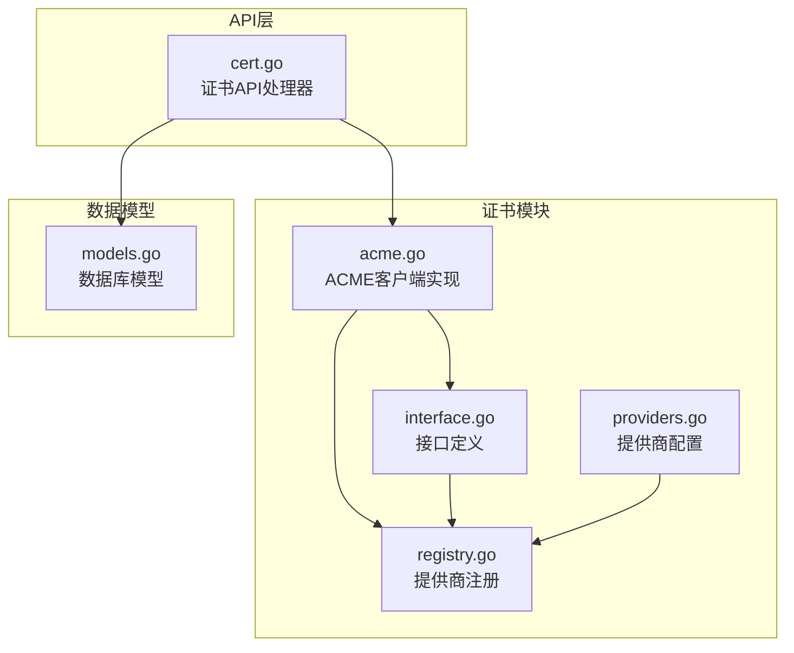

**图表来源**
- [acme.go:1-880](file://main/internal/cert/acme/acme.go#L1-L880)
- [interface.go:1-114](file://main/internal/cert/interface.go#L1-L114)
- [registry.go:1-108](file://main/internal/cert/registry.go#L1-L108)
- [providers.go:1-666](file://main/internal/cert/providers.go#L1-L666)

**章节来源**
- [acme.go:1-880](file://main/internal/cert/acme/acme.go#L1-L880)
- [interface.go:1-114](file://main/internal/cert/interface.go#L1-L114)
- [registry.go:1-108](file://main/internal/cert/registry.go#L1-L108)
- [providers.go:1-666](file://main/internal/cert/providers.go#L1-L666)

## 核心组件

### ACMEClient类

ACMEClient是系统的核心组件，实现了完整的ACME协议客户端功能：

```mermaid
classDiagram
class ACMEClient {
-string directoryURL
-string email
-string eabKID
-string eabHMACKey
-crypto.PrivateKey accountKey
-string accountURL
-Directory directory
-http.Client client
-Logger logger
-string nonce
+Register(ctx) map[string]interface{}
+CreateOrder(ctx, domains, order, keyType, keySize) map[string][]DNSRecord
+AuthOrder(ctx, domains, order) error
+GetAuthStatus(ctx, domains, order) bool
+FinalizeOrder(ctx, domains, order, keyType, keySize) CertResult
+Revoke(ctx, order, pem) error
+Cancel(ctx, order) error
+SetLogger(logger) void
-getDirectory(ctx) error
-getNonce(ctx) string
-signedRequest(ctx, url, payload, useKID) []byte
-getJWK() map[string]interface{}
-sign(data) []byte
-createEAB(ctx) map[string]interface{}
-getKeyAuthorization(token) string
-createCSR(domains, privateKey) []byte
}
class Directory {
+string NewNonce
+string NewAccount
+string NewOrder
+string RevokeCert
+string KeyChange
}
ACMEClient --> Directory : "使用"
```

**图表来源**
- [acme.go:69-880](file://main/internal/cert/acme/acme.go#L69-L880)

### Provider接口

Provider接口定义了证书提供商的标准行为：

```mermaid
classDiagram
class Provider {
<<interface>>
+Register(ctx) map[string]interface{}
+BuyCert(ctx, domains, order) error
+CreateOrder(ctx, domains, order, keyType, keySize) map[string][]DNSRecord
+AuthOrder(ctx, domains, order) error
+GetAuthStatus(ctx, domains, order) bool
+FinalizeOrder(ctx, domains, order, keyType, keySize) CertResult
+Revoke(ctx, order, pem) error
+Cancel(ctx, order) error
+SetLogger(logger) void
}
class ACMEClient {
+Register(ctx) map[string]interface{}
+CreateOrder(ctx, domains, order, keyType, keySize) map[string][]DNSRecord
+AuthOrder(ctx, domains, order) error
+GetAuthStatus(ctx, domains, order) bool
+FinalizeOrder(ctx, domains, order, keyType, keySize) CertResult
+Revoke(ctx, order, pem) error
+Cancel(ctx, order) error
+SetLogger(logger) void
}
Provider <|.. ACMEClient : "实现"
```

**图表来源**
- [interface.go:49-77](file://main/internal/cert/interface.go#L49-L77)
- [acme.go:422-880](file://main/internal/cert/acme/acme.go#L422-L880)

**章节来源**
- [acme.go:69-880](file://main/internal/cert/acme/acme.go#L69-L880)
- [interface.go:49-77](file://main/internal/cert/interface.go#L49-L77)

## 架构概览

系统采用插件化架构，支持多种ACME提供商的无缝集成：

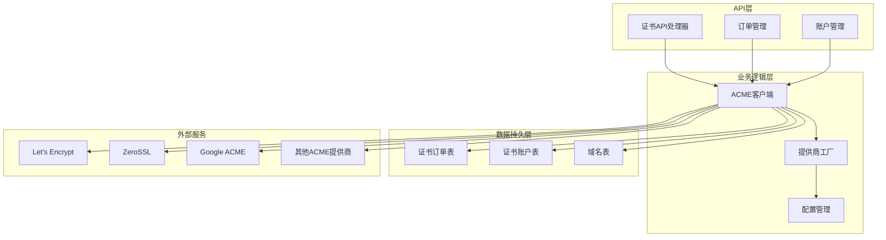

**图表来源**
- [cert.go:155-342](file://main/internal/api/handler/cert.go#L155-L342)
- [acme.go:36-67](file://main/internal/cert/acme/acme.go#L36-L67)
- [registry.go:30-42](file://main/internal/cert/registry.go#L30-L42)

系统的核心流程包括：

1. **初始化阶段**：注册各种ACME提供商，建立HTTP客户端连接
2. **目录发现**：从ACME服务器获取目录端点信息
3. **账户注册**：创建或激活ACME账户，支持EAB机制
4. **订单创建**：提交域名列表创建证书订单
5. **域名验证**：生成DNS TXT记录进行域名所有权验证
6. **证书签发**：提交CSR完成证书签发
7. **状态监控**：轮询订单状态直到完成或失败

**章节来源**
- [cert.go:155-342](file://main/internal/api/handler/cert.go#L155-L342)
- [acme.go:242-880](file://main/internal/cert/acme/acme.go#L242-L880)

## 详细组件分析

### 目录发现机制

系统通过目录发现机制获取ACME服务器的端点信息：

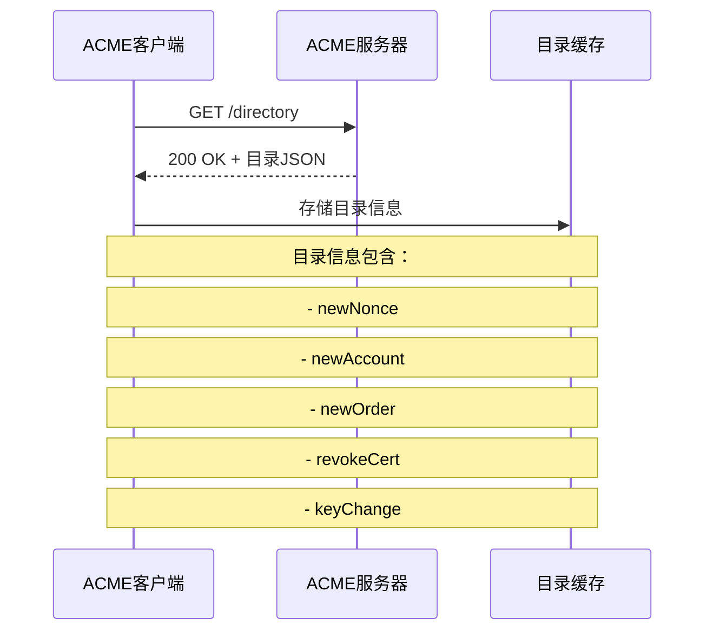

**图表来源**
- [acme.go:242-260](file://main/internal/cert/acme/acme.go#L242-L260)

目录发现过程包含以下步骤：
1. 发送HTTP GET请求到目录URL
2. 解析响应JSON获取各个端点URL
3. 缓存目录信息以避免重复请求
4. 为后续操作提供必要的端点信息

**章节来源**
- [acme.go:242-260](file://main/internal/cert/acme/acme.go#L242-L260)

### nonce缓存机制

nonce（一次性随机数）是ACME协议的重要安全机制：

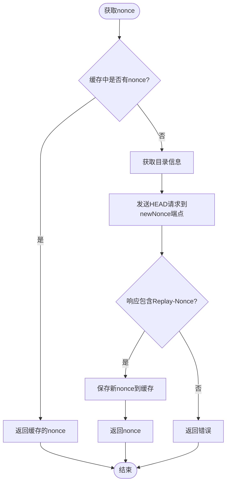

**图表来源**
- [acme.go:262-286](file://main/internal/cert/acme/acme.go#L262-L286)

nonce缓存机制的优势：
- 减少网络请求次数
- 提高系统性能
- 遵循ACME协议的安全要求
- 支持防重放攻击

**章节来源**
- [acme.go:262-286](file://main/internal/cert/acme/acme.go#L262-L286)

### JWK公钥格式

系统支持多种加密算法的JWK公钥格式：

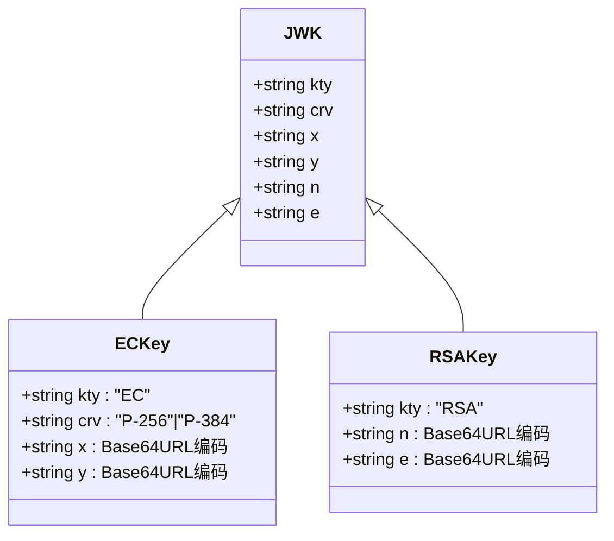

**图表来源**
- [acme.go:370-396](file://main/internal/cert/acme/acme.go#L370-L396)

JWK公钥格式的特点：
- ECDSA密钥使用P-256或P-384曲线
- RSA密钥支持2048位和4096位
- 所有数值都使用Base64URL编码
- 符合JWK标准格式要求

**章节来源**
- [acme.go:370-396](file://main/internal/cert/acme/acme.go#L370-L396)

### JWS签名算法

系统实现了完整的JWS（JSON Web Signature）签名机制：

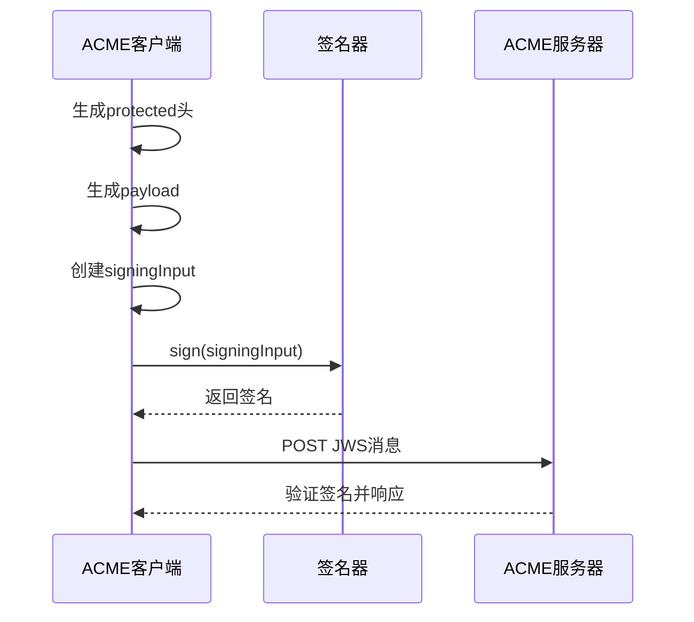

**图表来源**
- [acme.go:288-368](file://main/internal/cert/acme/acme.go#L288-L368)

JWS签名过程的关键步骤：
1. **受保护头部**：包含算法、nonce、URL等元数据
2. **签名输入**：protected + "." + payload的Base64URL编码
3. **签名生成**：使用相应的私钥进行数字签名
4. **消息封装**：将protected、payload、signature组合成最终消息

**章节来源**
- [acme.go:288-368](file://main/internal/cert/acme/acme.go#L288-L368)

### 外部账户绑定（EAB）

EAB机制允许使用外部账户凭证进行账户注册：

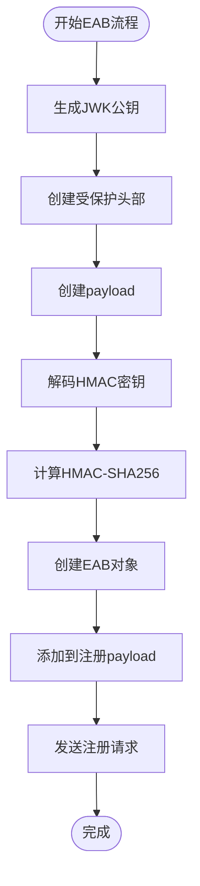

**图表来源**
- [acme.go:476-500](file://main/internal/cert/acme/acme.go#L476-L500)

EAB机制的实现要点：
- 使用HS256算法进行HMAC签名
- HMAC密钥需要Base64URL格式
- 受保护头部包含kid和URL信息
- payload包含JWK公钥的JSON序列化

**章节来源**
- [acme.go:476-500](file://main/internal/cert/acme/acme.go#L476-L500)

### 订单创建流程

订单创建是证书申请的核心流程：

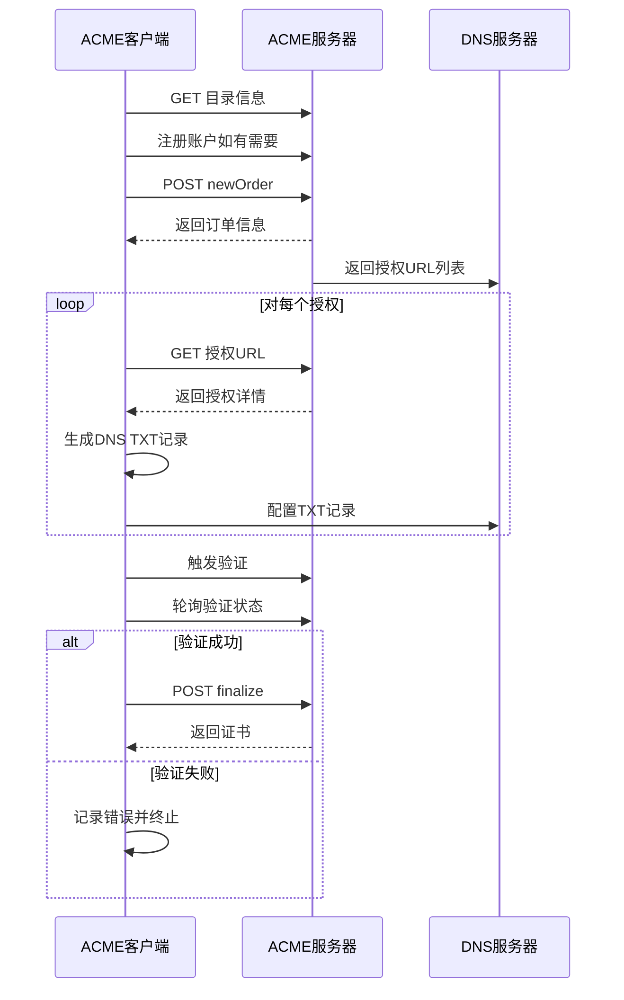

**图表来源**
- [acme.go:512-638](file://main/internal/cert/acme/acme.go#L512-L638)

订单创建的关键步骤：
1. **目录发现**：获取newOrder端点URL
2. **账户准备**：确保账户已注册
3. **订单提交**：发送域名列表创建订单
4. **授权处理**：为每个域名获取授权URL
5. **DNS配置**：生成并配置TXT验证记录
6. **验证触发**：向ACME服务器报告验证完成
7. **状态轮询**：等待验证结果

**章节来源**
- [acme.go:512-638](file://main/internal/cert/acme/acme.go#L512-L638)

### 证书签发流程

证书签发过程包含CSR生成和证书下载：

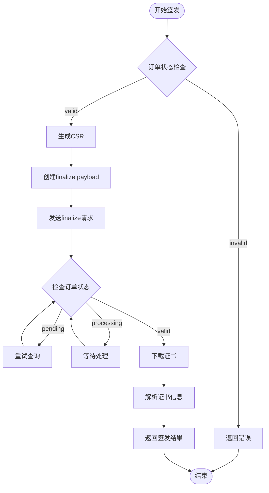

**图表来源**
- [acme.go:735-825](file://main/internal/cert/acme/acme.go#L735-L825)

证书签发的关键特性：
- 支持RSA和ECDSA两种密钥类型
- 自动处理订单状态轮询
- 支持证书链的完整下载
- 错误处理和重试机制

**章节来源**
- [acme.go:735-825](file://main/internal/cert/acme/acme.go#L735-L825)

## 依赖关系分析

系统采用松耦合的设计模式，通过接口和工厂模式实现模块间的解耦：

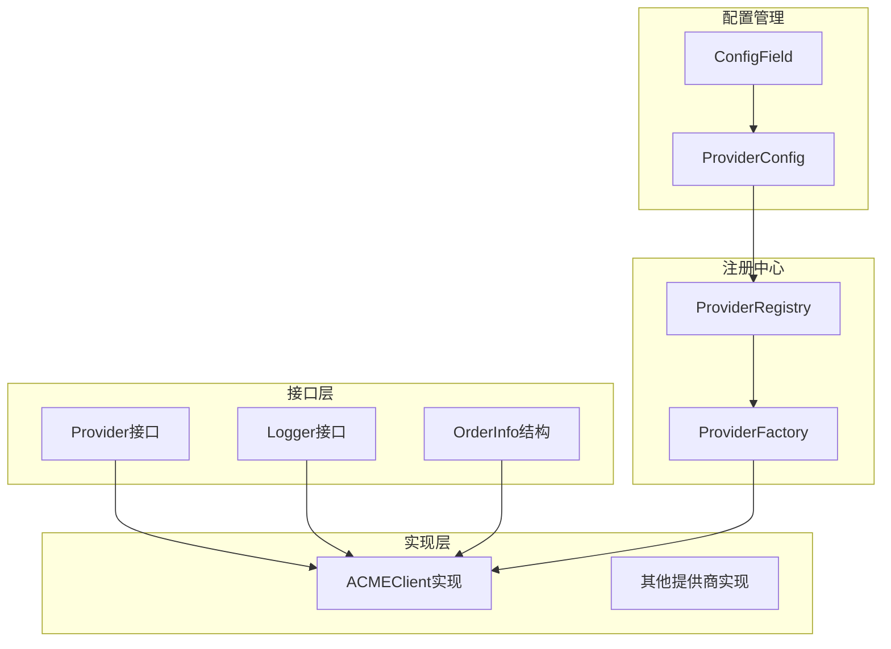

**图表来源**
- [interface.go:49-114](file://main/internal/cert/interface.go#L49-L114)
- [registry.go:8-28](file://main/internal/cert/registry.go#L8-L28)
- [providers.go:79-114](file://main/internal/cert/providers.go#L79-L114)

依赖关系特点：
- **低耦合**：通过接口定义抽象，实现与接口分离
- **可扩展**：新的提供商只需实现Provider接口
- **可配置**：通过ProviderConfig进行灵活配置
- **可测试**：接口隔离便于单元测试

**章节来源**
- [interface.go:49-114](file://main/internal/cert/interface.go#L49-L114)
- [registry.go:8-28](file://main/internal/cert/registry.go#L8-L28)
- [providers.go:79-114](file://main/internal/cert/providers.go#L79-L114)

## 性能考虑

系统在设计时充分考虑了性能优化：

### 连接池管理
- 使用HTTP客户端连接池减少连接开销
- 合理设置超时时间避免阻塞
- 支持代理服务器配置

### 缓存策略
- 目录信息缓存：避免重复的目录请求
- nonce缓存：减少nonce获取频率
- 账户信息缓存：支持账户URL复用

### 并发处理
- 异步订单处理：避免阻塞API响应
- 并发验证：支持多域名并行验证
- 轮询优化：智能退避算法

### 内存管理
- 流式处理：避免大证书的内存占用
- 及时释放：及时清理临时资源
- 垃圾回收：合理使用GC

## 故障排除指南

### 常见错误类型

系统定义了完整的错误处理机制：

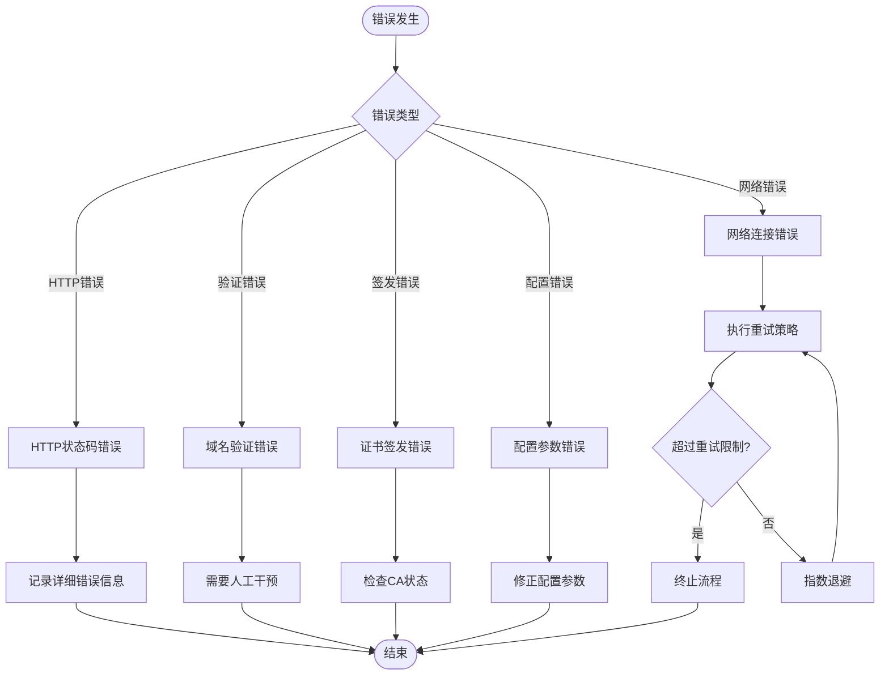

**图表来源**
- [acme.go:362-367](file://main/internal/cert/acme/acme.go#L362-L367)

### 错误处理策略

1. **HTTP错误处理**：捕获HTTP状态码并转换为有意义的错误信息
2. **网络错误处理**：实现指数退避重试机制
3. **验证错误处理**：提供详细的验证失败原因
4. **配置错误处理**：验证配置参数的有效性

### 调试技巧

- 启用详细日志记录
- 监控API响应时间和错误率
- 使用测试环境验证流程
- 实施监控告警机制

**章节来源**
- [acme.go:362-367](file://main/internal/cert/acme/acme.go#L362-L367)

## 结论

DNSPlane系统的ACME协议实现展现了现代证书管理系统的最佳实践。通过模块化设计、完善的错误处理和性能优化，系统能够稳定地支持多种ACME提供商的证书申请流程。

主要优势包括：
- **标准化实现**：完全遵循ACME v2协议规范
- **多提供商支持**：统一接口支持多家证书颁发机构
- **企业级特性**：支持EAB、CNAME代理、批量部署等功能
- **可靠性保障**：完善的错误处理和重试机制
- **可扩展性**：插件化架构便于功能扩展

该实现为DNSPlane系统提供了强大的SSL证书管理能力，满足了从个人用户到企业用户的多样化需求。