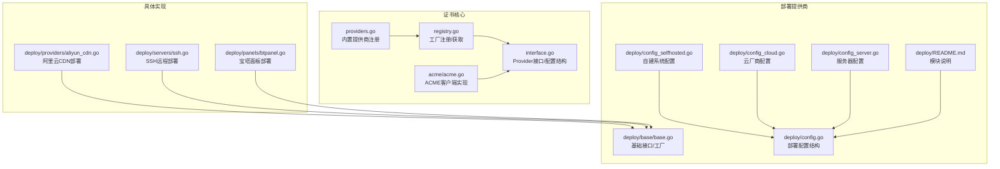
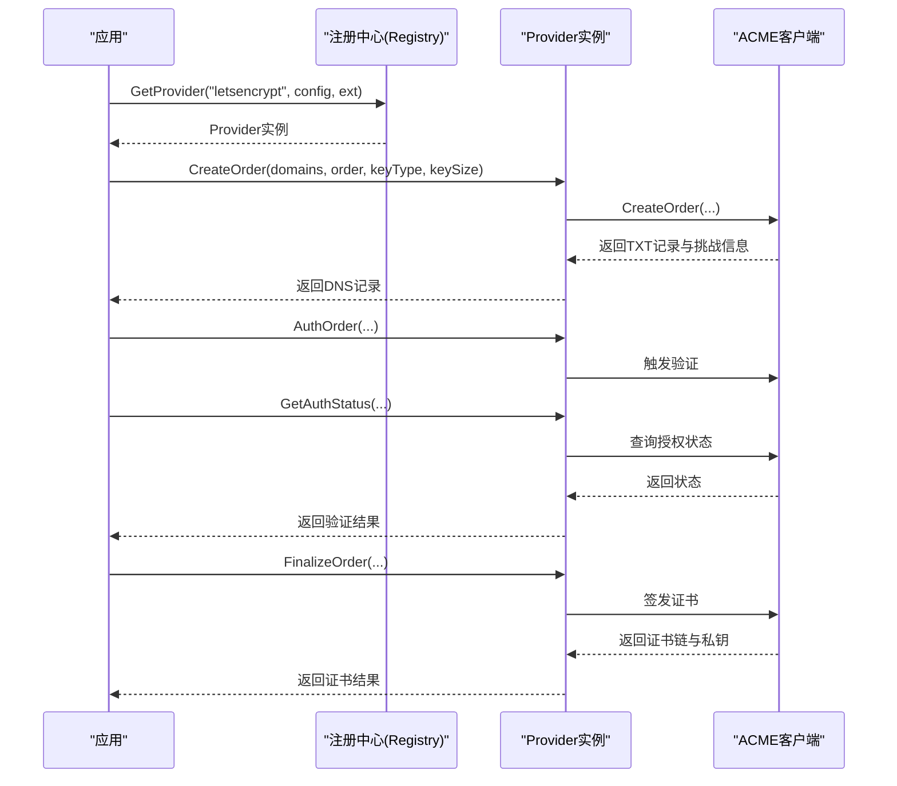
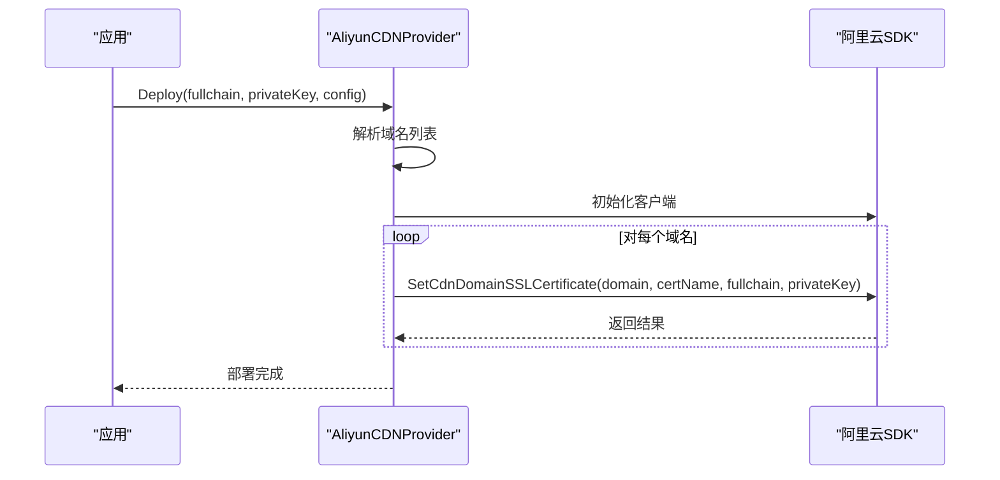
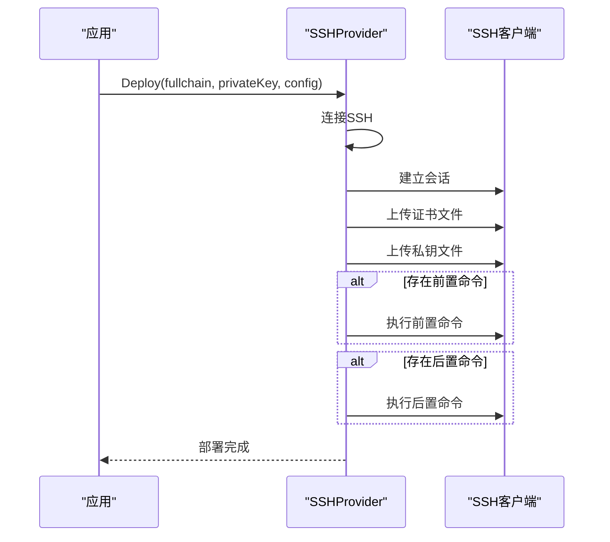
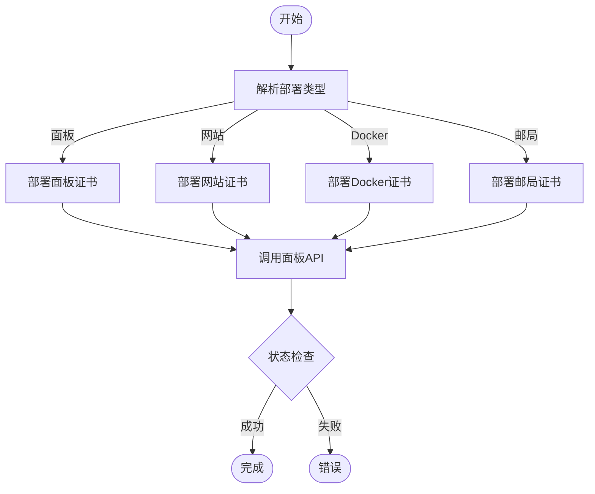
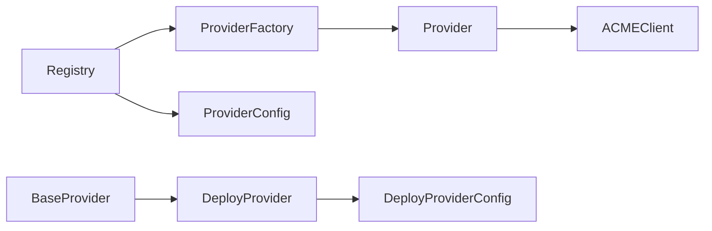

# 证书提供商集成

<cite>
**本文档引用的文件**
- [providers.go](file://main/internal/cert/providers.go)
- [registry.go](file://main/internal/cert/registry.go)
- [interface.go](file://main/internal/cert/interface.go)
- [acme.go](file://main/internal/cert/acme/acme.go)
- [config.go](file://main/internal/cert/deploy/config.go)
- [config_selfhosted.go](file://main/internal/cert/deploy/config_selfhosted.go)
- [config_cloud.go](file://main/internal/cert/deploy/config_cloud.go)
- [config_server.go](file://main/internal/cert/deploy/config_server.go)
- [README.md](file://main/internal/cert/deploy/README.md)
- [base.go](file://main/internal/cert/deploy/base/base.go)
- [aliyun_cdn.go](file://main/internal/cert/deploy/providers/aliyun_cdn.go)
- [ssh.go](file://main/internal/cert/deploy/servers/ssh.go)
- [btpanel.go](file://main/internal/cert/deploy/panels/btpanel.go)
</cite>

## 目录
1. [简介](#简介)
2. [项目结构](#项目结构)
3. [核心组件](#核心组件)
4. [架构总览](#架构总览)
5. [详细组件分析](#详细组件分析)
6. [依赖关系分析](#依赖关系分析)
7. [性能考虑](#性能考虑)
8. [故障排查指南](#故障排查指南)
9. [结论](#结论)
10. [附录](#附录)

## 简介
本技术文档面向证书提供商集成，系统性阐述如何在系统中注册与管理各类证书颁发机构（CA）提供商，涵盖 Let's Encrypt、ZeroSSL、Google ACME、LiteSSL 等主流 ACME 提供商，以及自定义 ACME 提供商的开发与配置流程。同时介绍部署提供商的工厂模式与动态注册机制，说明不同提供商的特性与限制（如 EAB 认证、域名验证方式、证书有效期等），并给出最佳实践与性能优化建议。

## 项目结构
证书相关功能主要位于 main/internal/cert 目录，按职责分为：
- 证书提供商注册与工厂：providers.go、registry.go、interface.go
- ACME 协议实现：acme/acme.go
- 部署提供商：deploy 目录下的 base、providers、panels、servers、config_* 等文件



图表来源
- [providers.go:1-666](file://main/internal/cert/providers.go#L1-L666)
- [registry.go:1-108](file://main/internal/cert/registry.go#L1-L108)
- [interface.go:1-114](file://main/internal/cert/interface.go#L1-L114)
- [acme.go:1-880](file://main/internal/cert/acme/acme.go#L1-L880)
- [config.go:1-50](file://main/internal/cert/deploy/config.go#L1-L50)
- [config_selfhosted.go:1-372](file://main/internal/cert/deploy/config_selfhosted.go#L1-L372)
- [config_cloud.go:1-495](file://main/internal/cert/deploy/config_cloud.go#L1-L495)
- [config_server.go:1-100](file://main/internal/cert/deploy/config_server.go#L1-L100)
- [README.md:1-123](file://main/internal/cert/deploy/README.md#L1-L123)
- [base.go:1-258](file://main/internal/cert/deploy/base/base.go#L1-L258)
- [aliyun_cdn.go:1-99](file://main/internal/cert/deploy/providers/aliyun_cdn.go#L1-L99)
- [ssh.go:1-179](file://main/internal/cert/deploy/servers/ssh.go#L1-L179)
- [btpanel.go:1-312](file://main/internal/cert/deploy/panels/btpanel.go#L1-L312)

章节来源
- [providers.go:1-666](file://main/internal/cert/providers.go#L1-L666)
- [registry.go:1-108](file://main/internal/cert/registry.go#L1-L108)
- [README.md:1-123](file://main/internal/cert/deploy/README.md#L1-L123)

## 核心组件
- Provider 工厂与注册中心：通过 Register(name, factory, config) 注册提供商，GetProvider(name, config, ext) 获取实例，支持并发安全读写锁保护。
- Provider 接口：定义统一的证书申请生命周期方法（注册账户、创建订单、触发验证、查询状态、签发证书、吊销、取消等）。
- ProviderConfig：描述提供商的元数据（名称、图标、说明、配置字段、是否支持 CNAME 代理、是否用于部署等）。
- ACME 客户端：封装 ACME 协议交互，支持 Let's Encrypt、ZeroSSL、Google ACME、LiteSSL、自定义 ACME 等。
- 部署提供商：通过 BaseProvider 抽象统一的部署能力，支持云厂商、自建面板、服务器等多场景。

章节来源
- [registry.go:22-42](file://main/internal/cert/registry.go#L22-L42)
- [interface.go:49-77](file://main/internal/cert/interface.go#L49-L77)
- [interface.go:79-114](file://main/internal/cert/interface.go#L79-L114)
- [acme.go:36-67](file://main/internal/cert/acme/acme.go#L36-L67)

## 架构总览
系统采用“工厂 + 接口”的解耦设计：
- 注册阶段：内置提供商在 init() 中调用 Register 注册，形成全局映射。
- 使用阶段：通过 GetProvider 获取具体 Provider 实例，调用 Provider 接口方法完成证书申请与部署。
- 配置驱动：ProviderConfig 描述每个提供商的配置字段、显示规则与用途，APIProvidersSnapshot 提供只读快照供管理界面使用。



图表来源
- [registry.go:30-42](file://main/internal/cert/registry.go#L30-L42)
- [acme.go:512-638](file://main/internal/cert/acme/acme.go#L512-L638)
- [acme.go:658-733](file://main/internal/cert/acme/acme.go#L658-L733)
- [acme.go:735-800](file://main/internal/cert/acme/acme.go#L735-L800)

## 详细组件分析

### 证书提供商工厂与注册机制
- 注册流程：init() 中调用 Register 注册内置提供商，支持带工厂函数（如 ACME 提供商）与纯配置（如免费证书提供商）两种形式。
- 获取流程：GetProvider 通过名称查找工厂并构造实例，若工厂为空或不存在则报错。
- 快照机制：APIProvidersSnapshot 仅构建一次，保证管理接口读取稳定。

```mermaid
classDiagram
class Registry {
+Register(name, factory, config)
+GetProvider(name, config, ext) Provider
+GetProviderConfig(name) ProviderConfig
+GetAllProviderConfigs() map[string]ProviderConfig
+GetCertProviderConfigs() map[string]ProviderConfig
+GetDeployProviderConfigs() map[string]ProviderConfig
+APIProvidersSnapshot() (cert, deploy)
}
class Provider {
<<interface>>
+Register(ctx) map[string]interface{}
+BuyCert(ctx, domains, order) error
+CreateOrder(ctx, domains, order, keyType, keySize) map[string][]DNSRecord
+AuthOrder(ctx, domains, order) error
+GetAuthStatus(ctx, domains, order) (bool, error)
+FinalizeOrder(ctx, domains, order, keyType, keySize) CertResult
+Revoke(ctx, order, pem) error
+Cancel(ctx, order) error
+SetLogger(logger)
}
class ProviderConfig {
+string Type
+string Name
+string Icon
+string Note
+ConfigField[] Config
+ConfigField[] DeployConfig
+string DeployNote
+bool CNAME
+bool IsDeploy
}
Registry --> Provider : "工厂创建"
Registry --> ProviderConfig : "存储配置"
```

图表来源
- [registry.go:22-107](file://main/internal/cert/registry.go#L22-L107)
- [interface.go:49-114](file://main/internal/cert/interface.go#L49-L114)

章节来源
- [providers.go:3-112](file://main/internal/cert/providers.go#L3-L112)
- [registry.go:22-107](file://main/internal/cert/registry.go#L22-L107)
- [interface.go:79-114](file://main/internal/cert/interface.go#L79-L114)

### ACME 客户端与内置提供商
- 内置提供商：Let's Encrypt、ZeroSSL、Google ACME、LiteSSL、自定义 ACME。
- 关键特性：
  - Let's Encrypt：标准 ACME v2，支持 CNAME 代理。
  - ZeroSSL：需 EAB（外部账户绑定）凭证。
  - Google ACME：支持正式与测试环境切换，需 EAB。
  - LiteSSL：freessl.cn 的 ACME，需 EAB。
  - 自定义 ACME：可指定任意 ACME Directory 地址，可选 EAB。
- 认证参数：
  - 邮箱地址（部分提供商必填）
  - EAB KID/HMAC Key（ZeroSSL、Google、LiteSSL、自定义ACME可选）
  - 模式选择（Google 支持 live/staging）
  - 代理开关（部分提供商支持）

```mermaid
classDiagram
class ACMEClient {
-string directoryURL
-string email
-string eabKID
-string eabHMACKey
-crypto.PrivateKey accountKey
-string accountURL
-Directory directory
-http.Client client
-Logger logger
-string nonce
+Register(ctx) map[string]interface{}
+CreateOrder(ctx, domains, order, keyType, keySize) map[string][]DNSRecord
+AuthOrder(ctx, domains, order) error
+GetAuthStatus(ctx, domains, order) (bool, error)
+FinalizeOrder(ctx, domains, order, keyType, keySize) *CertResult
+Revoke(ctx, order, pem) error
+Cancel(ctx, order) error
+SetLogger(logger)
}
class Directory {
+string NewNonce
+string NewAccount
+string NewOrder
+string RevokeCert
+string KeyChange
}
ACMEClient --> Directory : "解析目录"
```

图表来源
- [acme.go:69-88](file://main/internal/cert/acme/acme.go#L69-L88)
- [acme.go:90-206](file://main/internal/cert/acme/acme.go#L90-L206)

章节来源
- [acme.go:27-67](file://main/internal/cert/acme/acme.go#L27-L67)
- [acme.go:90-206](file://main/internal/cert/acme/acme.go#L90-L206)

### 部署提供商工厂与配置体系
- BaseProvider：统一的日志、配置读取、域名解析等能力。
- ProviderFactory：部署器工厂，按提供商类型创建实例。
- 配置分类：
  - 云厂商部署器：阿里云、腾讯云、华为云、AWS、七牛、又拍等。
  - 自建系统部署器：宝塔、1Panel、Kangle、MW、小皮、群晖、Lucky、飞牛OS、Proxmox、K8S、南墙WAF等。
  - 服务器部署器：SSH、FTP、本地部署。
- 配置结构：DeployProviderConfig 包含 Inputs（账户级）、TaskInputs（任务级）与说明信息。

```mermaid
classDiagram
class BaseProvider {
+map[string]interface{} Config
+Logger Logger
+SetLogger(logger)
+Log(msg)
+GetString(key) string
+GetInt(key, defaultVal) int
+GetStringFrom(config, key) string
+Check(ctx) error
}
class DeployProvider {
<<interface>>
+Check(ctx) error
+Deploy(ctx, fullchain, privateKey, config) error
+SetLogger(logger)
}
class DeployProviderConfig {
+string Type
+string Name
+int Class
+string Icon
+string Desc
+string Note
+ConfigField[] Inputs
+ConfigField[] TaskInputs
+string TaskNote
}
BaseProvider <|-- DeployProvider
DeployProviderConfig --> ConfigField : "使用"
```

图表来源
- [base.go:98-258](file://main/internal/cert/deploy/base/base.go#L98-L258)
- [config.go:19-50](file://main/internal/cert/deploy/config.go#L19-L50)

章节来源
- [base.go:63-84](file://main/internal/cert/deploy/base/base.go#L63-L84)
- [config.go:19-50](file://main/internal/cert/deploy/config.go#L19-L50)
- [config_selfhosted.go:9-372](file://main/internal/cert/deploy/config_selfhosted.go#L9-L372)
- [config_cloud.go:9-495](file://main/internal/cert/deploy/config_cloud.go#L9-L495)
- [config_server.go:9-100](file://main/internal/cert/deploy/config_server.go#L9-L100)

### 典型部署实现示例

#### 阿里云CDN部署
- 功能：批量为指定域名部署证书至阿里云CDN。
- 关键点：使用阿里云 SDK，逐域调用设置证书接口，生成唯一证书名称，自动处理 HTTPS 开启。



图表来源
- [aliyun_cdn.go:56-94](file://main/internal/cert/deploy/providers/aliyun_cdn.go#L56-L94)

章节来源
- [aliyun_cdn.go:17-99](file://main/internal/cert/deploy/providers/aliyun_cdn.go#L17-L99)

#### SSH远程部署
- 功能：通过SSH连接服务器，上传证书与私钥，并可执行预/后置命令。
- 关键点：支持密码与密钥两种认证方式，自动创建远程目录，使用 scp 协议传输文件。



图表来源
- [ssh.go:82-135](file://main/internal/cert/deploy/servers/ssh.go#L82-L135)
- [ssh.go:137-174](file://main/internal/cert/deploy/servers/ssh.go#L137-L174)

章节来源
- [ssh.go:40-80](file://main/internal/cert/deploy/servers/ssh.go#L40-L80)

#### 宝塔面板部署
- 功能：支持网站、Docker、邮局、面板本身等多种类型的证书部署。
- 关键点：统一鉴权（时间戳+MD5），按类型调用不同API，自动解析站点ID。



图表来源
- [btpanel.go:117-176](file://main/internal/cert/deploy/panels/btpanel.go#L117-L176)
- [btpanel.go:178-280](file://main/internal/cert/deploy/panels/btpanel.go#L178-L280)

章节来源
- [btpanel.go:35-59](file://main/internal/cert/deploy/panels/btpanel.go#L35-L59)
- [btpanel.go:117-176](file://main/internal/cert/deploy/panels/btpanel.go#L117-L176)

## 依赖关系分析
- Provider 与 ACMEClient：ACME 提供商实现 Provider 接口，内部持有 ACMEClient。
- Registry 与 ProviderFactory：注册中心维护 name->factory 映射，运行时通过工厂创建实例。
- BaseProvider 与 DeployProvider：部署器实现 DeployProvider 接口，继承 BaseProvider 能力。
- 配置与实现分离：ProviderConfig 描述配置，具体实现读取配置并执行业务逻辑。



图表来源
- [registry.go:22-42](file://main/internal/cert/registry.go#L22-L42)
- [interface.go:49-114](file://main/internal/cert/interface.go#L49-L114)
- [base.go:43-53](file://main/internal/cert/deploy/base/base.go#L43-L53)
- [config.go:19-30](file://main/internal/cert/deploy/config.go#L19-L30)

章节来源
- [registry.go:22-42](file://main/internal/cert/registry.go#L22-L42)
- [base.go:43-53](file://main/internal/cert/deploy/base/base.go#L43-L53)

## 性能考虑
- 并发安全：注册中心使用读写锁，避免竞态；APIProvidersSnapshot 仅构建一次，降低读取开销。
- ACME 请求优化：复用 nonce，减少额外 HEAD 请求；按需解析目录，避免重复网络调用。
- 部署并发：部署器按域名循环处理，可在上层任务调度中并行化（例如多域名同时部署到不同目标）。
- 网络超时：ACME 客户端与 HTTP 客户端均设置超时，避免阻塞。
- 日志与可观测性：Provider/DeployProvider 均支持 SetLogger，便于追踪问题。

## 故障排查指南
- 未知提供商：GetProvider 返回 unknown provider 错误，检查提供商名称是否正确。
- 工厂为空：返回 provider has no implementation 错误，确认是否正确注册。
- ACME 认证失败：
  - EAB 参数错误：ZeroSSL、Google、LiteSSL、自定义ACME需正确提供 KID/HMAC。
  - 验证状态 pending/processing：等待片刻后重试，查看授权响应中的详细错误。
  - 签发失败：检查订单状态是否为 invalid，或证书下载地址是否为空。
- 部署失败：
  - SSH：检查主机、端口、认证方式与权限；确认远程路径存在且可写。
  - 宝塔：核对API密钥、面板地址；确认站点名称或ID有效。
  - 云厂商：核对AK/SK、地域、产品类型与域名列表。

章节来源
- [registry.go:30-42](file://main/internal/cert/registry.go#L30-L42)
- [acme.go:476-500](file://main/internal/cert/acme/acme.go#L476-L500)
- [acme.go:675-733](file://main/internal/cert/acme/acme.go#L675-L733)
- [ssh.go:162-174](file://main/internal/cert/deploy/servers/ssh.go#L162-L174)
- [btpanel.go:117-176](file://main/internal/cert/deploy/panels/btpanel.go#L117-L176)

## 结论
该证书提供商集成为多提供商、多场景的自动化解决方案提供了清晰的扩展框架。通过工厂模式与配置驱动，系统能够快速集成新的 ACME 提供商与部署目标。建议在生产环境中：
- 优先使用 Let's Encrypt 或具备 EAB 的提供商，确保合规与稳定性。
- 为部署流程配置重试与告警，提升可靠性。
- 对高并发场景进行任务拆分与并行化部署，优化整体吞吐。

## 附录

### 不同提供商特性与限制
- Let's Encrypt
  - 特性：标准 ACME v2，支持 CNAME 代理，免费。
  - 限制：速率限制、域名数量限制（见 ACME 规范）。
- ZeroSSL
  - 特性：需 EAB 凭证，支持 CNAME 代理。
  - 限制：需提前申请 EAB 凭证。
- Google ACME
  - 特性：支持 live/staging 环境，需 EAB 凭证。
  - 限制：需 Google PKI 账户与 EAB。
- LiteSSL
  - 特性：freessl.cn 的 ACME，需 EAB 凭证。
  - 限制：需从 freessl.cn 获取 EAB。
- 自定义 ACME
  - 特性：可指定任意 ACME Directory，可选 EAB。
  - 限制：需确保目录地址与协议兼容。

章节来源
- [acme.go:27-67](file://main/internal/cert/acme/acme.go#L27-L67)
- [providers.go:10-111](file://main/internal/cert/providers.go#L10-L111)

### 自定义 ACME 提供商开发指南
- 步骤
  1) 在 init() 中调用 cert.Register 注册提供商，传入工厂函数与 ProviderConfig。
  2) 工厂函数接收 config 与 ext，返回实现了 Provider 接口的实例。
  3) 在 Provider 实现中调用 ACMEClient 的 CreateOrder/AuthOrder/GetAuthStatus/FinalizeOrder 等方法。
  4) 在 ProviderConfig 中定义必要的配置字段（如邮箱、EAB KID/HMAC、Directory 地址等）。
- 配置示例要点
  - 邮箱地址：用于账户注册与联系。
  - EAB KID/HMAC：可选，用于需要外部账户绑定的提供商。
  - Directory 地址：自定义 ACME 必填。
  - 代理开关：可选，用于网络受限环境。

章节来源
- [providers.go:94-111](file://main/internal/cert/providers.go#L94-L111)
- [acme.go:189-206](file://main/internal/cert/acme/acme.go#L189-L206)

### 最佳实践与性能建议
- 选择策略
  - 优先使用 Let's Encrypt，免费且生态完善。
  - 对需要 EAB 的企业级需求，选择 Google ACME 或 LiteSSL。
  - 自定义 ACME 适用于私有 CA 或特殊协议。
- 部署策略
  - 多域名部署：按提供商/目标拆分任务，避免单点瓶颈。
  - 云厂商部署：批量域名统一处理，减少 API 调用次数。
  - 自建系统部署：优先使用 SSH/FTP，确保路径与权限正确。
- 性能优化
  - 使用 APIProvidersSnapshot 缓存配置映射。
  - ACME 请求复用 nonce，减少网络往返。
  - 部署器按域名并行处理，结合任务队列与重试机制。