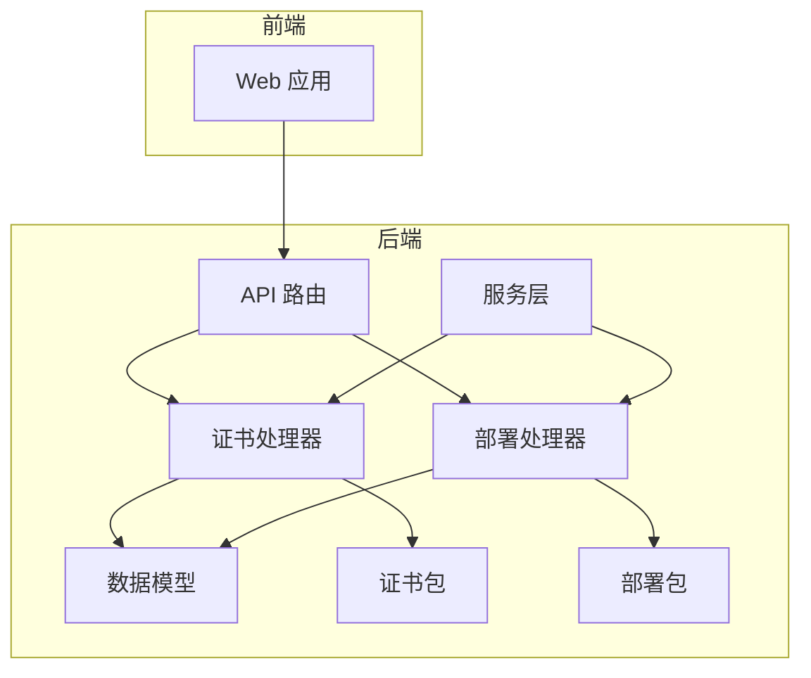
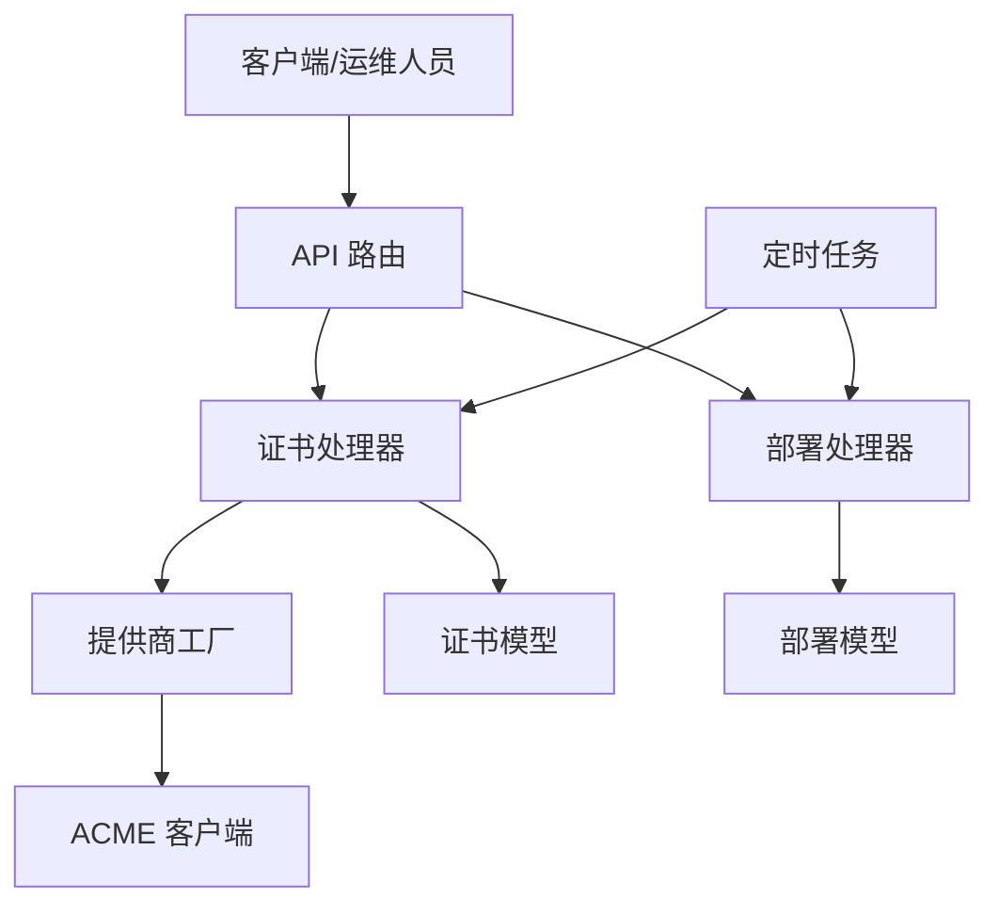
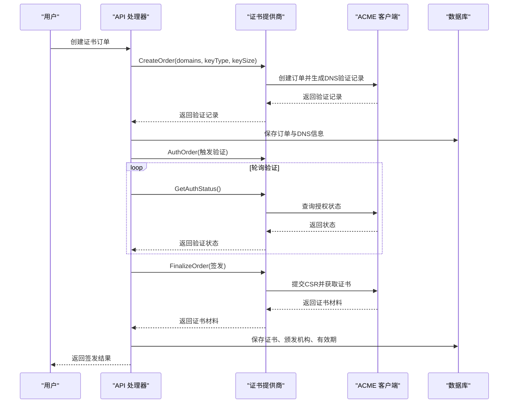
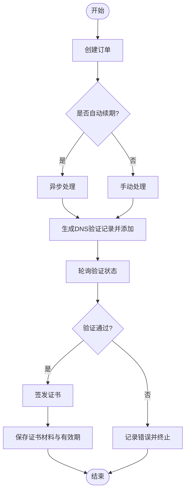
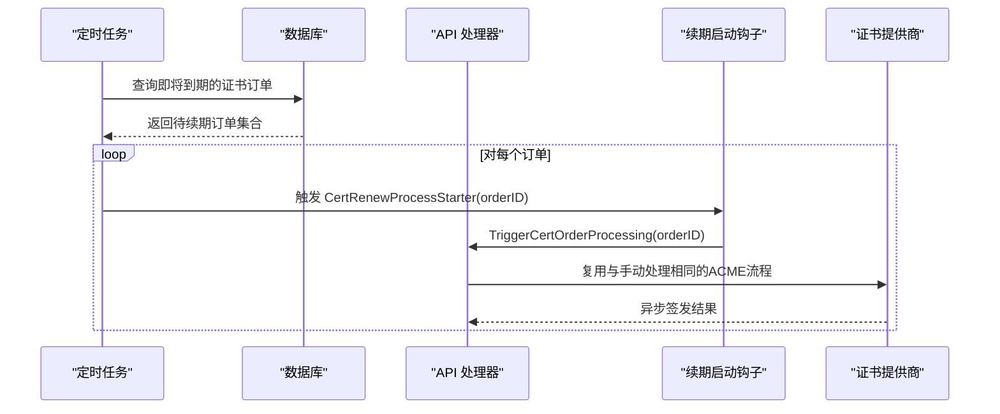
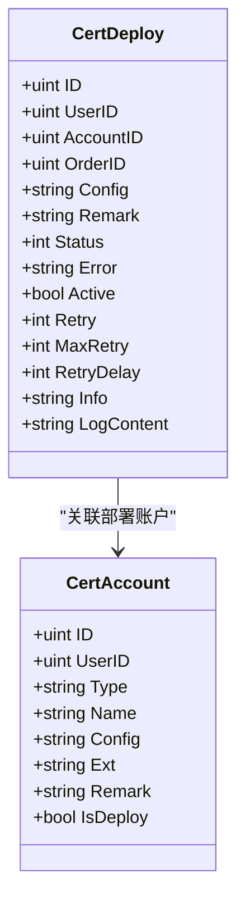
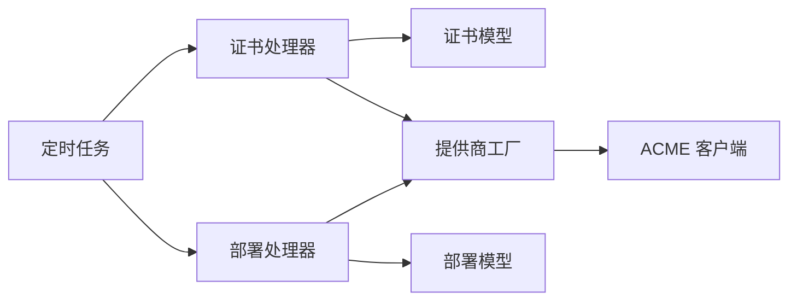

# 证书生命周期管理

<cite>
**本文档引用的文件**
- [cert.go](file://main/internal/api/handler/cert.go)
- [cert_deploy.go](file://main/internal/api/handler/cert_deploy.go)
- [acme.go](file://main/internal/cert/acme/acme.go)
- [interface.go](file://main/internal/cert/interface.go)
- [providers.go](file://main/internal/cert/providers.go)
- [registry.go](file://main/internal/cert/registry.go)
- [models.go](file://main/internal/models/models.go)
- [router.go](file://main/internal/api/router.go)
- [cert_renew_hook.go](file://main/internal/service/cert_renew_hook.go)
- [task_runner.go](file://main/internal/service/task_runner.go)
- [expire_notice.go](file://main/internal/service/expire_notice.go)
</cite>

## 目录
1. [引言](#引言)
2. [项目结构](#项目结构)
3. [核心组件](#核心组件)
4. [架构总览](#架构总览)
5. [详细组件分析](#详细组件分析)
6. [依赖关系分析](#依赖关系分析)
7. [性能考虑](#性能考虑)
8. [故障排查指南](#故障排查指南)
9. [结论](#结论)
10. [附录](#附录)

## 引言
本技术文档围绕证书生命周期管理展开，覆盖从申请、验证、签发、部署、监控到续期的全链路流程。系统基于 ACME 协议对接多家证书颁发机构（CA），并通过统一的证书提供商接口抽象，实现多 CA 的兼容与扩展。同时，系统内置自动续期机制、到期提醒与健康检查能力，并提供部署任务的统一调度与日志追踪。

## 项目结构
系统采用分层架构，前端通过 Web 应用访问，后端 API 负责业务编排，核心逻辑集中在证书申请与部署模块，配合定时任务服务实现自动续期与监控。

图表来源
- [router.go:14-165](file://main/internal/api/router.go#L14-L165)
- [cert.go:1-120](file://main/internal/api/handler/cert.go#L1-L120)
- [cert_deploy.go:1-60](file://main/internal/api/handler/cert_deploy.go#L1-L60)
- [models.go:204-266](file://main/internal/models/models.go#L204-L266)

章节来源
- [router.go:14-165](file://main/internal/api/router.go#L14-L165)

## 核心组件
- 证书提供商接口与工厂：通过统一接口抽象不同 CA 的差异，工厂负责注册与实例化。
- ACME 客户端：实现 Let's Encrypt、ZeroSSL、Google、LiteSSL 等 CA 的 ACME 流程。
- 证书订单与域名模型：持久化证书申请状态、日志、证书材料与到期时间。
- 部署任务模型与处理器：封装部署目标（CDN、面板、服务器等）的部署流程与状态管理。
- 服务层：定时任务驱动自动续期、到期提醒与健康检查。

章节来源
- [interface.go:49-77](file://main/internal/cert/interface.go#L49-L77)
- [registry.go:22-50](file://main/internal/cert/registry.go#L22-L50)
- [acme.go:36-67](file://main/internal/cert/acme/acme.go#L36-L67)
- [models.go:204-266](file://main/internal/models/models.go#L204-L266)
- [cert_deploy.go:496-580](file://main/internal/api/handler/cert_deploy.go#L496-L580)

## 架构总览
系统通过 API 层编排证书申请与部署，底层依赖证书提供商与部署提供商，结合数据库持久化与服务层定时任务，形成闭环的证书生命周期管理体系。

图表来源
- [router.go:87-106](file://main/internal/api/router.go#L87-L106)
- [cert.go:155-223](file://main/internal/api/handler/cert.go#L155-L223)
- [cert_deploy.go:717-750](file://main/internal/api/handler/cert_deploy.go#L717-L750)
- [acme.go:512-638](file://main/internal/cert/acme/acme.go#L512-L638)
- [registry.go:30-42](file://main/internal/cert/registry.go#L30-L42)
- [task_runner.go:183-249](file://main/internal/service/task_runner.go#L183-L249)

## 详细组件分析

### 证书申请与签发流程
- 订单创建：提交域名、密钥类型/长度与自动续期开关，若开启自动续期则立即进入异步处理。
- 订单处理：创建 ACME 订单，生成 DNS 验证记录，自动添加 TXT 记录并轮询验证状态。
- 签发证书：验证通过后发起 finalize，获取证书材料并持久化。
- 状态管理：订单状态涵盖 pending、validating、validated、issued、revoked 以及各类错误码。

图表来源
- [cert.go:155-223](file://main/internal/api/handler/cert.go#L155-L223)
- [cert.go:389-518](file://main/internal/api/handler/cert.go#L389-L518)
- [acme.go:512-638](file://main/internal/cert/acme/acme.go#L512-L638)
- [acme.go:658-733](file://main/internal/cert/acme/acme.go#L658-L733)
- [acme.go:735-800](file://main/internal/cert/acme/acme.go#L735-L800)

章节来源
- [cert.go:155-223](file://main/internal/api/handler/cert.go#L155-L223)
- [cert.go:389-518](file://main/internal/api/handler/cert.go#L389-L518)
- [acme.go:512-800](file://main/internal/cert/acme/acme.go#L512-L800)

### 证书状态管理与跟踪
- 订单状态枚举：pending、validating、validated、issued、revoked，以及多种错误状态码。
- 日志与信息：订单日志、DNS 验证信息、详细处理过程均持久化，便于追踪。
- 错误处理：在每个关键步骤捕获错误并更新状态与错误信息，保证可观测性。

图表来源
- [cert.go:389-518](file://main/internal/api/handler/cert.go#L389-L518)
- [models.go:204-231](file://main/internal/models/models.go#L204-L231)

章节来源
- [models.go:204-231](file://main/internal/models/models.go#L204-L231)
- [cert.go:369-387](file://main/internal/api/handler/cert.go#L369-L387)

### 自动续期机制
- 触发条件：定时任务扫描即将到期（默认阈值）的证书订单，满足条件则触发续期。
- 执行流程：通过注入的启动函数将“待续期”订单交给与手动处理相同的 ACME 异步流程。
- 重试与通知：连续失败达到阈值后进行冷却与通知，避免频繁重试。

图表来源
- [task_runner.go:183-249](file://main/internal/service/task_runner.go#L183-L249)
- [cert_renew_hook.go:3-12](file://main/internal/service/cert_renew_hook.go#L3-L12)
- [cert.go:306-367](file://main/internal/api/handler/cert.go#L306-L367)

章节来源
- [task_runner.go:183-249](file://main/internal/service/task_runner.go#L183-L249)
- [cert_renew_hook.go:3-12](file://main/internal/service/cert_renew_hook.go#L3-L12)
- [cert.go:306-367](file://main/internal/api/handler/cert.go#L306-L367)

### 证书部署与多提供商支持
- 部署任务：关联证书订单与部署账户，支持 CDN、面板、服务器等多种目标。
- 多提供商：统一的部署配置结构，支持 SSH、CDN、容器平台、云厂商等多种部署方式。
- 连通性检测：提供异步连通性检测接口，快速验证部署账户有效性。

图表来源
- [models.go:241-266](file://main/internal/models/models.go#L241-L266)
- [cert_deploy.go:496-580](file://main/internal/api/handler/cert_deploy.go#L496-L580)

章节来源
- [cert_deploy.go:268-323](file://main/internal/api/handler/cert_deploy.go#L268-L323)
- [cert_deploy.go:496-580](file://main/internal/api/handler/cert_deploy.go#L496-L580)
- [providers.go:114-666](file://main/internal/cert/providers.go#L114-L666)

### 证书监控与告警
- 到期提醒：系统支持域名 WHOIS 信息查询与到期时间更新，结合服务层通知机制进行提醒。
- 健康检查：部署任务具备状态与日志字段，便于监控部署健康状况。
- 通知策略：自动续期失败与部署失败可配置通知渠道，降低风险影响。

章节来源
- [expire_notice.go:12-41](file://main/internal/service/expire_notice.go#L12-L41)
- [models.go:241-266](file://main/internal/models/models.go#L241-L266)

## 依赖关系分析
- 处理器依赖模型与提供商工厂，模型承载状态与持久化，工厂负责 CA/部署提供商实例化。
- ACME 客户端依赖提供商接口，实现具体 CA 的 ACME 行为。
- 服务层依赖处理器与模型，驱动定时任务与通知。

图表来源
- [cert.go:155-223](file://main/internal/api/handler/cert.go#L155-L223)
- [cert_deploy.go:717-750](file://main/internal/api/handler/cert_deploy.go#L717-L750)
- [registry.go:30-42](file://main/internal/cert/registry.go#L30-L42)
- [acme.go:512-638](file://main/internal/cert/acme/acme.go#L512-L638)
- [task_runner.go:183-249](file://main/internal/service/task_runner.go#L183-L249)

章节来源
- [registry.go:22-50](file://main/internal/cert/registry.go#L22-L50)
- [providers.go:3-666](file://main/internal/cert/providers.go#L3-L666)

## 性能考虑
- 异步处理：证书申请与部署均采用异步流程，避免阻塞请求线程。
- N+1 查询优化：批量加载部署任务关联域名，减少数据库查询次数。
- 轮询节流：验证轮询设置合理间隔与最大尝试次数，避免过度请求。
- 日志落盘：订单日志与部署日志分批持久化，兼顾可观测性与性能。

章节来源
- [cert.go:389-518](file://main/internal/api/handler/cert.go#L389-L518)
- [cert_deploy.go:384-400](file://main/internal/api/handler/cert_deploy.go#L384-L400)

## 故障排查指南
- 申请失败：检查订单错误字段与日志，确认 DNS 记录是否正确添加、验证是否超时。
- 签发失败：查看 finalize 响应与订单状态，确认 CSR 与密钥类型配置。
- 部署失败：检查部署任务状态、错误信息与日志内容，确认目标账户配置与权限。
- 自动续期失败：查看定时任务日志与通知，确认续期启动钩子是否注册、账户密钥是否有效。
- 到期提醒异常：确认 WHOIS 查询是否成功、域名到期时间是否更新。

章节来源
- [cert.go:270-287](file://main/internal/api/handler/cert.go#L270-L287)
- [cert.go:476-482](file://main/internal/api/handler/cert.go#L476-L482)
- [cert_deploy.go:717-750](file://main/internal/api/handler/cert_deploy.go#L717-L750)
- [task_runner.go:208-213](file://main/internal/service/task_runner.go#L208-L213)

## 结论
本系统通过统一的证书提供商接口与部署提供商接口，实现了多 CA 与多部署目标的兼容与扩展；借助异步处理与定时任务，提供了可靠的证书申请、验证、签发、部署、监控与自动续期能力。完善的日志与错误处理机制保障了可观测性与可维护性。

## 附录

### 证书状态定义
- 0: pending（待处理）
- 1: validating（验证中）
- 2: validated（验证通过）
- 3: issued（已签发）
- 4: revoked（已吊销）
- -1~-7: 各类错误状态码（如创建订单失败、验证超时、签发失败等）

章节来源
- [models.go:214-214](file://main/internal/models/models.go#L214-L214)

### API 路由概览（证书相关）
- 证书账户：GET/POST/PUT/DELETE /api/cert/accounts
- 证书订单：GET/POST/POST:/id/process/DELETE/GET:/id/log/GET:/id/detail/GET:/id/download/POST:/id/auto
- 证书部署：GET/POST/PUT/DELETE/POST:/id/process

章节来源
- [router.go:87-106](file://main/internal/api/router.go#L87-L106)