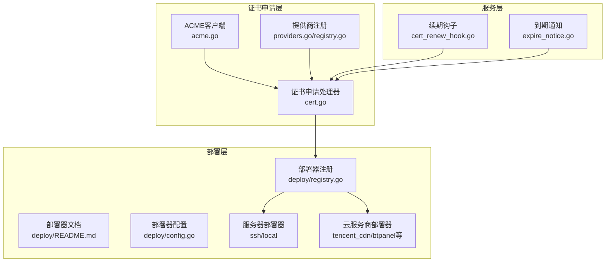
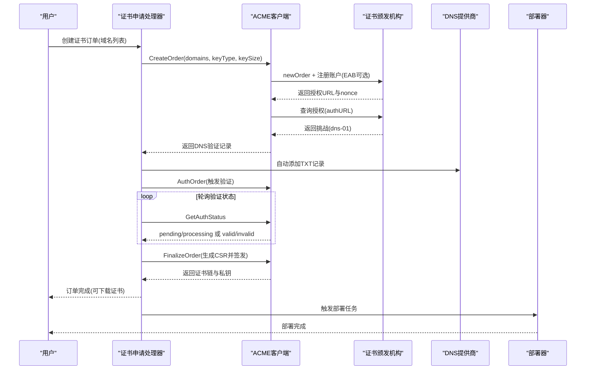
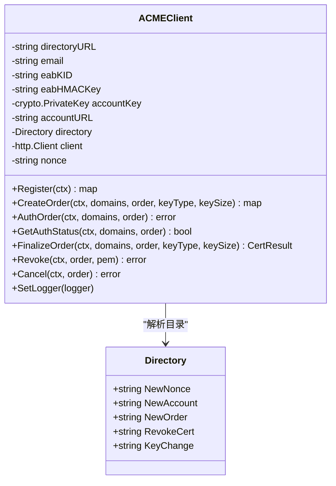
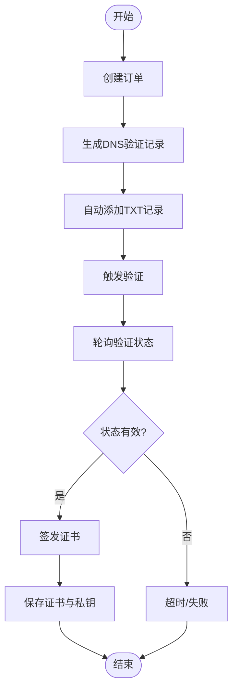
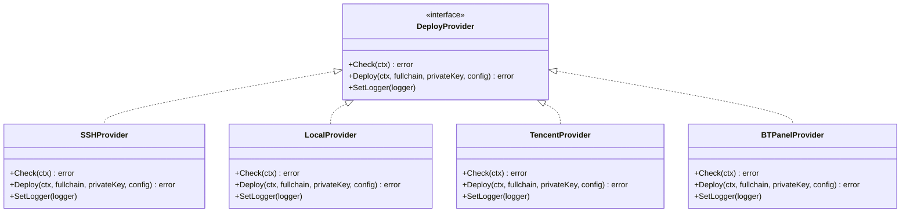
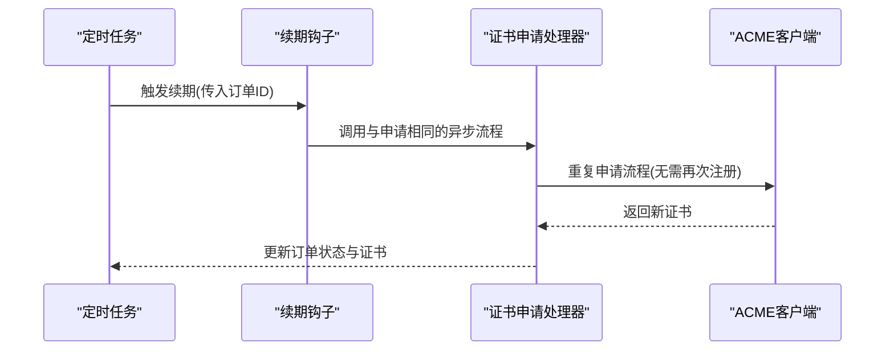
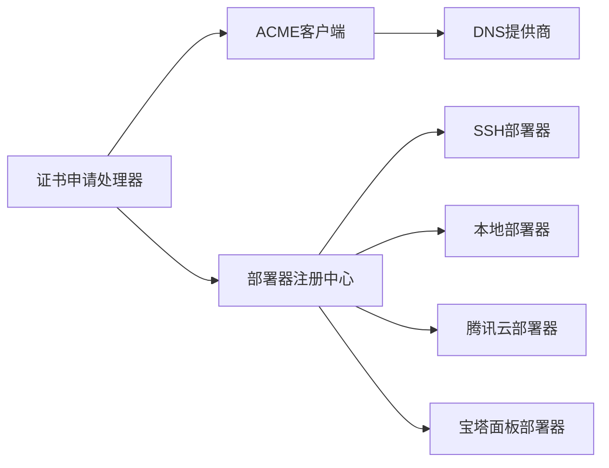

# 证书管理功能

<cite>
**本文档引用的文件**
- [acme.go](file://main/internal/cert/acme/acme.go)
- [interface.go](file://main/internal/cert/interface.go)
- [providers.go](file://main/internal/cert/providers.go)
- [registry.go](file://main/internal/cert/registry.go)
- [cert.go](file://main/internal/api/handler/cert.go)
- [cert_deploy.go](file://main/internal/api/handler/cert_deploy.go)
- [README.md](file://main/internal/cert/deploy/README.md)
- [config.go](file://main/internal/cert/deploy/config.go)
- [registry.go](file://main/internal/cert/deploy/registry.go)
- [ssh.go](file://main/internal/cert/deploy/servers/ssh.go)
- [local.go](file://main/internal/cert/deploy/servers/local.go)
- [tencent_cdn.go](file://main/internal/cert/deploy/providers/tencent_cdn.go)
- [btpanel.go](file://main/internal/cert/deploy/panels/btpanel.go)
- [cert_renew_hook.go](file://main/internal/service/cert_renew_hook.go)
- [expire_notice.go](file://main/internal/service/expire_notice.go)
</cite>

## 目录
1. [简介](#简介)
2. [项目结构](#项目结构)
3. [核心组件](#核心组件)
4. [架构总览](#架构总览)
5. [详细组件分析](#详细组件分析)
6. [依赖关系分析](#依赖关系分析)
7. [性能考虑](#性能考虑)
8. [故障排查指南](#故障排查指南)
9. [结论](#结论)
10. [附录](#附录)

## 简介
本文件面向DNSPlane项目的证书管理功能，系统化阐述ACME协议实现、Let's Encrypt与ZeroSSL等证书颁发机构的集成方式、证书申请与部署流程、续期机制与自动更新策略、账户与私钥管理、安全存储方案、监控与告警，以及各类部署器的配置与使用方法。文档旨在帮助开发者与运维人员快速理解并高效使用证书管理能力。

## 项目结构
证书管理功能主要分布在以下模块：
- ACME客户端与提供商注册：main/internal/cert/acme、main/internal/cert/providers.go、main/internal/cert/registry.go
- 证书申请与订单处理：main/internal/api/handler/cert.go
- 证书部署与部署器生态：main/internal/cert/deploy/README.md、main/internal/cert/deploy/config.go、main/internal/cert/deploy/registry.go、main/internal/cert/deploy/servers、main/internal/cert/deploy/providers、main/internal/cert/deploy/panels
- 自动续期与到期通知：main/internal/service/cert_renew_hook.go、main/internal/service/expire_notice.go

**图表来源**
- [acme.go:1-880](file://main/internal/cert/acme/acme.go#L1-L880)
- [providers.go:1-666](file://main/internal/cert/providers.go#L1-L666)
- [registry.go:1-108](file://main/internal/cert/registry.go#L1-L108)
- [cert.go:1-935](file://main/internal/api/handler/cert.go#L1-L935)
- [README.md:1-123](file://main/internal/cert/deploy/README.md#L1-L123)
- [config.go:1-50](file://main/internal/cert/deploy/config.go#L1-L50)
- [registry.go:1-72](file://main/internal/cert/deploy/registry.go#L1-L72)
- [ssh.go:1-179](file://main/internal/cert/deploy/servers/ssh.go#L1-L179)
- [local.go:1-119](file://main/internal/cert/deploy/servers/local.go#L1-L119)
- [tencent_cdn.go:1-487](file://main/internal/cert/deploy/providers/tencent_cdn.go#L1-L487)
- [btpanel.go:1-312](file://main/internal/cert/deploy/panels/btpanel.go#L1-L312)
- [cert_renew_hook.go:1-13](file://main/internal/service/cert_renew_hook.go#L1-L13)
- [expire_notice.go:1-42](file://main/internal/service/expire_notice.go#L1-L42)

**章节来源**
- [acme.go:1-880](file://main/internal/cert/acme/acme.go#L1-L880)
- [providers.go:1-666](file://main/internal/cert/providers.go#L1-L666)
- [registry.go:1-108](file://main/internal/cert/registry.go#L1-L108)
- [cert.go:1-935](file://main/internal/api/handler/cert.go#L1-L935)
- [README.md:1-123](file://main/internal/cert/deploy/README.md#L1-L123)
- [config.go:1-50](file://main/internal/cert/deploy/config.go#L1-L50)
- [registry.go:1-72](file://main/internal/cert/deploy/registry.go#L1-L72)
- [ssh.go:1-179](file://main/internal/cert/deploy/servers/ssh.go#L1-L179)
- [local.go:1-119](file://main/internal/cert/deploy/servers/local.go#L1-L119)
- [tencent_cdn.go:1-487](file://main/internal/cert/deploy/providers/tencent_cdn.go#L1-L487)
- [btpanel.go:1-312](file://main/internal/cert/deploy/panels/btpanel.go#L1-L312)
- [cert_renew_hook.go:1-13](file://main/internal/service/cert_renew_hook.go#L1-L13)
- [expire_notice.go:1-42](file://main/internal/service/expire_notice.go#L1-L42)

## 核心组件
- ACME客户端：封装Let's Encrypt、ZeroSSL、Google、LiteSSL及自定义ACME提供商的账户注册、订单创建、挑战验证、证书签发与吊销等流程。
- 提供商注册中心：集中注册与检索证书提供商与部署提供商配置，支持动态扩展。
- 证书申请处理器：负责接收前端请求、创建订单、异步执行ACME流程、持久化日志与状态。
- 部署器生态：覆盖SSH远程部署、本地文件部署、CDN与云服务商部署、面板类部署等，支持配置化与任务化执行。
- 自动续期与到期通知：基于后台任务触发续期流程，结合WHOIS查询更新域名到期信息。

**章节来源**
- [interface.go:1-114](file://main/internal/cert/interface.go#L1-L114)
- [registry.go:1-108](file://main/internal/cert/registry.go#L1-L108)
- [cert.go:1-935](file://main/internal/api/handler/cert.go#L1-L935)
- [README.md:1-123](file://main/internal/cert/deploy/README.md#L1-L123)

## 架构总览
证书管理采用“申请-验证-签发-部署”的流水线架构，申请阶段通过ACME协议与CA交互，验证阶段通过DNS TXT记录完成域名所有权校验，签发阶段获取证书链与私钥，部署阶段将证书推送到目标系统（服务器、CDN、面板等）。

**图表来源**
- [cert.go:389-518](file://main/internal/api/handler/cert.go#L389-L518)
- [acme.go:512-800](file://main/internal/cert/acme/acme.go#L512-L800)
- [tencent_cdn.go:87-207](file://main/internal/cert/deploy/providers/tencent_cdn.go#L87-L207)

**章节来源**
- [cert.go:389-518](file://main/internal/api/handler/cert.go#L389-L518)
- [acme.go:512-800](file://main/internal/cert/acme/acme.go#L512-L800)

## 详细组件分析

### ACME协议实现与CA集成
- 支持的CA：Let's Encrypt、ZeroSSL、Google PKI、LiteSSL、自定义ACME。
- 关键流程：
  - 账户注册：生成账户私钥（EC/RSA），必要时携带EAB（External Account Binding）。
  - 订单创建：构造identifiers，获取授权URL列表与finalize URL。
  - 挑战验证：生成dns-01 TXT记录，写入DNS并触发验证。
  - 证书签发：生成CSR，提交finalize，轮询订单状态直至签发完成。
- 安全与兼容：
  - 支持ES256/RS256签名算法，自动识别账户私钥类型。
  - 使用Replay-Nonce进行防重放，缓存nonce提升效率。
  - 支持EAB（ZeroSSL/自定义ACME），增强账户绑定安全性。

**图表来源**
- [acme.go:69-88](file://main/internal/cert/acme/acme.go#L69-L88)
- [acme.go:422-474](file://main/internal/cert/acme/acme.go#L422-L474)
- [acme.go:512-638](file://main/internal/cert/acme/acme.go#L512-L638)
- [acme.go:658-733](file://main/internal/cert/acme/acme.go#L658-L733)
- [acme.go:735-800](file://main/internal/cert/acme/acme.go#L735-L800)

**章节来源**
- [acme.go:27-67](file://main/internal/cert/acme/acme.go#L27-L67)
- [acme.go:90-206](file://main/internal/cert/acme/acme.go#L90-L206)
- [acme.go:422-511](file://main/internal/cert/acme/acme.go#L422-L511)
- [acme.go:512-638](file://main/internal/cert/acme/acme.go#L512-L638)
- [acme.go:658-733](file://main/internal/cert/acme/acme.go#L658-L733)
- [acme.go:735-800](file://main/internal/cert/acme/acme.go#L735-L800)

### 证书申请流程（含DNS验证）
- 订单创建：根据域名生成identifiers，获取authorizations与finalize URL。
- DNS验证：为每个授权生成_dots拼接的TXT记录值，自动添加到托管域名对应的DNS账户。
- 验证轮询：最多10次，每次间隔10秒，直到状态变为valid或超时。
- 证书签发：提交CSR，等待证书URL可用并下载证书链与私钥。

**图表来源**
- [cert.go:389-518](file://main/internal/api/handler/cert.go#L389-L518)
- [cert.go:520-597](file://main/internal/api/handler/cert.go#L520-L597)

**章节来源**
- [cert.go:389-518](file://main/internal/api/handler/cert.go#L389-L518)
- [cert.go:520-597](file://main/internal/api/handler/cert.go#L520-L597)

### 证书部署方式实现
- SSH远程部署：通过SSH连接目标服务器，使用scp上传证书与私钥，支持上传前后命令执行与{domain}占位符替换。
- 本地文件部署：直接写入本地文件系统，支持重启命令执行。
- CDN与云服务商部署：如腾讯云CDN/WAF/CLB/COS/TKE/SCF等，统一上传证书后通过SSL服务部署到目标资源。
- 面板类部署：如宝塔面板、1Panel、Kangle、MW面板等，调用其API完成站点或面板证书更新。

**图表来源**
- [ssh.go:21-135](file://main/internal/cert/deploy/servers/ssh.go#L21-L135)
- [local.go:19-110](file://main/internal/cert/deploy/servers/local.go#L19-L110)
- [tencent_cdn.go:48-111](file://main/internal/cert/deploy/providers/tencent_cdn.go#L48-L111)
- [btpanel.go:23-176](file://main/internal/cert/deploy/panels/btpanel.go#L23-L176)

**章节来源**
- [ssh.go:82-135](file://main/internal/cert/deploy/servers/ssh.go#L82-L135)
- [local.go:53-110](file://main/internal/cert/deploy/servers/local.go#L53-L110)
- [tencent_cdn.go:87-207](file://main/internal/cert/deploy/providers/tencent_cdn.go#L87-L207)
- [btpanel.go:117-176](file://main/internal/cert/deploy/panels/btpanel.go#L117-L176)

### 证书续期机制与自动更新策略
- 续期触发：通过后台任务注入的启动器将“待续期”订单交由与申请相同的异步流程处理。
- 自动化：订单创建时可选择自动续期，系统在到期前自动发起续期流程。
- 配置入口：续期钩子在service包中暴露，由主程序注入实际的处理函数。

**图表来源**
- [cert_renew_hook.go:1-13](file://main/internal/service/cert_renew_hook.go#L1-L13)
- [cert.go:306-367](file://main/internal/api/handler/cert.go#L306-L367)

**章节来源**
- [cert_renew_hook.go:1-13](file://main/internal/service/cert_renew_hook.go#L1-L13)
- [cert.go:306-367](file://main/internal/api/handler/cert.go#L306-L367)

### 证书账户管理、私钥保护与安全存储
- 账户注册：首次使用时生成账户私钥并返回PEM格式，同时保存账户URL与密钥。
- EAB支持：ZeroSSL/LiteSSL等需要外部账户绑定，通过kid与hmac key进行认证。
- 私钥保护：账户私钥以PEM形式返回并保存在账户扩展信息中，建议配合系统密钥管理与最小权限原则使用。
- 安全建议：部署账户配置应加密存储，传输使用HTTPS，定期轮换密钥与API凭据。

**章节来源**
- [acme.go:422-474](file://main/internal/cert/acme/acme.go#L422-L474)
- [acme.go:476-500](file://main/internal/cert/acme/acme.go#L476-L500)
- [providers.go:47-57](file://main/internal/cert/providers.go#L47-L57)

### 证书监控与告警
- 订单日志：申请与部署全流程记录详细日志，便于问题追踪与审计。
- 连通性检测：部署账户支持异步连通性检测，立即返回提交成功，后台输出检测结果。
- 到期通知：通过WHOIS查询域名到期时间，定期更新数据库，便于业务侧做续费提醒。

**章节来源**
- [cert.go:369-376](file://main/internal/api/handler/cert.go#L369-L376)
- [cert_deploy.go:310-323](file://main/internal/api/handler/cert_deploy.go#L310-L323)
- [expire_notice.go:17-42](file://main/internal/service/expire_notice.go#L17-L42)

### 不同部署器的配置与使用方法
- SSH部署：配置主机、端口、认证方式（密码/私钥）、证书与私钥保存路径、上传前后命令、域名占位符等。
- 本地部署：配置证书与私钥路径、重启命令、域名占位符等。
- 腾讯云CDN/WAF/CLB/COS/TKE/SCF等：配置SecretId/SecretKey、地域、实例ID/域名列表等，支持多域名批量部署。
- 面板类部署：如宝塔面板，配置面板地址与API密钥，选择部署类型（站点/面板/邮局/Docker等）与站点名称列表。

**章节来源**
- [ssh.go:17-135](file://main/internal/cert/deploy/servers/ssh.go#L17-L135)
- [local.go:15-110](file://main/internal/cert/deploy/servers/local.go#L15-L110)
- [tencent_cdn.go:34-207](file://main/internal/cert/deploy/providers/tencent_cdn.go#L34-L207)
- [btpanel.go:19-176](file://main/internal/cert/deploy/panels/btpanel.go#L19-L176)
- [README.md:1-123](file://main/internal/cert/deploy/README.md#L1-L123)

## 依赖关系分析
- 组件耦合：
  - 申请层与部署层通过订单模型解耦，订单完成后触发部署任务。
  - 提供商注册中心统一管理证书与部署提供商配置，避免硬编码。
- 外部依赖：
  - ACME协议依赖HTTP客户端与JWK签名，DNS验证依赖DNS提供商API。
  - 云服务商部署依赖官方SDK或自定义签名API调用。

**图表来源**
- [cert.go:389-518](file://main/internal/api/handler/cert.go#L389-L518)
- [registry.go:30-42](file://main/internal/cert/registry.go#L30-L42)
- [ssh.go:21-135](file://main/internal/cert/deploy/servers/ssh.go#L21-L135)
- [local.go:19-110](file://main/internal/cert/deploy/servers/local.go#L19-L110)
- [tencent_cdn.go:48-111](file://main/internal/cert/deploy/providers/tencent_cdn.go#L48-L111)
- [btpanel.go:23-176](file://main/internal/cert/deploy/panels/btpanel.go#L23-L176)

**章节来源**
- [registry.go:1-108](file://main/internal/cert/registry.go#L1-L108)
- [cert.go:389-518](file://main/internal/api/handler/cert.go#L389-L518)

## 性能考虑
- 并发与异步：证书申请与部署均采用异步处理，避免阻塞主线程。
- 轮询策略：验证轮询最大次数与间隔可调，平衡成功率与等待时间。
- DNS写入：自动添加TXT记录时按主域名聚合，减少重复操作。
- 部署幂等：部署器支持重试与锁机制，避免并发冲突。

[本节为通用指导，无需特定文件引用]

## 故障排查指南
- ACME错误：查看HTTP状态码与响应体，关注nonce失效、账户未注册、EAB参数错误等问题。
- DNS验证失败：确认TXT记录已生效、解析延迟、通配符与根域名区分、授权状态轮询。
- 部署失败：检查部署账户凭据、目标路径权限、命令执行权限、云服务商API返回错误。
- 续期异常：确认续期钩子已注入、订单状态正常、证书链完整性。

**章节来源**
- [acme.go:362-368](file://main/internal/cert/acme/acme.go#L362-L368)
- [cert.go:462-486](file://main/internal/api/handler/cert.go#L462-L486)
- [cert_deploy.go:751-755](file://main/internal/api/handler/cert_deploy.go#L751-L755)

## 结论
该证书管理功能以ACME为核心，结合丰富的部署器生态与自动化流程，实现了从域名验证、证书签发到多场景部署的全链路能力。通过模块化的提供商注册与任务化部署，系统具备良好的扩展性与可维护性。建议在生产环境中强化密钥与凭据管理、完善监控与告警体系，并根据业务需求选择合适的部署器与续期策略。

[本节为总结性内容，无需特定文件引用]

## 附录

### 关键接口与数据结构
- 订单信息：包含订单URL、finalize URL、证书URL、授权列表、状态、标识符、挑战映射等。
- 挑战与DNS记录：dns-01挑战的token与TXT记录值计算规则。
- 证书结果：包含完整证书链、私钥、颁发机构、有效期起止时间等。

**章节来源**
- [interface.go:5-44](file://main/internal/cert/interface.go#L5-L44)

### 部署器配置字段参考
- SSH部署：主机、端口、认证方式、证书/私钥路径、上传前后命令、域名占位符。
- 本地部署：证书/私钥路径、重启命令、域名占位符。
- 腾讯云CDN/WAF/CLB/COS/TKE/SCF：SecretId/SecretKey、地域、实例ID/域名列表等。
- 面板类部署：面板地址与密钥、部署类型与站点名称列表等。

**章节来源**
- [ssh.go:150-179](file://main/internal/cert/deploy/servers/ssh.go#L150-L179)
- [local.go:53-110](file://main/internal/cert/deploy/servers/local.go#L53-L110)
- [tencent_cdn.go:209-267](file://main/internal/cert/deploy/providers/tencent_cdn.go#L209-L267)
- [btpanel.go:117-176](file://main/internal/cert/deploy/panels/btpanel.go#L117-L176)
- [README.md:1-123](file://main/internal/cert/deploy/README.md#L1-L123)