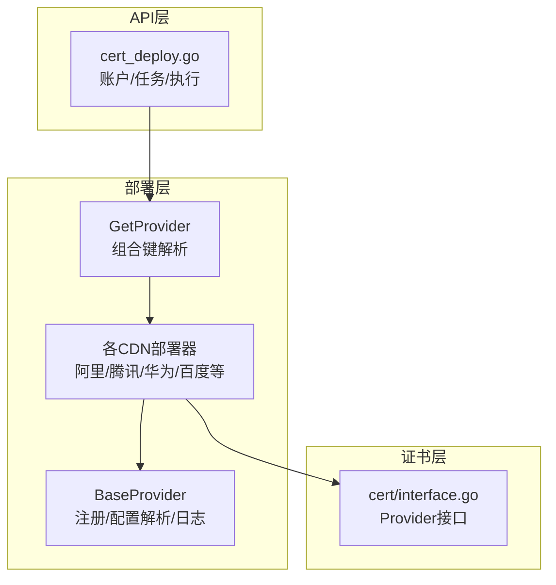
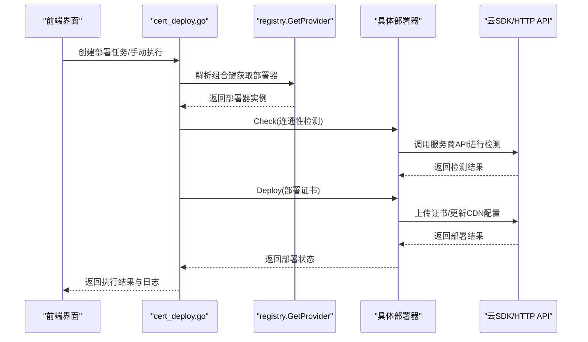
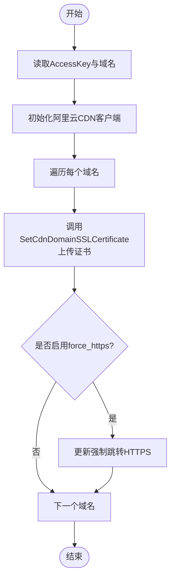
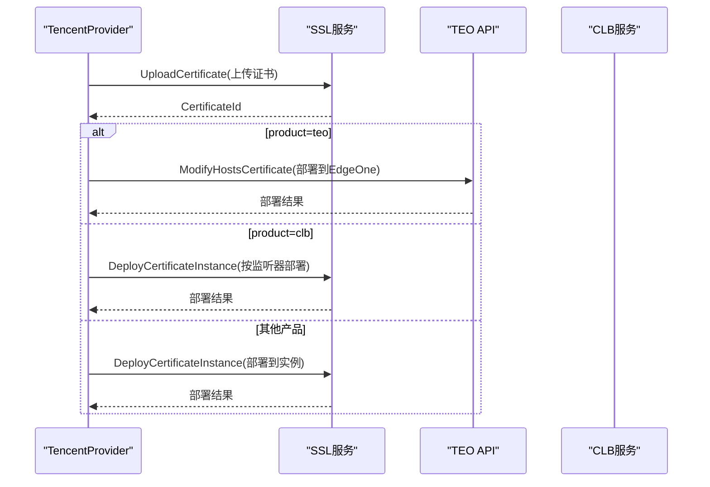
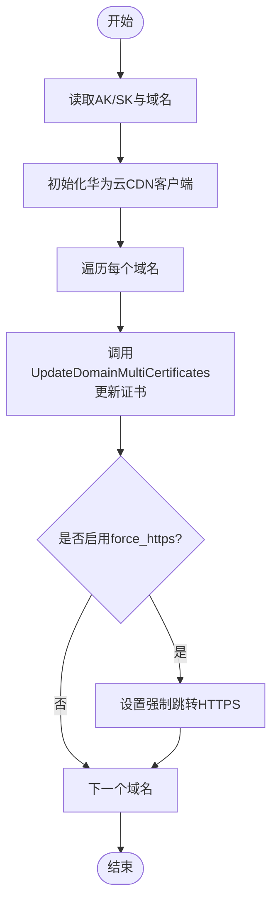
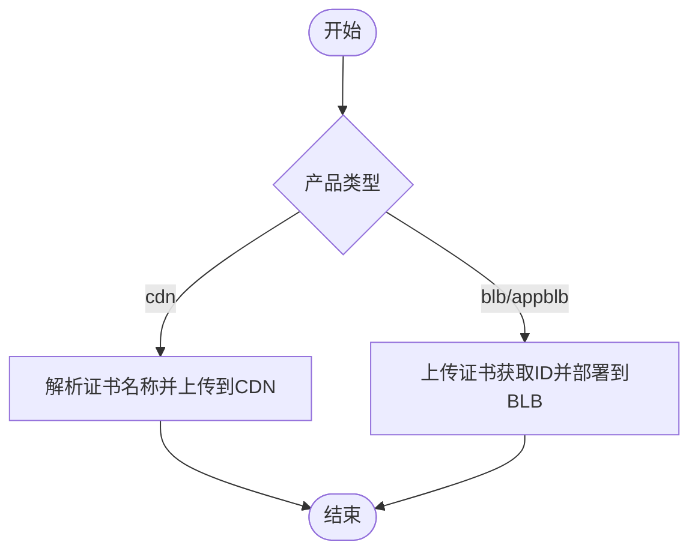
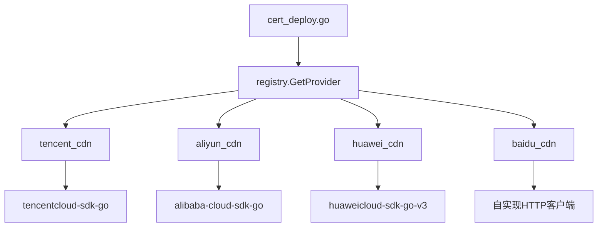

# CDN证书部署

<cite>
**本文档引用的文件**
- [aliyun_cdn.go](file://main/internal/cert/deploy/providers/aliyun_cdn.go)
- [tencent_cdn.go](file://main/internal/cert/deploy/providers/tencent_cdn.go)
- [huawei_cdn.go](file://main/internal/cert/deploy/providers/huawei_cdn.go)
- [baidu_cdn.go](file://main/internal/cert/deploy/providers/baidu_cdn.go)
- [base.go](file://main/internal/cert/deploy/base/base.go)
- [config.go](file://main/internal/cert/deploy/config.go)
- [config_cloud.go](file://main/internal/cert/deploy/config_cloud.go)
- [registry.go](file://main/internal/cert/deploy/registry.go)
- [cert_deploy.go](file://main/internal/api/handler/cert_deploy.go)
- [interface.go](file://main/internal/cert/interface.go)
- [README.md](file://main/internal/cert/deploy/README.md)
</cite>

## 目录
1. [简介](#简介)
2. [项目结构](#项目结构)
3. [核心组件](#核心组件)
4. [架构总览](#架构总览)
5. [详细组件分析](#详细组件分析)
6. [依赖关系分析](#依赖关系分析)
7. [性能考虑](#性能考虑)
8. [故障排除指南](#故障排除指南)
9. [结论](#结论)
10. [附录](#附录)

## 简介
本文件面向CDN证书部署的技术文档，聚焦于系统如何将签发的SSL/TLS证书部署到多家CDN与云服务商（如阿里云CDN、腾讯云CDN、华为云CDN、百度云CDN等）。文档涵盖部署器架构、工作流程、配置参数与认证方式、同步机制与缓存更新策略、监控与故障排除等内容，并提供各服务商的部署配置示例与最佳实践。

## 项目结构
CDN证书部署能力位于证书模块的部署子系统中，采用“接口 + 工厂 + 注册中心”的设计模式，支持多云厂商与自建系统两类部署器。核心目录与职责如下：
- deploy/base：基础接口与通用工具（注册、配置解析、日志等）
- deploy/providers：各云厂商CDN部署器实现
- deploy/config.go 与 deploy/config_cloud.go：部署器配置注册与UI输入项定义
- deploy/registry.go：部署器实例获取与组合键解析（如 tencent + product=cdn → tencent_cdn）
- api/handler/cert_deploy.go：前端交互与任务编排（账户、任务、手动执行等）
- cert/interface.go：证书提供商接口定义（与部署器解耦）



图表来源
- [base.go:43-114](file://main/internal/cert/deploy/base/base.go#L43-L114)
- [registry.go:27-66](file://main/internal/cert/deploy/registry.go#L27-L66)
- [cert_deploy.go:717-800](file://main/internal/api/handler/cert_deploy.go#L717-L800)
- [interface.go:49-77](file://main/internal/cert/interface.go#L49-L77)

章节来源
- [README.md:1-123](file://main/internal/cert/deploy/README.md#L1-L123)

## 核心组件
- DeployProvider 接口：定义 Check 与 Deploy 两个核心方法，分别用于连通性检测与证书部署；支持 SetLogger 设置日志回调。
- BaseProvider：提供配置读取（大小写不敏感 + 下划线/驼峰互转）、域名解析、日志记录等通用能力。
- 注册中心：通过 Register 注册部署器；GetProvider 支持直接键或组合键（如 tencent_cdn）解析。
- 配置系统：DeployProviderConfig 定义部署器类型、名称、图标、分类、输入项与任务输入项，用于UI渲染与表单校验。
- API处理器：负责部署账户的增删改查、连通性检测、部署任务的创建与手动执行。

章节来源
- [base.go:43-114](file://main/internal/cert/deploy/base/base.go#L43-L114)
- [base.go:116-146](file://main/internal/cert/deploy/base/base.go#L116-L146)
- [config.go:19-50](file://main/internal/cert/deploy/config.go#L19-L50)
- [registry.go:27-66](file://main/internal/cert/deploy/registry.go#L27-L66)
- [cert_deploy.go:28-110](file://main/internal/api/handler/cert_deploy.go#L28-L110)

## 架构总览
CDN证书部署的整体流程：
1. 用户在前端创建“部署账户”（选择服务商与产品），保存加密配置。
2. 用户创建“部署任务”，关联证书订单与部署账户，可配置任务级参数（如域名列表、产品子项）。
3. 手动触发或定时调度执行部署任务：
   - 加载账户配置与任务配置，解析组合键（如 tencent + product=cdn → tencent_cdn）。
   - 获取部署器实例，调用 Check 进行连通性检测。
   - 从证书订单读取 fullchain 与 private key，调用 Deploy 将证书上传/部署到目标CDN。
4. 部署器内部根据服务商差异调用SDK或HTTP API，完成证书上传与CDN配置更新。
5. 记录日志与状态，支持重试与审计。



图表来源
- [cert_deploy.go:717-800](file://main/internal/api/handler/cert_deploy.go#L717-L800)
- [registry.go:27-66](file://main/internal/cert/deploy/registry.go#L27-L66)
- [tencent_cdn.go:68-85](file://main/internal/cert/deploy/providers/tencent_cdn.go#L68-L85)
- [aliyun_cdn.go:44-54](file://main/internal/cert/deploy/providers/aliyun_cdn.go#L44-L54)

## 详细组件分析

### 阿里云CDN部署器
- 注册键：aliyun_cdn
- 认证方式：AccessKey ID/Secret
- 域名解析：支持从任务配置的 domainList/domains/domain 或账户配置的 domain 获取
- 部署流程：
  - 初始化阿里云CDN客户端（基于SDK）
  - 逐域调用 SetCdnDomainSSLCertificate 接口上传证书
  - 支持 force_https 开关（强制跳转HTTPS）
- 错误处理：对缺失参数与API错误进行封装返回



图表来源
- [aliyun_cdn.go:56-94](file://main/internal/cert/deploy/providers/aliyun_cdn.go#L56-L94)
- [base.go:224-257](file://main/internal/cert/deploy/base/base.go#L224-L257)

章节来源
- [aliyun_cdn.go:17-99](file://main/internal/cert/deploy/providers/aliyun_cdn.go#L17-L99)
- [config_cloud.go:448-477](file://main/internal/cert/deploy/config_cloud.go#L448-L477)

### 腾讯云CDN部署器
- 注册键：tencent_cdn（同时注册 tencent_teo、tencent_clb、tencent_cos 等）
- 认证方式：SecretId/SecretKey
- 产品选择：通过任务配置 product 决定部署目标（cdn、teo、clb、cos、waf、live、vod、scf、upload 等）
- 部署流程：
  - upload 模式：仅上传证书至SSL证书管理，不部署到实例
  - 通用模式：先上传证书获取 CertificateId，再调用 DeployCertificateInstance 部署到实例
  - TE0（EdgeOne）：通过独立API ModifyHostsCertificate 部署
  - CLB：支持按监听器维度部署
- 签名机制：实现TC3-HMAC-SHA256签名，支持自定义API调用
- 结果查询：提交部署后轮询部署记录，输出成功/失败统计与失败原因



图表来源
- [tencent_cdn.go:114-207](file://main/internal/cert/deploy/providers/tencent_cdn.go#L114-L207)
- [tencent_cdn.go:315-369](file://main/internal/cert/deploy/providers/tencent_cdn.go#L315-L369)
- [tencent_cdn.go:434-482](file://main/internal/cert/deploy/providers/tencent_cdn.go#L434-L482)

章节来源
- [tencent_cdn.go:34-487](file://main/internal/cert/deploy/providers/tencent_cdn.go#L34-L487)
- [config_cloud.go:49-80](file://main/internal/cert/deploy/config_cloud.go#L49-L80)

### 华为云CDN部署器
- 注册键：huawei_cdn
- 认证方式：Access Key/Secret Key
- 部署流程：
  - 初始化华为云CDN客户端（基于SDK）
  - 调用 UpdateDomainMultiCertificates 接口批量更新域名证书
  - 支持 force_redirect_https 强制跳转
- 错误处理：对缺失参数与API错误进行封装返回



图表来源
- [huawei_cdn.go:64-116](file://main/internal/cert/deploy/providers/huawei_cdn.go#L64-L116)

章节来源
- [huawei_cdn.go:17-121](file://main/internal/cert/deploy/providers/huawei_cdn.go#L17-L121)
- [config_cloud.go:82-109](file://main/internal/cert/deploy/config_cloud.go#L82-L109)

### 百度云CDN部署器
- 注册键：baidu_cdn
- 认证方式：AccessKey/SecretKey
- 产品类型：cdn、blb（普通型）、appblb（应用型）
- 部署流程：
  - CDN：解析证书名称，检查同名证书是否存在，不存在则PUT上传
  - BLB：先上传证书获取证书ID，再PUT到指定实例与监听端口
- 签名机制：实现BCE v1签名算法



图表来源
- [baidu_cdn.go:222-241](file://main/internal/cert/deploy/providers/baidu_cdn.go#L222-L241)
- [baidu_cdn.go:243-294](file://main/internal/cert/deploy/providers/baidu_cdn.go#L243-L294)
- [baidu_cdn.go:296-358](file://main/internal/cert/deploy/providers/baidu_cdn.go#L296-L358)

章节来源
- [baidu_cdn.go:23-428](file://main/internal/cert/deploy/providers/baidu_cdn.go#L23-L428)
- [config_cloud.go:166-194](file://main/internal/cert/deploy/config_cloud.go#L166-L194)

### 部署器通用基类与注册机制
- BaseProvider 提供：
  - 配置读取：GetString（大小写不敏感 + 下划线/驼峰互转）、GetInt、GetConfigString/Bool
  - 域名解析：GetConfigDomains 支持 domainList/domains/domain 与换行/逗号分隔
  - 日志：Log 输出到外部Logger
- 注册中心：
  - Register：注册部署器工厂
  - GetProvider：支持直接键或组合键（accountType_product）解析
  - GetConfigDomains：兼容历史配置字段

```mermaid
classDiagram
class BaseProvider {
+Config map[string]interface{}
+Logger Logger
+SetLogger(logger)
+Log(msg)
+GetString(key) string
+GetInt(key, defaultVal) int
+GetStringFrom(config, key) string
}
class DeployProvider {
<<interface>>
+Check(ctx) error
+Deploy(ctx, fullchain, privateKey, config) error
+SetLogger(logger)
}
class Registry {
+Register(name, factory)
+GetProvider(name, config) DeployProvider
+ListProviders() []string
}
DeployProvider <|.. BaseProvider
Registry --> DeployProvider : "工厂创建"
```

图表来源
- [base.go:98-146](file://main/internal/cert/deploy/base/base.go#L98-L146)
- [base.go:176-203](file://main/internal/cert/deploy/base/base.go#L176-L203)
- [registry.go:64-84](file://main/internal/cert/deploy/registry.go#L64-L84)

章节来源
- [base.go:13-258](file://main/internal/cert/deploy/base/base.go#L13-L258)
- [registry.go:27-72](file://main/internal/cert/deploy/registry.go#L27-L72)

## 依赖关系分析
- 组件耦合：
  - API层仅依赖注册中心与部署器接口，不直接依赖具体实现，耦合度低
  - 各部署器实现依赖 base.BaseProvider 与对应云SDK/HTTP客户端
- 外部依赖：
  - 阿里云：alibaba-cloud-sdk-go
  - 腾讯云：tencentcloud-sdk-go
  - 华为云：huaweicloud-sdk-go-v3
  - 百度云：自实现HTTP客户端与签名
- 组合键解析：
  - 通过 registry.GetProvider(accountType + "_" + product) 将通用账户类型扩展为具体产品部署器



图表来源
- [registry.go:27-66](file://main/internal/cert/deploy/registry.go#L27-L66)
- [tencent_cdn.go:60-66](file://main/internal/cert/deploy/providers/tencent_cdn.go#L60-L66)
- [aliyun_cdn.go:31-42](file://main/internal/cert/deploy/providers/aliyun_cdn.go#L31-L42)
- [huawei_cdn.go:31-49](file://main/internal/cert/deploy/providers/huawei_cdn.go#L31-L49)
- [baidu_cdn.go:201-207](file://main/internal/cert/deploy/providers/baidu_cdn.go#L201-L207)

章节来源
- [registry.go:27-66](file://main/internal/cert/deploy/registry.go#L27-L66)

## 性能考虑
- 并发与重试：部署器内部未见显式并发控制与指数退避重试，建议在上层任务调度器中引入限流与重试策略
- I/O与网络：
  - SDK调用与HTTP请求均设置超时，避免阻塞
  - 腾讯云部署后轮询部署记录，建议限制轮询次数与间隔
- 配置解析：
  - base.GetConfigDomains 对多源输入进行统一解析，减少重复处理
- 缓存与同步：
  - 部署器未内置缓存，建议在API层对账户连通性检测结果进行短期缓存，降低重复调用成本

## 故障排除指南
- 常见错误类型
  - 认证参数缺失：AccessKey/SecretId/SecretKey为空
  - 域名为空：未在任务配置或账户配置中提供有效域名
  - API调用失败：服务商返回错误或网络异常
  - 证书解析失败：PEM格式不正确或证书链不完整
- 定位步骤
  - 检查部署账户配置（在前端“部署账户”页面查看与编辑）
  - 使用“连通性检测”按钮快速验证账户可用性
  - 查看部署任务日志，定位具体失败域名与错误信息
  - 对腾讯云部署，关注部署记录ID与失败原因字段
- 建议
  - 对于批量域名，建议分批部署并记录失败明细
  - 对于API限流场景，适当增加重试间隔与最大重试次数
  - 对于证书链问题，确保 fullchain 包含中间证书

章节来源
- [cert_deploy.go:268-323](file://main/internal/api/handler/cert_deploy.go#L268-L323)
- [tencent_cdn.go:269-311](file://main/internal/cert/deploy/providers/tencent_cdn.go#L269-L311)

## 结论
本系统通过统一的部署器接口与注册机制，实现了对多家CDN与云服务商的标准化接入。部署流程清晰、配置灵活，支持多产品组合与任务级参数覆盖。建议在生产环境中结合任务调度器完善重试与限流策略，并充分利用日志与审计能力进行监控与排障。

## 附录

### 支持的CDN服务商与部署特点
- 阿里云CDN：支持域名级证书上传，支持强制跳转HTTPS
- 腾讯云CDN：支持CDN/EO/CLB/COS/WAF等多产品，统一上传与部署流程，支持TEO独立部署
- 华为云CDN：支持域名级证书批量更新，支持强制跳转HTTPS
- 百度云CDN：支持CDN与BLB/APPBLB，具备独立签名与证书管理

章节来源
- [README.md:33-52](file://main/internal/cert/deploy/README.md#L33-L52)

### 配置参数与认证方式
- 阿里云CDN
  - 账户参数：access_key_id、access_key_secret
  - 任务参数：domains（每行一个域名）
- 腾讯云CDN
  - 账户参数：SecretId、SecretKey
  - 任务参数：product（cdn/teo/clb/cos/waf/live/vod/upload）、domain、regionid、clb_id、clb_listener_id、site_id 等
- 华为云CDN
  - 账户参数：access_key、secret_key
  - 任务参数：domains（每行一个域名）、force_https
- 百度云CDN
  - 账户参数：access_key_id、access_key_secret
  - 任务参数：product（cdn/blb/appblb）、domain、region、blb_id、blb_port

章节来源
- [config_cloud.go:448-494](file://main/internal/cert/deploy/config_cloud.go#L448-L494)

### 最佳实践
- 账户管理
  - 为不同产品线创建独立部署账户，最小权限授权
  - 使用只读权限的凭证进行“连通性检测”，再使用具备写权限的凭证进行部署
- 任务编排
  - 对多域名部署采用分批策略，便于失败定位
  - 对高并发场景设置合理的重试与退避策略
- 证书链
  - 确保 fullchain 包含中间证书，避免浏览器校验失败
  - 定期检查证书有效期，提前续期并部署
- 监控与审计
  - 关注部署日志与部署记录ID，建立告警与回溯机制
  - 对关键业务域名启用强制HTTPS跳转，提升安全性