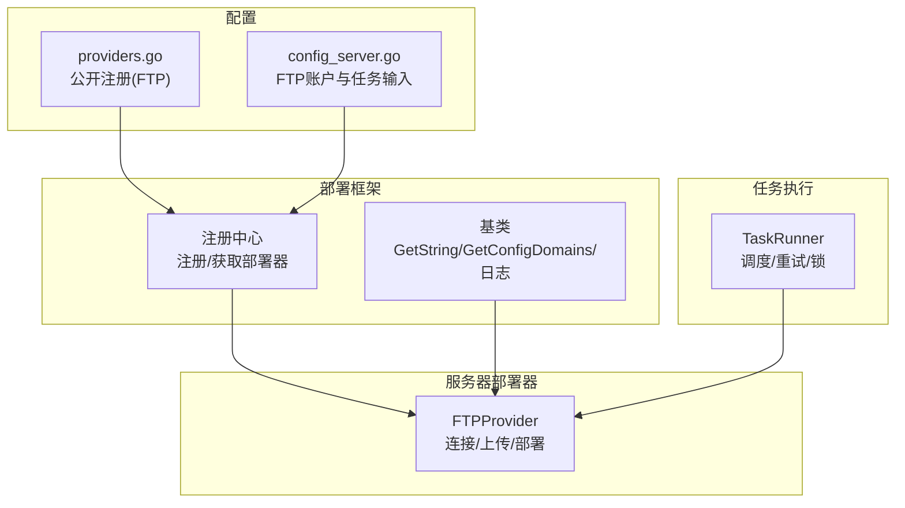
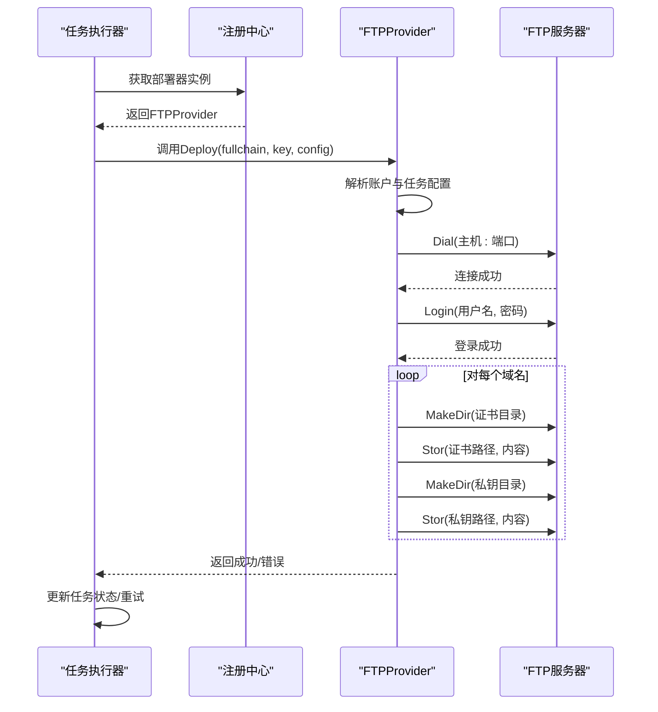
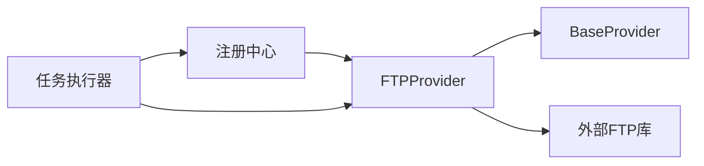

# FTP文件部署

<cite>
**本文引用的文件**
- [ftp.go](file://main/internal/cert/deploy/servers/ftp.go)
- [base.go](file://main/internal/cert/deploy/base/base.go)
- [config_server.go](file://main/internal/cert/deploy/config_server.go)
- [providers.go](file://main/internal/cert/providers.go)
- [README.md](file://main/internal/cert/deploy/README.md)
- [task_runner.go](file://main/internal/service/task_runner.go)
</cite>

## 目录
1. [简介](#简介)
2. [项目结构](#项目结构)
3. [核心组件](#核心组件)
4. [架构总览](#架构总览)
5. [详细组件分析](#详细组件分析)
6. [依赖关系分析](#依赖关系分析)
7. [性能考量](#性能考量)
8. [故障排除指南](#故障排除指南)
9. [结论](#结论)
10. [附录](#附录)

## 简介
本文件面向需要在FTP服务器上进行证书文件部署的用户与运维工程师，系统性说明FTP部署器的工作原理、适用场景、配置参数、安全注意事项、连接测试方法、错误处理与重试机制，并提供性能优化建议与常见问题排查步骤。FTP部署器基于统一的部署框架实现，支持将签发的证书链与私钥以文本形式上传至远端FTP服务器指定路径。

## 项目结构
FTP部署能力位于证书自动部署模块中，采用“注册-工厂-基类”的可扩展架构：
- 服务器部署器目录包含FTP实现
- 基类提供统一的配置读取、日志记录与接口契约
- 配置文件定义了账户级与任务级输入项
- 提供者注册入口集中声明FTP部署能力
- 任务执行器负责调度、重试与锁管理



图表来源
- [ftp.go:15-27](file://main/internal/cert/deploy/servers/ftp.go#L15-L27)
- [base.go:98-114](file://main/internal/cert/deploy/base/base.go#L98-L114)
- [config_server.go:44-70](file://main/internal/cert/deploy/config_server.go#L44-L70)
- [providers.go:289-308](file://main/internal/cert/providers.go#L289-L308)
- [task_runner.go:255-291](file://main/internal/service/task_runner.go#L255-L291)

章节来源
- [README.md:74-80](file://main/internal/cert/deploy/README.md#L74-L80)
- [config_server.go:44-70](file://main/internal/cert/deploy/config_server.go#L44-L70)
- [providers.go:289-308](file://main/internal/cert/providers.go#L289-L308)

## 核心组件
- FTPProvider：实现FTP服务器连接、登录、证书与私钥上传、目录创建等核心逻辑
- BaseProvider：提供配置读取、日志记录、域名解析等通用能力
- 配置系统：定义账户级（host/port/username/password/secure/passive）与任务级（cert_path/key_path/format等）输入字段
- 任务执行器：负责部署任务的调度、失败重试、锁释放与通知

章节来源
- [ftp.go:19-27](file://main/internal/cert/deploy/servers/ftp.go#L19-L27)
- [base.go:98-114](file://main/internal/cert/deploy/base/base.go#L98-L114)
- [config_server.go:52-69](file://main/internal/cert/deploy/config_server.go#L52-L69)
- [providers.go:296-307](file://main/internal/cert/providers.go#L296-L307)

## 架构总览
FTP部署在统一的证书部署框架内运行，遵循以下流程：
- 任务执行器发现待部署任务，获取证书链与私钥
- 通过注册中心获取FTPProvider实例
- FTPProvider解析配置，建立FTP连接并登录
- 针对每个域名，替换路径中的{domain}占位符
- 上传证书与私钥文件，必要时创建远程目录
- 记录日志并返回结果，失败时进入重试流程



图表来源
- [task_runner.go:255-291](file://main/internal/service/task_runner.go#L255-L291)
- [ftp.go:38-58](file://main/internal/cert/deploy/servers/ftp.go#L38-L58)
- [ftp.go:60-96](file://main/internal/cert/deploy/servers/ftp.go#L60-L96)
- [ftp.go:98-105](file://main/internal/cert/deploy/servers/ftp.go#L98-L105)

## 详细组件分析

### FTPProvider 组件
- 角色与职责
  - 实现部署接口，负责FTP连接、登录、文件上传与目录创建
  - 通过基类读取配置，支持大小写不敏感与下划线/驼峰键名映射
- 关键方法
  - Check：连通性检查
  - Deploy：部署主流程，按域名循环上传证书与私钥
  - uploadFile：创建远程目录并上传文件
  - connect：拨号、超时设置、登录
- 错误处理
  - 连接失败、登录失败均返回带上下文的错误
  - 上传失败时中断并返回错误
- 日志记录
  - 使用基类日志接口输出关键步骤

```mermaid
classDiagram
class BaseProvider {
    +map[string]interface{} Config
    +Logger Logger
    +SetLogger(logger)
    +Log(msg)
    +GetString(key) string
    +GetStringFrom(config, key) string
    +GetInt(key, default) int
}
class FTPProvider {
    +Check(ctx) error
    +Deploy(ctx, fullchain, privateKey, config) error
    +SetLogger(logger)
    -connect() (*ftp.ServerConn, error)
    -uploadFile(conn, remotePath, content) error
}
BaseProvider <|-- FTPProvider
```

图表来源
- [base.go:98-114](file://main/internal/cert/deploy/base/base.go#L98-L114)
- [ftp.go:19-27](file://main/internal/cert/deploy/servers/ftp.go#L19-L27)

章节来源
- [ftp.go:29-36](file://main/internal/cert/deploy/servers/ftp.go#L29-L36)
- [ftp.go:38-58](file://main/internal/cert/deploy/servers/ftp.go#L38-L58)
- [ftp.go:60-96](file://main/internal/cert/deploy/servers/ftp.go#L60-L96)
- [ftp.go:98-105](file://main/internal/cert/deploy/servers/ftp.go#L98-L105)

### 配置系统
- 账户级输入（注册入口）
  - FTP地址、端口、用户名、密码
- 任务级输入（注册入口）
  - 证书路径、私钥路径、部署域名（用于替换{domain}）
- 服务器配置补充
  - 额外支持“是否使用SSL”“被动模式”“证书格式”等
- 配置读取
  - 支持大小写不敏感、下划线与驼峰键名互转
  - 域名列表支持多格式输入并标准化

章节来源
- [providers.go:296-307](file://main/internal/cert/providers.go#L296-L307)
- [config_server.go:52-69](file://main/internal/cert/deploy/config_server.go#L52-L69)
- [base.go:116-146](file://main/internal/cert/deploy/base/base.go#L116-L146)
- [base.go:224-257](file://main/internal/cert/deploy/base/base.go#L224-L257)

### 任务执行与重试
- 任务发现与执行
  - 查询待执行/需重新部署的任务，确保证书已签发
- 失败重试
  - 指数退避策略，达到最大重试次数后停止
- 锁管理
  - 超时自动释放，避免进程异常退出导致的死锁
- 通知
  - 成功/失败通知开关可控

章节来源
- [task_runner.go:255-291](file://main/internal/service/task_runner.go#L255-L291)
- [task_runner.go:293-331](file://main/internal/service/task_runner.go#L293-L331)
- [task_runner.go:463-475](file://main/internal/service/task_runner.go#L463-L475)
- [task_runner.go:477-503](file://main/internal/service/task_runner.go#L477-L503)

## 依赖关系分析
- FTPProvider依赖
  - 基类：配置读取、日志、域名解析
  - 外部库：FTP客户端库
- 注册与发现
  - 通过注册中心按类型获取Provider实例
- 任务执行器
  - 与部署框架解耦，仅调用Provider接口



图表来源
- [ftp.go:3-12](file://main/internal/cert/deploy/servers/ftp.go#L3-L12)
- [base.go:98-114](file://main/internal/cert/deploy/base/base.go#L98-L114)
- [task_runner.go:255-291](file://main/internal/service/task_runner.go#L255-L291)

章节来源
- [ftp.go:3-12](file://main/internal/cert/deploy/servers/ftp.go#L3-L12)
- [base.go:98-114](file://main/internal/cert/deploy/base/base.go#L98-L114)
- [task_runner.go:255-291](file://main/internal/service/task_runner.go#L255-L291)

## 性能考量
- 连接复用
  - 单次部署仅建立一次连接并在结束后关闭，避免频繁拨号开销
- 串行上传
  - 证书与私钥逐个上传，简单可靠；若需并行可考虑批量任务拆分
- 目录创建
  - 仅在需要时创建目录，减少不必要的控制通道往返
- 重试策略
  - 指数退避降低对远端FTP的压力峰值
- 建议
  - 在高并发场景下，将不同域名/站点拆分为独立任务，避免单任务过大
  - 使用被动模式提升NAT/防火墙环境下的成功率

[本节为通用性能建议，不直接分析具体文件]

## 故障排除指南
- 连接失败
  - 检查主机地址与端口是否正确
  - 确认网络可达与防火墙放行
  - 若启用被动模式，确认服务器被动端口范围开放
- 登录失败
  - 核对用户名与密码
  - 确认用户权限具备写入目标目录的能力
- 上传失败
  - 检查目标路径是否存在且可写
  - 确认路径中{domain}占位符已被正确替换
- 重试与锁问题
  - 查看任务状态与错误信息
  - 超时锁会自动释放，等待下次重试
- 日志定位
  - 关注部署日志中的关键步骤与错误上下文

章节来源
- [ftp.go:47-55](file://main/internal/cert/deploy/servers/ftp.go#L47-L55)
- [ftp.go:83-91](file://main/internal/cert/deploy/servers/ftp.go#L83-L91)
- [task_runner.go:463-475](file://main/internal/service/task_runner.go#L463-L475)
- [task_runner.go:477-503](file://main/internal/service/task_runner.go#L477-L503)

## 结论
FTP部署器以简洁稳定的实现方式，将证书链与私钥上传至远端服务器，适配传统Web服务器与面板的证书存放需求。通过统一的配置与执行框架，具备良好的可维护性与可扩展性。在生产环境中，建议结合被动模式、合理的重试策略与完善的监控告警，确保部署的可靠性与可观测性。

[本节为总结性内容，不直接分析具体文件]

## 附录

### 配置参数清单与说明
- 账户级（注册入口）
  - FTP地址：FTP服务器主机或域名
  - FTP端口：FTP服务监听端口，默认21
  - 用户名：访问FTP的用户名
  - 密码：访问FTP的密码
- 任务级（注册入口）
  - 证书路径：证书文件保存路径，支持{domain}占位符
  - 私钥路径：私钥文件保存路径，支持{domain}占位符
  - 部署域名：可选，用于替换路径中的{domain}
- 服务器配置补充（额外可用）
  - 是否使用SSL：是否启用加密传输
  - 被动模式：是否启用被动模式
  - 证书格式：PEM或PFX等
  - PFX证书密码：当选择PFX格式时的密码

章节来源
- [providers.go:296-307](file://main/internal/cert/providers.go#L296-L307)
- [config_server.go:52-69](file://main/internal/cert/deploy/config_server.go#L52-L69)

### 连接测试方法
- 使用FTP客户端工具（如命令行或图形化工具）验证主机、端口、用户名、密码与目录写入权限
- 在被动模式下测试NAT/防火墙策略
- 确认路径存在且具备写权限，必要时先手动创建目录

[本节为通用测试建议，不直接分析具体文件]

### 安全注意事项
- 明文传输风险
  - 默认FTP为明文协议，用户名、密码与数据均可能被窃听
- 加密传输方案
  - 优先使用FTPS（FTP+TLS）或SFTP（SSH文件传输协议）替代明文FTP
  - 若必须使用FTP，请在受控网络或VPN内网中部署
- 最佳实践
  - 为FTP账户设置最小权限
  - 定期轮换密码
  - 限制访问源IP与时间段

[本节为通用安全建议，不直接分析具体文件]

### 断点续传机制
- 当前实现
  - 采用一次性Stor上传文件，未实现断点续传
- 影响与建议
  - 对于大文件或不稳定网络，建议改用支持断点续传的传输协议（如SFTP）
  - 或在应用侧对文件进行分块处理与校验

章节来源
- [ftp.go:104](file://main/internal/cert/deploy/servers/ftp.go#L104)