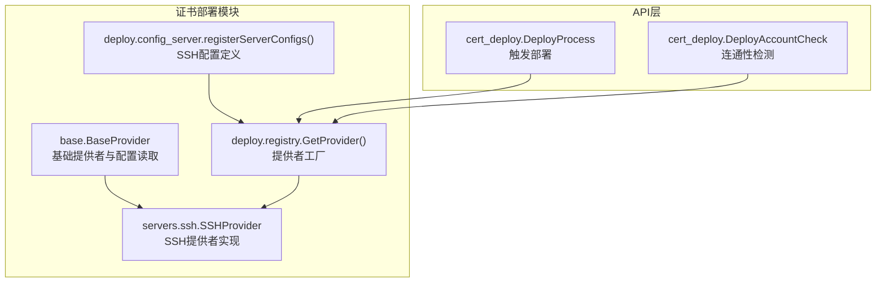
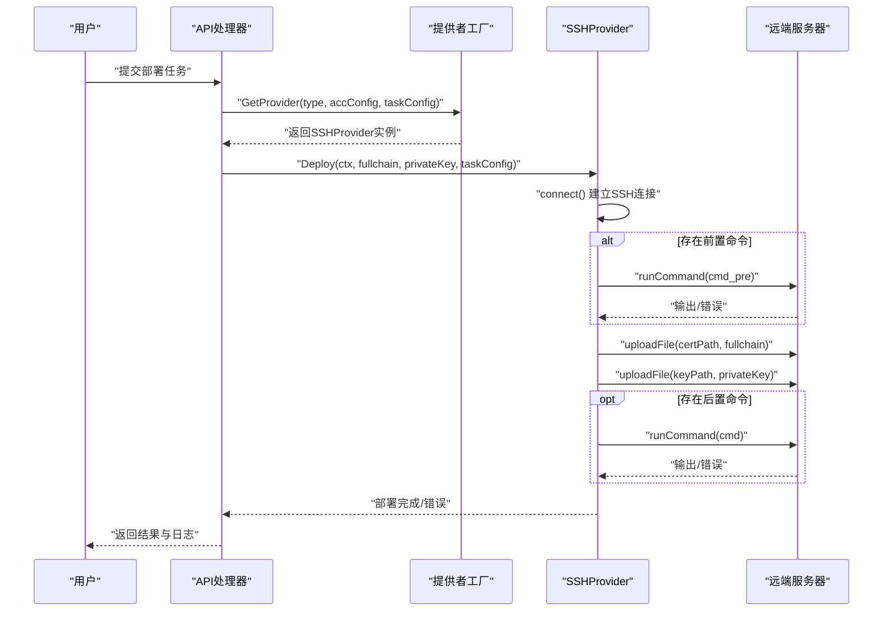
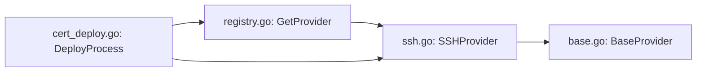
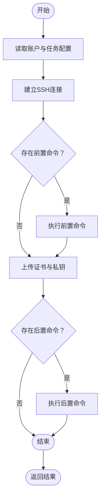

# SSH远程部署

<cite>
**本文引用的文件**
- [ssh.go](file://main/internal/cert/deploy/servers/ssh.go)
- [base.go](file://main/internal/cert/deploy/base/base.go)
- [config_server.go](file://main/internal/cert/deploy/config_server.go)
- [registry.go](file://main/internal/cert/deploy/registry.go)
- [cert_deploy.go](file://main/internal/api/handler/cert_deploy.go)
- [local.go](file://main/internal/cert/deploy/servers/local.go)
- [interface.go](file://main/internal/cert/interface.go)
</cite>

## 目录
1. [简介](#简介)
2. [项目结构](#项目结构)
3. [核心组件](#核心组件)
4. [架构总览](#架构总览)
5. [详细组件分析](#详细组件分析)
6. [依赖关系分析](#依赖关系分析)
7. [性能考量](#性能考量)
8. [故障排查指南](#故障排查指南)
9. [结论](#结论)
10. [附录](#附录)

## 简介
本文件面向需要在Linux/Windows服务器上进行自动化证书部署的工程师与运维人员，系统性阐述SSH远程部署器的设计与实现，覆盖以下主题：
- SSH连接建立、远程命令执行与文件传输流程
- 部署器配置参数与输入项定义
- 密钥认证与密码认证的差异、适用场景与安全建议
- 完整配置示例与连接测试方法
- 部署过程中的错误处理与重试策略
- 安全注意事项与最佳实践

## 项目结构
SSH远程部署能力位于证书部署模块内部，采用“提供者模式”注册与调用，配合API层完成账户与任务的生命周期管理。



图表来源
- [base.go:98-174](file://main/internal/cert/deploy/base/base.go#L98-L174)
- [ssh.go:21-135](file://main/internal/cert/deploy/servers/ssh.go#L21-L135)
- [config_server.go:9-42](file://main/internal/cert/deploy/config_server.go#L9-L42)
- [registry.go:27-65](file://main/internal/cert/deploy/registry.go#L27-L65)
- [cert_deploy.go:717-865](file://main/internal/api/handler/cert_deploy.go#L717-L865)

章节来源
- [base.go:98-174](file://main/internal/cert/deploy/base/base.go#L98-L174)
- [ssh.go:21-135](file://main/internal/cert/deploy/servers/ssh.go#L21-L135)
- [config_server.go:9-42](file://main/internal/cert/deploy/config_server.go#L9-L42)
- [registry.go:27-65](file://main/internal/cert/deploy/registry.go#L27-L65)
- [cert_deploy.go:717-865](file://main/internal/api/handler/cert_deploy.go#L717-L865)

## 核心组件
- SSHProvider：实现证书部署的SSH提供者，负责连接、命令执行与SCP文件传输。
- BaseProvider：提供统一的配置读取、日志记录与默认行为。
- 配置注册：定义SSH部署所需的账户级与任务级输入项。
- 提供者工厂：根据类型与任务上下文解析具体提供者实例。
- API处理器：对外暴露部署账户管理与部署任务执行接口。

章节来源
- [ssh.go:21-135](file://main/internal/cert/deploy/servers/ssh.go#L21-L135)
- [base.go:98-174](file://main/internal/cert/deploy/base/base.go#L98-L174)
- [config_server.go:9-42](file://main/internal/cert/deploy/config_server.go#L9-L42)
- [registry.go:27-65](file://main/internal/cert/deploy/registry.go#L27-L65)
- [cert_deploy.go:717-865](file://main/internal/api/handler/cert_deploy.go#L717-L865)

## 架构总览
SSH部署的整体流程如下：
- 用户在前端配置SSH账户（主机、端口、认证方式、凭据等），并创建部署任务（选择证书订单、目标路径、执行命令等）。
- API层接收请求后，通过提供者工厂解析SSHProvider实例。
- SSHProvider建立SSH会话，按需执行前置命令、上传证书与私钥、执行后置命令，并记录日志。



图表来源
- [cert_deploy.go:717-865](file://main/internal/api/handler/cert_deploy.go#L717-L865)
- [registry.go:27-65](file://main/internal/cert/deploy/registry.go#L27-L65)
- [ssh.go:82-135](file://main/internal/cert/deploy/servers/ssh.go#L82-L135)

## 详细组件分析

### SSHProvider 组件
- 连接建立
  - 读取主机、端口、用户名、认证方式与凭据（密钥或密码）。
  - 使用golang.org/x/crypto/ssh建立TCP连接，设置超时与主机校验策略。
- 远程命令执行
  - 通过新建session执行命令，捕获合并输出与错误，便于定位问题。
- 文件传输
  - 使用SCP协议上传证书与私钥，自动创建目标目录，设置权限（证书0644、私钥0600）。
- 部署流程
  - 支持前置命令（如备份）、多域名替换占位符、后置命令（如服务重启）。

```mermaid
classDiagram
class BaseProvider {
+Config map[string]interface{}
+Logger Logger
+GetString(key) string
+GetInt(key, default) int
+Log(msg) void
+SetLogger(logger) void
}
class SSHProvider {
+Check(ctx) error
+Deploy(ctx, fullchain, privateKey, config) error
+SetLogger(logger) void
-connect() (*ssh.Client, error)
-runCommand(client, cmd) error
-uploadFile(client, remotePath, content, perm) error
}
BaseProvider <|-- SSHProvider
```

图表来源
- [base.go:98-174](file://main/internal/cert/deploy/base/base.go#L98-L174)
- [ssh.go:21-135](file://main/internal/cert/deploy/servers/ssh.go#L21-L135)

章节来源
- [ssh.go:40-80](file://main/internal/cert/deploy/servers/ssh.go#L40-L80)
- [ssh.go:137-174](file://main/internal/cert/deploy/servers/ssh.go#L137-L174)

### BaseProvider 组件
- 配置读取
  - 支持精确匹配、大小写不敏感、下划线与驼峰互转，提升配置灵活性。
- 日志记录
  - 通过SetLogger注入日志回调，便于API层收集部署日志。
- 工具方法
  - 域名解析、配置域读取、默认值处理等。

章节来源
- [base.go:116-174](file://main/internal/cert/deploy/base/base.go#L116-L174)
- [base.go:205-257](file://main/internal/cert/deploy/base/base.go#L205-L257)

### 配置定义（SSH）
- 账户级输入项
  - 主机地址、端口、认证方式（密码/密钥）、用户名、密码、私钥、私钥密码、是否Windows。
- 任务级输入项
  - 证书格式（PEM/PFX）、保存路径、PFX密码、上传前/后命令、Windows/IIS相关选项。

章节来源
- [config_server.go:18-42](file://main/internal/cert/deploy/config_server.go#L18-L42)

### 提供者工厂与API集成
- 工厂解析
  - GetProvider根据账户类型与任务上下文解析具体提供者；支持子产品键组合。
- API调用链
  - DeployProcess：加锁、注入日志回调、超时控制、持久化状态与日志。
  - DeployAccountCheck：异步连通性检测，超时控制。

章节来源
- [registry.go:27-65](file://main/internal/cert/deploy/registry.go#L27-L65)
- [cert_deploy.go:717-865](file://main/internal/api/handler/cert_deploy.go#L717-L865)
- [cert_deploy.go:268-323](file://main/internal/api/handler/cert_deploy.go#L268-L323)

### 本地部署对比（参考）
- LocalProvider用于本地文件系统写入与命令执行，便于理解SSHProvider的文件与命令处理差异。

章节来源
- [local.go:53-110](file://main/internal/cert/deploy/servers/local.go#L53-L110)

## 依赖关系分析
- 内部依赖
  - SSHProvider依赖base.BaseProvider提供的配置读取与日志能力。
  - API层通过deploy.registry.GetProvider解析具体提供者。
- 外部依赖
  - golang.org/x/crypto/ssh用于SSH连接与认证。
  - 标准库net、io、os/exec、strings等支撑网络、文件与命令执行。



图表来源
- [ssh.go:21-135](file://main/internal/cert/deploy/servers/ssh.go#L21-L135)
- [base.go:98-174](file://main/internal/cert/deploy/base/base.go#L98-L174)
- [registry.go:27-65](file://main/internal/cert/deploy/registry.go#L27-L65)
- [cert_deploy.go:717-865](file://main/internal/api/handler/cert_deploy.go#L717-L865)

章节来源
- [ssh.go:3-15](file://main/internal/cert/deploy/servers/ssh.go#L3-L15)
- [cert_deploy.go:717-865](file://main/internal/api/handler/cert_deploy.go#L717-L865)

## 性能考量
- 连接复用
  - 单次部署使用一次SSH连接，避免频繁握手开销。
- 并发与超时
  - API层对部署与检测分别设置超时，防止阻塞。
- I/O效率
  - SCP上传采用一次性写入，减少多次往返。
- 建议
  - 对于大规模多域名部署，优先使用单次上传与命令组合，减少会话数量。

[本节为通用指导，无需列出章节来源]

## 故障排查指南
- 连接失败
  - 检查主机、端口、用户名与认证方式是否正确。
  - 若使用密钥认证，确认私钥格式与权限；若使用密码认证，确认密码正确。
- 权限问题
  - 上传路径需存在且具备写权限；必要时在前置命令中创建目录或提权。
- 命令执行失败
  - 查看后置命令的返回码与输出；确认服务可正常重启。
- 日志定位
  - API层会聚合提供者的日志输出，可在“部署日志”接口查看实时日志。
- 重试与状态
  - 部署失败后状态标记为失败，可重置任务后再次执行。

章节来源
- [ssh.go:162-174](file://main/internal/cert/deploy/servers/ssh.go#L162-L174)
- [cert_deploy.go:834-865](file://main/internal/api/handler/cert_deploy.go#L834-L865)

## 结论
SSH远程部署器以简洁的提供者模式实现，具备完善的配置读取、日志记录与错误反馈能力。结合API层的任务调度与检测机制，可稳定地完成证书与私钥的远程部署，并支持前置/后置命令的灵活编排。建议在生产环境中优先采用密钥认证与严格权限控制，配合最小化命令集与幂等操作，确保部署过程的安全与可靠。

[本节为总结性内容，无需列出章节来源]

## 附录

### SSH部署配置参数清单
- 账户级（SSH）
  - 主机地址：字符串，必填
  - 端口：字符串，默认22，必填
  - 认证方式：枚举，密码/密钥
  - 用户名：字符串，默认root，必填
  - 密码：字符串，当认证方式为密码时必填
  - 私钥：文本域，PEM格式，当认证方式为密钥时必填
  - 私钥密码：字符串，可选
  - 是否Windows：枚举，否/是
- 任务级（PEM格式）
  - 证书类型：固定为PEM
  - 证书保存路径：字符串，必填
  - 私钥保存路径：字符串，必填
  - 上传前执行命令：文本域，可选
  - 上传后执行命令：文本域，可选
- 任务级（PFX格式）
  - 证书类型：固定为PFX
  - PFX证书保存路径：字符串，必填
  - PFX证书密码：字符串，可选
  - 上传完操作：枚举，执行指定命令/部署到IIS
  - IIS绑定域名：字符串，当操作为部署到IIS时必填

章节来源
- [config_server.go:18-42](file://main/internal/cert/deploy/config_server.go#L18-L42)

### 认证方式对比与使用建议
- 密钥认证
  - 优点：安全性高、适合自动化与CI/CD
  - 注意：私钥需妥善保管，避免明文存储
- 密码认证
  - 优点：简单易用
  - 注意：应定期轮换，避免弱密码

章节来源
- [ssh.go:47-64](file://main/internal/cert/deploy/servers/ssh.go#L47-L64)

### 连接测试方法
- 在前端或后端调用“部署账户检测”接口，系统将异步发起一次连通性检测并记录结果。
- 观察日志输出，确认连接建立与认证通过。

章节来源
- [cert_deploy.go:268-323](file://main/internal/api/handler/cert_deploy.go#L268-L323)

### 部署流程图（算法）


图表来源
- [ssh.go:82-135](file://main/internal/cert/deploy/servers/ssh.go#L82-L135)