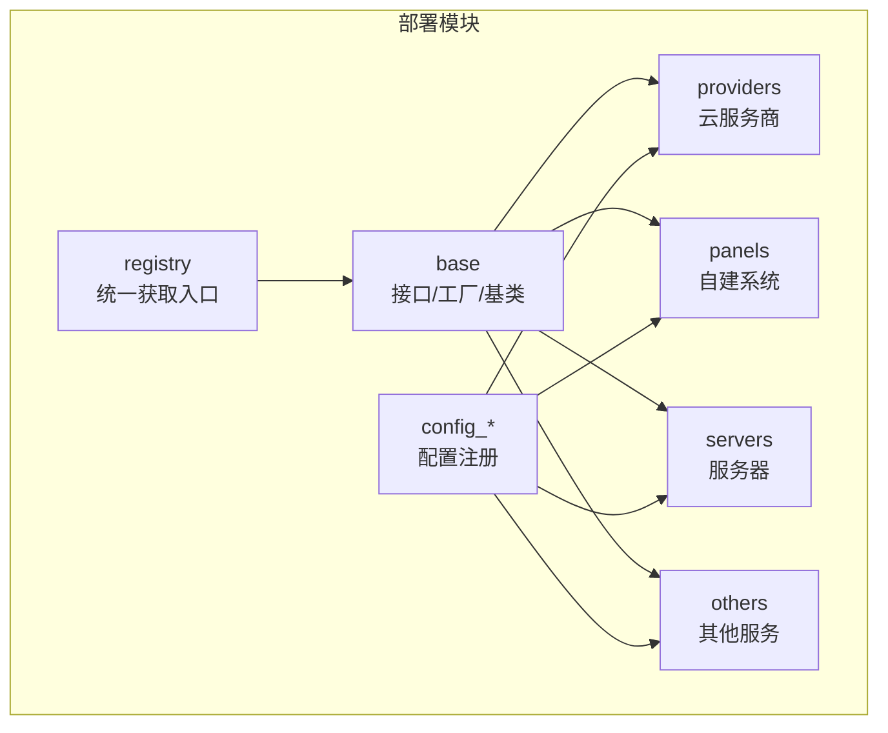
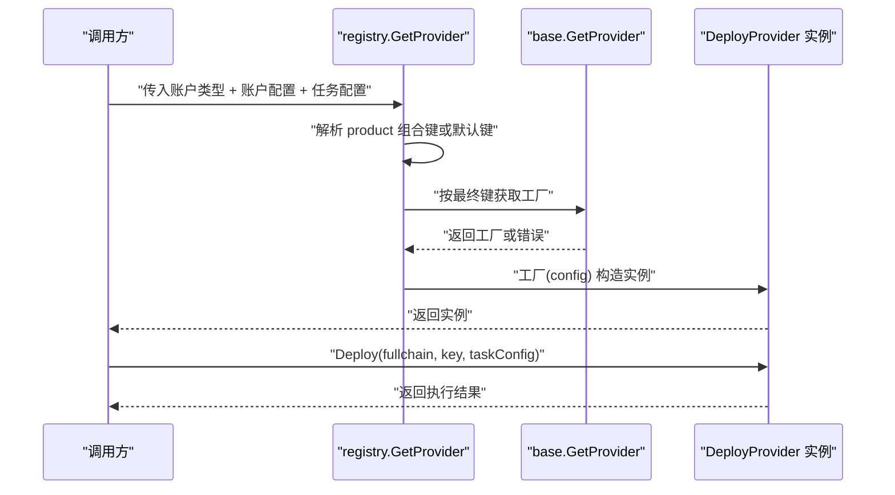
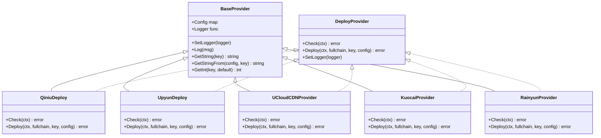
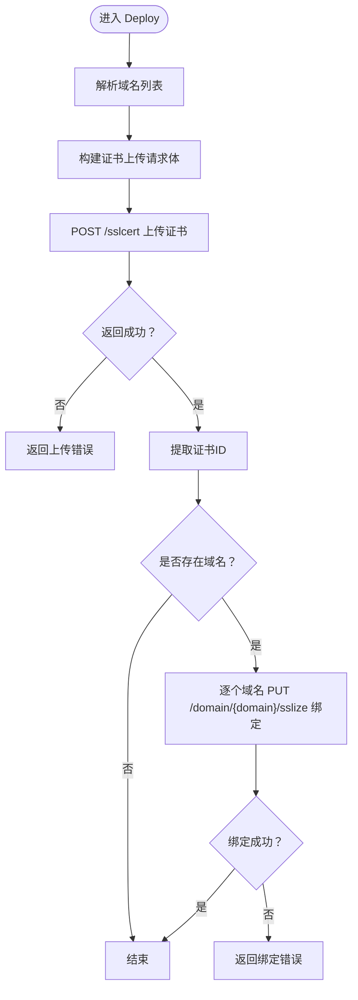
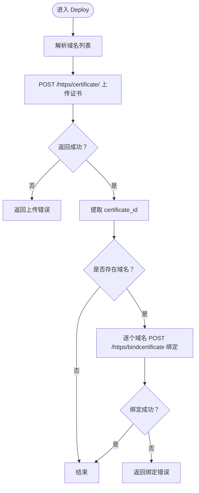
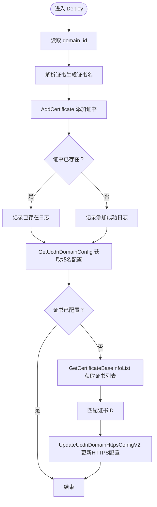
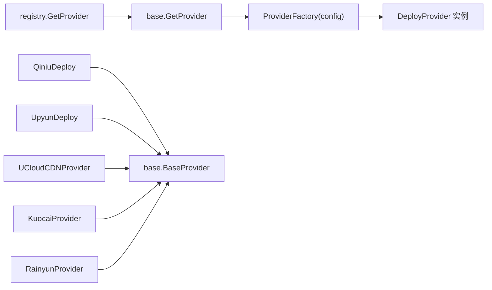

# 其他部署方式

<cite>
**本文引用的文件**
- [base.go](file://main/internal/cert/deploy/base/base.go)
- [registry.go](file://main/internal/cert/deploy/registry.go)
- [config.go](file://main/internal/cert/deploy/config.go)
- [config_cloud.go](file://main/internal/cert/deploy/config_cloud.go)
- [config_selfhosted.go](file://main/internal/cert/deploy/config_selfhosted.go)
- [config_server.go](file://main/internal/cert/deploy/config_server.go)
- [interface.go](file://main/internal/cert/interface.go)
- [providers.go](file://main/internal/cert/providers.go)
- [qiniu.go](file://main/internal/cert/deploy/providers/qiniu.go)
- [upyun.go](file://main/internal/cert/deploy/providers/upyun.go)
- [ucloud_cdn.go](file://main/internal/cert/deploy/providers/ucloud_cdn.go)
- [kuocai.go](file://main/internal/cert/deploy/others/kuocai.go)
- [rainyun.go](file://main/internal/cert/deploy/others/rainyun.go)
- [README.md](file://main/internal/cert/deploy/README.md)
</cite>

## 目录
1. [简介](#简介)
2. [项目结构](#项目结构)
3. [核心组件](#核心组件)
4. [架构总览](#架构总览)
5. [详细组件分析](#详细组件分析)
6. [依赖关系分析](#依赖关系分析)
7. [性能考虑](#性能考虑)
8. [故障排除指南](#故障排除指南)
9. [结论](#结论)
10. [附录](#附录)

## 简介
本章节面向“其他部署方式”的扩展与定制，覆盖以下主题：
- 除主流部署方式之外的特殊场景与第三方服务集成（如七牛云、又拍云、UCloud 等）。
- 自定义部署器的开发方法、扩展机制与最佳实践。
- 部署器接口规范、注册与配置流程、通用基类与继承关系。
- 部署器的通用基类与继承关系。
- 部署器开发的最佳实践与测试方法。
- 部署器故障排除与性能优化指南。

## 项目结构
部署模块采用按职责分层与按类别分包的组织方式：
- base：基础接口、工厂注册、通用基类与工具函数。
- providers：云服务商部署器（CDN、WAF、OSS 等）。
- panels：自建系统部署器（面板、WAF、容器平台等）。
- servers：服务器部署器（SSH、FTP、本地）。
- others：其他第三方服务部署器（西部数码、雨云、uniCloud、括彩云等）。
- config_*：各类部署器的配置注册与界面字段定义。
- registry：向后兼容的类型别名与统一获取入口。
- interface.go：与证书提供商注册体系的对接。

图表来源
- [README.md:1-123](file://main/internal/cert/deploy/README.md#L1-L123)
- [base.go:43-102](file://main/internal/cert/deploy/base/base.go#L43-L102)
- [registry.go:27-66](file://main/internal/cert/deploy/registry.go#L27-L66)
- [config.go:19-49](file://main/internal/cert/deploy/config.go#L19-L49)

章节来源
- [README.md:1-123](file://main/internal/cert/deploy/README.md#L1-L123)

## 核心组件
- 接口与工厂
  - DeployProvider：定义 Check、Deploy、SetLogger 三个核心方法。
  - ProviderFactory：工厂函数类型，用于按配置构造具体部署器实例。
  - 注册与获取：通过全局映射表进行注册与获取，支持并发读写锁保护。
- 通用基类 BaseProvider
  - 统一持有 Config 与 Logger，并提供常用配置读取与日志输出能力。
  - 提供大小写不敏感、下划线与驼峰互转的键值读取辅助方法。
- 配置体系
  - DeployProviderConfig：描述部署器类型、分类、图标、说明、输入字段与任务输入字段。
  - 分类常量：自建系统、云服务商、服务器三类，便于前端展示与筛选。
- 统一获取入口
  - registry.GetProvider：支持直接按账户类型获取，或根据任务配置 product 组合键获取，或回退到默认 “type_cdn”。

章节来源
- [base.go:43-102](file://main/internal/cert/deploy/base/base.go#L43-L102)
- [base.go:116-174](file://main/internal/cert/deploy/base/base.go#L116-L174)
- [config.go:5-49](file://main/internal/cert/deploy/config.go#L5-L49)
- [registry.go:27-66](file://main/internal/cert/deploy/registry.go#L27-L66)

## 架构总览
部署器的运行时架构由“注册—获取—执行”三阶段构成：
- 注册阶段：各部署器在 init 中调用 base.Register 完成注册。
- 获取阶段：registry.GetProvider 根据账户类型与任务配置解析最终部署器。
- 执行阶段：调用 DeployProvider.Deploy 完成证书部署。

图表来源
- [registry.go:27-66](file://main/internal/cert/deploy/registry.go#L27-L66)
- [base.go:71-84](file://main/internal/cert/deploy/base/base.go#L71-L84)

## 详细组件分析

### 通用基类与继承关系
- BaseProvider
  - 持有 Config 与 Logger，提供 SetLogger 与 Log 方法。
  - 提供 GetString、GetStringFrom、GetInt、GetConfigDomains 等常用工具。
- 继承关系
  - 云服务商部署器通常直接实现 DeployProvider。
  - 面板/服务器/其他部署器多以内嵌 base.BaseProvider，复用其配置读取与日志能力。

图表来源
- [base.go:43-102](file://main/internal/cert/deploy/base/base.go#L43-L102)
- [qiniu.go:18-30](file://main/internal/cert/deploy/providers/qiniu.go#L18-L30)
- [upyun.go:15-25](file://main/internal/cert/deploy/providers/upyun.go#L15-L25)
- [ucloud_cdn.go:37-51](file://main/internal/cert/deploy/providers/ucloud_cdn.go#L37-L51)
- [kuocai.go:20-30](file://main/internal/cert/deploy/others/kuocai.go#L20-L30)
- [rainyun.go:20-29](file://main/internal/cert/deploy/others/rainyun.go#L20-L29)

章节来源
- [base.go:98-174](file://main/internal/cert/deploy/base/base.go#L98-L174)
- [qiniu.go:18-30](file://main/internal/cert/deploy/providers/qiniu.go#L18-L30)
- [upyun.go:15-25](file://main/internal/cert/deploy/providers/upyun.go#L15-L25)
- [ucloud_cdn.go:37-51](file://main/internal/cert/deploy/providers/ucloud_cdn.go#L37-L51)
- [kuocai.go:20-30](file://main/internal/cert/deploy/others/kuocai.go#L20-L30)
- [rainyun.go:20-29](file://main/internal/cert/deploy/others/rainyun.go#L20-L29)

### 七牛云部署器
- 功能要点
  - 使用 HMAC-SHA1 对请求签名，Authorization 头拼接为“Qiniu + ak + : + base64(签名)”。
  - 支持上传证书并绑定域名，域名列表来自任务配置或账户配置。
  - 错误处理：当上传成功但绑定失败时，返回组合错误提示。
- 关键流程

图表来源
- [qiniu.go:95-138](file://main/internal/cert/deploy/providers/qiniu.go#L95-L138)

章节来源
- [qiniu.go:90-138](file://main/internal/cert/deploy/providers/qiniu.go#L90-L138)

### 又拍云部署器
- 功能要点
  - 使用 Bearer Token 认证，Authorization 头为“Bearer + token”。
  - 先上传证书，再对每个域名执行绑定操作。
  - 错误处理：上传成功但绑定失败时，返回组合错误提示。
- 关键流程

图表来源
- [upyun.go:73-111](file://main/internal/cert/deploy/providers/upyun.go#L73-L111)

章节来源
- [upyun.go:68-111](file://main/internal/cert/deploy/providers/upyun.go#L68-L111)

### UCloud 部署器
- 功能要点
  - 通过签名算法对请求参数排序后拼接私钥进行 SHA1 签名。
  - 先添加证书，再查询域名配置，最后更新 HTTPS 加速配置。
  - 若证书已存在则跳过重复添加，避免报错。
- 关键流程

图表来源
- [ucloud_cdn.go:65-181](file://main/internal/cert/deploy/providers/ucloud_cdn.go#L65-L181)

章节来源
- [ucloud_cdn.go:21-181](file://main/internal/cert/deploy/providers/ucloud_cdn.go#L21-L181)

### 其他第三方服务部署器
- 括彩云（Kuocai）
  - 登录获取 token，随后 PUT 更新域名证书。
- 雨云（Rainyun）
  - 支持新增或更新证书，依据任务配置是否提供证书ID决定请求方法。

章节来源
- [kuocai.go:74-114](file://main/internal/cert/deploy/others/kuocai.go#L74-L114)
- [rainyun.go:58-106](file://main/internal/cert/deploy/others/rainyun.go#L58-L106)

### 配置体系与注册
- 配置结构
  - DeployProviderConfig：包含 type、name、class、icon、desc、note、inputs、task_inputs、task_note。
  - 分类常量：自建系统、云服务商、服务器。
- 注册方式
  - 云服务商：在 providers.go 中通过 cert.Register 完成注册，并在 config_cloud.go 中补充配置。
  - 自建系统：在 providers.go 中注册，config_selfhosted.go 中补充配置。
  - 服务器：在 providers.go 中注册，config_server.go 中补充配置。
  - 其他：在 config_selfhosted.go 或 others 子包中注册。

章节来源
- [config.go:5-49](file://main/internal/cert/deploy/config.go#L5-L49)
- [providers.go:114-665](file://main/internal/cert/providers.go#L114-L665)
- [config_cloud.go:9-494](file://main/internal/cert/deploy/config_cloud.go#L9-L494)
- [config_selfhosted.go:9-371](file://main/internal/cert/deploy/config_selfhosted.go#L9-L371)
- [config_server.go:9-99](file://main/internal/cert/deploy/config_server.go#L9-L99)

### 开发自定义部署器的最佳实践
- 接口实现
  - 必须实现 Check、Deploy、SetLogger 三个方法。
  - 在 init 中通过 base.Register 完成注册。
- 配置设计
  - 在 config_*.go 中通过 registerDeployConfig 完成部署器配置注册。
  - inputs 用于账户级配置，task_inputs 用于任务级配置。
- 基类使用
  - 通过 base.BaseProvider 复用配置读取与日志能力。
  - 使用 base.GetConfigDomains 解析域名列表，支持多种分隔符与格式。
- 错误处理
  - 明确区分“上传成功但绑定失败”的场景，返回可诊断的错误信息。
  - 对第三方 API 的错误响应进行解析并透传有意义的错误文本。
- 并发与超时
  - 为 HTTP 请求设置合理超时时间，避免阻塞。
  - 使用并发安全的注册表，避免竞态。

章节来源
- [README.md:89-123](file://main/internal/cert/deploy/README.md#L89-L123)
- [base.go:116-174](file://main/internal/cert/deploy/base/base.go#L116-L174)
- [qiniu.go:90-138](file://main/internal/cert/deploy/providers/qiniu.go#L90-L138)
- [upyun.go:68-111](file://main/internal/cert/deploy/providers/upyun.go#L68-L111)
- [ucloud_cdn.go:183-230](file://main/internal/cert/deploy/providers/ucloud_cdn.go#L183-L230)

## 依赖关系分析
- 组件耦合
  - registry 依赖 base 的注册表与获取函数。
  - 各部署器实现依赖 base.BaseProvider 与 base.GetConfig* 工具。
  - 配置注册与部署器实现解耦，通过 type 字段关联。
- 外部依赖
  - HTTP 客户端用于调用第三方 API。
  - JSON 解析用于处理第三方响应。
- 潜在循环依赖
  - 未发现直接循环依赖；注册集中在 init 中，避免运行期循环。

图表来源
- [registry.go:27-66](file://main/internal/cert/deploy/registry.go#L27-L66)
- [base.go:71-84](file://main/internal/cert/deploy/base/base.go#L71-L84)
- [qiniu.go:18-30](file://main/internal/cert/deploy/providers/qiniu.go#L18-L30)
- [upyun.go:15-25](file://main/internal/cert/deploy/providers/upyun.go#L15-L25)
- [ucloud_cdn.go:37-51](file://main/internal/cert/deploy/providers/ucloud_cdn.go#L37-L51)
- [kuocai.go:20-30](file://main/internal/cert/deploy/others/kuocai.go#L20-L30)
- [rainyun.go:20-29](file://main/internal/cert/deploy/others/rainyun.go#L20-L29)

章节来源
- [registry.go:27-66](file://main/internal/cert/deploy/registry.go#L27-L66)
- [base.go:58-96](file://main/internal/cert/deploy/base/base.go#L58-L96)

## 性能考虑
- 并发与限流
  - 对第三方 API 的调用应遵循其速率限制，必要时引入指数退避与队列控制。
- 超时与重试
  - 为 HTTP 请求设置合理超时；对幂等操作可引入有限重试。
- 日志与可观测性
  - 使用 base.BaseProvider.Log 输出关键步骤日志，便于定位问题。
- 资源释放
  - 正确关闭 HTTP 响应体，避免连接泄漏。

## 故障排除指南
- 常见问题
  - 未知部署器：检查 registry.GetProvider 的键是否正确，确认已注册。
  - 配置缺失：检查 inputs 与 task_inputs 是否完整，尤其是必填项。
  - 第三方 API 错误：解析响应体中的错误信息，修正凭据或参数。
  - 域名解析失败：使用 base.GetConfigDomains 校验输入格式。
- 定位方法
  - 在 Check 中进行最小化连通性验证。
  - 在 Deploy 中分步记录日志，区分“上传成功/失败”与“绑定成功/失败”。

章节来源
- [registry.go:27-66](file://main/internal/cert/deploy/registry.go#L27-L66)
- [base.go:116-174](file://main/internal/cert/deploy/base/base.go#L116-L174)
- [qiniu.go:90-138](file://main/internal/cert/deploy/providers/qiniu.go#L90-L138)
- [upyun.go:68-111](file://main/internal/cert/deploy/providers/upyun.go#L68-L111)
- [ucloud_cdn.go:53-181](file://main/internal/cert/deploy/providers/ucloud_cdn.go#L53-L181)

## 结论
- 该部署模块通过统一的接口、工厂与基类，实现了对多类部署目标的可扩展支持。
- 云服务商、自建系统、服务器与“其他”四类部署器均遵循相同的注册与配置模式，便于维护与扩展。
- 通过合理的错误处理与日志记录，能够快速定位与修复部署过程中的问题。

## 附录

### 部署器注册与配置方法
- 注册部署器
  - 在部署器实现文件的 init 中调用 base.Register("your_type", NewYourProvider)。
- 配置部署器
  - 在 config_cloud.go、config_selfhosted.go 或 config_server.go 中调用 registerDeployConfig 完成注册。
  - inputs 用于账户级配置，task_inputs 用于任务级配置。

章节来源
- [README.md:89-111](file://main/internal/cert/deploy/README.md#L89-L111)
- [config_cloud.go:9-494](file://main/internal/cert/deploy/config_cloud.go#L9-L494)
- [config_selfhosted.go:9-371](file://main/internal/cert/deploy/config_selfhosted.go#L9-L371)
- [config_server.go:9-99](file://main/internal/cert/deploy/config_server.go#L9-L99)