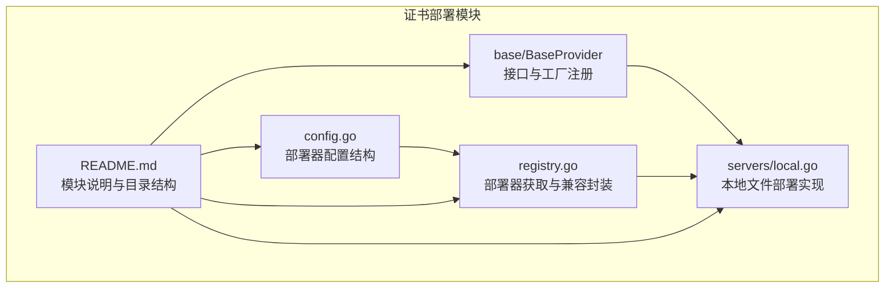
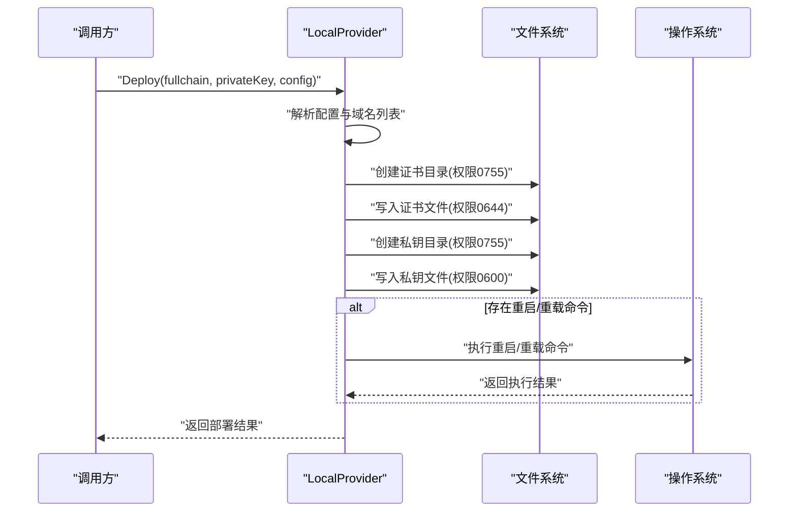
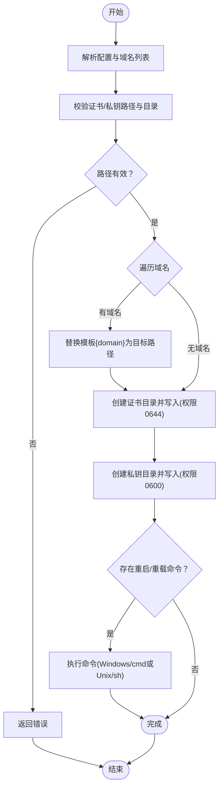
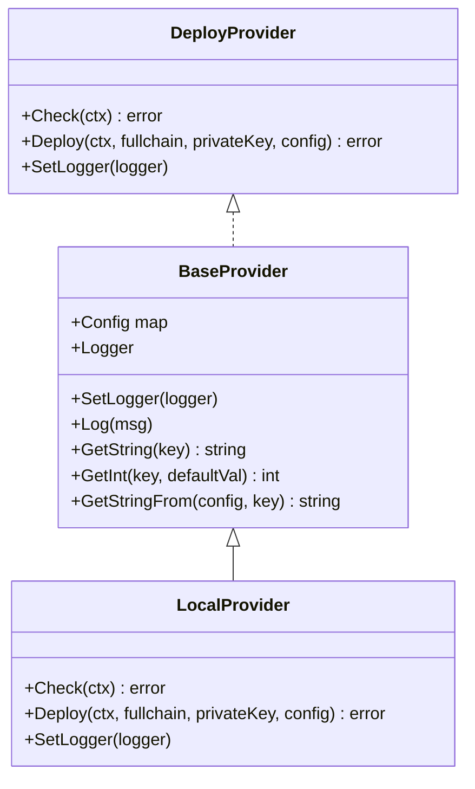
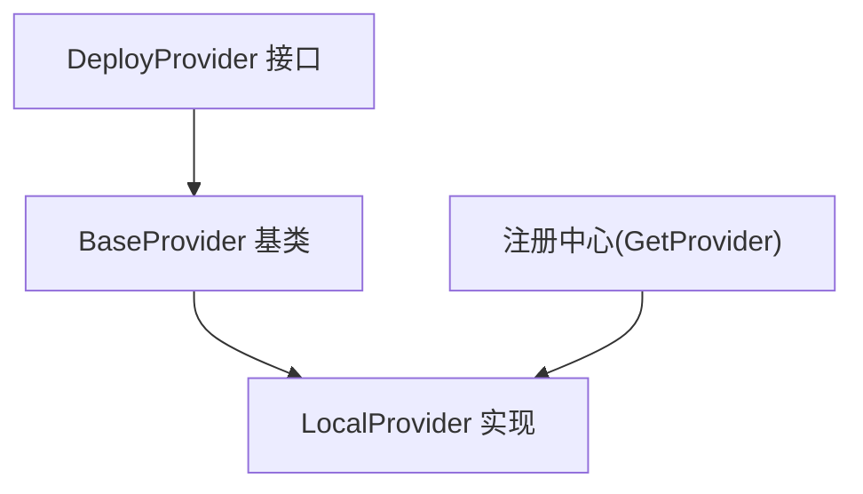

# 本地文件部署

<cite>
**本文引用的文件**
- [main.go](file://main/main.go)
- [local.go](file://main/internal/cert/deploy/servers/local.go)
- [base.go](file://main/internal/cert/deploy/base/base.go)
- [config.go](file://main/internal/cert/deploy/config.go)
- [registry.go](file://main/internal/cert/deploy/registry.go)
- [README.md](file://main/internal/cert/deploy/README.md)
- [interface.go](file://main/internal/cert/interface.go)
- [config_selfhosted.go](file://main/internal/cert/deploy/config_selfhosted.go)
</cite>

## 目录
1. [简介](#简介)
2. [项目结构](#项目结构)
3. [核心组件](#核心组件)
4. [架构总览](#架构总览)
5. [详细组件分析](#详细组件分析)
6. [依赖分析](#依赖分析)
7. [性能考虑](#性能考虑)
8. [故障排查指南](#故障排查指南)
9. [结论](#结论)
10. [附录](#附录)

## 简介
本文件面向“本地文件部署”能力的技术文档，聚焦于将签发的证书（完整链与私钥）写入本地文件系统，并在需要时触发服务重启或重载命令。该能力适用于自建服务器、容器或本地开发环境，确保证书与私钥按预期落盘并具备合适的权限与目录结构。

## 项目结构
本地文件部署位于证书部署模块的“服务器部署器”子目录中，采用统一的部署器接口与工厂注册机制，便于扩展与复用。

图示来源
- [README.md:1-123](file://main/internal/cert/deploy/README.md#L1-L123)
- [base.go:1-258](file://main/internal/cert/deploy/base/base.go#L1-L258)
- [local.go:1-119](file://main/internal/cert/deploy/servers/local.go#L1-L119)
- [config.go:1-50](file://main/internal/cert/deploy/config.go#L1-L50)
- [registry.go:1-72](file://main/internal/cert/deploy/registry.go#L1-L72)

章节来源
- [README.md:1-123](file://main/internal/cert/deploy/README.md#L1-L123)

## 核心组件
- 本地部署器实现：负责校验目标路径、写入证书与私钥文件、按需执行重启/重载命令。
- 基类与接口：提供统一的配置读取、日志记录、域名解析与工厂注册机制。
- 配置与注册：定义部署器配置结构与注册中心，支持通过类型名获取具体部署器实例。

章节来源
- [local.go:19-119](file://main/internal/cert/deploy/servers/local.go#L19-L119)
- [base.go:43-114](file://main/internal/cert/deploy/base/base.go#L43-L114)
- [config.go:19-50](file://main/internal/cert/deploy/config.go#L19-L50)
- [registry.go:27-66](file://main/internal/cert/deploy/registry.go#L27-L66)

## 架构总览
本地部署的整体流程如下：调用方传入证书与私钥内容以及部署配置，本地部署器先进行路径与目录检查，再写入证书与私钥文件，最后执行重启/重载命令（若配置存在）。期间通过基类的日志接口输出过程信息。

图示来源
- [local.go:53-110](file://main/internal/cert/deploy/servers/local.go#L53-L110)
- [base.go:109-114](file://main/internal/cert/deploy/base/base.go#L109-L114)

## 详细组件分析

### 本地部署器实现（LocalProvider）
- 职责
  - 校验证书与私钥的目标路径是否存在且有效。
  - 支持域名模板替换，针对多域名场景生成对应的目标路径。
  - 写入证书与私钥文件，并设置合理的文件权限。
  - 可选执行重启或重载命令以使服务生效。
- 关键行为
  - 路径检查：确保证书与私钥的父目录存在。
  - 目录创建：使用统一权限创建缺失的目录。
  - 文件写入：证书文件使用更宽松的读取权限；私钥文件使用严格限制的权限。
  - 命令执行：区分 Windows 与类 Unix 系统，执行重启/重载命令。
- 错误处理
  - 对目录创建失败、文件写入失败、命令执行失败进行错误包装与返回。
  - 使用日志接口输出关键步骤与错误信息，便于排障。

图示来源
- [local.go:53-110](file://main/internal/cert/deploy/servers/local.go#L53-L110)

章节来源
- [local.go:29-51](file://main/internal/cert/deploy/servers/local.go#L29-L51)
- [local.go:53-110](file://main/internal/cert/deploy/servers/local.go#L53-L110)

### 基类与接口（BaseProvider 与 DeployProvider）
- 接口职责
  - Check：对部署器配置进行前置校验。
  - Deploy：执行实际的部署动作。
  - SetLogger：注入日志记录器。
- 基类能力
  - 统一的配置读取：支持大小写不敏感、下划线与驼峰命名互转。
  - 域名解析：支持从多种键名解析域名列表。
  - 日志记录：通过注入的 Logger 输出运行日志。
  - 工厂注册：提供注册与获取部署器实例的能力。

图示来源
- [base.go:43-114](file://main/internal/cert/deploy/base/base.go#L43-L114)
- [local.go:19-27](file://main/internal/cert/deploy/servers/local.go#L19-L27)

章节来源
- [base.go:43-114](file://main/internal/cert/deploy/base/base.go#L43-L114)
- [base.go:116-174](file://main/internal/cert/deploy/base/base.go#L116-L174)
- [base.go:223-257](file://main/internal/cert/deploy/base/base.go#L223-L257)

### 配置与注册（DeployProviderConfig 与注册中心）
- 配置结构
  - 包含类型、名称、图标、描述、输入项、任务输入项等。
  - 用于前端动态渲染部署器配置表单。
- 注册中心
  - 提供部署器工厂注册与获取能力。
  - 支持通过账户类型与任务配置中的 product 组合键选择具体部署器。

章节来源
- [config.go:19-50](file://main/internal/cert/deploy/config.go#L19-L50)
- [registry.go:27-66](file://main/internal/cert/deploy/registry.go#L27-L66)

### 本地部署的配置选项
- 必填项
  - 证书路径：证书文件写入的目标路径。
  - 私钥路径：私钥文件写入的目标路径。
- 可选项
  - 重启命令：执行服务重启或重载的命令字符串。
  - 重载命令：当未配置重启命令时，可回退使用重载命令。
  - 域名模板：路径中可使用占位符进行域名替换，支持多域名场景。
- 域名解析
  - 支持从多个键名解析域名列表，兼容不同前端传参习惯。

章节来源
- [local.go:53-72](file://main/internal/cert/deploy/servers/local.go#L53-L72)
- [base.go:223-257](file://main/internal/cert/deploy/base/base.go#L223-L257)

### 本地部署的安全机制
- 文件权限
  - 证书文件：写入时设置为仅属主可读，提升安全性。
  - 私钥文件：写入时设置为仅属主可读写，严格限制权限。
- 目录权限
  - 目录创建使用统一权限，避免过度开放。
- 敏感信息处理
  - 私钥文件权限严格限制，降低泄露风险。
  - 建议在受控环境中运行，避免在共享或不可信位置写入私钥。

章节来源
- [local.go:79-90](file://main/internal/cert/deploy/servers/local.go#L79-L90)

### 本地部署的使用场景
- 自建服务器：将证书与私钥写入 Web 服务器或反向代理的证书目录。
- 容器环境：将证书写入挂载的卷目录，随后执行容器内服务的重启/重载。
- 开发测试：在本地开发机上快速替换证书，无需手动运维。

章节来源
- [README.md:74-80](file://main/internal/cert/deploy/README.md#L74-L80)

### 本地部署的验证方法
- 文件存在性与权限
  - 检查证书与私钥文件是否存在，确认权限符合预期。
- 服务可用性
  - 执行重启/重载命令后，验证服务是否正常响应。
- 日志核对
  - 查看部署日志，确认各步骤均成功执行。

章节来源
- [local.go:74-109](file://main/internal/cert/deploy/servers/local.go#L74-L109)

### 回滚与错误恢复
- 回滚策略
  - 若写入失败或命令执行失败，应保留原有证书与私钥，避免覆盖导致服务中断。
  - 建议在写入前备份原证书与私钥文件，以便失败时快速恢复。
- 错误恢复
  - 对于命令执行失败，记录输出并提示用户检查命令与权限。
  - 对于路径或权限问题，提示修正后再重试。

章节来源
- [local.go:77-104](file://main/internal/cert/deploy/servers/local.go#L77-L104)

## 依赖分析
本地部署器依赖于统一的部署器接口与基类，通过注册中心获取实例，遵循模块化设计，便于扩展其他部署目标。

图示来源
- [base.go:43-114](file://main/internal/cert/deploy/base/base.go#L43-L114)
- [registry.go:27-66](file://main/internal/cert/deploy/registry.go#L27-L66)
- [local.go:19-27](file://main/internal/cert/deploy/servers/local.go#L19-L27)

章节来源
- [base.go:63-96](file://main/internal/cert/deploy/base/base.go#L63-L96)
- [registry.go:27-66](file://main/internal/cert/deploy/registry.go#L27-L66)

## 性能考虑
- 并发与批量
  - 当涉及多域名时，按顺序逐个写入，避免并发写入带来的竞争。
- I/O 优化
  - 目录创建与文件写入均为必要操作，建议确保磁盘性能稳定。
- 命令执行
  - 重启/重载命令应尽量轻量，避免长时间阻塞部署流程。

## 故障排查指南
- 路径与权限
  - 确认证书与私钥的父目录存在且可写；若不存在，先创建目录。
- 文件权限
  - 私钥文件权限必须严格限制；若服务无法读取，请检查权限设置。
- 命令执行
  - 确认命令字符串正确且具备执行权限；在 Windows 与类 Unix 系统下分别使用对应 shell。
- 日志定位
  - 查看部署日志，定位失败步骤并结合错误信息进行修复。

章节来源
- [local.go:29-51](file://main/internal/cert/deploy/servers/local.go#L29-L51)
- [local.go:77-104](file://main/internal/cert/deploy/servers/local.go#L77-L104)

## 结论
本地文件部署提供了将证书与私钥写入本地文件系统的可靠能力，具备完善的路径校验、权限设置与命令执行机制。通过统一的接口与注册中心，可与其他部署器协同工作，满足多样化的部署需求。建议在生产环境中配合严格的权限控制与备份策略，确保部署安全与可恢复性。

## 附录

### 本地部署配置示例（说明性）
- 证书路径：指向 Web 服务器证书目录。
- 私钥路径：指向 Web 服务器私钥目录。
- 重启命令：例如重启 Nginx 或 Apache 的命令。
- 重载命令：作为重启命令的回退方案。
- 域名模板：在路径中使用占位符进行域名替换。

章节来源
- [local.go:53-72](file://main/internal/cert/deploy/servers/local.go#L53-L72)