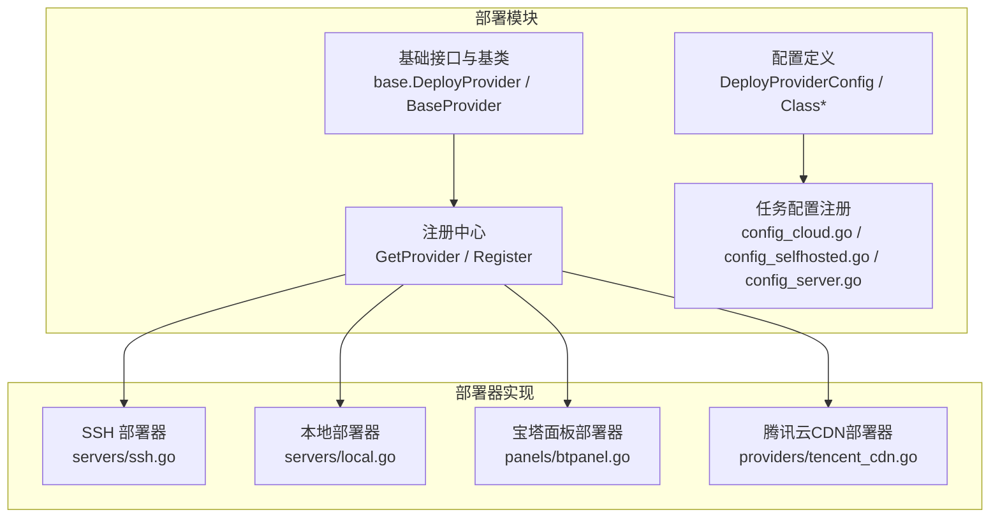
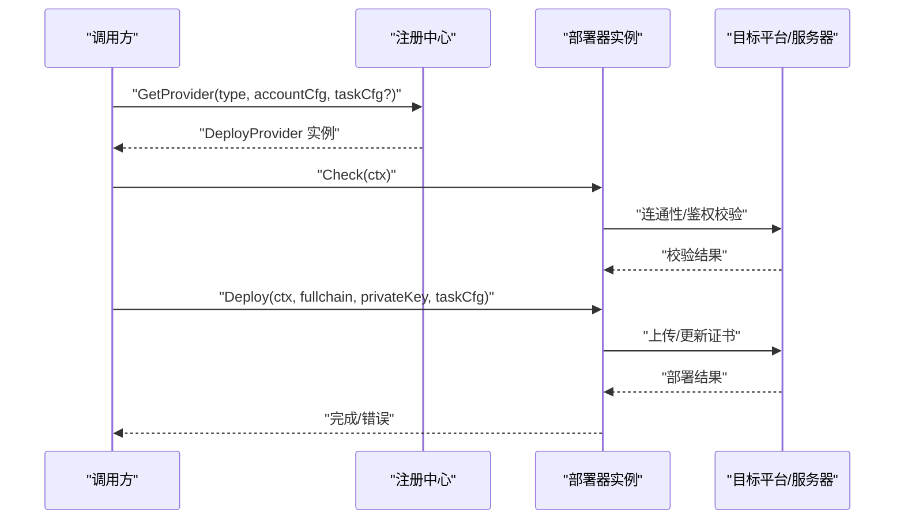
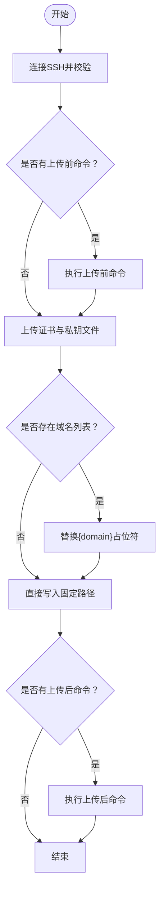
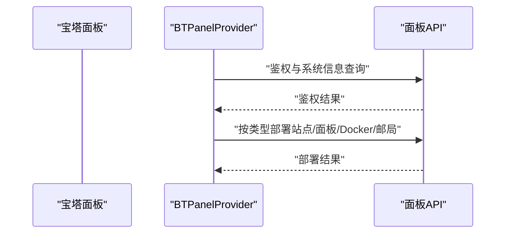
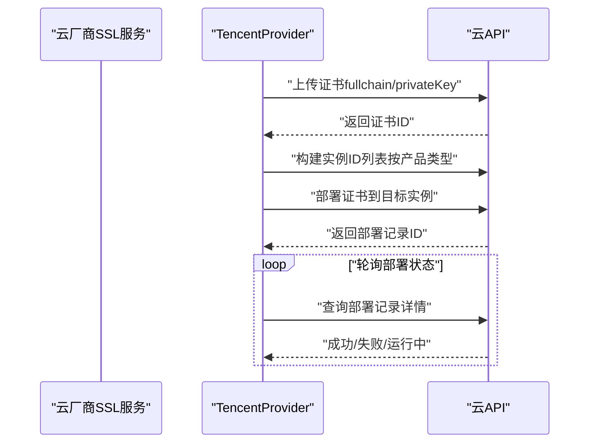
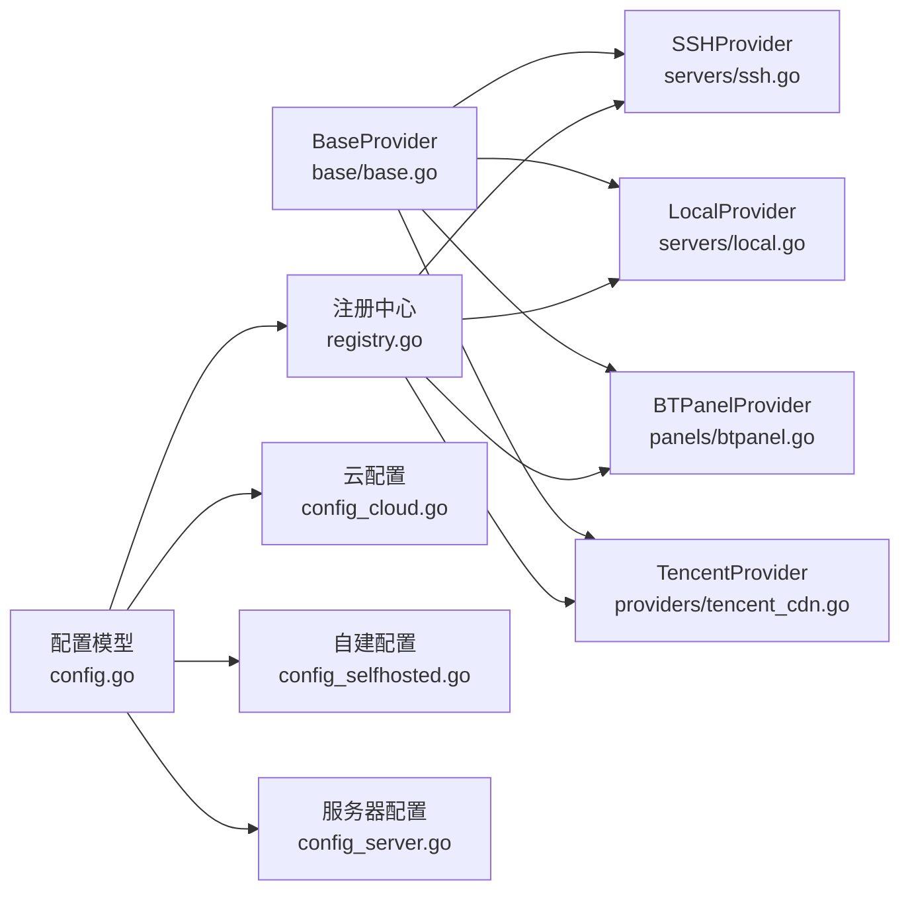

# 证书部署策略

<cite>
**本文引用的文件**
- [README.md](file://main/internal/cert/deploy/README.md)
- [config.go](file://main/internal/cert/deploy/config.go)
- [registry.go](file://main/internal/cert/deploy/registry.go)
- [base.go](file://main/internal/cert/deploy/base/base.go)
- [interface.go](file://main/internal/cert/interface.go)
- [providers.go](file://main/internal/cert/providers.go)
- [config_cloud.go](file://main/internal/cert/deploy/config_cloud.go)
- [config_selfhosted.go](file://main/internal/cert/deploy/config_selfhosted.go)
- [config_server.go](file://main/internal/cert/deploy/config_server.go)
- [ssh.go](file://main/internal/cert/deploy/servers/ssh.go)
- [local.go](file://main/internal/cert/deploy/servers/local.go)
- [btpanel.go](file://main/internal/cert/deploy/panels/btpanel.go)
- [tencent_cdn.go](file://main/internal/cert/deploy/providers/tencent_cdn.go)
</cite>

## 目录
1. [引言](#引言)
2. [项目结构](#项目结构)
3. [核心组件](#核心组件)
4. [架构总览](#架构总览)
5. [详细组件分析](#详细组件分析)
6. [依赖关系分析](#依赖关系分析)
7. [性能考虑](#性能考虑)
8. [故障排除指南](#故障排除指南)
9. [结论](#结论)
10. [附录](#附录)

## 引言
本文件面向证书部署策略的技术文档，系统化阐述该系统支持的多种证书部署方式：SSH远程部署、本地文件部署、CDN部署以及面板部署。文档覆盖部署器的配置参数、连接方式与部署流程，给出部署前准备（证书链验证、私钥保护、权限设置）、部署后验证与回滚思路，并提供常见场景的配置示例与故障排除方法，最后总结性能优化建议与安全最佳实践。

## 项目结构
部署模块采用“接口抽象 + 工厂注册 + 分类配置”的组织方式，按部署目标分为四类：
- 云服务商部署器（providers）：对接阿里云、腾讯云、AWS、华为云等多家云厂商的CDN/证书管理服务。
- 自建系统部署器（panels）：对接宝塔、1Panel、Kangle、MW面板、群晖、K8S等自建平台。
- 服务器部署器（servers）：通过SSH或FTP将证书文件上传至远端服务器，或写入本地文件系统。
- 其他部署器（others）：对接部分第三方CDN或WAF平台。

**图表来源**
- [base.go:43-102](file://main/internal/cert/deploy/base/base.go#L43-L102)
- [registry.go:27-66](file://main/internal/cert/deploy/registry.go#L27-L66)
- [config.go:19-49](file://main/internal/cert/deploy/config.go#L19-L49)
- [config_cloud.go:9-494](file://main/internal/cert/deploy/config_cloud.go#L9-L494)
- [config_selfhosted.go:9-371](file://main/internal/cert/deploy/config_selfhosted.go#L9-L371)
- [config_server.go:9-99](file://main/internal/cert/deploy/config_server.go#L9-L99)
- [ssh.go:21-29](file://main/internal/cert/deploy/servers/ssh.go#L21-L29)
- [local.go:19-27](file://main/internal/cert/deploy/servers/local.go#L19-L27)
- [btpanel.go:23-33](file://main/internal/cert/deploy/panels/btpanel.go#L23-L33)
- [tencent_cdn.go:48-58](file://main/internal/cert/deploy/providers/tencent_cdn.go#L48-L58)

**章节来源**
- [README.md:1-123](file://main/internal/cert/deploy/README.md#L1-L123)

## 核心组件
- 接口与基类
  - DeployProvider：定义 Check 与 Deploy 两个核心方法，以及 SetLogger。
  - BaseProvider：提供配置读取、日志记录、域名解析等通用能力。
- 注册中心
  - Register：注册部署器工厂。
  - GetProvider：按类型名获取部署器实例；支持从任务配置推导子产品类型（如 tencent_cdn）。
- 配置模型
  - DeployProviderConfig：描述部署器的分类、图标、说明、输入项与任务输入项。
  - ClassSelfHosted / ClassCloudService / ClassServer：三类部署器的分类常量与显示名称。
- 证书提供商接口（与部署相关）
  - Provider 接口：定义证书签发、吊销、取消等生命周期方法；部署阶段通常由签发结果驱动。

**章节来源**
- [base.go:43-102](file://main/internal/cert/deploy/base/base.go#L43-L102)
- [base.go:116-174](file://main/internal/cert/deploy/base/base.go#L116-L174)
- [registry.go:27-66](file://main/internal/cert/deploy/registry.go#L27-L66)
- [config.go:5-30](file://main/internal/cert/deploy/config.go#L5-L30)
- [interface.go:49-77](file://main/internal/cert/interface.go#L49-L77)

## 架构总览
部署流程遵循“配置解析 → 实例化部署器 → 执行部署 → 记录日志”的通用路径。不同部署器在连接方式、认证机制、目标介质上差异较大，但都通过统一接口对外暴露。

**图表来源**
- [registry.go:27-66](file://main/internal/cert/deploy/registry.go#L27-L66)
- [base.go:43-53](file://main/internal/cert/deploy/base/base.go#L43-L53)
- [ssh.go:31-38](file://main/internal/cert/deploy/servers/ssh.go#L31-L38)
- [tencent_cdn.go:68-85](file://main/internal/cert/deploy/providers/tencent_cdn.go#L68-L85)

## 详细组件分析

### SSH远程部署
- 连接与认证
  - 支持密码与私钥两种认证方式；私钥需为受支持的PEM格式；Windows场景需提前安装OpenSSH。
  - 建立SSH客户端后进行连通性检查。
- 证书写入
  - 支持PEM与PFX两种格式；PEM分别写入证书与私钥文件，权限分别为0644与0600；PFX写入单一文件。
  - 支持域名占位符替换（{domain}），便于多域名批量部署。
- 命令执行
  - 上传前/后可执行自定义命令（如重启Nginx），命令执行失败会返回错误。
- 权限与路径
  - 目标路径必须存在且具备写权限；目录不存在时会尝试创建。

**图表来源**
- [ssh.go:82-135](file://main/internal/cert/deploy/servers/ssh.go#L82-L135)
- [ssh.go:137-160](file://main/internal/cert/deploy/servers/ssh.go#L137-L160)

**章节来源**
- [ssh.go:31-179](file://main/internal/cert/deploy/servers/ssh.go#L31-L179)
- [config_server.go:10-42](file://main/internal/cert/deploy/config_server.go#L10-L42)

### 本地文件部署
- 路径与权限
  - 必须提供证书与私钥的保存路径；若路径不存在，会尝试创建目录。
  - 写入权限：证书0644，私钥0600。
- 命令执行
  - 支持部署完成后执行重启命令（Windows与Linux分别使用不同命令行）。
- 多域名支持
  - 通过域名占位符替换实现多域名批量写入。

**章节来源**
- [local.go:29-119](file://main/internal/cert/deploy/servers/local.go#L29-L119)
- [config_server.go:72-99](file://main/internal/cert/deploy/config_server.go#L72-L99)

### 面板部署（以宝塔为例）
- 连接与鉴权
  - 通过面板API进行鉴权与连通性检查；不同面板版本API略有差异。
- 部署类型
  - 支持网站证书、Docker站点证书、邮局域名证书、面板本身证书等多类型。
  - IIS站点需要PFX证书，当前实现提示暂不支持。
- 多站点批量
  - 支持站点名称列表批量部署。

**图表来源**
- [btpanel.go:35-59](file://main/internal/cert/deploy/panels/btpanel.go#L35-L59)
- [btpanel.go:117-176](file://main/internal/cert/deploy/panels/btpanel.go#L117-L176)

**章节来源**
- [btpanel.go:35-312](file://main/internal/cert/deploy/panels/btpanel.go#L35-L312)
- [config_selfhosted.go:10-33](file://main/internal/cert/deploy/config_selfhosted.go#L10-L33)

### CDN部署（以腾讯云CDN为例）
- 通用流程
  - 上传证书到云厂商证书管理服务，获取证书ID；
  - 根据产品类型构建实例ID列表（如域名、负载均衡ID、监听器ID等）；
  - 调用部署接口将证书绑定到目标实例；
  - 对于部分产品，提供部署记录查询以确认部署状态。
- 子产品支持
  - 支持CDN、EO（EdgeOne）、CLB、COS、WAF、TKE、SCF等；不同产品参数差异较大。
- 参数要点
  - SecretId/SecretKey 等凭证；
  - 产品类型与实例ID（如负载均衡ID、监听器ID、域名等）；
  - 部分产品需要指定地域ID。

**图表来源**
- [tencent_cdn.go:113-141](file://main/internal/cert/deploy/providers/tencent_cdn.go#L113-L141)
- [tencent_cdn.go:143-207](file://main/internal/cert/deploy/providers/tencent_cdn.go#L143-L207)
- [tencent_cdn.go:269-311](file://main/internal/cert/deploy/providers/tencent_cdn.go#L269-L311)

**章节来源**
- [tencent_cdn.go:68-487](file://main/internal/cert/deploy/providers/tencent_cdn.go#L68-L487)
- [config_cloud.go:49-80](file://main/internal/cert/deploy/config_cloud.go#L49-L80)

## 依赖关系分析
- 组件耦合
  - 部署器实现依赖基础基类与注册中心；不同部署器之间低耦合，通过统一接口交互。
  - 任务配置与账户配置分离：账户配置用于鉴权，任务配置用于本次部署的目标与参数。
- 外部依赖
  - 云厂商SDK（如腾讯云SSL SDK）；
  - SSH库（用于SSH部署）；
  - HTTP客户端（用于面板与云API交互）。

**图表来源**
- [base.go:98-102](file://main/internal/cert/deploy/base/base.go#L98-L102)
- [registry.go:27-66](file://main/internal/cert/deploy/registry.go#L27-L66)
- [config.go:19-49](file://main/internal/cert/deploy/config.go#L19-L49)
- [config_cloud.go:9-494](file://main/internal/cert/deploy/config_cloud.go#L9-L494)
- [config_selfhosted.go:9-371](file://main/internal/cert/deploy/config_selfhosted.go#L9-L371)
- [config_server.go:9-99](file://main/internal/cert/deploy/config_server.go#L9-L99)

**章节来源**
- [base.go:58-96](file://main/internal/cert/deploy/base/base.go#L58-L96)
- [registry.go:27-66](file://main/internal/cert/deploy/registry.go#L27-L66)

## 性能考虑
- 并发与重试
  - 当前部署器未见内置并发与重试机制；建议在上层调度器中引入重试与限速策略，避免对云API或面板造成瞬时压力。
- 传输效率
  - SSH部署使用SCP协议，适合小文件；若涉及大量证书或频繁部署，可评估压缩打包或增量更新策略。
- 资源占用
  - 面板与云API调用应设置合理超时时间，避免长时间阻塞；本地部署写文件时注意磁盘IO与权限变更开销。
- 缓存与幂等
  - 对于CDN部署，可在上层实现幂等判断（如证书ID一致则跳过部署），减少重复调用。

## 故障排除指南
- 连接失败
  - SSH：检查主机、端口、认证方式与凭据；确认防火墙放行与OpenSSH服务状态。
  - 面板：核对API地址、密钥与代理设置；确认面板版本差异导致的接口差异。
  - 云厂商：核对AK/SK、地域与产品参数；检查网络代理与DNS解析。
- 权限问题
  - SSH：确保目标路径存在且具备写权限；证书0644、私钥0600。
  - 本地：确认目录存在或可创建；执行重启命令前确保具备相应权限。
- 命令执行失败
  - 检查命令语法与上下文；在SSH部署中，命令输出会被捕获并返回，便于定位。
- 部署状态不确定
  - 云CDN部署可查询部署记录详情；若长时间处于“运行中”，建议检查实例ID与产品参数是否正确。

**章节来源**
- [ssh.go:162-174](file://main/internal/cert/deploy/servers/ssh.go#L162-L174)
- [btpanel.go:61-109](file://main/internal/cert/deploy/panels/btpanel.go#L61-L109)
- [tencent_cdn.go:269-311](file://main/internal/cert/deploy/providers/tencent_cdn.go#L269-L311)

## 结论
该证书部署策略通过统一接口与配置体系，实现了对多类部署目标的覆盖：从本地文件到远端服务器，从自建面板到多家云厂商CDN。其设计强调可扩展性与可维护性，便于新增部署器与适配新的部署场景。建议在生产环境中结合幂等判断、重试与限速策略，确保部署过程稳定高效。

## 附录

### 部署前准备清单
- 证书链验证
  - 确认签发结果包含完整链（含中间证书）；必要时进行链完整性校验。
- 私钥保护
  - 私钥文件权限设置为0600；避免明文存储；在CI/CD中使用受控密钥管理。
- 权限设置
  - SSH：确保目标路径存在且具备写权限；Windows路径使用正斜杠并以根路径开头。
  - 本地：确保写入目录存在或可创建；重启命令具备执行权限。
  - 面板/云：确保API密钥具备相应权限范围。

### 部署后验证步骤
- SSH/本地：检查目标路径文件存在且权限正确；执行重启命令后验证服务可用。
- 面板：确认面板证书列表中已更新；检查站点或面板SSL状态。
- CDN：通过浏览器或工具访问域名，确认证书链与有效期正常；必要时查询云厂商控制台状态。

### 回滚机制建议
- 保留上一版本证书与私钥备份；在部署失败时快速恢复。
- 对于CDN部署，若支持，可使用相同证书ID进行回滚或切换回原实例。
- 对于面板与本地部署，建议在执行重启命令前生成配置快照，以便回滚。

### 配置示例（路径指引）
- SSH部署
  - 账户配置：主机、端口、认证方式、用户名、密码或私钥、是否Windows。
  - 任务配置：证书保存路径、私钥保存路径、上传前/后命令、部署域名占位符。
  - 参考路径：[config_server.go:10-42](file://main/internal/cert/deploy/config_server.go#L10-L42)
- 本地部署
  - 账户配置：证书与私钥路径、重启命令。
  - 任务配置：域名占位符。
  - 参考路径：[config_server.go:72-99](file://main/internal/cert/deploy/config_server.go#L72-L99)
- 宝塔面板
  - 账户配置：面板地址、API密钥、面板版本、代理。
  - 任务配置：部署类型、站点名称列表、是否IIS。
  - 参考路径：[config_selfhosted.go:10-33](file://main/internal/cert/deploy/config_selfhosted.go#L10-L33)
- 腾讯云CDN
  - 账户配置：SecretId、SecretKey、代理。
  - 任务配置：产品类型、实例ID（如CLB/域名）、地域ID等。
  - 参考路径：[config_cloud.go:49-80](file://main/internal/cert/deploy/config_cloud.go#L49-L80)