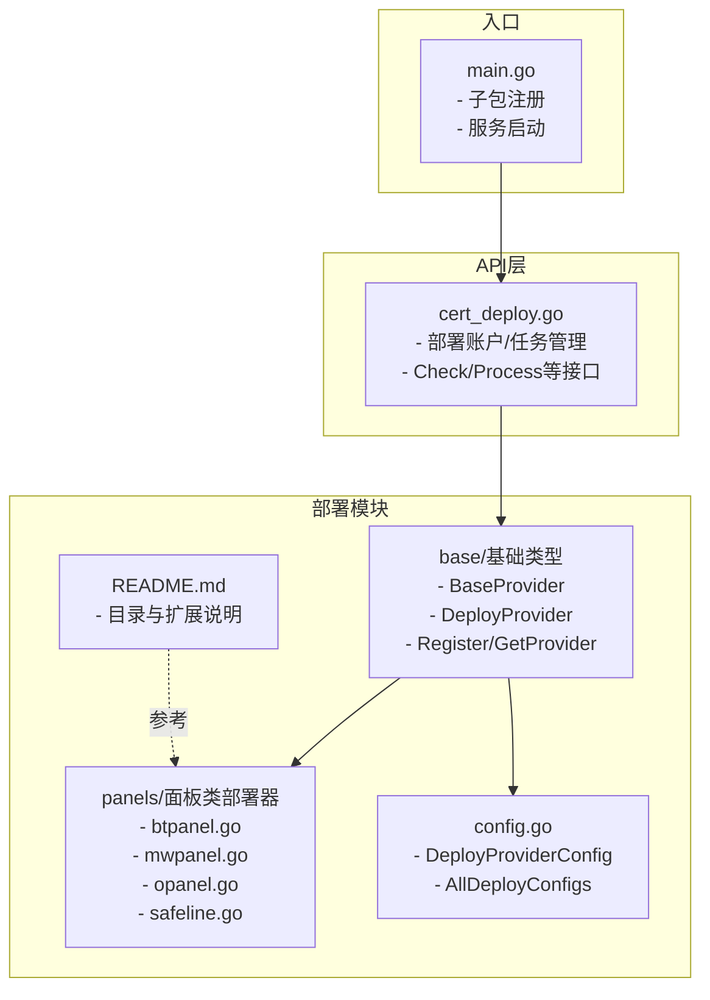
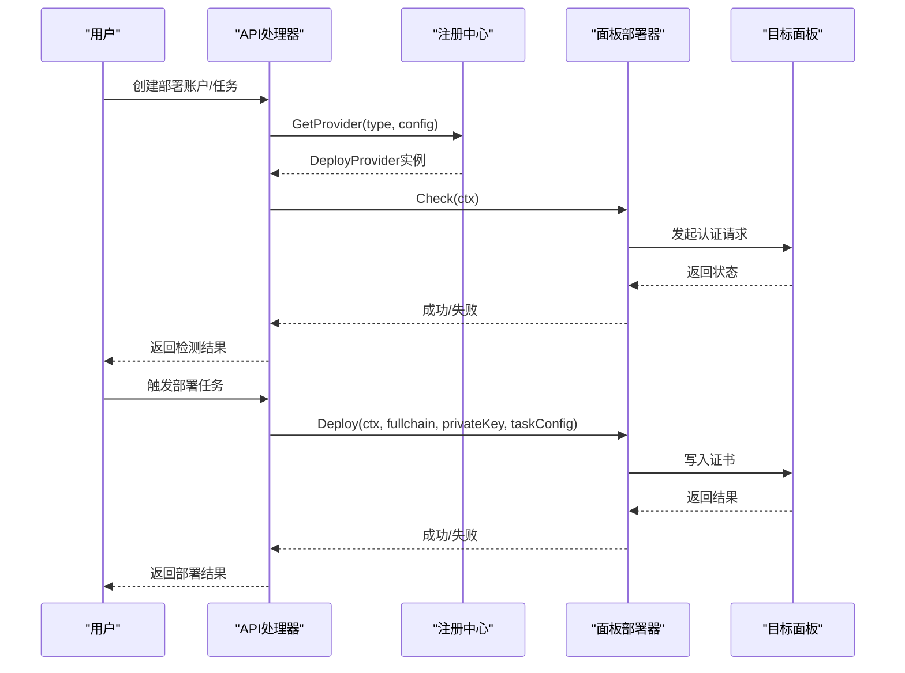
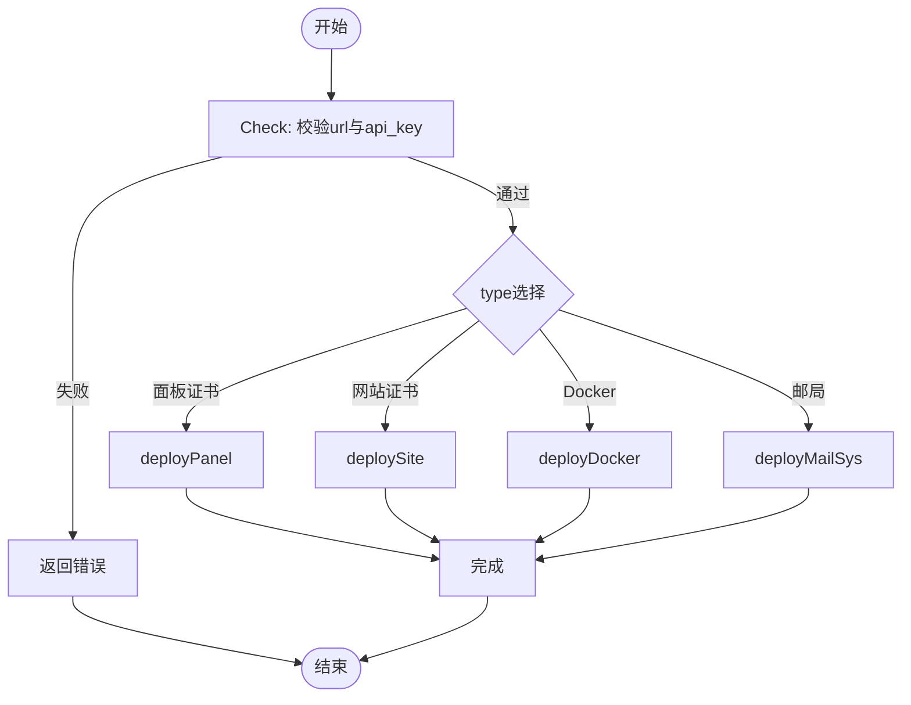
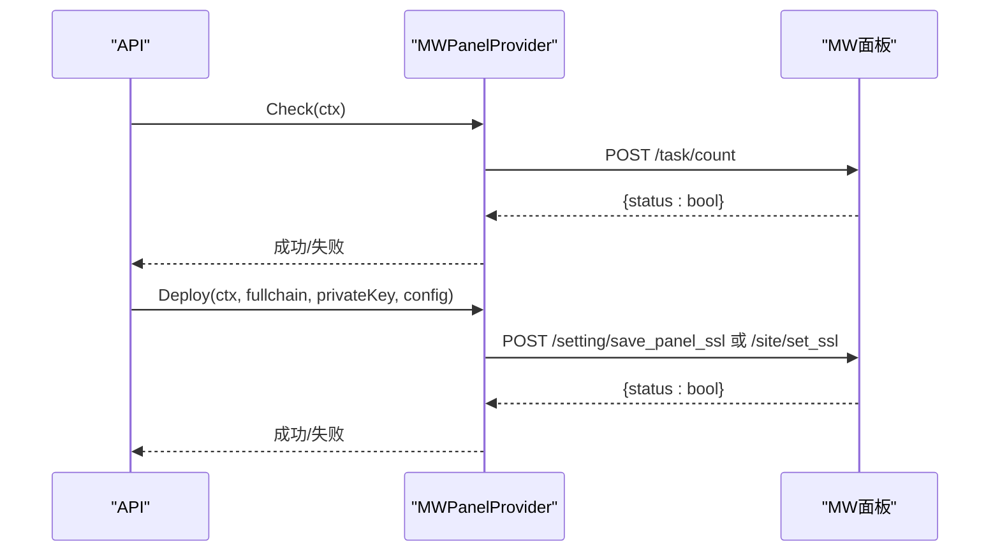
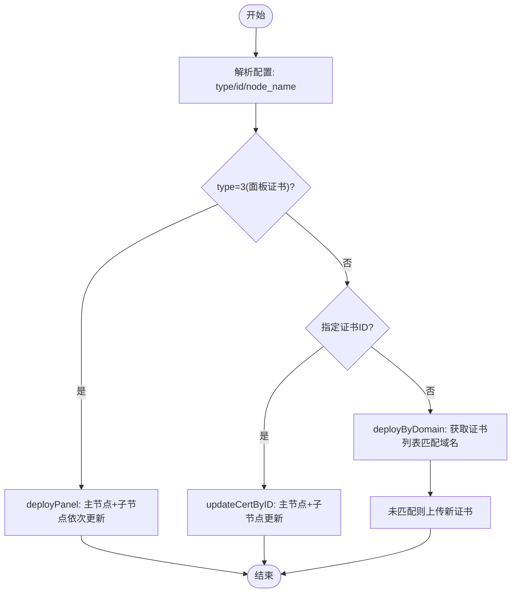

# 面板部署

<cite>
**本文引用的文件**
- [main.go](file://main/main.go)
- [README.md](file://main/internal/cert/deploy/README.md)
- [base.go](file://main/internal/cert/deploy/base/base.go)
- [config.go](file://main/internal/cert/deploy/config.go)
- [interface.go](file://main/internal/cert/interface.go)
- [btpanel.go](file://main/internal/cert/deploy/panels/btpanel.go)
- [mwpanel.go](file://main/internal/cert/deploy/panels/mwpanel.go)
- [opanel.go](file://main/internal/cert/deploy/panels/opanel.go)
- [safeline.go](file://main/internal/cert/deploy/panels/safeline.go)
- [cert_deploy.go](file://main/internal/api/handler/cert_deploy.go)
</cite>

## 目录
1. [简介](#简介)
2. [项目结构](#项目结构)
3. [核心组件](#核心组件)
4. [架构总览](#架构总览)
5. [详细组件分析](#详细组件分析)
6. [依赖分析](#依赖分析)
7. [性能考量](#性能考量)
8. [故障排查指南](#故障排查指南)
9. [结论](#结论)
10. [附录](#附录)

## 简介
本文件面向“面板部署”能力的技术文档，聚焦于将签发的证书自动部署到各类服务器管理面板（如宝塔、魔方面板、1Panel、雷池WAF等）。文档涵盖以下主题：
- 面板部署器的功能与应用场景
- 支持的面板类型及各自部署特性
- 面板部署的API调用方式与认证机制
- 部署配置项与接口调用方法
- 兼容性与版本适配策略
- 错误处理与状态查询机制
- 最佳实践与常见问题解决方案

## 项目结构
面板部署模块位于证书部署子系统中，采用“接口 + 工厂 + 基类”的设计，统一了不同面板的接入方式，并通过注册中心集中管理。



图表来源
- [main.go:40-44](file://main/main.go#L40-L44)
- [README.md:5-20](file://main/internal/cert/deploy/README.md#L5-L20)
- [base.go:43-96](file://main/internal/cert/deploy/base/base.go#L43-L96)
- [config.go:19-50](file://main/internal/cert/deploy/config.go#L19-L50)
- [cert_deploy.go:28-54](file://main/internal/api/handler/cert_deploy.go#L28-L54)

章节来源
- [main.go:40-44](file://main/main.go#L40-L44)
- [README.md:5-20](file://main/internal/cert/deploy/README.md#L5-L20)

## 核心组件
- 接口与工厂
  - DeployProvider：定义 Check 与 Deploy 两个核心方法，以及日志设置。
  - ProviderFactory：工厂函数类型，用于按类型创建具体部署器实例。
  - 注册中心：通过 Register(name, factory) 注册，GetProvider(name, config) 获取实例。
- 基类 BaseProvider
  - 统一配置读取（支持大小写不敏感、下划线与驼峰互转）、日志记录、域名解析等工具方法。
- 配置模型
  - DeployProviderConfig：描述部署器类型、分类、图标、输入项等。
  - AllDeployConfigs：全局注册表，供前端与API查询。

章节来源
- [base.go:43-96](file://main/internal/cert/deploy/base/base.go#L43-L96)
- [base.go:116-257](file://main/internal/cert/deploy/base/base.go#L116-L257)
- [config.go:19-50](file://main/internal/cert/deploy/config.go#L19-L50)

## 架构总览
面板部署的整体流程如下：
- 用户在前端创建“部署账户”，填写面板地址、密钥等配置。
- 后端API将配置交给注册中心获取对应部署器实例。
- 调用 Check 对账户连通性进行异步检测。
- 用户创建“部署任务”，选择账户与证书订单。
- 后端触发 Deploy 执行部署，将签发的 fullchain 与 private key 写入目标面板。



图表来源
- [cert_deploy.go:268-323](file://main/internal/api/handler/cert_deploy.go#L268-L323)
- [cert_deploy.go:717-800](file://main/internal/api/handler/cert_deploy.go#L717-L800)
- [base.go:70-84](file://main/internal/cert/deploy/base/base.go#L70-L84)

## 详细组件分析

### 宝塔面板（BTPanel）
- 支持场景
  - 部署面板自身SSL、网站站点SSL、Docker站点SSL、邮件系统SSL。
  - 通过版本字段区分不同API路径与参数。
- 认证机制
  - 使用时间戳与MD5拼接生成token，随POST请求发送。
  - 支持多版本API路径差异。
- 关键流程
  - Check：调用系统接口验证密钥有效性。
  - Deploy：根据type分支执行不同部署动作；支持IIS需PFX格式的限制提示。
- 配置要点
  - url、api_key/key、version、type、sites/domain、is_iis等。



图表来源
- [btpanel.go:35-59](file://main/internal/cert/deploy/panels/btpanel.go#L35-L59)
- [btpanel.go:117-176](file://main/internal/cert/deploy/panels/btpanel.go#L117-L176)
- [btpanel.go:178-207](file://main/internal/cert/deploy/panels/btpanel.go#L178-L207)
- [btpanel.go:209-247](file://main/internal/cert/deploy/panels/btpanel.go#L209-L247)
- [btpanel.go:266-280](file://main/internal/cert/deploy/panels/btpanel.go#L266-L280)

章节来源
- [btpanel.go:19-33](file://main/internal/cert/deploy/panels/btpanel.go#L19-L33)
- [btpanel.go:35-59](file://main/internal/cert/deploy/panels/btpanel.go#L35-L59)
- [btpanel.go:61-109](file://main/internal/cert/deploy/panels/btpanel.go#L61-L109)
- [btpanel.go:117-176](file://main/internal/cert/deploy/panels/btpanel.go#L117-L176)
- [btpanel.go:178-207](file://main/internal/cert/deploy/panels/btpanel.go#L178-L207)
- [btpanel.go:209-247](file://main/internal/cert/deploy/panels/btpanel.go#L209-L247)
- [btpanel.go:266-280](file://main/internal/cert/deploy/panels/btpanel.go#L266-L280)

### 魔方面板（MWPanel）
- 支持场景
  - 部署面板证书或网站证书。
  - 支持批量网站部署，逐个记录成功/失败。
- 认证机制
  - 使用 app-id 与 app-secret 作为请求头进行签名式鉴权。
- 关键流程
  - Check：调用任务计数接口验证连通性。
  - Deploy：根据type选择面板或站点部署，逐个尝试并统计成功数量。



图表来源
- [mwpanel.go:55-74](file://main/internal/cert/deploy/panels/mwpanel.go#L55-L74)
- [mwpanel.go:76-119](file://main/internal/cert/deploy/panels/mwpanel.go#L76-L119)
- [mwpanel.go:121-143](file://main/internal/cert/deploy/panels/mwpanel.go#L121-L143)
- [mwpanel.go:145-167](file://main/internal/cert/deploy/panels/mwpanel.go#L145-L167)

章节来源
- [mwpanel.go:16-35](file://main/internal/cert/deploy/panels/mwpanel.go#L16-L35)
- [mwpanel.go:55-74](file://main/internal/cert/deploy/panels/mwpanel.go#L55-L74)
- [mwpanel.go:76-119](file://main/internal/cert/deploy/panels/mwpanel.go#L76-L119)
- [mwpanel.go:121-143](file://main/internal/cert/deploy/panels/mwpanel.go#L121-L143)
- [mwpanel.go:145-167](file://main/internal/cert/deploy/panels/mwpanel.go#L145-L167)

### 1Panel（OPanel）
- 支持场景
  - 面板证书与网站证书两种部署模式。
  - 支持指定证书ID直接更新，或按域名自动匹配并上传。
  - 支持主节点与子节点（多节点）同时部署。
- 认证机制
  - 1Panel-Token + 1Panel-Timestamp + Content-Type: application/json。
  - 支持 v1/v2 API版本选择。
- 关键流程
  - Check：调用设置接口验证密钥。
  - Deploy：根据type与id/node_name决定走面板更新或站点匹配上传。



图表来源
- [opanel.go:55-68](file://main/internal/cert/deploy/panels/opanel.go#L55-L68)
- [opanel.go:70-89](file://main/internal/cert/deploy/panels/opanel.go#L70-L89)
- [opanel.go:91-141](file://main/internal/cert/deploy/panels/opanel.go#L91-L141)
- [opanel.go:158-206](file://main/internal/cert/deploy/panels/opanel.go#L158-L206)
- [opanel.go:208-246](file://main/internal/cert/deploy/panels/opanel.go#L208-L246)

章节来源
- [opanel.go:18-41](file://main/internal/cert/deploy/panels/opanel.go#L18-L41)
- [opanel.go:55-68](file://main/internal/cert/deploy/panels/opanel.go#L55-L68)
- [opanel.go:70-89](file://main/internal/cert/deploy/panels/opanel.go#L70-L89)
- [opanel.go:91-141](file://main/internal/cert/deploy/panels/opanel.go#L91-L141)
- [opanel.go:158-206](file://main/internal/cert/deploy/panels/opanel.go#L158-L206)
- [opanel.go:208-246](file://main/internal/cert/deploy/panels/opanel.go#L208-L246)

### 雷池WAF（SafeLine）
- 支持场景
  - 通过证书列表匹配域名，命中即更新；未命中则上传新证书。
- 认证机制
  - X-SLCE-API-TOKEN 请求头。
- 关键流程
  - Check：访问系统接口验证Token。
  - Deploy：遍历证书列表匹配域名，命中则更新，否则上传。

章节来源
- [safeline.go:33-43](file://main/internal/cert/deploy/panels/safeline.go#L33-L43)
- [safeline.go:45-150](file://main/internal/cert/deploy/panels/safeline.go#L45-L150)

## 依赖分析
- 面板部署器均实现 DeployProvider 接口，并通过 base.Register 注册到全局注册中心。
- API层通过 GetProvider(type, config) 获取实例，再调用 Check/Deploy。
- 配置模型 DeployProviderConfig 用于前端渲染与任务执行时的参数校验。

```mermaid
classDiagram
class DeployProvider {
    +Check(ctx) error
    +Deploy(ctx, fullchain, privateKey, config) error
    +SetLogger(logger)
}
class BaseProvider {
    +Config : map[string]interface{}
    +GetString(key) string
    +GetInt(key, defaultVal) int
    +Log(msg)
}
class BTPanelProvider
class MWPanelProvider
class OPanelProvider
class SafeLineProvider
DeployProvider <.. BaseProvider
BaseProvider <|-- BTPanelProvider
BaseProvider <|-- MWPanelProvider
BaseProvider <|-- OPanelProvider
BaseProvider <|-- SafeLineProvider
```

图表来源
- [base.go:43-53](file://main/internal/cert/deploy/base/base.go#L43-L53)
- [base.go:98-114](file://main/internal/cert/deploy/base/base.go#L98-L114)
- [btpanel.go:23-33](file://main/internal/cert/deploy/panels/btpanel.go#L23-L33)
- [mwpanel.go:37-53](file://main/internal/cert/deploy/panels/mwpanel.go#L37-L53)
- [opanel.go:43-53](file://main/internal/cert/deploy/panels/opanel.go#L43-L53)
- [safeline.go:21-31](file://main/internal/cert/deploy/panels/safeline.go#L21-L31)

章节来源
- [base.go:63-84](file://main/internal/cert/deploy/base/base.go#L63-L84)
- [config.go:19-50](file://main/internal/cert/deploy/config.go#L19-L50)

## 性能考量
- 并发与超时
  - 各面板部署器内部HTTP客户端均设置合理超时，避免阻塞。
- 批量部署
  - 魔方面板支持逐个网站部署并统计成功数，便于快速定位失败站点。
- 多节点部署
  - 1Panel支持主节点与子节点同步部署，建议在大规模场景下关注网络抖动与重试策略。
- 日志与可观测性
  - 基类提供统一日志接口，部署器内部记录关键步骤，便于排障。

## 故障排查指南
- 常见错误类型
  - 配置缺失：面板地址为空、密钥为空、站点列表为空等。
  - 认证失败：Token/Key错误、签名不正确、时间戳过期等。
  - 接口异常：HTTP状态码非200、响应体解析失败、业务错误码。
- 排查步骤
  - 使用“部署账户检测”接口进行连通性测试。
  - 查看部署任务状态与错误信息，结合日志定位失败节点。
  - 对于1Panel多节点部署，分别检查主节点与子节点的可用性。
- 建议
  - 面板侧确保网络可达、时间同步、防火墙放行。
  - 面板侧密钥/Token定期轮换时，及时更新系统中的配置。

章节来源
- [cert_deploy.go:268-323](file://main/internal/api/handler/cert_deploy.go#L268-L323)
- [cert_deploy.go:717-800](file://main/internal/api/handler/cert_deploy.go#L717-L800)
- [btpanel.go:35-59](file://main/internal/cert/deploy/panels/btpanel.go#L35-L59)
- [mwpanel.go:55-74](file://main/internal/cert/deploy/panels/mwpanel.go#L55-L74)
- [opanel.go:55-68](file://main/internal/cert/deploy/panels/opanel.go#L55-L68)

## 结论
面板部署模块以统一接口抽象了多类服务器管理面板的证书部署需求，通过注册中心与配置模型实现了灵活扩展与一致体验。针对不同面板的认证与API差异，模块提供了清晰的适配点与最佳实践，能够满足从单节点到多节点、从面板级到站点级的多样化部署场景。

## 附录

### 支持的面板类型与特性概览
- 宝塔面板：支持面板证书、站点证书、Docker、邮局；支持IIS提示。
- 魔方面板：支持面板证书与网站证书；支持批量站点部署。
- 1Panel：支持面板证书与网站证书；支持证书ID直改与按域名匹配；支持多节点。
- 雷池WAF：支持按域名匹配更新或上传新证书。

章节来源
- [README.md:53-73](file://main/internal/cert/deploy/README.md#L53-L73)
- [btpanel.go:138-176](file://main/internal/cert/deploy/panels/btpanel.go#L138-L176)
- [mwpanel.go:76-119](file://main/internal/cert/deploy/panels/mwpanel.go#L76-L119)
- [opanel.go:70-89](file://main/internal/cert/deploy/panels/opanel.go#L70-L89)
- [safeline.go:45-150](file://main/internal/cert/deploy/panels/safeline.go#L45-L150)

### 面板部署的API调用与认证机制
- API调用
  - 部署账户检测：POST /deploy/accounts/check
  - 部署任务执行：POST /deploy/process
- 认证机制
  - 宝塔：请求头携带时间戳与MD5 token。
  - 魔方面板：请求头携带 app-id 与 app-secret。
  - 1Panel：请求头携带 1Panel-Token 与 1Panel-Timestamp。
  - 雷池WAF：请求头携带 X-SLCE-API-TOKEN。

章节来源
- [cert_deploy.go:268-323](file://main/internal/api/handler/cert_deploy.go#L268-L323)
- [cert_deploy.go:717-800](file://main/internal/api/handler/cert_deploy.go#L717-L800)
- [btpanel.go:61-109](file://main/internal/cert/deploy/panels/btpanel.go#L61-L109)
- [mwpanel.go:169-209](file://main/internal/cert/deploy/panels/mwpanel.go#L169-L209)
- [opanel.go:387-455](file://main/internal/cert/deploy/panels/opanel.go#L387-L455)
- [safeline.go:152-220](file://main/internal/cert/deploy/panels/safeline.go#L152-L220)

### 部署配置示例与接口调用方法
- 配置示例（示意）
  - 宝塔：url、api_key、version、type、sites/domain、is_iis
  - 魔方面板：url、appid、appsecret、type、sites
  - 1Panel：url、key、version、type、id、node_name
  - 雷池WAF：url、token、domainList
- 接口调用
  - 创建部署账户：POST /deploy/accounts/add
  - 编辑/删除/详情：/deploy/accounts/edit、/delete、/detail
  - 列表与筛选：/deploy/list
  - 手动执行：/deploy/process

章节来源
- [opanel.go:21-40](file://main/internal/cert/deploy/panels/opanel.go#L21-L40)
- [btpanel.go:117-176](file://main/internal/cert/deploy/panels/btpanel.go#L117-L176)
- [mwpanel.go:19-34](file://main/internal/cert/deploy/panels/mwpanel.go#L19-L34)
- [safeline.go:45-150](file://main/internal/cert/deploy/panels/safeline.go#L45-L150)
- [cert_deploy.go:28-54](file://main/internal/api/handler/cert_deploy.go#L28-L54)
- [cert_deploy.go:501-580](file://main/internal/api/handler/cert_deploy.go#L501-L580)
- [cert_deploy.go:717-800](file://main/internal/api/handler/cert_deploy.go#L717-L800)

### 兼容性与版本适配策略
- 1Panel
  - 支持 v1/v2 API版本选择，默认使用 v2。
  - 多节点部署时仅在子节点请求头中设置 CurrentNode。
- 宝塔面板
  - 通过 version 字段区分不同API路径与参数。
- 魔方面板
  - 通过 app-id 与 app-secret 固定头部字段。
- 雷池WAF
  - 通过 X-SLCE-API-TOKEN 固定头部字段。

章节来源
- [opanel.go:387-455](file://main/internal/cert/deploy/panels/opanel.go#L387-L455)
- [btpanel.go:178-207](file://main/internal/cert/deploy/panels/btpanel.go#L178-L207)
- [mwpanel.go:169-209](file://main/internal/cert/deploy/panels/mwpanel.go#L169-L209)
- [safeline.go:152-220](file://main/internal/cert/deploy/panels/safeline.go#L152-L220)

### 错误处理与状态查询机制
- 错误处理
  - 面板返回业务错误码时，统一解析并返回人类可读消息。
  - HTTP异常与响应体解析失败均有明确错误提示。
- 状态查询
  - 部署任务状态枚举：待部署、部署中、已部署、部署失败。
  - 支持按账户、订单、状态筛选列表。

章节来源
- [opanel.go:441-455](file://main/internal/cert/deploy/panels/opanel.go#L441-L455)
- [btpanel.go:100-109](file://main/internal/cert/deploy/panels/btpanel.go#L100-L109)
- [mwpanel.go:133-142](file://main/internal/cert/deploy/panels/mwpanel.go#L133-L142)
- [cert_deploy.go:330-431](file://main/internal/api/handler/cert_deploy.go#L330-L431)

### 最佳实践
- 配置管理
  - 使用“部署账户”集中管理面板配置，避免散落各处。
  - 对于1Panel多节点，建议先主后子逐一验证。
- 安全与合规
  - 密钥/Token定期轮换，轮换后及时更新系统配置。
  - 仅在可信网络内访问面板API。
- 可靠性
  - 对批量部署任务，建议开启重试与告警。
  - 部署前先执行“账户检测”，降低失败率。