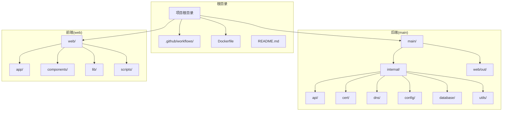
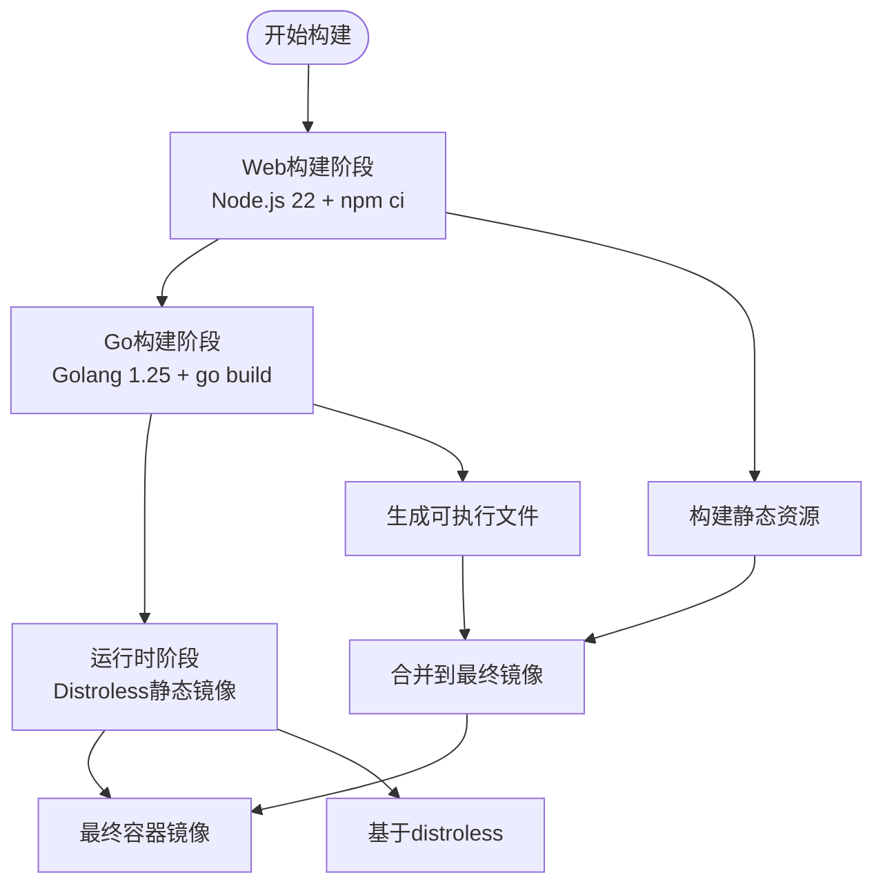
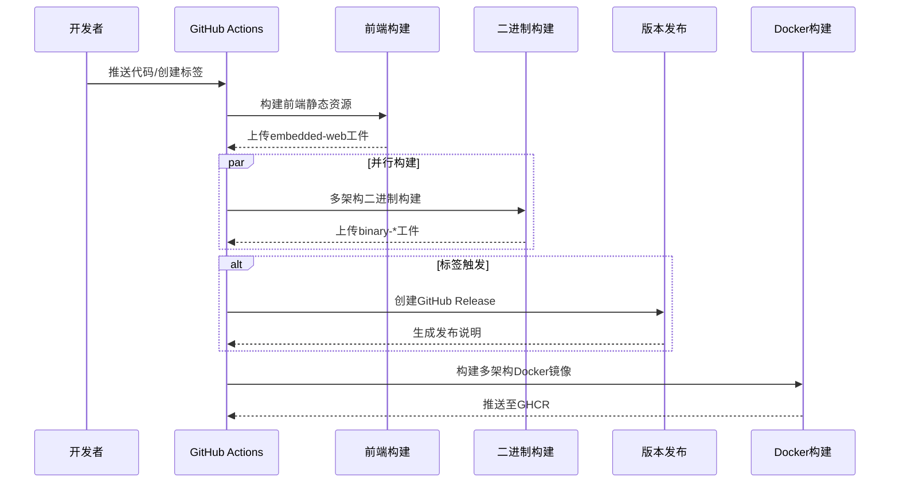
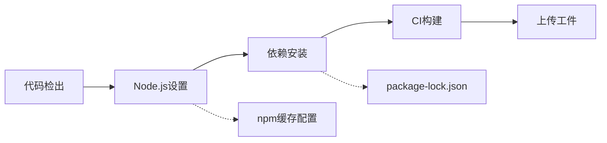
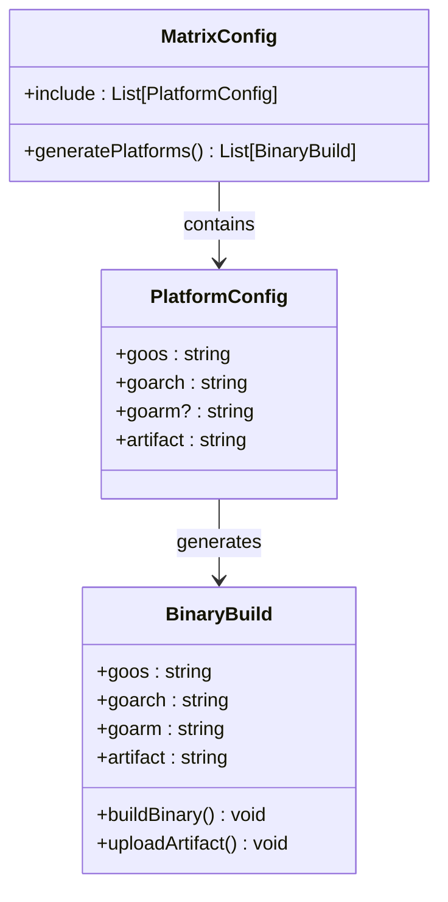
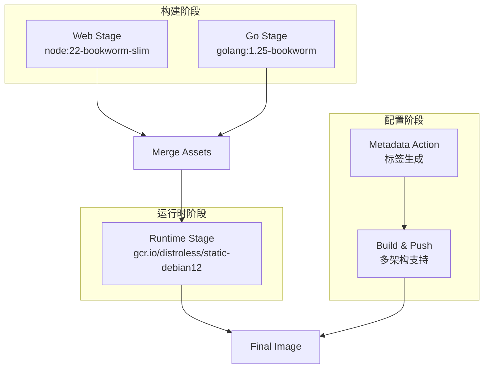
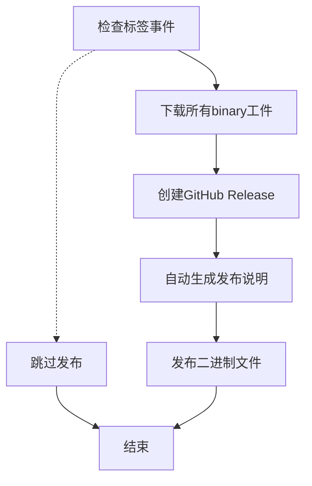
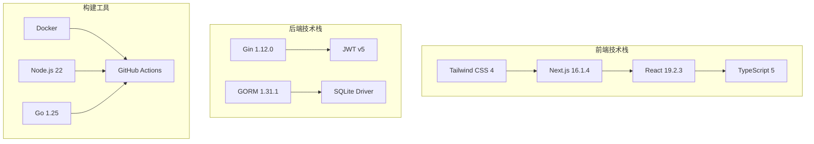

# CI/CD流水线配置

<cite>
**本文档引用的文件**
- [.github/workflows/build.yml](file://.github/workflows/build.yml)
- [Dockerfile](file://Dockerfile)
- [README.md](file://README.md)
- [main/go.mod](file://main/go.mod)
- [web/package.json](file://web/package.json)
- [web/.gitignore](file://web/.gitignore)
</cite>

## 目录
1. [简介](#简介)
2. [项目结构](#项目结构)
3. [核心组件](#核心组件)
4. [架构概览](#架构概览)
5. [详细组件分析](#详细组件分析)
6. [依赖关系分析](#依赖关系分析)
7. [性能考虑](#性能考虑)
8. [故障排除指南](#故障排除指南)
9. [结论](#结论)

## 简介

DNSPlane是一个基于Go语言开发的DNS管理系统，支持多平台DNS管理、SSL证书申请部署、容灾切换等功能。本项目采用GitHub Actions作为CI/CD流水线，实现了完整的自动化构建、测试、打包和部署流程。

该项目采用前后端分离的架构设计：
- **后端**: Go语言开发，基于Gin框架，支持多平台DNS服务商集成
- **前端**: Next.js应用，提供现代化的Web界面
- **容器化**: 使用Docker多阶段构建，支持多架构镜像推送

## 项目结构

DNSPlane项目采用清晰的分层架构，主要包含以下核心目录：

**图表来源**
- [README.md:14-40](file://README.md#L14-L40)

**章节来源**
- [README.md:14-40](file://README.md#L14-L40)

## 核心组件

### GitHub Actions工作流

项目的核心CI/CD配置位于`.github/workflows/build.yml`，该工作流定义了完整的构建和部署流程：

#### 触发条件
- 推送到主分支(main/master)
- 创建标签(版本发布)
- 拉取请求(Pull Request)
- 手动触发(workflow_dispatch)

#### 权限配置
工作流具有必要的权限用于内容和包的写入操作，确保能够发布版本和推送容器镜像。

#### 环境变量
- `IMAGE_NAME`: 定义GHCR镜像仓库的基础名称
- 自动转换为小写格式用于镜像名称

**章节来源**
- [.github/workflows/build.yml:1-16](file://.github/workflows/build.yml#L1-L16)

### 多架构构建矩阵

工作流定义了全面的多架构支持，覆盖主流操作系统和CPU架构：

| 操作系统 | CPU架构 | ARM变体 | 构建产物 |
|---------|---------|---------|----------|
| Linux | amd64 | - | linux-amd64 |
| Linux | arm64 | - | linux-arm64 |
| Linux | arm | v7 | linux-armv7 |
| Linux | 386 | - | linux-386 |
| Darwin/MacOS | amd64 | - | darwin-amd64 |
| Darwin/MacOS | arm64 | - | darwin-arm64 |
| Windows | amd64 | - | windows-amd64 |
| Windows | arm64 | - | windows-arm64 |
| FreeBSD | amd64 | - | freebsd-amd64 |
| FreeBSD | arm64 | - | freebsd-arm64 |
| Linux | ppc64le | - | linux-ppc64le |
| Linux | riscv64 | - | linux-riscv64 |

**章节来源**
- [.github/workflows/build.yml:44-85](file://.github/workflows/build.yml#L44-L85)

### Docker多阶段构建

项目使用Docker多阶段构建实现高效的镜像构建过程：

**图表来源**
- [Dockerfile:4-34](file://Dockerfile#L4-L34)

**章节来源**
- [Dockerfile:1-34](file://Dockerfile#L1-L34)

## 架构概览

DNSPlane的CI/CD流水线采用模块化设计，每个组件都有明确的职责分工：

**图表来源**
- [.github/workflows/build.yml:18-181](file://.github/workflows/build.yml#L18-L181)

### 构建流程详解

#### 前端构建阶段
1. **Node.js环境设置**: 使用Node.js 22，启用npm缓存
2. **依赖安装**: 使用`npm ci`确保依赖一致性
3. **构建执行**: 运行`build:ci`脚本生成生产环境静态资源
4. **工件上传**: 将构建结果上传为`embedded-web`工件

#### 二进制构建阶段
1. **多架构矩阵**: 并行构建支持12种不同架构组合
2. **交叉编译**: 使用Go的CGO_ENABLED=0进行静态链接
3. **工件管理**: 每个架构生成独立的binary-*工件
4. **构建优化**: 启用strip和压缩标志减少二进制大小

#### Docker构建阶段
1. **QEMU支持**: 启用多架构模拟确保正确构建
2. **Buildx配置**: 使用现代Docker Buildx工具链
3. **镜像标签**: 自动生成语义化版本标签
4. **缓存优化**: 利用GitHub Actions缓存提升构建速度

**章节来源**
- [.github/workflows/build.yml:18-181](file://.github/workflows/build.yml#L18-L181)

## 详细组件分析

### 前端构建组件

前端构建使用Next.js框架，配置了专门的CI构建脚本：

**图表来源**
- [.github/workflows/build.yml:18-40](file://.github/workflows/build.yml#L18-L40)

#### 构建配置特点
- **Node.js版本**: 22.x稳定版本
- **缓存策略**: 基于package-lock.json的npm缓存
- **构建命令**: 使用`build:ci`脚本确保生产环境构建
- **工件管理**: 生成的静态资源保存在`main/web`目录

**章节来源**
- [.github/workflows/build.yml:18-40](file://.github/workflows/build.yml#L18-L40)

### 二进制构建组件

二进制构建采用Go语言的交叉编译能力，支持广泛的平台组合：

**图表来源**
- [.github/workflows/build.yml:44-117](file://.github/workflows/build.yml#L44-L117)

#### 构建优化技术
- **静态链接**: CGO_ENABLED=0确保可执行文件独立性
- **符号剥离**: 使用`-s -w` ldflags移除调试信息
- **路径清理**: 启用`-trimpath`移除构建路径信息
- **并行构建**: 使用matrix策略最大化利用CI资源

**章节来源**
- [.github/workflows/build.yml:94-117](file://.github/workflows/build.yml#L94-L117)

### Docker构建组件

Docker构建采用多阶段策略，确保最终镜像的最小化和安全性：

**图表来源**
- [Dockerfile:12-34](file://Dockerfile#L12-L34)

#### 安全特性
- **最小化基础镜像**: 使用distroless静态镜像
- **非root用户**: 默认以nonroot用户运行
- **无包管理器**: 移除包管理器减少攻击面
- **只读文件系统**: 配置只读根文件系统

**章节来源**
- [Dockerfile:28-34](file://Dockerfile#L28-L34)

### 版本发布组件

版本发布功能仅在标签触发时激活，提供自动化的发布流程：

**图表来源**
- [.github/workflows/build.yml:119-134](file://.github/workflows/build.yml#L119-L134)

#### 发布特性
- **自动标签**: 基于git标签触发
- **工件聚合**: 合并所有架构的二进制文件
- **发布说明**: 自动生成GitHub Release说明
- **资产管理**: 自动上传所有构建产物

**章节来源**
- [.github/workflows/build.yml:119-134](file://.github/workflows/build.yml#L119-L134)

## 依赖关系分析

### 技术栈依赖

DNSPlane项目的技术栈依赖关系如下：

**图表来源**
- [main/go.mod:5-28](file://main/go.mod#L5-L28)
- [web/package.json:12-51](file://web/package.json#L12-L51)

### Go模块依赖

后端Go模块使用了丰富的第三方库，涵盖数据库、加密、DNS服务等多个领域：

#### 核心依赖分类
- **Web框架**: Gin (API路由和中间件)
- **数据库**: GORM (ORM框架)，SQLite驱动
- **加密**: JWT (身份认证)，Crypto (密码学)
- **DNS服务**: 多个云服务商SDK
- **工具库**: UUID生成，JSON处理，YAML解析

**章节来源**
- [main/go.mod:1-96](file://main/go.mod#L1-L96)

### 前端依赖

前端使用现代化的Next.js技术栈，提供了完整的开发和构建工具链：

#### 开发依赖
- **ESLint 9**: 代码质量检查
- **Tailwind CSS 4**: 实用优先的CSS框架
- **TypeScript 5**: 类型安全的JavaScript扩展

#### 运行时依赖
- **Next.js 16.1.4**: React全栈框架
- **Radix UI**: 无障碍UI组件库
- **Lucide React**: 简洁图标库
- **Sonner**: 通知组件

**章节来源**
- [web/package.json:41-51](file://web/package.json#L41-L51)

## 性能考虑

### 构建性能优化

#### 缓存策略
- **npm缓存**: 基于package-lock.json的依赖缓存
- **Go模块缓存**: 自动缓存Go依赖
- **Docker层缓存**: 利用Docker构建缓存机制
- **GitHub Actions缓存**: 使用GHA缓存提升构建速度

#### 并行构建
- **矩阵构建**: 12个架构并行构建
- **流水线并行**: 前端和二进制构建并行执行
- **资源优化**: 合理分配CI资源避免冲突

#### 构建优化技术
- **静态链接**: 减少运行时依赖
- **符号剥离**: 减小二进制文件大小
- **多阶段构建**: 最小化最终镜像

### 存储和工件管理

#### 工件保留策略
- **embedded-web工件**: 14天保留期
- **binary-*工件**: 14天保留期
- **清理策略**: 自动清理过期工件

#### 存储优化
- **工件压缩**: 减少存储空间占用
- **增量构建**: 利用缓存避免重复构建

## 故障排除指南

### 常见问题诊断

#### 前端构建失败
**症状**: 前端构建阶段失败
**可能原因**:
- npm依赖安装失败
- 构建脚本执行错误
- Node.js版本不兼容

**解决方案**:
1. 检查package.json依赖配置
2. 验证npm ci命令执行
3. 确认Node.js 22环境可用

#### 二进制构建失败
**症状**: 交叉编译过程中出现错误
**可能原因**:
- Go版本不兼容
- CGO相关依赖缺失
- 架构特定问题

**解决方案**:
1. 检查Go 1.25环境配置
2. 验证交叉编译工具链
3. 测试单个架构构建

#### Docker构建失败
**症状**: 容器镜像构建失败
**可能原因**:
- 多架构支持问题
- QEMU模拟器配置错误
- 镜像推送权限问题

**解决方案**:
1. 检查QEMU配置
2. 验证GHCR登录凭据
3. 确认Docker Buildx设置

### 调试技巧

#### 日志分析
- **启用详细日志**: 在GitHub Actions中查看完整构建日志
- **分阶段调试**: 逐个阶段验证构建结果
- **工件检查**: 下载并检查生成的工件文件

#### 本地验证
- **本地构建测试**: 在本地机器上验证构建流程
- **Docker镜像测试**: 验证容器镜像功能
- **多架构验证**: 测试不同架构的二进制文件

### 性能优化建议

#### 构建时间优化
- **缓存优化**: 合理配置各种缓存策略
- **并行度调整**: 根据CI资源调整并行度
- **依赖优化**: 减少不必要的依赖安装

#### 成本控制
- **构建时间监控**: 监控CI资源使用情况
- **工件清理**: 及时清理过期工件
- **缓存管理**: 优化缓存使用策略

## 结论

DNSPlane的CI/CD流水线设计体现了现代DevOps的最佳实践，具有以下显著特点：

### 技术优势
- **全面的多架构支持**: 覆盖12种主流架构组合
- **高效的构建流程**: 多阶段构建和并行处理
- **安全的容器化**: 基于distroless的最小化镜像
- **自动化的发布**: 标签触发的完整发布流程

### 架构特色
- **模块化设计**: 每个组件职责明确
- **可扩展性**: 易于添加新的构建目标
- **可靠性**: 完善的错误处理和重试机制
- **可观测性**: 详细的日志和监控

### 最佳实践
该流水线为类似项目提供了优秀的参考模板，特别是在多架构构建、容器化部署和自动化发布方面展现了最佳实践。通过合理的缓存策略、并行构建和安全配置，实现了高效可靠的CI/CD流程。