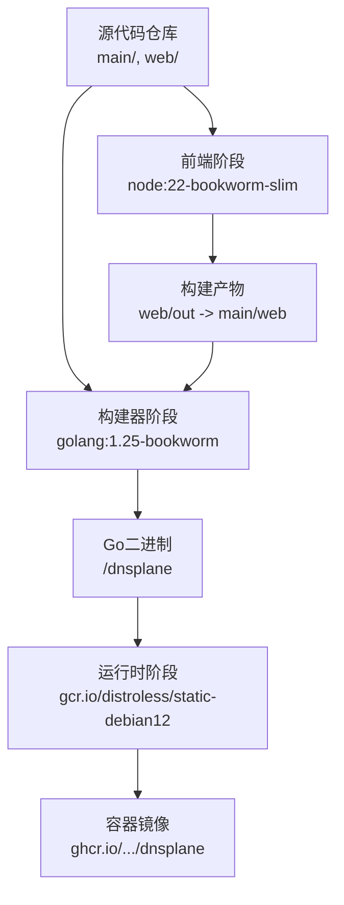
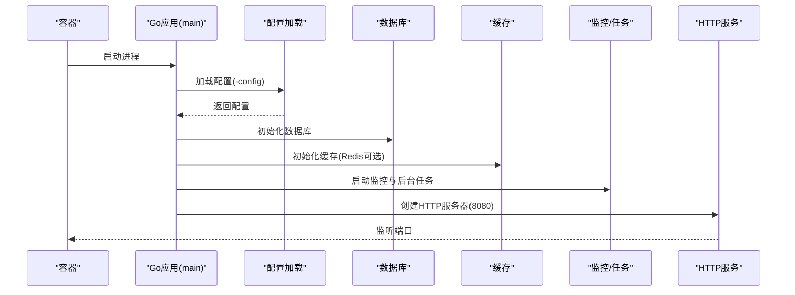
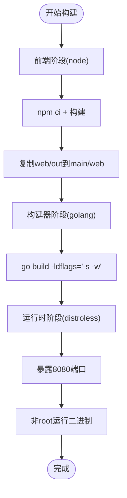
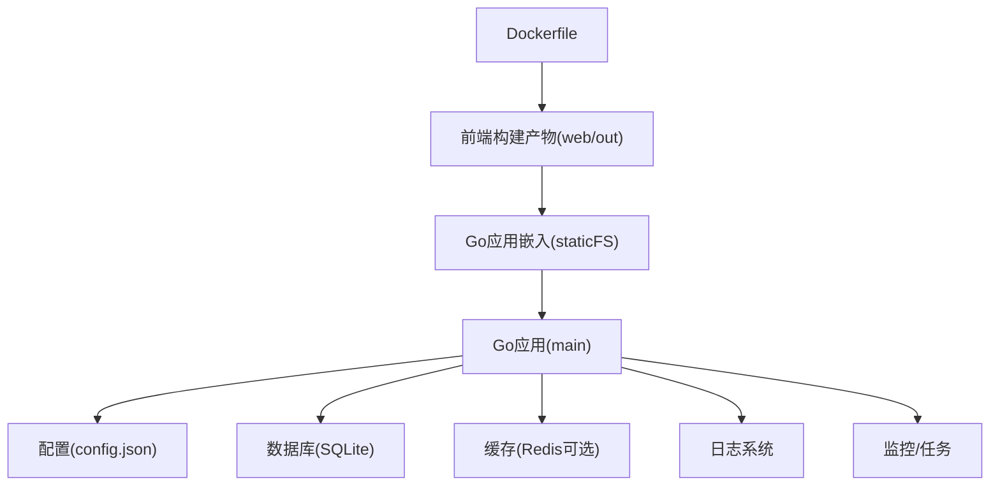

# Docker容器化部署

<cite>
**本文档引用的文件**
- [Dockerfile](file://Dockerfile)
- [.dockerignore](file://.dockerignore)
- [README.md](file://README.md)
- [.github/workflows/build.yml](file://.github/workflows/build.yml)
- [main.go](file://main/main.go)
- [config.go](file://main/internal/config/config.go)
- [logger.go](file://main/internal/logger/logger.go)
- [store.go](file://main/internal/logstore/store.go)
- [package.json](file://web/package.json)
- [next.config.ts](file://web/next.config.ts)
</cite>

## 目录
1. [简介](#简介)
2. [项目结构](#项目结构)
3. [核心组件](#核心组件)
4. [架构总览](#架构总览)
5. [详细组件分析](#详细组件分析)
6. [依赖关系分析](#依赖关系分析)
7. [性能考虑](#性能考虑)
8. [故障排除指南](#故障排除指南)
9. [结论](#结论)
10. [附录](#附录)

## 简介
本指南面向DNSPlane项目的Docker容器化部署，涵盖多阶段构建流程、前端构建与Go应用编译的优化策略、镜像构建参数与平台兼容性、单容器与多容器部署方案、环境变量与数据卷最佳实践、健康检查与重启策略、网络与端口映射、日志收集与调试技巧，以及常见问题排查。

## 项目结构
DNSPlane采用前后端分离的多阶段Docker构建策略：
- 前端（Next.js）在独立阶段构建，产物输出到main/web目录，供Go应用嵌入。
- Go后端在builder阶段交叉编译，最终复制到distroless基础镜像中运行。

图表来源
- [Dockerfile:1-34](file://Dockerfile#L1-L34)
- [build.yml:135-181](file://.github/workflows/build.yml#L135-L181)

章节来源
- [Dockerfile:1-34](file://Dockerfile#L1-L34)
- [README.md:14-40](file://README.md#L14-L40)

## 核心组件
- 多阶段构建
  - 前端阶段：基于node:22-bookworm-slim，执行npm ci与构建，产物输出至web/out并复制到main/web供Go嵌入。
  - 构建器阶段：基于golang:1.25-bookworm，下载Go模块并交叉编译，设置CGO_ENABLED=0、GOOS/GOARCH/GOARM等目标平台变量。
  - 运行时阶段：基于gcr.io/distroless/static-debian12:nonroot，非root用户运行，暴露8080端口。
- 平台兼容性
  - 支持linux/amd64、linux/arm64、linux/arm/v7等架构，通过GitHub Actions矩阵构建。
- 镜像元数据与标签
  - 使用docker/metadata-action生成语义化标签（版本、主次版本、分支、sha），推送至GHCR。

章节来源
- [Dockerfile:4-33](file://Dockerfile#L4-L33)
- [build.yml:44-85](file://.github/workflows/build.yml#L44-L85)
- [build.yml:170-179](file://.github/workflows/build.yml#L170-L179)

## 架构总览
容器内运行流程：容器启动后，Go应用加载配置、初始化数据库与缓存、注册监控与后台任务，然后启动HTTP服务监听8080端口。

图表来源
- [main.go:52-147](file://main/main.go#L52-L147)
- [config.go:82-123](file://main/internal/config/config.go#L82-L123)

## 详细组件分析

### Dockerfile多阶段构建详解
- 前端构建优化
  - 使用BUILDPLATFORM进行构建，避免多架构并行npm ci导致网络超时。
  - 设置npm重试参数，提升CI稳定性。
  - 构建完成后将web/out同步到main/web，供Go应用嵌入。
- Go应用编译优化
  - CGO_ENABLED=0，生成纯静态二进制，减小体积与攻击面。
  - 通过TARGETOS/TARGETARCH/TARGETVARIANT设置交叉编译参数，支持arm/v7。
  - 使用-l flag精简符号表，-s -w去除符号与调试信息，进一步减小体积。
- 运行时安全
  - 使用distroless非root镜像，降低权限风险。
  - 暴露8080端口，ENTRYPOINT直接启动二进制。

图表来源
- [Dockerfile:4-33](file://Dockerfile#L4-L33)

章节来源
- [Dockerfile:2-10](file://Dockerfile#L2-L10)
- [Dockerfile:12-26](file://Dockerfile#L12-L26)
- [Dockerfile:28-33](file://Dockerfile#L28-L33)

### 前端构建与产物集成
- 构建脚本
  - package.json定义build:ci脚本，使用Next.js生产构建并同步到main/web。
  - next.config.ts设置输出为静态导出，禁用TS错误阻塞构建。
- 产物位置
  - 构建产物位于web/out，Dockerfile将其复制到main/web，Go应用通过embed打包进二进制。

章节来源
- [package.json:5-11](file://web/package.json#L5-L11)
- [next.config.ts:3-13](file://web/next.config.ts#L3-L13)
- [Dockerfile:20](file://Dockerfile#L20)

### Go应用配置与运行
- 配置加载
  - 默认配置文件路径为config.json，可通过命令行参数覆盖。
  - 默认监听0.0.0.0:8080，支持release模式。
  - 数据库默认SQLite，文件路径为data/dnsplane.db。
- 运行时行为
  - 初始化数据库、缓存、验证码、日志存储。
  - 启动监控与后台任务管理器。
  - 提供优雅关闭，处理SIGINT/SIGTERM信号。

章节来源
- [main.go:52-147](file://main/main.go#L52-L147)
- [config.go:82-123](file://main/internal/config/config.go#L82-L123)

### 日志与持久化
- 日志
  - 内置日志轮转与清理，单文件最大10MB，最多保留30个备份，最多30天。
  - 日志目录为logs，容器内默认工作目录下。
- 数据持久化
  - SQLite数据库默认位于data/dnsplane.db，建议通过数据卷挂载到外部存储。
  - 日志目录logs建议挂载，便于容器外查看与备份。

章节来源
- [logger.go:16-20](file://main/internal/logger/logger.go#L16-L20)
- [logger.go:107-171](file://main/internal/logger/logger.go#L107-L171)
- [config.go:91-98](file://main/internal/config/config.go#L91-L98)

### GitHub Actions构建流程
- 前端Artifacts：构建web并上传embedded-web。
- 多平台二进制：矩阵构建linux/{amd64,arm64,arm/v7,386,ppc64le,riscv64}及darwin/windows/freebsd各架构。
- Docker镜像：使用QEMU与Buildx，按分支/标签生成标签，推送至GHCR。

章节来源
- [build.yml:18-40](file://.github/workflows/build.yml#L18-L40)
- [build.yml:41-118](file://.github/workflows/build.yml#L41-L118)
- [build.yml:135-181](file://.github/workflows/build.yml#L135-L181)

## 依赖关系分析
- 组件耦合
  - Dockerfile将前端产物嵌入Go应用，Go应用依赖配置、数据库、缓存、日志与监控模块。
- 外部依赖
  - 运行时镜像distroless，无shell与包管理器，减少攻击面。
  - 可选Redis用于缓存与日志存储。

图表来源
- [Dockerfile:20](file://Dockerfile#L20)
- [main.go:49-50](file://main/main.go#L49-L50)
- [config.go:82-123](file://main/internal/config/config.go#L82-L123)

## 性能考虑
- 构建性能
  - 前端阶段使用BUILDPLATFORM避免重复npm ci，提升多架构构建效率。
  - Go构建设置CGO_ENABLED=0与精简链接标志，减小二进制体积与启动时间。
- 运行性能
  - distroless镜像无多余软件包，启动更快、占用更少。
  - 建议启用Redis缓存，提升日志与会话性能。
- 稳定性
  - CI中设置npm重试参数，降低网络波动影响。
  - 日志轮转与清理策略避免磁盘膨胀。

章节来源
- [Dockerfile:2-10](file://Dockerfile#L2-L10)
- [Dockerfile:21-26](file://Dockerfile#L21-L26)
- [logger.go:16-20](file://main/internal/logger/logger.go#L16-L20)

## 故障排除指南
- 容器启动后无法访问
  - 检查端口映射：确保容器8080映射到主机可用端口。
  - 检查防火墙与安全组规则。
- 首次安装页面未出现
  - 访问根路径而非/api，确认前端静态文件已正确嵌入。
- 数据库文件权限问题
  - 确保/data目录可写，或通过数据卷挂载到有权限的目录。
- 日志无法查看
  - 检查logs目录是否挂载，或查看容器标准输出。
- Redis连接失败
  - 确认Redis地址、密码、DB索引配置正确，网络可达。

章节来源
- [README.md:70-75](file://README.md#L70-L75)
- [config.go:91-98](file://main/internal/config/config.go#L91-L98)
- [logger.go:358-384](file://main/internal/logger/logger.go#L358-L384)

## 结论
DNSPlane的Docker容器化方案通过多阶段构建实现了前端与后端的高效集成，结合distroless运行时镜像提升了安全性与性能。配合合理的数据卷与日志策略，可在单容器与多容器环境中稳定运行。建议在生产环境启用Redis缓存、持久化数据与日志目录，并通过CI/CD自动化构建与发布。

## 附录

### 单容器部署步骤
- 拉取镜像
  - 使用GHCR中的官方镜像，或自行构建。
- 运行容器
  - 映射8080端口到主机。
  - 挂载/data与/logs目录到持久化存储。
  - 如需Redis，提供Redis连接参数。
- 首次访问
  - 浏览器访问http://host:port，进入安装向导。

章节来源
- [Dockerfile:32](file://Dockerfile#L32)
- [README.md:70-75](file://README.md#L70-L75)

### 多容器编排（Compose示例思路）
- 服务
  - dnsplane：运行DNSPlane容器，挂载数据与日志卷。
  - redis：可选，提供缓存与日志存储。
  - nginx：可选，作为反向代理与TLS终止。
- 网络
  - 使用自定义桥接网络，服务间通过服务名通信。
- 健康检查
  - 对8080端口进行HTTP GET /api/install/status或类似探针。
- 重启策略
  - 建议使用unless-stopped或on-failure。

[本节为概念性说明，不直接对应具体源文件，故无“章节来源”]

### 环境变量与配置文件
- 配置文件
  - config.json：server.host/port/mode、database.driver/file_path、jwt.secret/expire_hour、log_cleanup、redis等。
- 命令行参数
  - -config：指定配置文件路径。
- 环境变量
  - 当前Dockerfile未定义额外环境变量，建议通过挂载配置文件或使用外部配置中心。

章节来源
- [config.go:12-19](file://main/internal/config/config.go#L12-L19)
- [config.go:82-123](file://main/internal/config/config.go#L82-L123)
- [main.go:53](file://main/main.go#L53)

### 数据卷挂载最佳实践
- /app/data：SQLite数据库文件目录（默认data/dnsplane.db所在目录）。
- /app/logs：日志目录（默认logs）。
- 建议使用命名卷或绑定挂载到可靠存储。

章节来源
- [config.go:91-98](file://main/internal/config/config.go#L91-L98)
- [logger.go:107-171](file://main/internal/logger/logger.go#L107-L171)

### 健康检查与重启策略
- 健康检查
  - 探针：对8080端口进行HTTP GET，检查安装状态或根路径。
  - 建议使用探针URL：/api/install/status或/。
- 重启策略
  - unless-stopped：容器异常退出时自动重启。
  - on-failure：失败时重启，可限制重试次数。

[本节为通用实践说明，不直接对应具体源文件，故无“章节来源”]

### 网络与端口映射
- 暴露端口：8080（TCP）。
- 映射建议：将容器8080映射到主机8080或更高可用端口。
- 反向代理：建议通过nginx或同机其他反向代理统一入口与TLS终止。

章节来源
- [Dockerfile:32](file://Dockerfile#L32)
- [config.go:86-90](file://main/internal/config/config.go#L86-L90)

### 日志收集与调试
- 容器日志
  - 使用docker logs查看标准输出与错误输出。
- 文件日志
  - 挂载/app/logs目录到宿主机，定期备份。
- 调试建议
  - 临时开启debug模式（config.json server.mode），观察详细日志。
  - 检查数据库与Redis连通性。

章节来源
- [logger.go:307-325](file://main/internal/logger/logger.go#L307-L325)
- [logger.go:358-384](file://main/internal/logger/logger.go#L358-L384)
- [config.go:89](file://main/internal/config/config.go#L89)