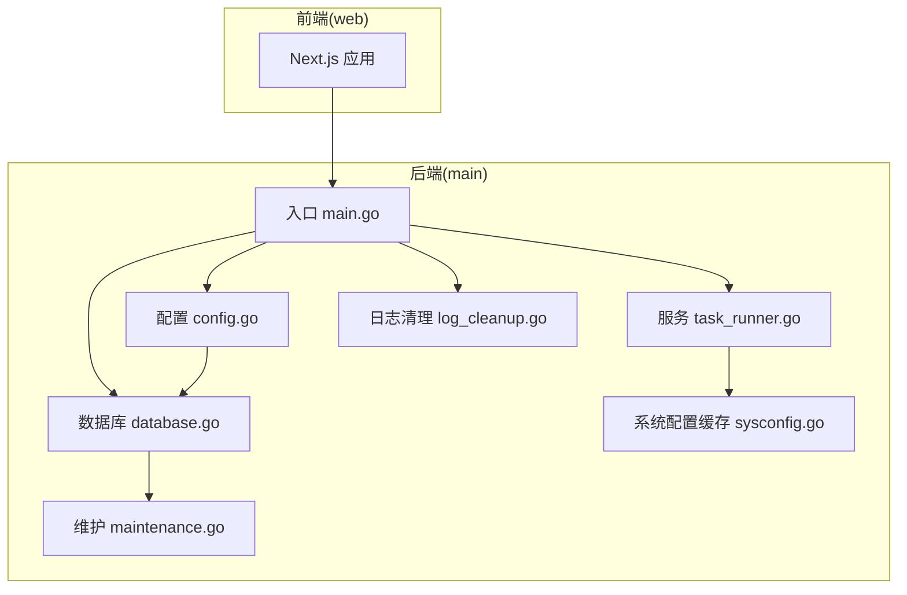
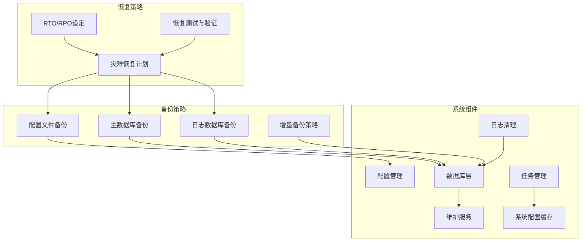
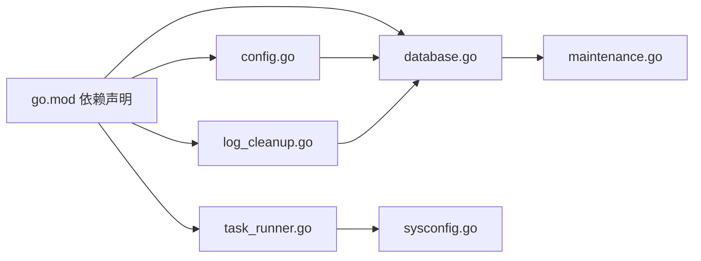

# 备份恢复策略

<cite>
**本文引用的文件**
- [main.go](file://main/main.go)
- [go.mod](file://main/go.mod)
- [config.go](file://main/internal/config/config.go)
- [database.go](file://main/internal/database/database.go)
- [maintenance.go](file://main/internal/database/maintenance.go)
- [models.go](file://main/internal/models/models.go)
- [sysconfig.go](file://main/internal/sysconfig/sysconfig.go)
- [task_runner.go](file://main/internal/service/task_runner.go)
- [log_cleanup.go](file://main/internal/service/log_cleanup.go)
- [REDIS_AND_DBCACHE.md](file://main/docs/REDIS_AND_DBCACHE.md)
- [README.md](file://README.md)
</cite>

## 目录
1. [简介](#简介)
2. [项目结构](#项目结构)
3. [核心组件](#核心组件)
4. [架构总览](#架构总览)
5. [详细组件分析](#详细组件分析)
6. [依赖分析](#依赖分析)
7. [性能考量](#性能考量)
8. [故障排查指南](#故障排查指南)
9. [结论](#结论)
10. [附录](#附录)

## 简介
本指南面向DNSPlane系统的运维与开发团队，提供一套完整的备份与恢复策略，涵盖数据库备份的定期与增量策略、配置文件与用户数据的备份方案与存储位置、灾难恢复计划与RTO/RPO指标设定方法、数据迁移与版本升级的备份保护措施、备份数据的加密与访问控制、恢复测试与验证流程、备份监控与告警机制以及备份失败与数据损坏的应急处理方案。

## 项目结构
DNSPlane采用前后端分离架构：后端为Go语言实现，前端为Next.js应用。数据库层包含主数据库与两个独立的SQLite日志数据库（审计日志与请求日志）。系统通过配置文件控制运行参数，包括数据库驱动、文件路径、JWT密钥、Redis缓存等。

**图表来源**
- [main.go:52-147](file://main/main.go#L52-L147)
- [config.go:82-123](file://main/internal/config/config.go#L82-L123)
- [database.go:73-149](file://main/internal/database/database.go#L73-L149)
- [maintenance.go:110-133](file://main/internal/database/maintenance.go#L110-L133)
- [task_runner.go:49-75](file://main/internal/service/task_runner.go#L49-L75)
- [log_cleanup.go:19-32](file://main/internal/service/log_cleanup.go#L19-L32)
- [sysconfig.go:27-36](file://main/internal/sysconfig/sysconfig.go#L27-L36)

**章节来源**
- [README.md:14-40](file://README.md#L14-L40)
- [main.go:52-147](file://main/main.go#L52-L147)
- [config.go:82-123](file://main/internal/config/config.go#L82-L123)

## 核心组件
- 配置管理：集中管理服务器、数据库、JWT、Redis、日志清理等配置项，支持默认值与动态保存。
- 数据库层：主数据库与两个独立的日志数据库（审计日志、请求日志），支持SQLite与MySQL，具备迁移、初始化与维护能力。
- 维护服务：周期性清理过期日志、执行VACUUM与优化，保障数据库体积与性能。
- 任务管理：证书续期、部署执行、到期通知等后台任务，配合系统配置缓存减少DB压力。
- 日志清理：按条数与时间维度清理请求日志，避免无限增长。
- 系统配置缓存：对SysConfig进行带缓存读取，提升后台任务效率。

**章节来源**
- [config.go:12-161](file://main/internal/config/config.go#L12-L161)
- [database.go:20-149](file://main/internal/database/database.go#L20-L149)
- [maintenance.go:14-98](file://main/internal/database/maintenance.go#L14-L98)
- [task_runner.go:24-43](file://main/internal/service/task_runner.go#L24-L43)
- [log_cleanup.go:12-63](file://main/internal/service/log_cleanup.go#L12-L63)
- [sysconfig.go:18-36](file://main/internal/sysconfig/sysconfig.go#L18-L36)

## 架构总览
下图展示备份与恢复策略在系统中的位置与交互关系：备份策略围绕配置文件、主数据库与日志数据库展开；恢复策略依赖备份文件与维护脚本；监控与告警贯穿备份执行过程。

**图表来源**
- [config.go:82-123](file://main/internal/config/config.go#L82-L123)
- [database.go:73-149](file://main/internal/database/database.go#L73-L149)
- [maintenance.go:110-133](file://main/internal/database/maintenance.go#L110-L133)
- [task_runner.go:49-75](file://main/internal/service/task_runner.go#L49-L75)
- [log_cleanup.go:19-32](file://main/internal/service/log_cleanup.go#L19-L32)
- [sysconfig.go:27-36](file://main/internal/sysconfig/sysconfig.go#L27-L36)

## 详细组件分析

### 数据库备份策略
- 备份对象
  - 主数据库：存放用户、账户、域名、权限、证书、定时任务、系统配置等核心业务数据。
  - 审计日志数据库：存放操作日志、证书日志、监控检查日志等审计数据。
  - 请求日志数据库：存放API请求日志，支持按天与条数清理。
- 备份介质与位置
  - SQLite：数据库文件位于配置文件指定的路径，主库与日志库分别独立文件。
  - MySQL：由外部数据库实例负责备份与归档。
- 备份频率与类型
  - 定期全量备份：建议每日执行一次全量备份，作为恢复基线。
  - 增量备份：SQLite场景下可结合WAL模式与定期checkpoint，但需结合外部工具实现增量归档；MySQL场景下使用数据库自带binlog或物理备份工具实现增量。
- 备份保留与轮转
  - 依据RPO设定保留周期（如7-30天），结合磁盘容量制定轮转策略。
- 备份校验与加密
  - 备份完成后执行一致性校验（如校验和、导入验证）。
  - 对备份文件进行加密存储，密钥由安全系统管理。
- 备份元数据
  - 记录备份时间、版本、校验信息、存储位置等元数据，便于恢复定位。

**章节来源**
- [database.go:73-149](file://main/internal/database/database.go#L73-L149)
- [config.go:55-65](file://main/internal/config/config.go#L55-L65)
- [maintenance.go:16-26](file://main/internal/database/maintenance.go#L16-L26)

### 配置文件与用户数据备份
- 配置文件
  - 位置：config.json（默认路径），可通过命令行参数指定。
  - 内容：服务器、数据库、JWT、Redis、日志清理等配置。
  - 备份：随主数据库备份一同归档，或单独加密存储。
- 用户数据
  - 用户、OAuth、账户、域名、权限、证书、定时任务等业务数据均在主数据库中。
  - 审计日志与请求日志分别在独立数据库中，需同步备份。
- 存储位置
  - SQLite文件：由配置中的file_path决定；日志库路径由主库路径推导。
  - MySQL：由数据库实例的存储策略决定。

**章节来源**
- [config.go:82-123](file://main/internal/config/config.go#L82-L123)
- [config.go:55-65](file://main/internal/config/config.go#L55-L65)
- [README.md:76-96](file://README.md#L76-L96)

### 灾难恢复计划与RTO/RPO设定
- RTO（恢复时间目标）
  - 生产环境：建议RTO ≤ 4小时；关键业务 ≤ 1小时。
  - 验证与演练：每季度进行恢复演练，记录实际恢复时间并持续优化。
- RPO（恢复点目标）
  - 生产环境：建议RPO ≤ 15分钟；关键业务 ≤ 5分钟。
  - 通过定期全量+增量备份、WAL checkpoint与binlog归档实现。
- 恢复流程
  - 识别故障类型（单机故障、网络故障、数据损坏）。
  - 选择最近可用备份（考虑RPO），准备恢复环境（相同版本或兼容版本）。
  - 执行恢复脚本（导入数据库、重建索引、启动服务），验证数据完整性与功能。
  - 发布变更公告，观察系统运行状态。

**章节来源**
- [maintenance.go:16-26](file://main/internal/database/maintenance.go#L16-L26)
- [database.go:301-325](file://main/internal/database/database.go#L301-L325)

### 数据迁移与版本升级的备份保护
- 升级前备份
  - 执行一次全量备份，记录备份元数据。
  - 对比新旧版本差异，评估影响范围。
- 迁移策略
  - 采用“双写+校验”或“停服迁移”，确保数据一致性。
  - 对于数据库迁移，先在测试环境验证迁移脚本与数据转换逻辑。
- 回滚预案
  - 准备回滚脚本与恢复流程，确保能在升级失败时快速回退。
- 版本兼容性
  - 保持数据库结构与索引的向前兼容，必要时提供灰度发布策略。

**章节来源**
- [database.go:233-292](file://main/internal/database/database.go#L233-L292)
- [maintenance.go:61-98](file://main/internal/database/maintenance.go#L61-L98)

### 备份数据的加密存储与访问控制
- 加密存储
  - 备份文件使用强加密算法（如AES-256）加密，密钥由KMS或HSM管理。
  - 传输过程中使用TLS，存储介质启用磁盘加密。
- 访问控制
  - 限制备份文件的访问权限（最小权限原则），仅授权人员可访问。
  - 对备份存储位置进行网络隔离与审计。
- 密钥管理
  - 密钥轮换周期不超过一年，密钥生命周期受控。
  - 备份文件与密钥分开存储，降低泄露风险。

**章节来源**
- [REDIS_AND_DBCACHE.md:1-28](file://main/docs/REDIS_AND_DBCACHE.md#L1-L28)

### 恢复测试与验证流程
- 测试计划
  - 制定不同场景的恢复测试（全量恢复、增量恢复、跨版本恢复）。
  - 明确测试步骤、预期结果与验收标准。
- 执行流程
  - 从备份中恢复到隔离环境，执行数据一致性检查与功能回归测试。
  - 记录测试结果与问题，形成改进建议。
- 验证指标
  - 恢复时间（RTO）、数据丢失量（RPO）、功能可用性、性能表现。

**章节来源**
- [maintenance.go:165-197](file://main/internal/database/maintenance.go#L165-L197)

### 备份监控与告警机制
- 监控指标
  - 备份成功率、备份耗时、备份文件大小、存储空间使用率、加密完整性校验结果。
- 告警策略
  - 备份失败、超时、校验失败、存储空间不足等事件触发即时告警。
  - 告警通道：邮件、IM、电话等多渠道覆盖。
- 日志与审计
  - 备份执行日志与审计日志留存至少90天，支持追溯与取证。

**章节来源**
- [log_cleanup.go:65-127](file://main/internal/service/log_cleanup.go#L65-L127)
- [maintenance.go:275-325](file://main/internal/database/maintenance.go#L275-L325)

### 备份失败与数据损坏的应急处理
- 快速响应
  - 立即触发告警，组织应急小组，评估影响范围与恢复优先级。
- 恢复手段
  - 使用上一个可用备份进行恢复；若存在多个备份，选择最接近故障时间点的备份。
  - 对于数据损坏，优先尝试数据库内置修复（如VACUUM、ANALYZE），必要时回滚到最近一次完整备份。
- 事后复盘
  - 分析失败原因，完善备份策略与监控告警，更新应急预案。

**章节来源**
- [maintenance.go:275-325](file://main/internal/database/maintenance.go#L275-L325)
- [database.go:301-325](file://main/internal/database/database.go#L301-L325)

## 依赖分析
- 外部依赖
  - 数据库驱动：SQLite与MySQL驱动，用于连接与迁移。
  - 缓存：Redis连接池，用于日志列表与系统配置缓存。
  - Web框架：Gin，提供HTTP服务与路由。
- 内部依赖
  - 配置模块为数据库、缓存、日志清理等模块提供统一配置入口。
  - 数据库模块为维护服务、任务管理、日志清理提供底层支撑。
  - 系统配置缓存为任务管理提供高效读取能力。

**图表来源**
- [go.mod:5-28](file://main/go.mod#L5-L28)
- [config.go:82-123](file://main/internal/config/config.go#L82-L123)
- [database.go:73-149](file://main/internal/database/database.go#L73-L149)
- [maintenance.go:110-133](file://main/internal/database/maintenance.go#L110-L133)
- [task_runner.go:49-75](file://main/internal/service/task_runner.go#L49-L75)
- [log_cleanup.go:19-32](file://main/internal/service/log_cleanup.go#L19-L32)
- [sysconfig.go:27-36](file://main/internal/sysconfig/sysconfig.go#L27-L36)

**章节来源**
- [go.mod:5-28](file://main/go.mod#L5-L28)

## 性能考量
- 数据库优化
  - SQLite：启用WAL模式、调整缓存与连接池参数，定期执行VACUUM与ANALYZE。
  - MySQL：合理设置连接池大小与生命周期，优化查询与索引。
- 维护策略
  - 定期清理过期日志，避免表膨胀；按配置动态调整保留策略。
- 缓存与读写分离
  - Redis缓存热点数据，减轻数据库压力；系统配置缓存减少DB查询开销。

**章节来源**
- [database.go:34-71](file://main/internal/database/database.go#L34-L71)
- [maintenance.go:275-325](file://main/internal/database/maintenance.go#L275-L325)
- [sysconfig.go:27-36](file://main/internal/sysconfig/sysconfig.go#L27-L36)

## 故障排查指南
- 备份失败
  - 检查备份脚本与权限、存储空间、网络连通性。
  - 查看备份日志与告警，定位具体失败环节。
- 数据库异常
  - 使用维护服务执行VACUUM与ANALYZE，检查WAL状态与journal_mode。
  - 对于SQLite，确认文件权限与磁盘空间充足。
- 日志清理异常
  - 检查配置项与清理阈值，确认RequestDB连接正常。
- 任务执行异常
  - 查看任务管理器日志，确认系统配置缓存可用性与通知渠道配置。

**章节来源**
- [maintenance.go:275-325](file://main/internal/database/maintenance.go#L275-L325)
- [log_cleanup.go:65-127](file://main/internal/service/log_cleanup.go#L65-L127)
- [task_runner.go:164-182](file://main/internal/service/task_runner.go#L164-L182)

## 结论
通过建立完善的备份与恢复策略，DNSPlane能够在生产环境中实现高可用与数据安全。定期全量备份、增量备份与严格的加密存储相结合，辅以RTO/RPO指标与恢复演练，可显著降低业务中断风险。同时，监控与告警机制、应急处理流程与版本升级保护措施共同构成完整的运维保障体系。

## 附录
- 备份清单
  - 配置文件：config.json
  - 主数据库：主库文件
  - 审计日志数据库：审计日志库文件
  - 请求日志数据库：请求日志库文件
- 恢复清单
  - 备份文件、恢复脚本、版本兼容性说明、验证清单
- 常用命令
  - SQLite：VACUUM、PRAGMA wal_checkpoint、PRAGMA optimize
  - MySQL：物理备份/逻辑备份、binlog归档