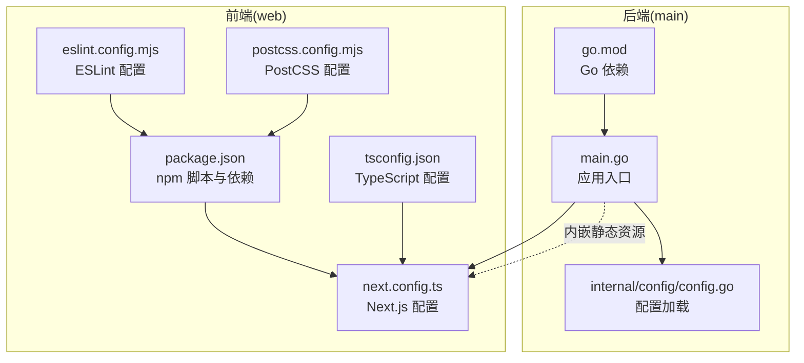
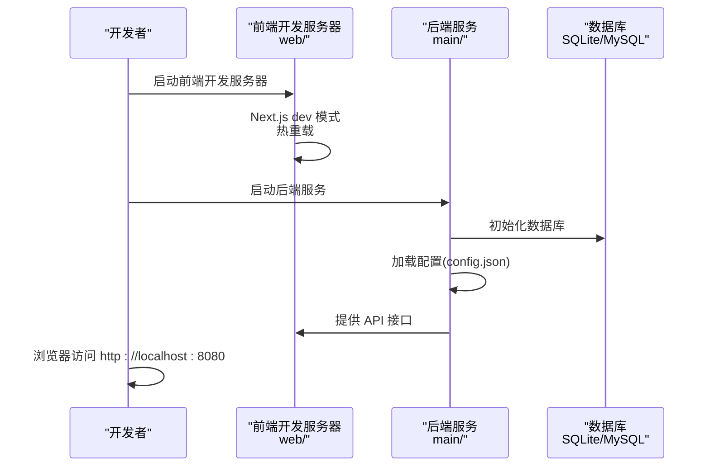
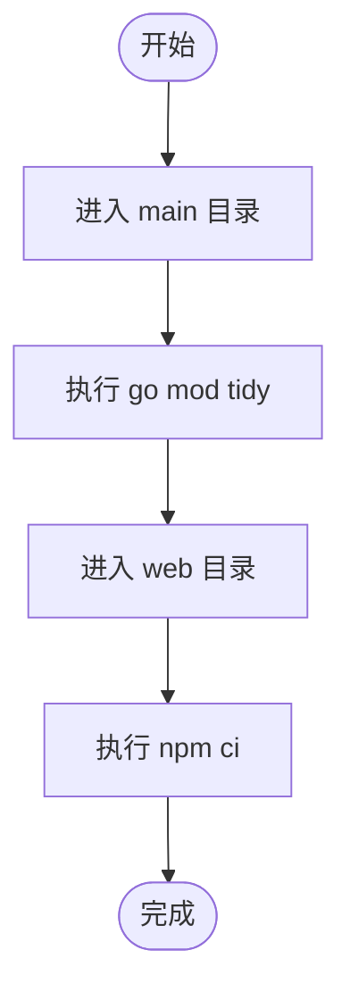
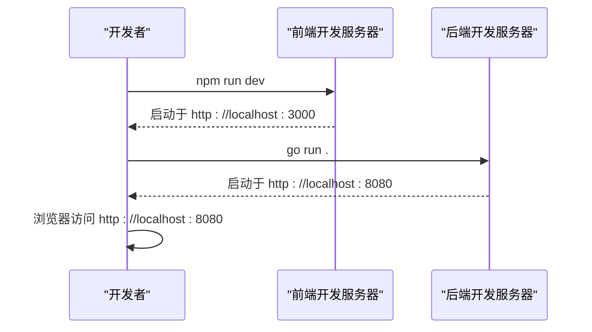
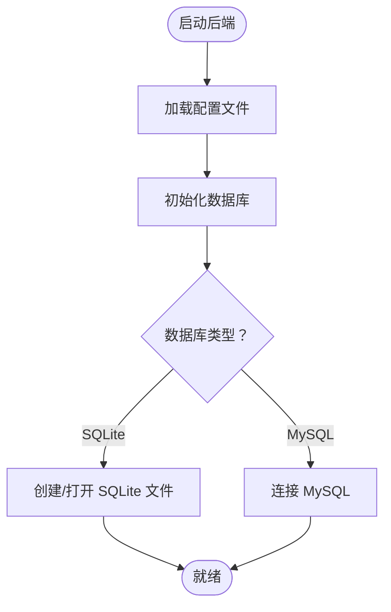
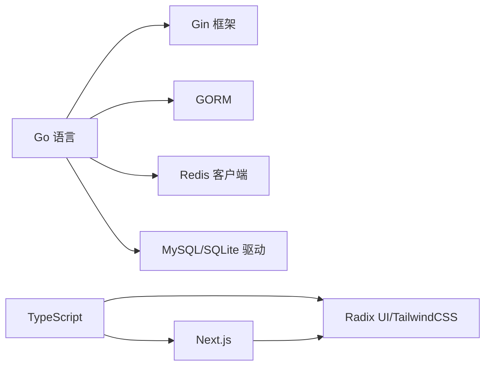

# 开发环境搭建

<cite>
**本文引用的文件**
- [README.md](file://README.md)
- [Dockerfile](file://Dockerfile)
- [build.yml](file://.github/workflows/build.yml)
- [go.mod](file://main/go.mod)
- [main.go](file://main/main.go)
- [config.go](file://main/internal/config/config.go)
- [package.json](file://web/package.json)
- [next.config.ts](file://web/next.config.ts)
- [tsconfig.json](file://web/tsconfig.json)
- [eslint.config.mjs](file://web/eslint.config.mjs)
- [postcss.config.mjs](file://web/postcss.config.mjs)
- [web README.md](file://web/README.md)
</cite>

## 目录
1. [简介](#简介)
2. [项目结构](#项目结构)
3. [核心组件](#核心组件)
4. [架构总览](#架构总览)
5. [详细组件分析](#详细组件分析)
6. [依赖关系分析](#依赖关系分析)
7. [性能考虑](#性能考虑)
8. [故障排除指南](#故障排除指南)
9. [结论](#结论)
10. [附录](#附录)

## 简介
本指南面向希望在本地搭建 DNSPlane 开发环境的开发者，覆盖以下内容：
- 环境要求：Go 1.23+ 与 Node.js 22 的安装与验证
- 项目依赖安装：Go 模块与 npm 包
- IDE 配置与调试环境设置
- 开发服务器启动与热重载配置
- 数据库初始化与环境变量配置
- 代码格式化与 linting 工具配置
- 常见开发问题的解决方案与最佳实践

## 项目结构
DNSPlane 采用前后端分离架构：
- 后端：Go 语言实现，入口位于 main/main.go，使用 Gin 框架提供 REST API，并内嵌前端静态资源
- 前端：Next.js 16 应用，位于 web/ 目录，使用 React 19 与 TailwindCSS 4

**图表来源**
- [main.go:1-148](file://main/main.go#L1-L148)
- [config.go:1-161](file://main/internal/config/config.go#L1-L161)
- [go.mod:1-96](file://main/go.mod#L1-L96)
- [next.config.ts:1-16](file://web/next.config.ts#L1-L16)
- [package.json:1-53](file://web/package.json#L1-L53)
- [tsconfig.json:1-35](file://web/tsconfig.json#L1-L35)
- [eslint.config.mjs:1-19](file://web/eslint.config.mjs#L1-L19)
- [postcss.config.mjs:1-8](file://web/postcss.config.mjs#L1-L8)

**章节来源**
- [README.md:14-40](file://README.md#L14-L40)
- [main.go:1-148](file://main/main.go#L1-L148)
- [go.mod:1-96](file://main/go.mod#L1-L96)
- [package.json:1-53](file://web/package.json#L1-L53)
- [next.config.ts:1-16](file://web/next.config.ts#L1-L16)

## 核心组件
- 后端运行时与依赖
  - Go 版本：1.25.0（仓库要求）
  - 关键依赖：Gin、GORM、Redis 客户端、JWT、MySQL 驱动、SQLite 驱动等
- 前端运行时与依赖
  - Next.js 16、React 19、TailwindCSS 4、TypeScript 5
  - ESLint 9、PostCSS 插件
- 构建与打包
  - Dockerfile 使用 Node.js 22 与 Go 1.25 构建镜像
  - GitHub Actions 使用 Node.js 22 与 Go 1.25 进行 CI 构建

**章节来源**
- [go.mod:1-96](file://main/go.mod#L1-L96)
- [package.json:1-53](file://web/package.json#L1-L53)
- [Dockerfile:1-34](file://Dockerfile#L1-L34)
- [.github/workflows/build.yml:23-27](file://.github/workflows/build.yml#L23-L27)

## 架构总览
下图展示开发环境中的启动流程与组件交互：

**图表来源**
- [main.go:52-127](file://main/main.go#L52-L127)
- [config.go:82-123](file://main/internal/config/config.go#L82-L123)
- [next.config.ts:1-16](file://web/next.config.ts#L1-L16)

## 详细组件分析

### 环境要求与安装
- Go 1.23+
  - 仓库要求 Go 1.25.0，建议安装 1.23+ 以满足最低版本要求
  - 安装后验证：go version
- Node.js 22
  - 仓库使用 Node.js 22 进行前端构建与 CI
  - 建议使用 nvm 或直接安装官方二进制包
  - 安装后验证：node -v、npm -v

**章节来源**
- [Dockerfile:4-4](file://Dockerfile#L4-L4)
- [.github/workflows/build.yml:24-25](file://.github/workflows/build.yml#L24-L25)
- [README.md:165-166](file://README.md#L165-L166)

### 项目依赖安装
- 后端依赖（Go 模块）
  - 进入 main 目录，执行 go mod tidy 下载依赖
  - 依赖清单参见 go.mod
- 前端依赖（npm 包）
  - 进入 web 目录，执行 npm ci 或 npm install 安装依赖
  - 脚本定义参见 package.json（dev、build、lint）

**图表来源**
- [go.mod:1-96](file://main/go.mod#L1-L96)
- [package.json:5-11](file://web/package.json#L5-L11)

**章节来源**
- [README.md:44-54](file://README.md#L44-L54)
- [go.mod:1-96](file://main/go.mod#L1-L96)
- [package.json:1-53](file://web/package.json#L1-L53)

### IDE 配置与调试环境
- Go 语言
  - 推荐使用 VS Code + Go 扩展，启用内置 linter 与 formatter
  - 调试配置：launch.json 中添加 Go 启动项，目标指向 main/main.go
- Node.js/Next.js
  - VS Code + TypeScript Vue/React 扩展
  - 调试配置：添加 Node.js 启动项，程序入口指向 web/next.config.ts 或直接运行 npm run dev
- 环境变量
  - 默认配置文件路径可通过命令行参数指定：-config config.json
  - 配置文件示例参见 README 的“配置文件”章节

**章节来源**
- [main.go:52-56](file://main/main.go#L52-L56)
- [config.go:82-123](file://main/internal/config/config.go#L82-L123)
- [README.md:76-96](file://README.md#L76-L96)

### 开发服务器启动与热重载
- 前端开发服务器
  - 在 web 目录执行 npm run dev，Next.js 使用 Turbopack
  - 默认监听端口：3000（Next.js 默认）
- 后端开发服务器
  - 在 main 目录执行 go run . 启动后端
  - 默认监听端口：8080（配置文件默认值）
  - 若需自定义配置文件路径，使用 -config 参数
- 热重载
  - 前端：Next.js dev 模式自动热重载
  - 后端：Go 程序重启后自动重新加载静态资源（内嵌）

**图表来源**
- [package.json:6-6](file://web/package.json#L6-L6)
- [main.go:117-127](file://main/main.go#L117-L127)

**章节来源**
- [web README.md:5-15](file://web/README.md#L5-L15)
- [main.go:117-127](file://main/main.go#L117-L127)

### 数据库初始化与环境变量配置
- 数据库驱动选择
  - 默认使用 SQLite（file_path），可切换为 MySQL（driver、host、port、username、password、database）
- 初始化流程
  - 启动后端时自动初始化数据库与表结构
  - 日志数据库与请求日志数据库路径由主数据库路径推导
- 配置文件
  - 默认配置文件名为 config.json，可通过 -config 指定
  - 配置项包括 server、database、jwt、redis、log_cleanup 等

**图表来源**
- [main.go:62-66](file://main/main.go#L62-L66)
- [config.go:45-65](file://main/internal/config/config.go#L45-L65)

**章节来源**
- [config.go:45-105](file://main/internal/config/config.go#L45-L105)
- [README.md:76-96](file://README.md#L76-L96)

### 代码格式化与 Linting 工具配置
- ESLint
  - 使用 eslint-config-next 提供的规则集
  - 自定义忽略规则覆盖默认忽略项
- TypeScript
  - tsconfig.json 启用严格模式与 bundler 模式
- PostCSS
  - 使用 @tailwindcss/postcss 插件
- 运行方式
  - 前端：npm run lint
  - 建议在 IDE 中启用 ESLint 与 Prettier 插件进行实时检查

**章节来源**
- [eslint.config.mjs:1-19](file://web/eslint.config.mjs#L1-L19)
- [tsconfig.json:1-35](file://web/tsconfig.json#L1-L35)
- [postcss.config.mjs:1-8](file://web/postcss.config.mjs#L1-L8)
- [package.json:10-10](file://web/package.json#L10-L10)

## 依赖关系分析
- 后端依赖
  - Gin：HTTP 路由与中间件
  - GORM：数据库 ORM
  - Redis 客户端：缓存支持
  - MySQL/SQLite 驱动：数据库访问
- 前端依赖
  - Next.js：SSR/CSR 框架
  - Radix UI：基础 UI 组件
  - TailwindCSS：样式框架
  - TypeScript：类型安全

**图表来源**
- [go.mod:5-28](file://main/go.mod#L5-L28)
- [package.json:12-40](file://web/package.json#L12-L40)

**章节来源**
- [go.mod:1-96](file://main/go.mod#L1-L96)
- [package.json:1-53](file://web/package.json#L1-L53)

## 性能考虑
- 前端构建
  - 使用 Turbopack（开发模式）提升热重载速度
  - 生产构建开启静态导出与图片优化
- 后端性能
  - Release 模式下禁用调试日志，减少开销
  - 合理配置 Redis 连接池参数（pool_size、min_idle_conns）
- 数据库
  - SQLite 适合开发测试；生产建议使用 MySQL 并配置索引与查询优化

[本节为通用指导，无需列出具体文件来源]

## 故障排除指南
- 启动后端报错找不到配置
  - 确认 config.json 存在且路径正确；可通过 -config 指定
- 前端无法热重载
  - 检查 Node.js 版本是否为 22；确保 npm ci 成功
- 数据库连接失败
  - 检查 database.driver、host、port、username、password、database/file_path
- 端口占用
  - 修改 server.port 或释放 8080/3000 端口占用
- Docker 构建失败
  - 确保 Node.js 22 与 Go 1.25 环境可用；检查网络与缓存配置

**章节来源**
- [main.go:52-60](file://main/main.go#L52-L60)
- [config.go:82-123](file://main/internal/config/config.go#L82-L123)
- [Dockerfile:4-4](file://Dockerfile#L4-L4)
- [web README.md:5-15](file://web/README.md#L5-L15)

## 结论
按照本指南完成环境准备与依赖安装后，即可在本地启动 DNSPlane 的前后端开发服务器，并通过热重载快速迭代功能。建议在开发过程中遵循 ESLint 与 TypeScript 规范，合理配置数据库与缓存参数，以获得更佳的开发体验。

[本节为总结性内容，无需列出具体文件来源]

## 附录

### 常用命令速查
- 安装后端依赖：cd main && go mod tidy
- 安装前端依赖：cd web && npm ci
- 启动前端开发：cd web && npm run dev
- 启动后端开发：cd main && go run .
- 构建前端静态资源：cd web && npm run build
- 运行生产构建：cd web && npm run start
- Lint 前端代码：cd web && npm run lint

**章节来源**
- [README.md:44-71](file://README.md#L44-L71)
- [package.json:5-11](file://web/package.json#L5-L11)