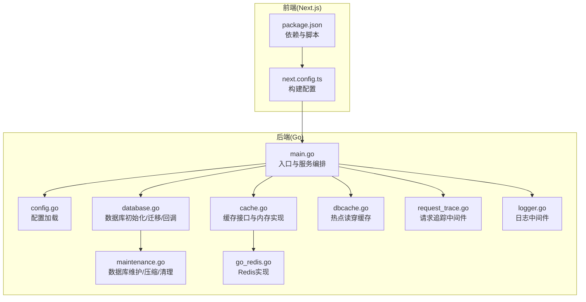
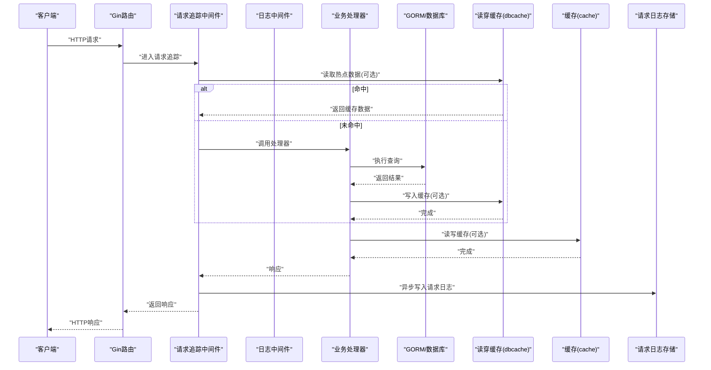
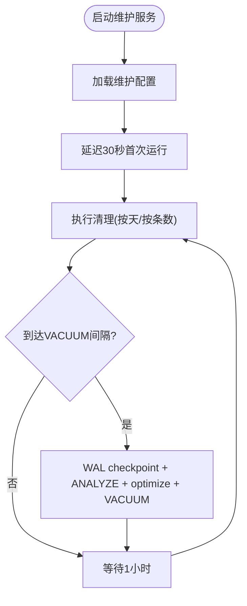
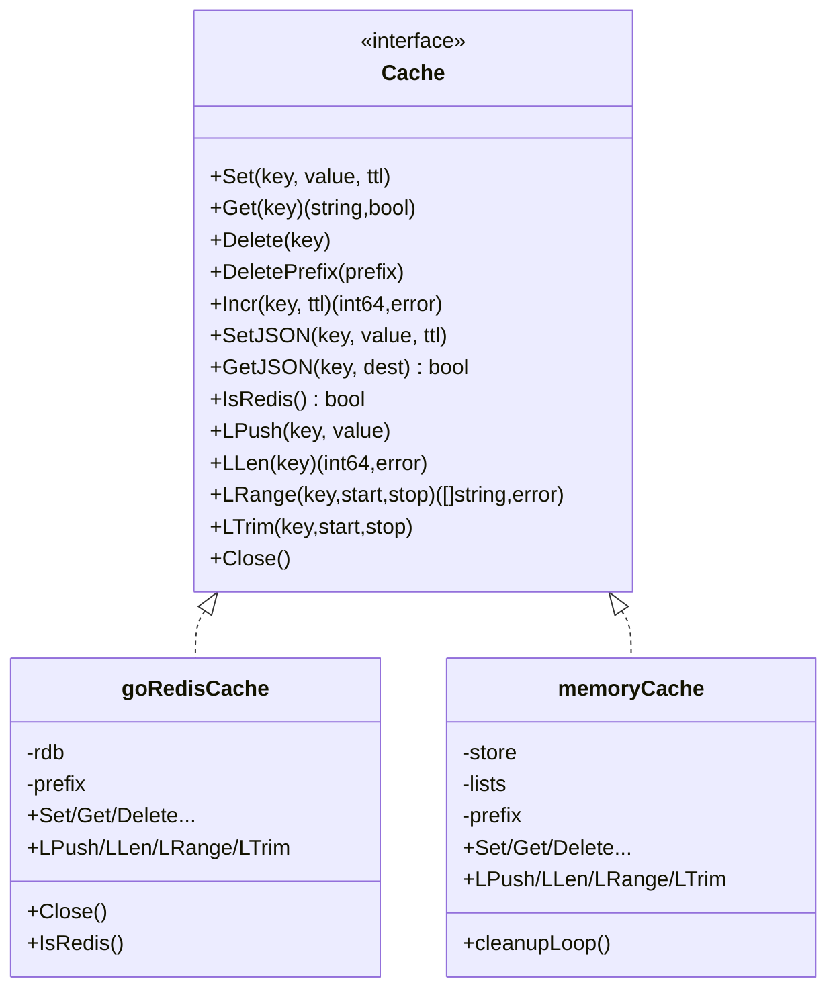
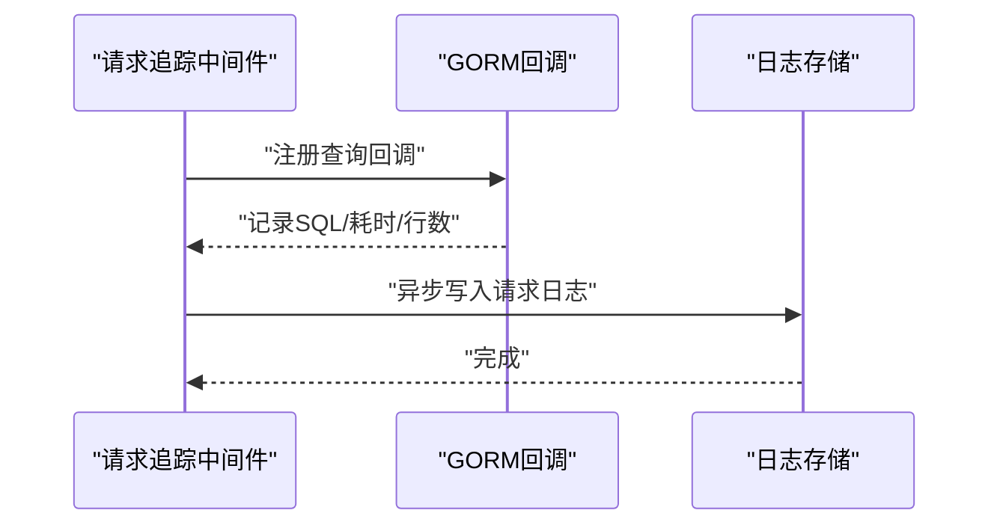
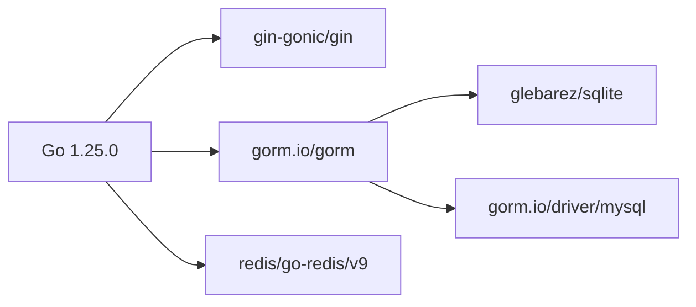

# 性能优化与调优

<cite>
**本文引用的文件**   
- [main.go](file://main/main.go)
- [go.mod](file://main/go.mod)
- [config.go](file://main/internal/config/config.go)
- [database.go](file://main/internal/database/database.go)
- [maintenance.go](file://main/internal/database/maintenance.go)
- [cache.go](file://main/internal/cache/cache.go)
- [go_redis.go](file://main/internal/cache/go_redis.go)
- [dbcache.go](file://main/internal/dbcache/dbcache.go)
- [request_trace.go](file://main/internal/api/middleware/request_trace.go)
- [logger.go](file://main/internal/api/middleware/logger.go)
- [next.config.ts](file://web/next.config.ts)
- [package.json](file://web/package.json)
- [REDIS_AND_DBCACHE.md](file://main/docs/REDIS_AND_DBCACHE.md)
- [README.md](file://README.md)
</cite>

## 目录
1. [简介](#简介)
2. [项目结构](#项目结构)
3. [核心组件](#核心组件)
4. [架构总览](#架构总览)
5. [详细组件分析](#详细组件分析)
6. [依赖关系分析](#依赖关系分析)
7. [性能考量](#性能考量)
8. [故障排查指南](#故障排查指南)
9. [结论](#结论)
10. [附录](#附录)

## 简介
本指南面向DNSPlane的Go后端与Next.js前端，聚焦以下性能优化主题：
- Go应用内存管理与垃圾回收优化
- 数据库查询优化与索引设计最佳实践
- 前端资源优化与缓存策略
- Redis缓存性能调优与连接池配置
- 静态资源压缩与CDN加速
- 并发处理与goroutine调度优化
- 监控指标采集与性能瓶颈分析
- 负载测试与压力测试实施

## 项目结构
项目采用“后端Go + 前端Next.js”的双栈架构，后端通过嵌入式静态资源提供Web界面，数据库采用SQLite/MySQL双栈，缓存支持Redis与内存双栈。

**图表来源**
- [main.go:52-148](file://main/main.go#L52-L148)
- [config.go:82-161](file://main/internal/config/config.go#L82-L161)
- [database.go:73-149](file://main/internal/database/database.go#L73-L149)
- [maintenance.go:110-133](file://main/internal/database/maintenance.go#L110-L133)
- [cache.go:47-94](file://main/internal/cache/cache.go#L47-L94)
- [go_redis.go:12-138](file://main/internal/cache/go_redis.go#L12-L138)
- [dbcache.go:14-69](file://main/internal/dbcache/dbcache.go#L14-L69)
- [request_trace.go:58-192](file://main/internal/api/middleware/request_trace.go#L58-L192)
- [logger.go:152-231](file://main/internal/api/middleware/logger.go#L152-L231)
- [next.config.ts:1-16](file://web/next.config.ts#L1-L16)
- [package.json:1-53](file://web/package.json#L1-L53)

**章节来源**
- [README.md:14-41](file://README.md#L14-L41)
- [main.go:52-148](file://main/main.go#L52-L148)

## 核心组件
- 服务编排与启动：初始化配置、数据库、缓存、验证码、日志存储、监控、后台任务、数据库维护、请求日志清理、路由与HTTP服务。
- 数据库层：GORM初始化、SQLite/MySQL驱动、连接池、WAL模式、PRAGMA优化、查询回调记录、迁移与旧数据迁移。
- 缓存层：统一Cache接口，内存实现与Redis实现，Ping回退，Key前缀规范化，列表操作支持。
- 读穿缓存：热点只读接口短期JSON缓存，写后显式失效。
- 请求追踪与日志：请求ID生成、数据库查询记录、异步请求日志落库与Redis写入、慢请求告警。
- 前端构建：静态导出、图片未优化、TypeScript构建忽略错误。

**章节来源**
- [main.go:56-116](file://main/main.go#L56-L116)
- [database.go:73-149](file://main/internal/database/database.go#L73-L149)
- [cache.go:47-94](file://main/internal/cache/cache.go#L47-L94)
- [dbcache.go:14-69](file://main/internal/dbcache/dbcache.go#L14-L69)
- [request_trace.go:58-192](file://main/internal/api/middleware/request_trace.go#L58-L192)
- [logger.go:152-231](file://main/internal/api/middleware/logger.go#L152-L231)
- [next.config.ts:3-13](file://web/next.config.ts#L3-L13)

## 架构总览
后端通过Gin路由接收请求，经中间件链路（鉴权、审计、请求追踪、日志）进入业务处理器，业务通过GORM访问数据库，热点数据走读穿缓存，日志通过异步写入请求日志库与Redis列表。

**图表来源**
- [request_trace.go:58-192](file://main/internal/api/middleware/request_trace.go#L58-L192)
- [dbcache.go:14-69](file://main/internal/dbcache/dbcache.go#L14-L69)
- [cache.go:47-94](file://main/internal/cache/cache.go#L47-L94)
- [database.go:367-404](file://main/internal/database/database.go#L367-L404)

## 详细组件分析

### 数据库层优化与维护
- 驱动选择与连接池
  - SQLite：WAL模式、同步级别、缓存大小、busy_timeout、mmap、连接池上限与空闲生命周期。
  - MySQL：连接池上限、空闲连接、连接生命周期。
- 查询回调与性能记录
  - 注册Query/Create/Update/Delete/Row/Raw回调，记录SQL、耗时、影响行数、错误，并截断超长SQL。
- 维护任务
  - 每小时清理：操作日志、证书日志、监控检查日志、容灾切换日志、请求日志（按天与条数）。
  - 定期VACUUM与optimize：WAL checkpoint、ANALYZE、PRAGMA optimize、VACUUM、恢复WAL模式。
  - 统计缓存：短时缓存避免频繁COUNT统计带来的系统压力。

**图表来源**
- [maintenance.go:110-196](file://main/internal/database/maintenance.go#L110-L196)
- [maintenance.go:275-325](file://main/internal/database/maintenance.go#L275-L325)

**章节来源**
- [database.go:73-149](file://main/internal/database/database.go#L73-L149)
- [database.go:367-404](file://main/internal/database/database.go#L367-L404)
- [maintenance.go:61-98](file://main/internal/database/maintenance.go#L61-L98)
- [maintenance.go:201-271](file://main/internal/database/maintenance.go#L201-L271)

### 缓存层与Redis调优
- 缓存接口与回退机制
  - Redis Ping失败自动回退内存缓存；Key前缀规范化；列表操作支持（LPush/LRange等）。
- Redis连接池配置
  - 地址、密码、DB、连接池大小、最小空闲连接；Ping校验后启用。
- 读穿缓存
  - 短TTL热点数据缓存，写后显式失效，保证最终一致性。

**图表来源**
- [cache.go:15-31](file://main/internal/cache/cache.go#L15-L31)
- [go_redis.go:12-138](file://main/internal/cache/go_redis.go#L12-L138)
- [cache.go:96-309](file://main/internal/cache/cache.go#L96-L309)

**章节来源**
- [cache.go:47-94](file://main/internal/cache/cache.go#L47-L94)
- [go_redis.go:64-81](file://main/internal/cache/go_redis.go#L64-L81)
- [REDIS_AND_DBCACHE.md:1-28](file://main/docs/REDIS_AND_DBCACHE.md#L1-L28)

### 请求追踪与日志中间件
- 请求追踪
  - 生成请求ID与错误ID，注入上下文；记录请求头、路径、方法、参数、耗时、状态码、错误信息、数据库查询明细。
  - 异步写入请求日志库与Redis列表，避免阻塞主流程。
- 日志中间件
  - 过滤静态资源与特定路径；彩色控制台输出；慢请求告警；结构化文件日志。

**图表来源**
- [request_trace.go:58-192](file://main/internal/api/middleware/request_trace.go#L58-L192)
- [database.go:367-404](file://main/internal/database/database.go#L367-L404)

**章节来源**
- [request_trace.go:58-192](file://main/internal/api/middleware/request_trace.go#L58-L192)
- [logger.go:152-231](file://main/internal/api/middleware/logger.go#L152-L231)

### 前端资源优化与缓存策略
- 构建配置
  - 静态导出模式，尾斜杠，图片未优化，TypeScript构建忽略错误。
- 建议
  - 启用图片优化与自动按需转换；开启静态资源压缩与浏览器缓存；结合CDN分发静态产物。

**章节来源**
- [next.config.ts:3-13](file://web/next.config.ts#L3-L13)
- [package.json:5-11](file://web/package.json#L5-L11)

## 依赖关系分析
- Go版本与关键依赖
  - Go 1.25.0；Gin Web框架；GORM + SQLite/MySQL驱动；Redis客户端；sonic等高性能库。
- 间接依赖
  - 包含大量高性能JSON、网络、加密、验证等库，有助于整体性能表现。

**图表来源**
- [go.mod:3-28](file://main/go.mod#L3-L28)

**章节来源**
- [go.mod:3-28](file://main/go.mod#L3-L28)

## 性能考量

### Go内存管理与GC优化
- 连接池与并发
  - SQLite：最大打开连接数、空闲连接、连接最大空闲时间；避免默认池过小导致排队。
  - MySQL：提升连接池上限与复用，减少连接建立开销。
- 查询回调与开销控制
  - 仅在存在请求追踪上下文时记录查询明细，避免Explain等高开销路径在无追踪场景下执行。
- 结构体与切片
  - 使用固定容量切片与预分配，减少扩容与拷贝。
- 上下文与锁
  - 读写分离锁保护缓存，定期清理内存缓存，避免无限增长。

**章节来源**
- [database.go:49-71](file://main/internal/database/database.go#L49-L71)
- [database.go:367-404](file://main/internal/database/database.go#L367-L404)
- [cache.go:295-309](file://main/internal/cache/cache.go#L295-L309)

### 数据库查询优化与索引设计
- SQLite优化要点
  - WAL模式、同步级别、缓存大小、busy_timeout、临时存储内存、mmap大小。
- 连接池与事务
  - 合理设置最大连接数与空闲连接，避免连接饥饿；批量写入与事务封装。
- 查询回调与统计
  - 使用回调记录慢查询与高成本SQL，结合ANALYZE与PRAGMA optimize指导索引设计。
- 维护与压缩
  - 定期VACUUM回收空间，恢复WAL模式，保持查询计划最优。

**章节来源**
- [database.go:34-47](file://main/internal/database/database.go#L34-L47)
- [maintenance.go:275-325](file://main/internal/database/maintenance.go#L275-L325)

### Redis缓存性能调优与连接池
- 连接池参数
  - pool_size、min_idle_conns；Ping校验失败回退内存缓存。
- Key前缀与SCAN
  - 规范化前缀，Redis使用SCAN迭代删除，分批DEL避免阻塞。
- 列表操作
  - LPush/LRange/LTrim支持，满足日志列表写入与裁剪需求。

**章节来源**
- [cache.go:64-81](file://main/internal/cache/cache.go#L64-L81)
- [go_redis.go:60-80](file://main/internal/cache/go_redis.go#L60-L80)
- [REDIS_AND_DBCACHE.md:6-14](file://main/docs/REDIS_AND_DBCACHE.md#L6-L14)

### 前端资源优化与CDN加速
- 构建与缓存
  - 静态导出模式便于CDN分发；图片未优化可考虑开启自动优化。
- 压缩与缓存
  - 启用Gzip/Brotli压缩；设置强缓存策略；版本化静态资源。

**章节来源**
- [next.config.ts:3-13](file://web/next.config.ts#L3-L13)

### 并发处理与goroutine调度
- 后台任务
  - 任务运行器在独立goroutine中运行，支持优雅停止。
- 异步日志
  - 请求日志写入采用goroutine异步，避免阻塞主请求链路。
- 缓存清理
  - 内存缓存定期清理过期键，避免内存泄漏。

**章节来源**
- [main.go:98-116](file://main/main.go#L98-L116)
- [request_trace.go:184-190](file://main/internal/api/middleware/request_trace.go#L184-L190)
- [cache.go:295-309](file://main/internal/cache/cache.go#L295-L309)

### 监控指标采集与性能瓶颈分析
- 请求追踪
  - X-Request-ID、X-Error-ID、数据库查询明细、慢请求告警。
- 日志中间件
  - 控制台彩色输出与文件结构化日志，区分慢请求与错误。
- 维护统计
  - 短时缓存统计信息，避免频繁COUNT带来的系统压力。

**章节来源**
- [request_trace.go:24-50](file://main/internal/api/middleware/request_trace.go#L24-L50)
- [logger.go:152-231](file://main/internal/api/middleware/logger.go#L152-L231)
- [maintenance.go:342-360](file://main/internal/database/maintenance.go#L342-L360)

### 负载测试与压力测试
- 测试建议
  - 使用压测工具模拟高并发请求，覆盖登录、域名查询、证书申请等关键路径。
  - 关注数据库连接池饱和、Redis连接池使用率、GC停顿、慢请求比例。
  - 结合请求追踪ID定位慢查询与异常路径。

[本节为通用指导，无需具体文件引用]

## 故障排查指南
- Redis连接失败
  - 检查地址、密码、DB、池大小；确认Ping连通性；查看回退日志。
- 数据库性能问题
  - 查看慢查询记录与数据库维护日志；确认WAL模式与ANALYZE执行；评估VACUUM频率。
- 缓存命中率低
  - 检查Key前缀与TTL；确认写后失效逻辑是否正确触发；评估热点数据范围。
- 请求日志缺失
  - 确认请求追踪中间件是否生效；检查异步写入是否被提前终止。

**章节来源**
- [cache.go:74-81](file://main/internal/cache/cache.go#L74-L81)
- [maintenance.go:275-325](file://main/internal/database/maintenance.go#L275-L325)
- [request_trace.go:184-190](file://main/internal/api/middleware/request_trace.go#L184-L190)

## 结论
DNSPlane通过数据库WAL优化、连接池调优、查询回调记录、定期维护与压缩、Redis连接池与回退机制、请求追踪与异步日志、以及前端静态导出与缓存策略，形成了较为完善的性能优化体系。建议在生产环境中持续关注慢请求与数据库统计，结合压测结果迭代优化索引与连接池参数，并完善CDN与前端资源优化以进一步提升用户体验。

## 附录
- 配置参考
  - 服务器、数据库、JWT、代理、日志清理、Redis等配置项。
- 文档与说明
  - Redis与读穿缓存说明文档。

**章节来源**
- [config.go:82-161](file://main/internal/config/config.go#L82-L161)
- [REDIS_AND_DBCACHE.md:1-28](file://main/docs/REDIS_AND_DBCACHE.md#L1-L28)