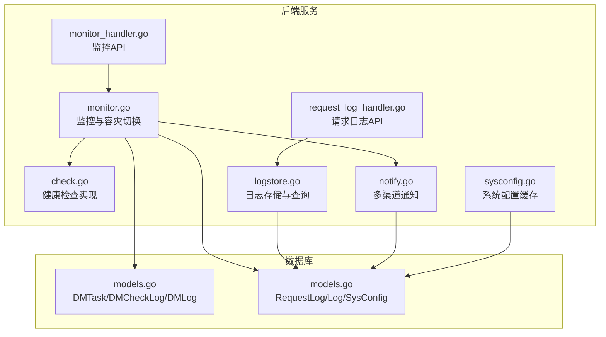
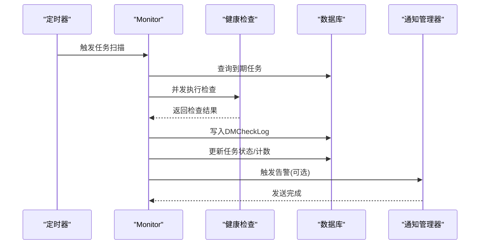
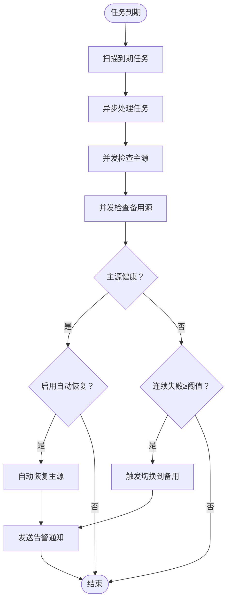
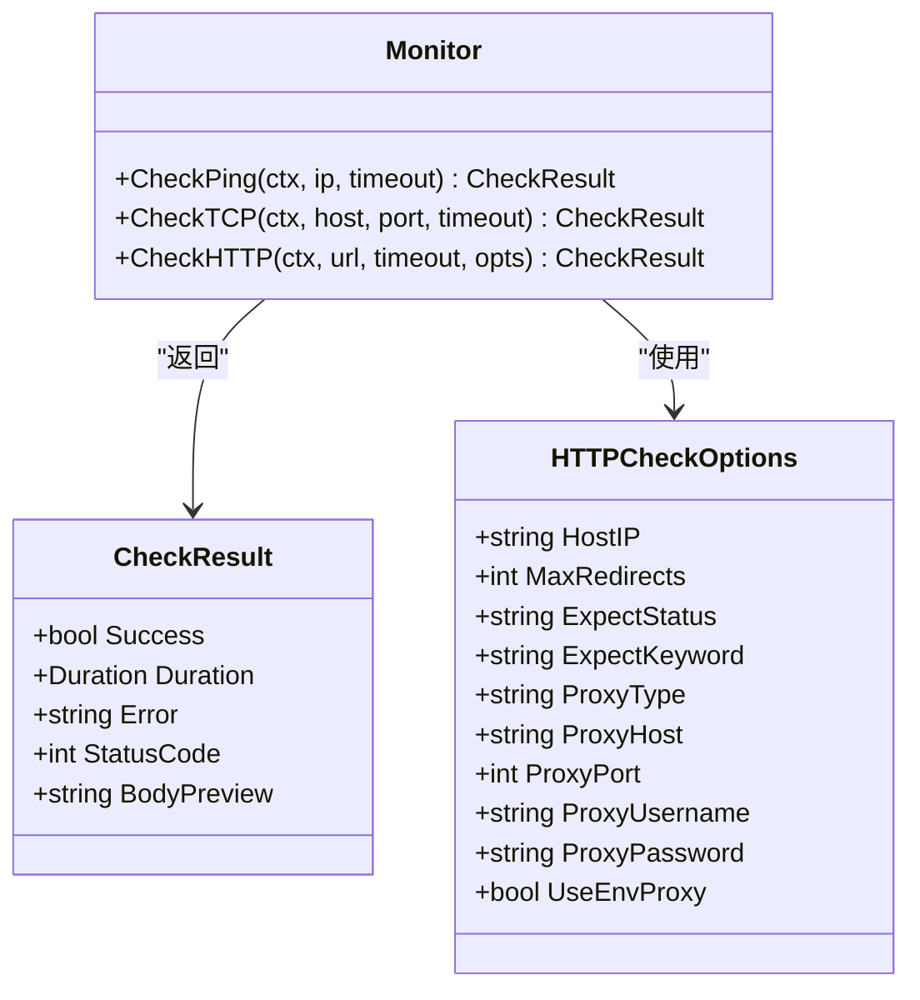
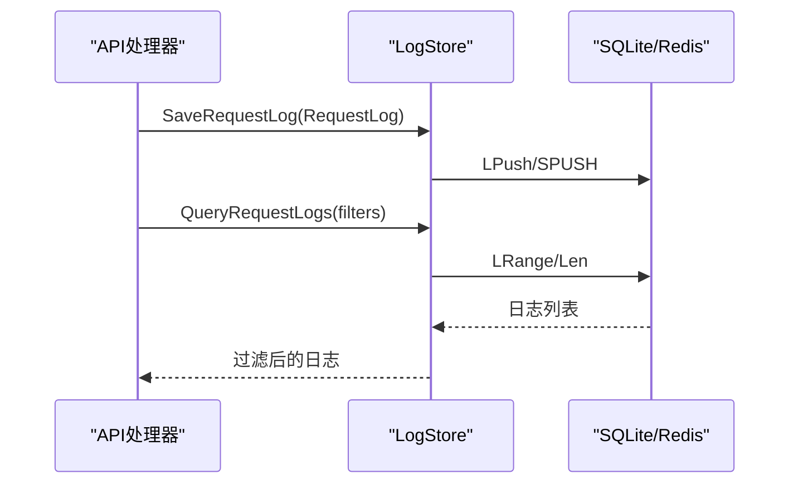
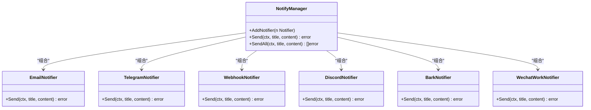
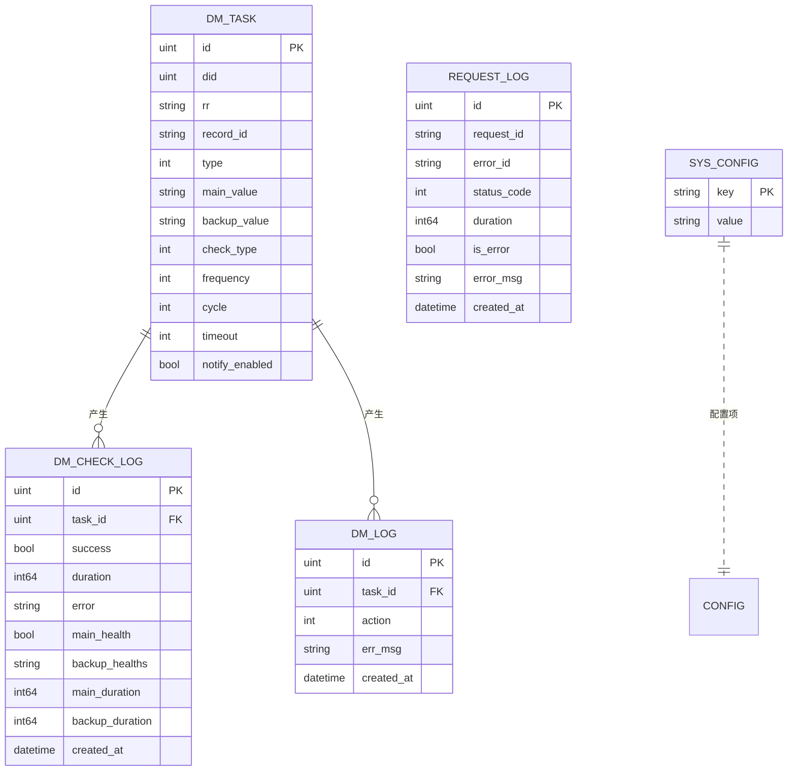
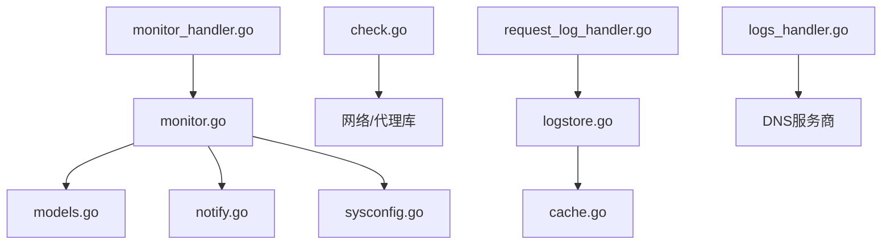

# 监控告警配置

<cite>
**本文档引用的文件**
- [main.go](file://main/main.go)
- [monitor.go](file://main/internal/monitor/monitor.go)
- [check.go](file://main/internal/monitor/check.go)
- [monitor_handler.go](file://main/internal/api/handler/monitor.go)
- [logs_handler.go](file://main/internal/api/handler/logs.go)
- [request_log_handler.go](file://main/internal/api/handler/request_log.go)
- [notify.go](file://main/internal/notify/notify.go)
- [store.go](file://main/internal/logstore/store.go)
- [models.go](file://main/internal/models/models.go)
- [sysconfig.go](file://main/internal/sysconfig/sysconfig.go)
- [expire_notice.go](file://main/internal/service/expire_notice.go)
- [cert_renew_hook.go](file://main/internal/service/cert_renew_hook.go)
</cite>

## 目录
1. [简介](#简介)
2. [项目结构](#项目结构)
3. [核心组件](#核心组件)
4. [架构概览](#架构概览)
5. [详细组件分析](#详细组件分析)
6. [依赖分析](#依赖分析)
7. [性能考虑](#性能考虑)
8. [故障排查指南](#故障排查指南)
9. [结论](#结论)
10. [附录](#附录)

## 简介
本指南面向DNSPlane监控告警系统的运维与开发人员，提供从应用日志收集与分析、系统指标监控与性能告警、DNS解析成功率与响应时间监控，到证书到期与系统异常告警的完整配置说明。文档还涵盖邮件、Webhook等多种通知渠道的集成方法，监控数据可视化与仪表板配置思路，以及告警去重与静默策略的实现方案，并提供监控系统维护与故障排查的操作手册。

## 项目结构
DNSPlane采用Go语言编写的后端服务，结合SQLite作为主要数据库，Redis作为可选缓存与日志存储后端。监控与告警功能集中在monitor包中，日志采集通过logstore包实现，通知通道由notify包统一管理。前端监控页面位于web目录下，提供任务管理、历史查询与可视化展示。

**图示来源**
- [monitor.go:1-1022](file://main/internal/monitor/monitor.go#L1-L1022)
- [check.go:1-370](file://main/internal/monitor/check.go#L1-L370)
- [notify.go:1-569](file://main/internal/notify/notify.go#L1-L569)
- [store.go:1-440](file://main/internal/logstore/store.go#L1-L440)
- [monitor_handler.go:1-1148](file://main/internal/api/handler/monitor.go#L1-L1148)
- [request_log_handler.go:1-335](file://main/internal/api/handler/request_log.go#L1-L335)
- [models.go:1-357](file://main/internal/models/models.go#L1-L357)
- [sysconfig.go:1-47](file://main/internal/sysconfig/sysconfig.go#L1-L47)

**章节来源**
- [main.go:52-148](file://main/main.go#L52-L148)
- [monitor.go:63-114](file://main/internal/monitor/monitor.go#L63-L114)
- [monitor_handler.go:106-155](file://main/internal/api/handler/monitor.go#L106-L155)

## 核心组件
- 监控服务：负责定时扫描监控任务、执行健康检查、触发容灾切换与恢复、生成通知。
- 健康检查：支持Ping、TCP、HTTP/HTTPS探测，具备代理、重定向控制、状态码与关键词匹配。
- 日志系统：统一请求日志与系统日志存储，支持Redis或内存后端，提供查询、统计与清理。
- 通知系统：支持邮件、Telegram、Webhook、Discord、Bark、企业微信等多渠道。
- 数据模型：定义监控任务、检查日志、切换日志、请求日志、系统配置等核心数据结构。
- 配置缓存：为后台任务提供SysConfig的缓存读取，减少数据库压力。

**章节来源**
- [monitor.go:45-91](file://main/internal/monitor/monitor.go#L45-L91)
- [check.go:24-45](file://main/internal/monitor/check.go#L24-L45)
- [store.go:35-55](file://main/internal/logstore/store.go#L35-L55)
- [notify.go:17-27](file://main/internal/notify/notify.go#L17-L27)
- [models.go:122-187](file://main/internal/models/models.go#L122-L187)
- [sysconfig.go:23-46](file://main/internal/sysconfig/sysconfig.go#L23-L46)

## 架构概览
监控系统以定时器驱动，每秒扫描到期任务并异步执行检查。健康检查结果写入DMCheckLog，根据阈值触发容灾切换并在DMLog记录动作。通知系统基于SysConfig动态加载各渠道配置，统一发送告警。日志系统通过LogStore聚合请求日志，支持统计与查询。

**图示来源**
- [monitor.go:93-152](file://main/internal/monitor/monitor.go#L93-L152)
- [monitor.go:154-318](file://main/internal/monitor/monitor.go#L154-L318)
- [monitor.go:735-791](file://main/internal/monitor/monitor.go#L735-L791)

## 详细组件分析

### 监控与容灾切换
- 任务调度：每秒扫描check_next_time到期的任务，更新下次检查时间并异步处理。
- 健康检查：支持Ping、TCP、HTTP/HTTPS，具备超时控制与代理支持。
- 容灾策略：根据连续失败次数阈值触发切换，支持暂停/恢复、删除/重建、切换备用值三种模式。
- 通知机制：根据任务配置与系统配置动态加载通知渠道并发送告警。

**图示来源**
- [monitor.go:130-152](file://main/internal/monitor/monitor.go#L130-L152)
- [monitor.go:154-318](file://main/internal/monitor/monitor.go#L154-L318)
- [monitor.go:376-443](file://main/internal/monitor/monitor.go#L376-L443)
- [monitor.go:735-791](file://main/internal/monitor/monitor.go#L735-L791)

**章节来源**
- [monitor.go:130-318](file://main/internal/monitor/monitor.go#L130-L318)
- [monitor.go:376-707](file://main/internal/monitor/monitor.go#L376-L707)
- [monitor_handler.go:208-263](file://main/internal/api/handler/monitor.go#L208-L263)

### 健康检查实现
- Ping：跨平台实现，Windows使用内核级API，其他平台使用ICMP原始套接字，不可用时回退TCP。
- TCP：基于net.Dialer，支持超时控制。
- HTTP/HTTPS：支持HTTP/SOCKS5代理、重定向限制、期望状态码与关键词匹配，具备HostIP改写能力。

**图示来源**
- [check.go:24-45](file://main/internal/monitor/check.go#L24-L45)
- [check.go:47-163](file://main/internal/monitor/check.go#L47-L163)
- [check.go:167-338](file://main/internal/monitor/check.go#L167-L338)

**章节来源**
- [check.go:47-338](file://main/internal/monitor/check.go#L47-L338)

### 日志收集与分析
- 请求日志：统一写入LogStore，支持Redis或内存后端，提供分页查询、关键字/方法/错误/日期过滤、统计缓存。
- 系统日志：操作日志统一存储，支持分页与过滤。
- 域名日志：优先从DNS服务商查询，失败时降级到本地日志数据库。

**图示来源**
- [store.go:59-125](file://main/internal/logstore/store.go#L59-L125)
- [store.go:189-249](file://main/internal/logstore/store.go#L189-L249)
- [request_log_handler.go:99-129](file://main/internal/api/handler/request_log.go#L99-L129)
- [logs_handler.go:27-87](file://main/internal/api/handler/logs.go#L27-L87)

**章节来源**
- [store.go:59-249](file://main/internal/logstore/store.go#L59-L249)
- [request_log_handler.go:99-335](file://main/internal/api/handler/request_log.go#L99-L335)
- [logs_handler.go:27-87](file://main/internal/api/handler/logs.go#L27-L87)

### 通知渠道集成
- 邮件：支持SMTP Plain/Login/CRAM-MD5认证，SSL/TLS加密方式。
- Telegram：通过Bot API发送消息。
- Webhook：自定义URL、方法、头与模板。
- Discord：Embed样式消息。
- Bark：移动端推送。
- 企业微信：Markdown消息。

**图示来源**
- [notify.go:333-364](file://main/internal/notify/notify.go#L333-L364)
- [notify.go:49-190](file://main/internal/notify/notify.go#L49-L190)
- [notify.go:224-265](file://main/internal/notify/notify.go#L224-L265)
- [notify.go:277-331](file://main/internal/notify/notify.go#L277-L331)
- [notify.go:372-413](file://main/internal/notify/notify.go#L372-L413)
- [notify.go:422-455](file://main/internal/notify/notify.go#L422-L455)
- [notify.go:463-501](file://main/internal/notify/notify.go#L463-L501)

**章节来源**
- [notify.go:509-569](file://main/internal/notify/notify.go#L509-L569)

### 数据模型与指标
- 监控任务：包含主/备用值、检查类型、频率、阈值、超时、代理、CDN标记、通知开关等。
- 检查日志：记录每次检查的成功/耗时/错误、主/备用健康状态与耗时。
- 切换日志：记录切换/恢复动作与错误信息。
- 请求日志：记录API请求的ID、方法、路径、状态码、耗时、错误信息等。
- 系统配置：通知渠道配置键集合，供系统读取与缓存。

**图示来源**
- [models.go:122-187](file://main/internal/models/models.go#L122-L187)
- [models.go:332-356](file://main/internal/models/models.go#L332-L356)
- [models.go:299-303](file://main/internal/models/models.go#L299-L303)

**章节来源**
- [models.go:122-187](file://main/internal/models/models.go#L122-L187)
- [models.go:332-356](file://main/internal/models/models.go#L332-L356)

### 证书到期与系统异常告警
- 证书续期钩子：通过SetCertRenewProcessStarter注入续期后的签发流程，避免循环依赖。
- WHOIS查询：定期查询域名WHOIS信息，更新到期与创建时间，便于异常检测与告警。

**章节来源**
- [cert_renew_hook.go:7-12](file://main/internal/service/cert_renew_hook.go#L7-L12)
- [expire_notice.go:17-41](file://main/internal/service/expire_notice.go#L17-L41)

## 依赖分析
- 监控服务依赖数据库模型与通知管理器，通过SysConfig缓存读取系统配置。
- 健康检查依赖网络栈与代理库，支持多种协议与选项。
- 日志系统依赖缓存层，提供高性能的列表与统计能力。
- API处理器依赖监控与日志模块，提供任务管理、历史查询与统计接口。

**图示来源**
- [monitor.go:1-17](file://main/internal/monitor/monitor.go#L1-L17)
- [check.go:1-20](file://main/internal/monitor/check.go#L1-L20)
- [store.go:1-14](file://main/internal/logstore/store.go#L1-L14)
- [monitor_handler.go:1-23](file://main/internal/api/handler/monitor.go#L1-L23)
- [request_log_handler.go:1-14](file://main/internal/api/handler/request_log.go#L1-L14)
- [logs_handler.go:1-11](file://main/internal/api/handler/logs.go#L1-L11)

**章节来源**
- [monitor.go:1-17](file://main/internal/monitor/monitor.go#L1-L17)
- [check.go:1-20](file://main/internal/monitor/check.go#L1-L20)
- [store.go:1-14](file://main/internal/logstore/store.go#L1-L14)
- [monitor_handler.go:1-23](file://main/internal/api/handler/monitor.go#L1-L23)
- [request_log_handler.go:1-14](file://main/internal/api/handler/request_log.go#L1-L14)
- [logs_handler.go:1-11](file://main/internal/api/handler/logs.go#L1-L11)

## 性能考虑
- 监控扫描：1秒ticker，60秒更新运行状态，避免频繁写入。
- 并发检查：主/备用源并发执行，缩短整体检查时间。
- 日志存储：Redis后端使用LPush/LRange，内存后端采用轻量JSON解析与缓存统计。
- 配置缓存：SysConfig读取带60秒TTL缓存，减少数据库压力。
- 请求日志清理：按条数截断与按天清理策略，控制存储规模。

**章节来源**
- [monitor.go:93-128](file://main/internal/monitor/monitor.go#L93-L128)
- [monitor.go:170-218](file://main/internal/monitor/monitor.go#L170-L218)
- [store.go:42-50](file://main/internal/logstore/store.go#L42-L50)
- [store.go:193-249](file://main/internal/logstore/store.go#L193-L249)
- [sysconfig.go:23-36](file://main/internal/sysconfig/sysconfig.go#L23-L36)
- [request_log_handler.go:253-334](file://main/internal/api/handler/request_log.go#L253-L334)

## 故障排查指南
- 监控任务无检查：确认任务处于激活状态、check_next_time已到期、超时设置合理。
- 切换失败：查看DMLog记录的动作与错误信息，检查DNS提供商能力与凭证。
- 通知未送达：检查SysConfig中邮件/Telegram/Webhook等配置键是否正确，验证渠道可用性。
- 日志查询缓慢：确认使用Redis后端，检查过滤条件与分页大小，关注统计缓存失效。
- 证书到期异常：确认WHOIS查询可用，检查查询频率与超时设置。

**章节来源**
- [monitor.go:289-318](file://main/internal/monitor/monitor.go#L289-L318)
- [monitor.go:735-791](file://main/internal/monitor/monitor.go#L735-L791)
- [request_log_handler.go:99-129](file://main/internal/api/handler/request_log.go#L99-L129)
- [expire_notice.go:17-41](file://main/internal/service/expire_notice.go#L17-L41)

## 结论
DNSPlane提供了完善的监控告警体系，涵盖健康检查、容灾切换、日志采集与通知渠道。通过合理的配置与策略，可实现对DNS解析成功率与响应时间的持续监控，及时发现证书到期与系统异常问题，并通过多种通知渠道快速触达相关人员。配合日志系统与统计接口，可构建直观的监控仪表板，支撑运维与业务决策。

## 附录

### 应用日志收集与分析配置
- 启用Redis后端以提升日志查询性能。
- 配置请求日志清理策略：按保留数量或天数清理。
- 使用API接口查询请求日志与统计信息，支持关键字与日期范围过滤。

**章节来源**
- [store.go:42-50](file://main/internal/logstore/store.go#L42-L50)
- [request_log_handler.go:99-129](file://main/internal/api/handler/request_log.go#L99-L129)
- [request_log_handler.go:253-334](file://main/internal/api/handler/request_log.go#L253-L334)

### 系统指标监控与性能告警设置
- 监控运行状态：通过SysConfig的run_time与run_count键记录运行时间与次数。
- 性能指标：利用DMCheckLog的duration与success字段计算平均响应时间与可用率。
- 告警阈值：根据业务SLA设置连续失败阈值与超时时间。

**章节来源**
- [monitor.go:117-128](file://main/internal/monitor/monitor.go#L117-L128)
- [monitor_handler.go:528-603](file://main/internal/api/handler/monitor.go#L528-L603)

### DNS解析成功率与响应时间监控配置
- 成功率：统计DMCheckLog中success=true的比例，按24h/7d/30d窗口计算。
- 响应时间：取success=true时的duration平均值，结合最大/最小值进行告警。
- 历史趋势：通过GetMonitorHistory接口获取检查点，绘制趋势图。

**章节来源**
- [monitor_handler.go:762-800](file://main/internal/api/handler/monitor.go#L762-L800)
- [monitor_handler.go:728-760](file://main/internal/api/handler/monitor.go#L728-L760)

### 证书到期与系统异常告警规则
- 证书续期：通过SetCertRenewProcessStarter注入续期后的签发流程。
- WHOIS查询：定期查询域名到期与创建时间，异常时触发告警。
- 系统异常：结合请求日志的错误统计与最近错误列表，设置阈值告警。

**章节来源**
- [cert_renew_hook.go:7-12](file://main/internal/service/cert_renew_hook.go#L7-L12)
- [expire_notice.go:17-41](file://main/internal/service/expire_notice.go#L17-L41)
- [request_log_handler.go:209-251](file://main/internal/api/handler/request_log.go#L209-L251)

### 通知渠道集成方法
- 邮件：配置mail_host/port/user/password/from/to/secure/tls等键。
- Telegram：配置tgbot_token与tgbot_chatid。
- Webhook：配置webhook_url，可选method/headers/content_type/template。
- Discord：配置discord_webhook。
- Bark：配置bark_url与bark_key。
- 企业微信：配置wechat_webhook。

**章节来源**
- [notify.go:509-569](file://main/internal/notify/notify.go#L509-L569)

### 监控数据可视化与仪表板配置
- 任务概览：使用GetMonitorOverview接口获取任务总数、健康数、故障数、24h切换与失败次数、平均可用率。
- 历史趋势：使用GetMonitorHistory接口获取检查点，按24h/7d/30d窗口绘制成功率与响应时间曲线。
- 请求统计：使用GetRequestStats接口获取总请求数、错误数、今日统计与最近错误列表。

**章节来源**
- [monitor_handler.go:528-603](file://main/internal/api/handler/monitor.go#L528-L603)
- [monitor_handler.go:728-760](file://main/internal/api/handler/monitor.go#L728-L760)
- [request_log_handler.go:209-251](file://main/internal/api/handler/request_log.go#L209-L251)

### 告警去重与静默策略
- 去重：同一任务在连续失败期间仅在达到阈值时发送一次告警，恢复时发送一次恢复通知。
- 静默：通过任务的notify_enabled与AutoRestore字段控制通知与自动恢复行为；通过SysConfig配置全局通知策略。
- 通知渠道：NotifyManager支持多渠道并行发送，任一渠道成功即视为发送完成。

**章节来源**
- [monitor.go:289-318](file://main/internal/monitor/monitor.go#L289-L318)
- [monitor.go:735-791](file://main/internal/monitor/monitor.go#L735-L791)
- [notify.go:333-364](file://main/internal/notify/notify.go#L333-L364)

### 监控系统维护与故障排查操作手册
- 启动与关闭：通过main.go启动监控服务与后台任务，优雅关闭HTTP服务。
- 日志清理：使用CleanRequestLogs接口按保留数量清理请求日志。
- 配置更新：通过sysconfig包的Invalidate清除缓存，确保后台任务读取最新配置。
- 常见问题：检查任务状态、检查日志、通知渠道连通性与配置键完整性。

**章节来源**
- [main.go:93-146](file://main/main.go#L93-L146)
- [request_log_handler.go:314-334](file://main/internal/api/handler/request_log.go#L314-L334)
- [sysconfig.go:39-46](file://main/internal/sysconfig/sysconfig.go#L39-L46)