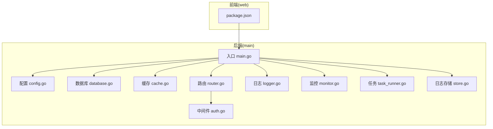
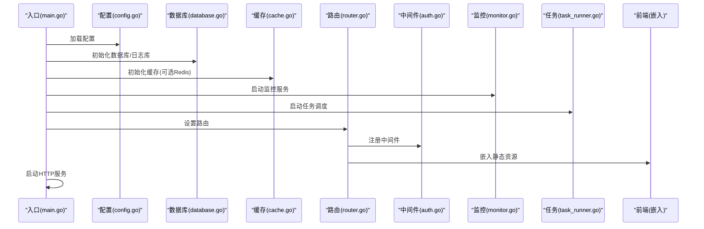
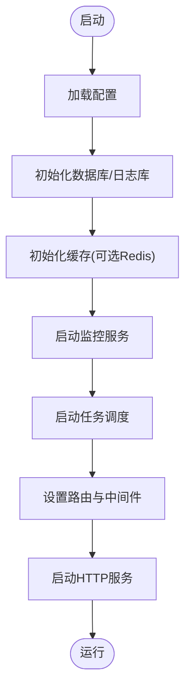
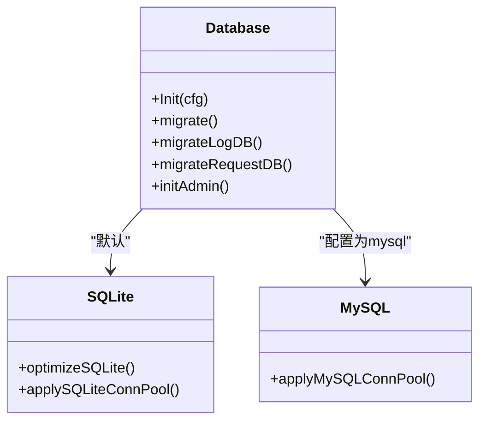
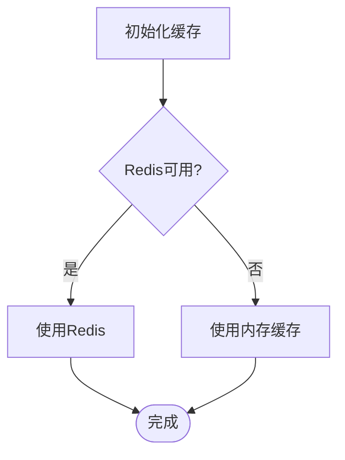
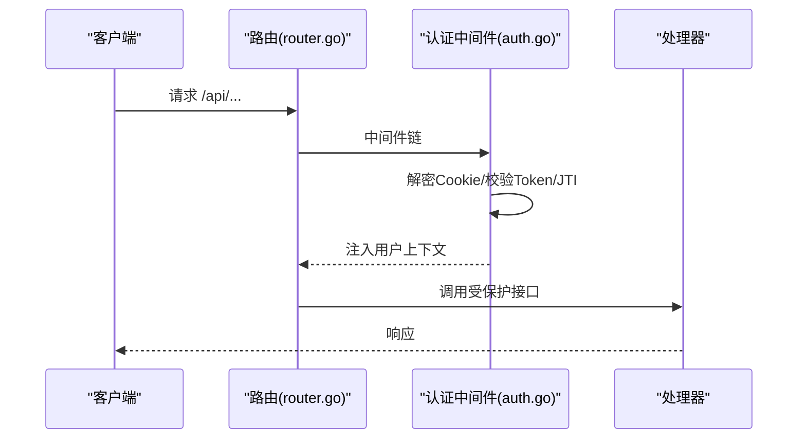
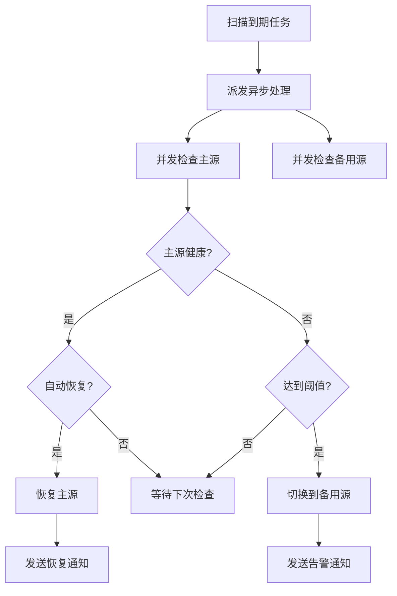
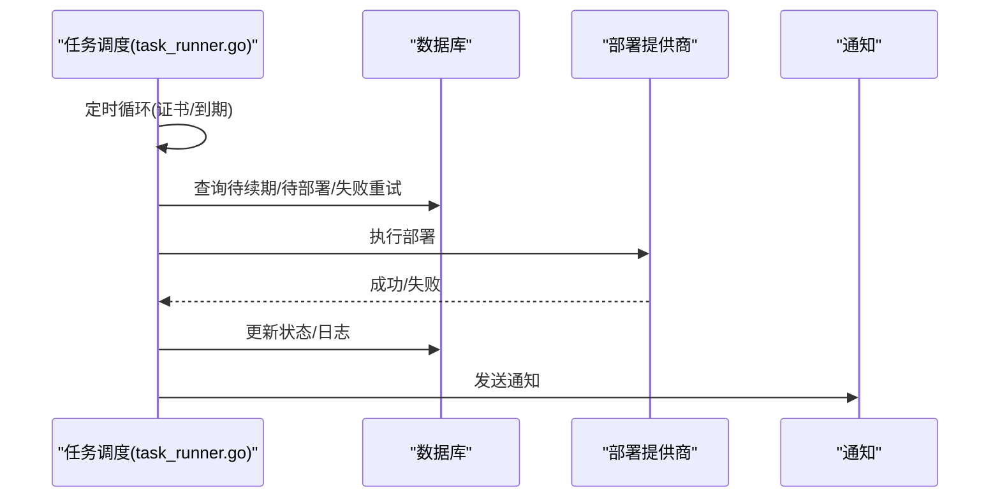
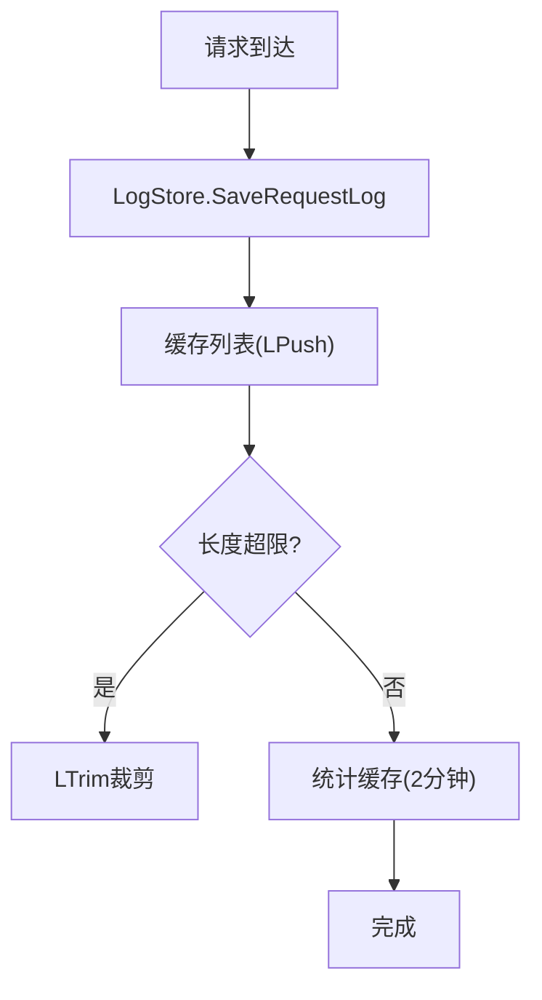
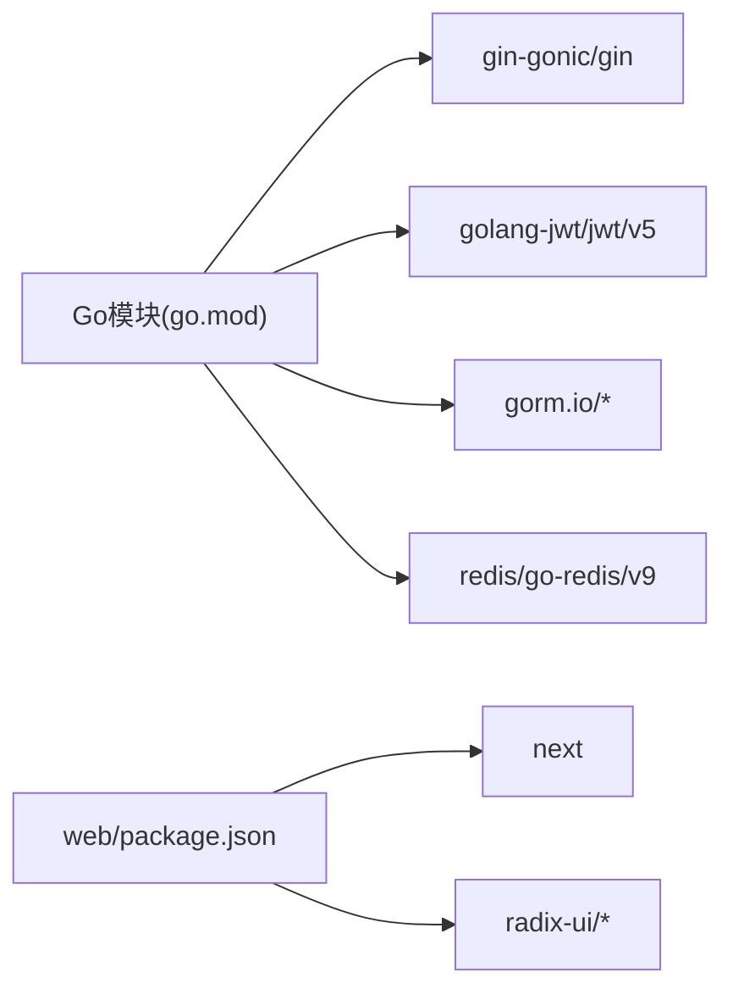

# 部署运维

<cite>
**本文引用的文件**
- [README.md](file://README.md)
- [Dockerfile](file://Dockerfile)
- [.github/workflows/build.yml](file://.github/workflows/build.yml)
- [main.go](file://main/main.go)
- [go.mod](file://main/go.mod)
- [config.go](file://main/internal/config/config.go)
- [database.go](file://main/internal/database/database.go)
- [cache.go](file://main/internal/cache/cache.go)
- [router.go](file://main/internal/api/router.go)
- [auth.go](file://main/internal/api/middleware/auth.go)
- [logger.go](file://main/internal/logger/logger.go)
- [monitor.go](file://main/internal/monitor/monitor.go)
- [task_runner.go](file://main/internal/service/task_runner.go)
- [store.go](file://main/internal/logstore/store.go)
- [package.json](file://web/package.json)
</cite>

## 目录
1. [简介](#简介)
2. [项目结构](#项目结构)
3. [核心组件](#核心组件)
4. [架构总览](#架构总览)
5. [详细组件分析](#详细组件分析)
6. [依赖关系分析](#依赖关系分析)
7. [性能考虑](#性能考虑)
8. [故障排查指南](#故障排查指南)
9. [结论](#结论)
10. [附录](#附录)

## 简介
本指南面向DNSPlane的部署与运维，覆盖开发环境与生产环境搭建、Docker容器化部署、CI/CD流水线、性能优化与资源调优、日志与监控告警、备份与恢复、高可用与负载均衡、常见问题排查以及安全加固与访问控制最佳实践。内容基于仓库现有代码与配置文件整理，确保可操作性与可追溯性。

## 项目结构
项目采用前后端分离架构：
- 后端（Go）位于 main/，包含API、数据库、缓存、监控、日志、服务等模块
- 前端（Next.js）位于 web/，构建产物嵌入到后端二进制中
- CI/CD使用 GitHub Actions，Dockerfile定义容器镜像构建流程

图示来源
- [main.go:52-148](file://main/main.go#L52-L148)
- [config.go:12-161](file://main/internal/config/config.go#L12-L161)
- [database.go:73-149](file://main/internal/database/database.go#L73-L149)
- [cache.go:47-94](file://main/internal/cache/cache.go#L47-L94)
- [router.go:14-275](file://main/internal/api/router.go#L14-L275)
- [auth.go:124-199](file://main/internal/api/middleware/auth.go#L124-L199)
- [logger.go:56-91](file://main/internal/logger/logger.go#L56-L91)
- [monitor.go:63-91](file://main/internal/monitor/monitor.go#L63-L91)
- [task_runner.go:36-75](file://main/internal/service/task_runner.go#L36-L75)
- [store.go:42-50](file://main/internal/logstore/store.go#L42-L50)
- [package.json:1-53](file://web/package.json#L1-L53)

章节来源
- [README.md:14-40](file://README.md#L14-L40)
- [main.go:52-148](file://main/main.go#L52-L148)
- [package.json:1-53](file://web/package.json#L1-L53)

## 核心组件
- 配置管理：支持服务器、数据库、JWT、代理、日志清理、Redis等配置项，具备默认值与自动保存能力
- 数据库层：支持SQLite与MySQL，内置迁移、日志数据库分离、连接池优化、WAL模式与SQLite性能参数
- 缓存层：支持Redis与内存双栈，自动降级，提供键空间前缀与列表操作
- API与中间件：基于Gin，提供认证、CORS、安全头、日志、审计等中间件
- 监控与容灾：定时任务扫描、并发健康检查、主备切换/恢复、通知通道
- 任务调度：证书续期、部署执行、失败重试、锁释放与到期通知
- 日志与日志存储：统一日志轮转与清理、请求日志与系统日志的内存/Redis存储
- 前端构建：Next.js构建产物嵌入至后端，便于单体部署

章节来源
- [config.go:12-161](file://main/internal/config/config.go#L12-L161)
- [database.go:73-149](file://main/internal/database/database.go#L73-L149)
- [cache.go:47-94](file://main/internal/cache/cache.go#L47-L94)
- [router.go:14-275](file://main/internal/api/router.go#L14-L275)
- [auth.go:124-199](file://main/internal/api/middleware/auth.go#L124-L199)
- [monitor.go:63-91](file://main/internal/monitor/monitor.go#L63-L91)
- [task_runner.go:36-75](file://main/internal/service/task_runner.go#L36-L75)
- [store.go:42-50](file://main/internal/logstore/store.go#L42-L50)
- [logger.go:56-91](file://main/internal/logger/logger.go#L56-L91)

## 架构总览
DNSPlane采用“单体后端 + 嵌入式前端”的部署形态，核心流程如下：
- 启动阶段：加载配置、初始化数据库与日志、注册缓存、启动监控与任务调度
- 运行阶段：HTTP服务对外提供API与静态资源；中间件负责认证、CORS与安全头；监控与任务调度后台运行
- 容器化：Dockerfile将前端构建产物复制到后端，最终以精简镜像运行

图示来源
- [main.go:52-148](file://main/main.go#L52-L148)
- [config.go:82-123](file://main/internal/config/config.go#L82-L123)
- [database.go:73-149](file://main/internal/database/database.go#L73-L149)
- [cache.go:47-94](file://main/internal/cache/cache.go#L47-L94)
- [router.go:14-275](file://main/internal/api/router.go#L14-L275)
- [auth.go:124-199](file://main/internal/api/middleware/auth.go#L124-L199)
- [monitor.go:63-91](file://main/internal/monitor/monitor.go#L63-L91)
- [task_runner.go:36-75](file://main/internal/service/task_runner.go#L36-L75)

## 详细组件分析

### 配置与启动流程
- 配置文件默认路径可通过命令行参数指定；若不存在则自动生成默认配置并保存
- 启动顺序：配置加载 → 数据库初始化 → 缓存初始化 → 监控启动 → 任务调度启动 → HTTP服务启动
- 日志初始化与数据库维护、请求日志清理服务在启动时注册

图示来源
- [main.go:52-148](file://main/main.go#L52-L148)
- [config.go:82-123](file://main/internal/config/config.go#L82-L123)
- [database.go:73-149](file://main/internal/database/database.go#L73-L149)
- [cache.go:47-94](file://main/internal/cache/cache.go#L47-L94)
- [router.go:14-275](file://main/internal/api/router.go#L14-L275)

章节来源
- [main.go:52-148](file://main/main.go#L52-L148)
- [config.go:82-123](file://main/internal/config/config.go#L82-L123)

### 数据库与连接池优化
- 驱动选择：SQLite与MySQL双栈，SQLite默认开启WAL、调整缓存与busy_timeout、内存临时存储
- 连接池：SQLite最大打开连接64，MySQL默认100；均设置空闲连接与生命周期
- 日志数据库：独立SQLite数据库，分离操作日志、证书日志、请求日志，提升性能
- 迁移与兼容：自动迁移、旧表日志迁移、管理员初始化

图示来源
- [database.go:73-149](file://main/internal/database/database.go#L73-L149)
- [database.go:34-71](file://main/internal/database/database.go#L34-L71)
- [database.go:233-292](file://main/internal/database/database.go#L233-L292)
- [database.go:294-320](file://main/internal/database/database.go#L294-L320)

章节来源
- [database.go:73-149](file://main/internal/database/database.go#L73-L149)
- [database.go:34-71](file://main/internal/database/database.go#L34-L71)

### 缓存与降级策略
- Redis可选：若连接失败自动回退内存缓存；支持列表操作与键前缀
- 内存缓存：定期清理过期键，提供原子递增、JSON序列化等能力

图示来源
- [cache.go:47-94](file://main/internal/cache/cache.go#L47-L94)
- [cache.go:295-309](file://main/internal/cache/cache.go#L295-L309)

章节来源
- [cache.go:47-94](file://main/internal/cache/cache.go#L47-L94)

### API与认证中间件
- 路由组：/api前缀，公开接口与受保护接口分离
- 认证：Cookie中加密存储访问令牌，Authorization头二次校验；支持刷新令牌JTI轮转与防重放
- CORS与安全头：严格Origin白名单、安全响应头、HSTS提示
- 用户权限：中间件注入用户模型与权限集合，支持快速读取

图示来源
- [router.go:14-275](file://main/internal/api/router.go#L14-L275)
- [auth.go:124-199](file://main/internal/api/middleware/auth.go#L124-L199)
- [auth.go:295-317](file://main/internal/api/middleware/auth.go#L295-L317)
- [auth.go:469-482](file://main/internal/api/middleware/auth.go#L469-L482)
- [auth.go:490-508](file://main/internal/api/middleware/auth.go#L490-L508)

章节来源
- [router.go:14-275](file://main/internal/api/router.go#L14-L275)
- [auth.go:124-199](file://main/internal/api/middleware/auth.go#L124-L199)

### 监控与容灾切换
- 主循环：1秒扫描到期任务，60秒更新运行状态
- 并发健康检查：主源与备用源并发探测，支持Ping/TCP/HTTP/HTTPS
- 切换策略：暂停/删除/重建、切换备用值（含CNAME解析）、自动恢复
- 通知：邮件/Telegram/Webhook/Discord等通道

图示来源
- [monitor.go:94-152](file://main/internal/monitor/monitor.go#L94-L152)
- [monitor.go:154-318](file://main/internal/monitor/monitor.go#L154-L318)
- [monitor.go:376-443](file://main/internal/monitor/monitor.go#L376-L443)
- [monitor.go:735-791](file://main/internal/monitor/monitor.go#L735-L791)

章节来源
- [monitor.go:94-152](file://main/internal/monitor/monitor.go#L94-L152)
- [monitor.go:154-318](file://main/internal/monitor/monitor.go#L154-L318)

### 任务调度与证书部署
- 证书任务：每5分钟检查续期窗口内的订单，自动续期并触发部署
- 部署任务：待执行/失败重试（指数退避），加锁防止并发，超时自动释放
- 到期通知：域名与证书到期通知，支持邮件/Telegram/Webhook

图示来源
- [task_runner.go:105-132](file://main/internal/service/task_runner.go#L105-L132)
- [task_runner.go:255-291](file://main/internal/service/task_runner.go#L255-L291)
- [task_runner.go:293-332](file://main/internal/service/task_runner.go#L293-L332)
- [task_runner.go:334-448](file://main/internal/service/task_runner.go#L334-L448)
- [task_runner.go:643-747](file://main/internal/service/task_runner.go#L643-L747)

章节来源
- [task_runner.go:105-132](file://main/internal/service/task_runner.go#L105-L132)
- [task_runner.go:255-291](file://main/internal/service/task_runner.go#L255-L291)
- [task_runner.go:334-448](file://main/internal/service/task_runner.go#L334-L448)

### 日志与日志存储
- 日志：统一轮转与清理，按天切割、最多保留30天、最多30个文件
- 日志存储：请求日志与系统日志使用缓存列表（Redis优先），支持分页、过滤、统计缓存

图示来源
- [logger.go:107-171](file://main/internal/logger/logger.go#L107-L171)
- [logger.go:173-228](file://main/internal/logger/logger.go#L173-L228)
- [store.go:59-77](file://main/internal/logstore/store.go#L59-L77)
- [store.go:189-249](file://main/internal/logstore/store.go#L189-L249)

章节来源
- [logger.go:107-171](file://main/internal/logger/logger.go#L107-L171)
- [store.go:59-77](file://main/internal/logstore/store.go#L59-L77)

## 依赖关系分析
- 后端依赖：Gin、JWT、SQLite/MySQL驱动、Redis客户端、WHOIS查询、验证码等
- 前端依赖：Next.js、Radix UI、Tailwind等
- 构建与打包：Go交叉编译、前端构建、Docker镜像

图示来源
- [go.mod:5-28](file://main/go.mod#L5-L28)
- [package.json:12-40](file://web/package.json#L12-L40)

章节来源
- [go.mod:5-28](file://main/go.mod#L5-L28)
- [package.json:12-40](file://web/package.json#L12-L40)

## 性能考虑
- 数据库
  - SQLite：WAL模式、缓存大小、busy_timeout、内存临时存储、连接池上限
  - MySQL：连接池上限、空闲连接与生命周期
- 缓存
  - Redis连接池大小与最小空闲连接；键前缀避免多环境冲突
- 日志
  - 请求日志列表按64次写入一次裁剪，统计结果2分钟缓存
- HTTP
  - 读取头超时与空闲超时，避免慢连接占用资源
- 前端
  - 构建产物嵌入后端，减少静态资源分发复杂度

章节来源
- [database.go:34-71](file://main/internal/database/database.go#L34-L71)
- [database.go:73-149](file://main/internal/database/database.go#L73-L149)
- [cache.go:47-94](file://main/internal/cache/cache.go#L47-L94)
- [store.go:70-77](file://main/internal/logstore/store.go#L70-L77)
- [store.go:189-249](file://main/internal/logstore/store.go#L189-L249)
- [main.go:122-127](file://main/main.go#L122-L127)

## 故障排查指南
- 启动失败
  - 检查配置文件路径与权限；确认数据库文件目录存在且可写
  - 查看日志文件（logs目录），定位初始化错误
- 数据库问题
  - SQLite：确认WAL与缓存参数生效；检查连接池上限与空闲连接
  - MySQL：核对连接串与凭据；确认网络可达
- 缓存问题
  - Redis不可用时自动回退内存缓存；检查连接参数与网络
- 监控与容灾
  - 检查任务频率与超时设置；查看监控日志与通知通道配置
- 任务调度
  - 部署任务锁超时自动释放；检查重试间隔与最大重试次数
- 日志问题
  - 日志轮转与清理策略；请求日志列表裁剪与统计缓存

章节来源
- [main.go:56-66](file://main/main.go#L56-L66)
- [database.go:73-149](file://main/internal/database/database.go#L73-L149)
- [cache.go:71-85](file://main/internal/cache/cache.go#L71-L85)
- [monitor.go:63-91](file://main/internal/monitor/monitor.go#L63-L91)
- [task_runner.go:477-503](file://main/internal/service/task_runner.go#L477-L503)
- [logger.go:107-171](file://main/internal/logger/logger.go#L107-L171)
- [store.go:70-77](file://main/internal/logstore/store.go#L70-L77)

## 结论
DNSPlane提供了从开发到生产的完整能力：配置灵活、数据库与缓存优化完善、认证与安全中间件健全、监控与任务调度可靠、日志与存储高效。结合Docker与CI/CD，可实现标准化的容器化交付与自动化构建。

## 附录

### 开发环境搭建
- 后端依赖
  - 进入 dns/main，执行依赖管理与运行
- 前端依赖
  - 进入 dns/web，安装依赖并构建
- 运行后端
  - 在 dns/main 目录运行后端服务

章节来源
- [README.md:44-70](file://README.md#L44-L70)

### 生产环境搭建
- 配置文件
  - 在运行目录创建配置文件，包含服务器、数据库、JWT、Redis、日志清理等配置
- 数据库
  - 推荐使用MySQL以获得更好的并发与连接池管理
- 缓存
  - 建议启用Redis并合理设置连接池与键前缀

章节来源
- [README.md:76-96](file://README.md#L76-L96)
- [config.go:12-161](file://main/internal/config/config.go#L12-L161)
- [database.go:81-88](file://main/internal/database/database.go#L81-L88)

### Docker容器化部署
- 构建镜像
  - 使用Dockerfile进行多阶段构建，前端在构建平台构建，后端在目标平台交叉编译
  - 镜像暴露8080端口，非root用户运行
- 运行容器
  - 映射配置文件与数据目录，设置环境变量（如数据库连接）

章节来源
- [Dockerfile:1-34](file://Dockerfile#L1-L34)

### CI/CD流水线
- 前端构建：在GitHub Actions中使用Node.js环境构建前端并上传制品
- 后端二进制：矩阵构建多平台二进制，上传为制品
- 发布：标签触发发布，上传到Release
- Docker镜像：根据分支与标签构建并推送镜像

章节来源
- [.github/workflows/build.yml:18-40](file://.github/workflows/build.yml#L18-L40)
- [.github/workflows/build.yml:41-118](file://.github/workflows/build.yml#L41-L118)
- [.github/workflows/build.yml:119-181](file://.github/workflows/build.yml#L119-L181)

### 性能优化与资源调优
- 数据库
  - SQLite：WAL、缓存、busy_timeout、内存临时存储
  - MySQL：连接池上限、空闲连接与生命周期
- 缓存
  - Redis连接池与最小空闲连接；键前缀
- 日志
  - 请求日志列表按64次写入一次裁剪；统计缓存2分钟
- HTTP
  - 读取头超时与空闲超时

章节来源
- [database.go:34-71](file://main/internal/database/database.go#L34-L71)
- [cache.go:47-94](file://main/internal/cache/cache.go#L47-L94)
- [store.go:70-77](file://main/internal/logstore/store.go#L70-L77)
- [main.go:122-127](file://main/main.go#L122-L127)

### 日志管理与监控告警
- 日志
  - 自动轮转与清理（最多30天、30个文件）
  - 请求日志与系统日志分离存储
- 监控
  - 定时任务扫描、并发健康检查、主备切换与通知

章节来源
- [logger.go:107-171](file://main/internal/logger/logger.go#L107-L171)
- [monitor.go:94-152](file://main/internal/monitor/monitor.go#L94-L152)
- [monitor.go:735-791](file://main/internal/monitor/monitor.go#L735-L791)

### 备份与恢复
- 数据库
  - SQLite：备份data目录；日志数据库独立，需分别备份
  - MySQL：使用mysqldump或物理备份
- 配置
  - 备份config.json与Redis数据（如启用）

章节来源
- [database.go:105-128](file://main/internal/database/database.go#L105-L128)
- [config.go:133-145](file://main/internal/config/config.go#L133-L145)

### 负载均衡与高可用
- 多实例
  - 使用反向代理（如Nginx）进行负载均衡
  - 共享数据库与Redis（如启用）
- 健康检查
  - 监控服务与容灾任务保障可用性

章节来源
- [monitor.go:94-152](file://main/internal/monitor/monitor.go#L94-L152)

### 常见部署问题与解决方案
- 配置文件缺失
  - 启动时自动生成默认配置并保存
- 数据库连接失败
  - 检查驱动、连接串、凭据与网络
- Redis不可用
  - 自动回退内存缓存；检查网络与凭据
- 任务锁超时
  - 自动释放并记录日志；检查重试策略

章节来源
- [config.go:82-123](file://main/internal/config/config.go#L82-L123)
- [database.go:80-103](file://main/internal/database/database.go#L80-L103)
- [cache.go:71-85](file://main/internal/cache/cache.go#L71-L85)
- [task_runner.go:477-503](file://main/internal/service/task_runner.go#L477-L503)

### 安全加固与访问控制
- 认证
  - Cookie中加密存储访问令牌；Authorization头二次校验
  - 刷新令牌JTI轮转与防重放
- CORS与安全头
  - 严格Origin白名单；安全响应头与HSTS提示
- 传输安全
  - HTTPS场景下设置安全Cookie与HSTS

章节来源
- [auth.go:124-199](file://main/internal/api/middleware/auth.go#L124-L199)
- [auth.go:295-317](file://main/internal/api/middleware/auth.go#L295-L317)
- [auth.go:469-482](file://main/internal/api/middleware/auth.go#L469-L482)
- [auth.go:490-508](file://main/internal/api/middleware/auth.go#L490-L508)