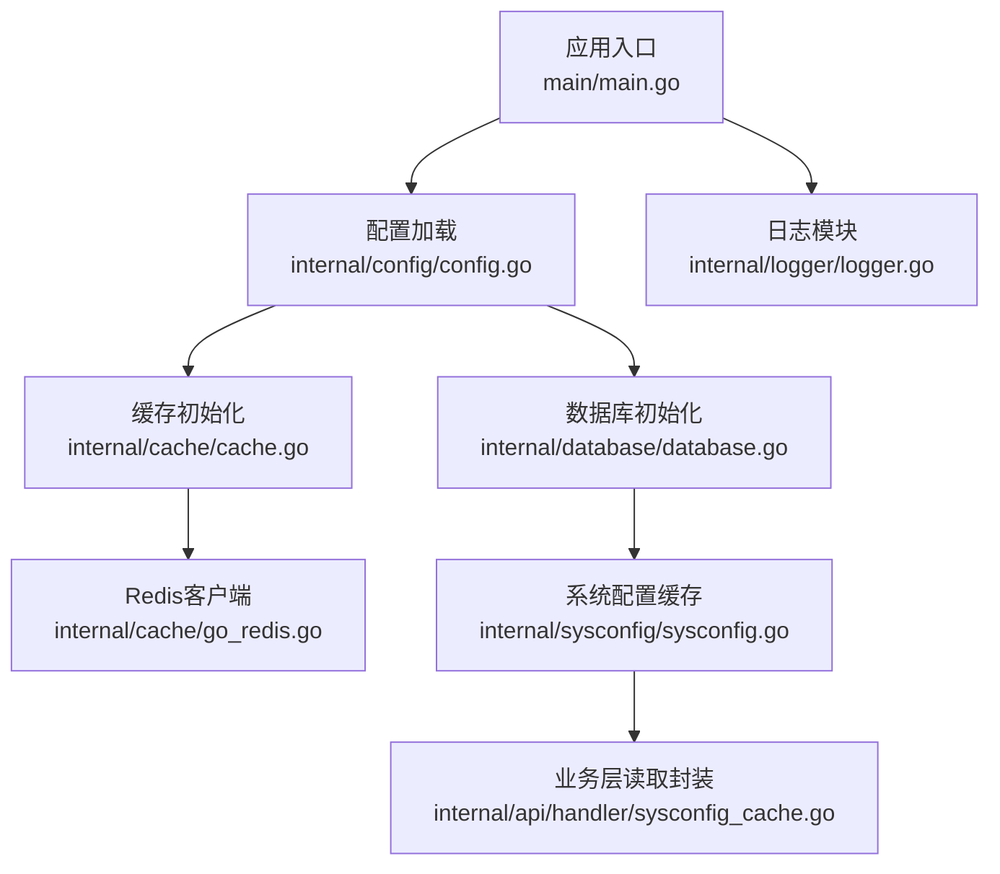
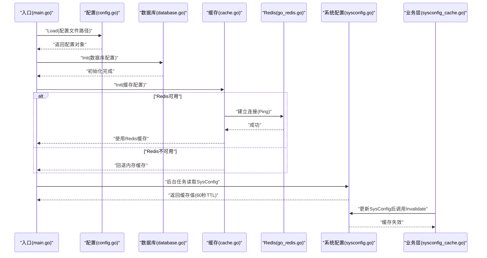
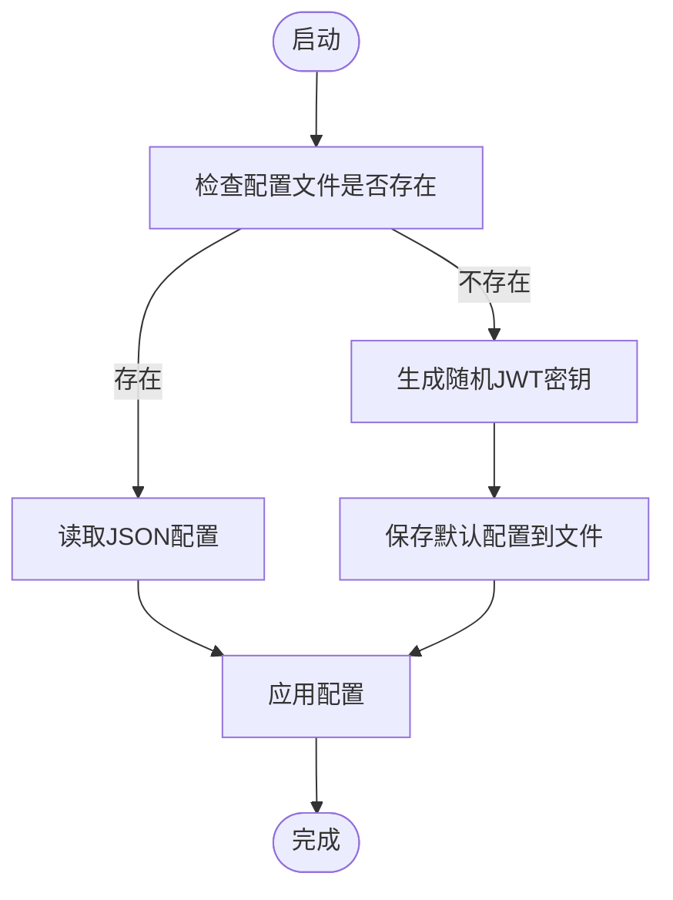
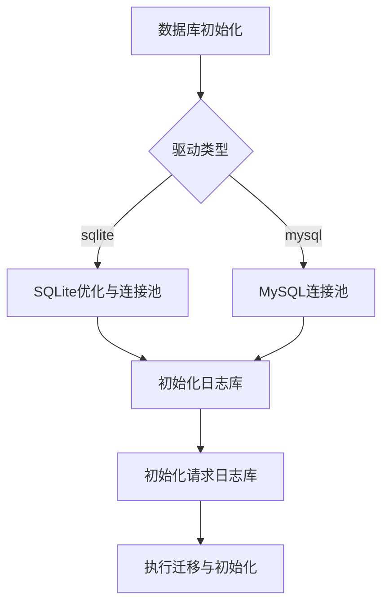
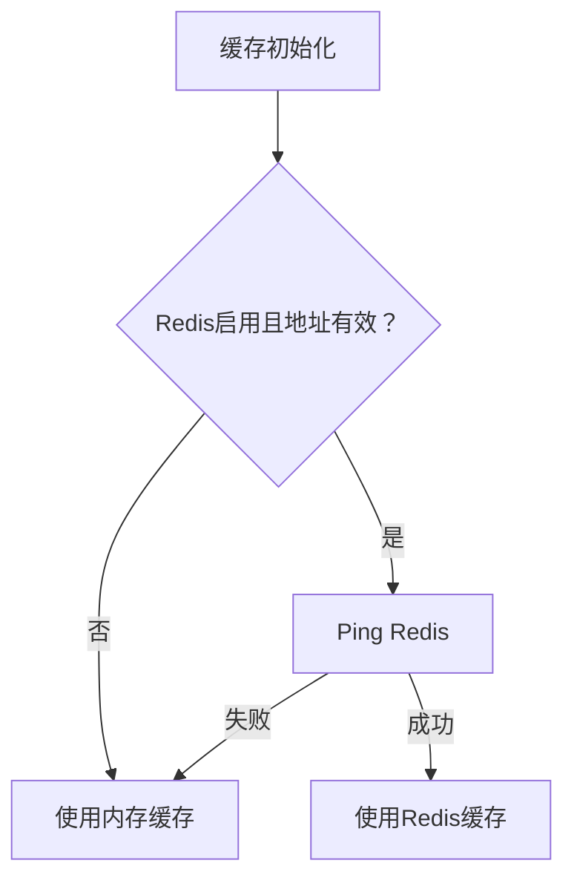
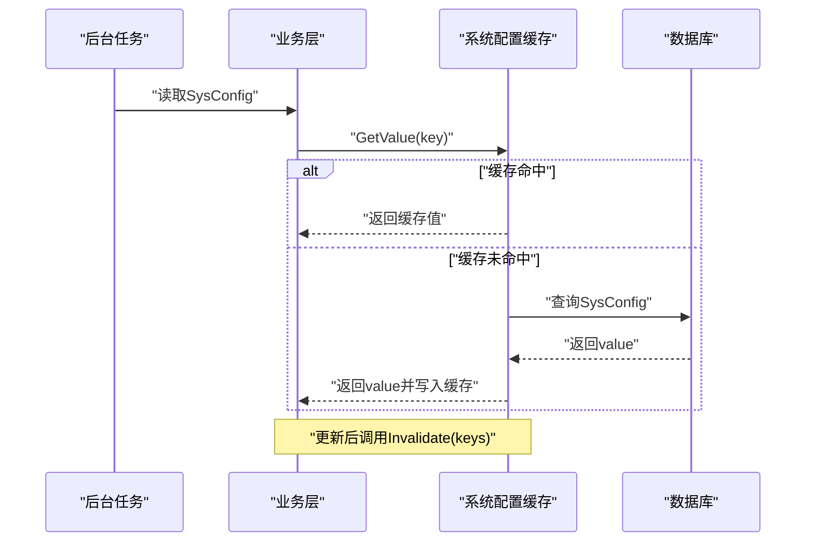
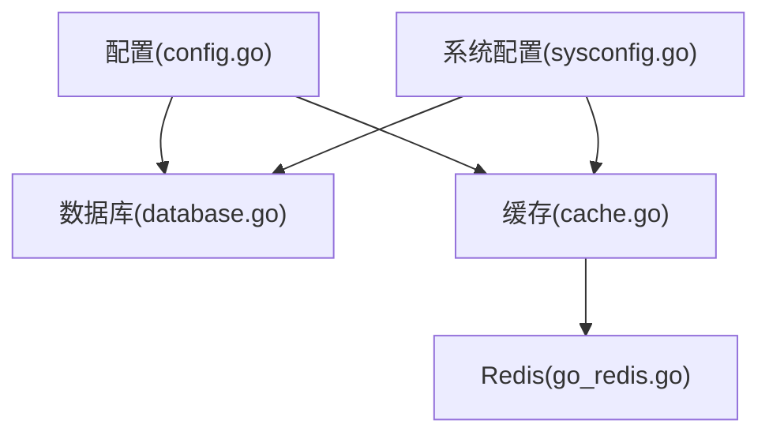

# 配置管理

<cite>
**本文引用的文件**
- [main.go](file://main/main.go)
- [config.go](file://main/internal/config/config.go)
- [database.go](file://main/internal/database/database.go)
- [cache.go](file://main/internal/cache/cache.go)
- [go_redis.go](file://main/internal/cache/go_redis.go)
- [logger.go](file://main/internal/logger/logger.go)
- [sysconfig.go](file://main/internal/sysconfig/sysconfig.go)
- [sysconfig_cache.go](file://main/internal/api/handler/sysconfig_cache.go)
- [Dockerfile](file://Dockerfile)
</cite>

## 目录
1. [简介](#简介)
2. [项目结构](#项目结构)
3. [核心组件](#核心组件)
4. [架构总览](#架构总览)
5. [详细组件分析](#详细组件分析)
6. [依赖分析](#依赖分析)
7. [性能考虑](#性能考虑)
8. [故障排查指南](#故障排查指南)
9. [结论](#结论)
10. [附录](#附录)

## 简介
本文件面向DNSPlane的配置管理，系统性阐述配置文件结构、配置项作用、默认值与生成机制、运行时配置的缓存与失效策略、系统设置的读取与缓存、数据库连接与日志清理配置、JWT密钥与安全建议、以及不同环境下的配置差异与最佳实践。文档同时给出配置验证与版本迁移的建议，并提供可视化图示帮助理解。

## 项目结构
DNSPlane的配置管理由以下模块协同完成：
- 应用入口负责加载配置文件并初始化数据库、缓存、监控、任务等子系统
- 配置模块定义配置结构、默认值与持久化
- 数据库模块根据配置建立主库与日志库连接，并执行迁移与初始化
- 缓存模块支持Redis与内存两种后端，具备统一接口与键空间前缀
- 系统配置缓存层为后台任务提供SysConfig读取缓存，避免频繁访问数据库
- 日志模块提供全局日志器，支持文件轮转与清理

**图表来源**
- [main.go:52-120](file://main/main.go#L52-L120)
- [config.go:82-123](file://main/internal/config/config.go#L82-L123)
- [database.go:73-149](file://main/internal/database/database.go#L73-L149)
- [cache.go:47-86](file://main/internal/cache/cache.go#L47-L86)
- [go_redis.go:12-138](file://main/internal/cache/go_redis.go#L12-L138)
- [sysconfig.go:27-46](file://main/internal/sysconfig/sysconfig.go#L27-L46)
- [sysconfig_cache.go:14-40](file://main/internal/api/handler/sysconfig_cache.go#L14-L40)
- [logger.go:56-91](file://main/internal/logger/logger.go#L56-L91)

**章节来源**
- [main.go:52-120](file://main/main.go#L52-L120)
- [config.go:12-19](file://main/internal/config/config.go#L12-L19)

## 核心组件
- 配置结构与默认值
  - server：监听地址、端口、运行模式、基础URL
  - database：驱动类型、主机、端口、账号、密码、数据库名、SQLite文件路径
  - jwt：密钥、过期小时数
  - proxy：是否启用、代理URL
  - log_cleanup：是否启用、成功/错误日志保留条数、清理间隔
  - redis：是否启用、地址、密码、DB索引、连接池大小、最小空闲连接、键前缀
- 配置加载与持久化
  - 加载顺序：先设置默认值，再读取配置文件，不存在则生成随机JWT密钥并保存默认配置
  - 提供Get/Save方法用于运行时读取与保存
- 数据库初始化
  - 支持sqlite与mysql，自动创建目录、优化SQLite、设置连接池、初始化日志库与请求日志库
- 缓存初始化
  - 优先使用Redis，失败回退内存缓存；支持键前缀避免多环境冲突
- 系统配置缓存
  - 为后台任务提供SysConfig读取缓存（60秒TTL），并提供失效接口
- 日志模块
  - 支持文件轮转、过期清理、级别控制、彩色输出

**章节来源**
- [config.go:82-161](file://main/internal/config/config.go#L82-L161)
- [database.go:73-149](file://main/internal/database/database.go#L73-L149)
- [cache.go:47-86](file://main/internal/cache/cache.go#L47-L86)
- [sysconfig.go:18-46](file://main/internal/sysconfig/sysconfig.go#L18-L46)
- [logger.go:16-456](file://main/internal/logger/logger.go#L16-L456)

## 架构总览
DNSPlane的配置生命周期如下：
- 启动阶段：命令行参数指定配置文件路径，加载配置并初始化数据库与缓存
- 运行阶段：系统配置通过缓存层读取，后台任务定期更新运行状态；日志模块按策略轮转与清理
- 配置变更：通过业务层更新SysConfig后，调用缓存失效接口，确保下次读取最新值

**图表来源**
- [main.go:52-120](file://main/main.go#L52-L120)
- [config.go:82-123](file://main/internal/config/config.go#L82-L123)
- [database.go:73-149](file://main/internal/database/database.go#L73-L149)
- [cache.go:47-86](file://main/internal/cache/cache.go#L47-L86)
- [go_redis.go:12-138](file://main/internal/cache/go_redis.go#L12-L138)
- [sysconfig.go:27-46](file://main/internal/sysconfig/sysconfig.go#L27-L46)
- [sysconfig_cache.go:14-40](file://main/internal/api/handler/sysconfig_cache.go#L14-L40)

## 详细组件分析

### 配置文件结构与配置项说明
- server
  - host：监听地址
  - port：监听端口
  - mode：运行模式（debug/release）
  - base_url：对外访问的基础URL
- database
  - driver：数据库驱动（sqlite/mysql）
  - host/port/username/password/database：MySQL连接参数
  - file_path：SQLite文件路径（用于主库、日志库、请求日志库路径基于此推导）
- jwt
  - secret：JWT密钥（首次生成随机密钥并保存）
  - expire_hour：令牌过期间（小时）
- proxy
  - enable：是否启用代理
  - url：代理URL
- log_cleanup
  - enable：是否启用自动清理
  - success_keep_count：保留成功日志条数
  - error_keep_count：保留错误日志条数
  - cleanup_interval：清理间隔（小时）
- redis
  - enable：是否启用Redis
  - addr：地址（host:port）
  - password：密码
  - db：数据库索引
  - pool_size：连接池大小
  - min_idle_conns：最小空闲连接
  - key_prefix：键前缀（建议以“dnsplane:”开头）

**章节来源**
- [config.go:12-76](file://main/internal/config/config.go#L12-L76)
- [config.go:55-65](file://main/internal/config/config.go#L55-L65)

### 配置加载与默认值生成
- 默认值：在未指定配置文件或文件不存在时，会生成默认配置并写入文件，其中JWT密钥通过随机数生成
- 保存逻辑：提供Save方法将当前内存中的配置写回文件

**图表来源**
- [config.go:82-123](file://main/internal/config/config.go#L82-L123)
- [config.go:133-145](file://main/internal/config/config.go#L133-L145)

**章节来源**
- [config.go:82-123](file://main/internal/config/config.go#L82-L123)
- [config.go:133-145](file://main/internal/config/config.go#L133-L145)

### 数据库连接配置与初始化
- 驱动选择：sqlite或mysql
- SQLite优化：WAL模式、缓存大小、busy_timeout、mmap等
- 连接池：MySQL默认较大连接池，SQLite默认较小但针对WAL优化
- 独立日志库：日志库与请求日志库分别初始化，路径基于主库文件路径推导
- 迁移与初始化：自动迁移、旧表迁移、管理员初始化

**图表来源**
- [database.go:73-149](file://main/internal/database/database.go#L73-L149)
- [database.go:233-320](file://main/internal/database/database.go#L233-L320)

**章节来源**
- [database.go:73-149](file://main/internal/database/database.go#L73-L149)
- [database.go:233-320](file://main/internal/database/database.go#L233-L320)

### 缓存配置与动态回退
- Redis优先：建立连接并Ping验证，成功则使用Redis后端
- 回退策略：Redis连接失败时回退到内存缓存，记录告警日志
- 键前缀：支持逻辑键前缀，避免多环境冲突

**图表来源**
- [cache.go:47-86](file://main/internal/cache/cache.go#L47-L86)
- [go_redis.go:12-138](file://main/internal/cache/go_redis.go#L12-L138)

**章节来源**
- [cache.go:47-86](file://main/internal/cache/cache.go#L47-L86)
- [go_redis.go:12-138](file://main/internal/cache/go_redis.go#L12-L138)

### 系统设置的管理与缓存
- 读取缓存：60秒TTL，先查缓存，未命中则查数据库并写入缓存
- 缓存失效：更新SysConfig后调用Invalidate，清除对应键的缓存
- 业务层封装：handler层提供统一的GetValue与Invalidate接口

**图表来源**
- [sysconfig.go:27-46](file://main/internal/sysconfig/sysconfig.go#L27-L46)
- [sysconfig_cache.go:14-40](file://main/internal/api/handler/sysconfig_cache.go#L14-L40)

**章节来源**
- [sysconfig.go:18-46](file://main/internal/sysconfig/sysconfig.go#L18-L46)
- [sysconfig_cache.go:14-40](file://main/internal/api/handler/sysconfig_cache.go#L14-L40)

### 日志级别与轮转策略
- 日志级别：Debug/Info/Warn/Error
- 轮转策略：按日切分、单文件最大10MB、最多保留30个备份、最多保留30天
- 输出目标：文件+控制台（可配置），支持彩色输出
- 清理策略：按保留上限与过期时间清理

**章节来源**
- [logger.go:16-456](file://main/internal/logger/logger.go#L16-L456)

### 运行时配置的动态更新机制
- SysConfig缓存：60秒TTL，减少数据库压力
- 失效策略：更新后主动Invalidate，确保下次读取最新值
- 适用范围：认证相关配置、站点URL、通知渠道等

**章节来源**
- [sysconfig.go:18-46](file://main/internal/sysconfig/sysconfig.go#L18-L46)
- [sysconfig_cache.go:19-40](file://main/internal/api/handler/sysconfig_cache.go#L19-L40)

### 环境变量与优先级规则
- 当前仓库未发现显式的环境变量解析逻辑
- 建议实践（概念性说明，非代码映射）
  - 命令行参数优先于配置文件
  - 环境变量次之（如需扩展，建议在配置加载阶段解析）
  - 配置文件为最终落盘来源
  - 生产环境建议通过外部机密管理（如Kubernetes Secret）注入敏感配置

[本节为概念性说明，不直接分析具体文件，故无“章节来源”]

### 不同环境下的配置差异与最佳实践
- 开发环境
  - server.mode: debug
  - database.driver: sqlite（便于本地开发）
  - redis.enable: false 或使用本地Redis
  - log_cleanup.enable: false 或较小保留量
- 生产环境
  - server.mode: release
  - database.driver: mysql（高可用、备份）
  - redis.enable: true（开启连接池与键前缀）
  - log_cleanup.enable: true（按业务量设定保留条数与间隔）
- 容器化部署
  - Dockerfile暴露8080端口，ENTRYPOINT为二进制
  - 建议通过卷挂载配置文件与数据目录

**章节来源**
- [Dockerfile:28-34](file://Dockerfile#L28-L34)

### 配置安全与敏感信息保护
- JWT密钥：首次启动自动生成随机密钥并保存，生产环境应妥善保管
- 敏感字段：数据库密码、Redis密码、第三方API密钥等建议通过机密管理注入
- 网络安全：HTTPS传输、反向代理场景注意X-Forwarded-Proto识别
- 日志脱敏：避免在日志中输出敏感信息

**章节来源**
- [config.go:112-131](file://main/internal/config/config.go#L112-L131)
- [main.go:323-328](file://main/main.go#L323-L328)

### 配置验证与版本管理
- 配置验证（建议）
  - 类型校验：端口范围、布尔值、枚举值
  - 必填校验：数据库连接参数、JWT密钥长度
  - 依赖校验：启用代理时需提供URL
- 版本管理与迁移（建议）
  - 新增配置项时增加默认值与迁移逻辑
  - 旧字段废弃时提供迁移脚本与兼容读取
  - 通过配置版本号控制迁移策略

[本节为通用实践建议，不直接分析具体文件，故无“章节来源”]

## 依赖分析
- 配置对数据库与缓存的依赖
  - 配置加载完成后，数据库与缓存按配置初始化
- 缓存对Redis的依赖
  - Redis可用则使用Redis后端，否则回退内存缓存
- 系统配置缓存对数据库与缓存的依赖
  - 读取SysConfig时先查缓存，未命中查数据库并写入缓存

**图表来源**
- [config.go:82-123](file://main/internal/config/config.go#L82-L123)
- [database.go:73-149](file://main/internal/database/database.go#L73-L149)
- [cache.go:47-86](file://main/internal/cache/cache.go#L47-L86)
- [go_redis.go:12-138](file://main/internal/cache/go_redis.go#L12-L138)
- [sysconfig.go:27-46](file://main/internal/sysconfig/sysconfig.go#L27-L46)

**章节来源**
- [config.go:82-123](file://main/internal/config/config.go#L82-L123)
- [database.go:73-149](file://main/internal/database/database.go#L73-L149)
- [cache.go:47-86](file://main/internal/cache/cache.go#L47-L86)
- [sysconfig.go:27-46](file://main/internal/sysconfig/sysconfig.go#L27-L46)

## 性能考虑
- 数据库
  - SQLite：WAL模式、缓存大小、连接池并发读优化
  - MySQL：较大的连接池与合理的空闲连接数
- 缓存
  - Redis连接池大小与最小空闲连接合理配置
  - 键前缀避免跨环境键冲突
- 日志
  - 文件轮转与清理策略避免磁盘占用过高

**章节来源**
- [database.go:34-71](file://main/internal/database/database.go#L34-L71)
- [cache.go:47-86](file://main/internal/cache/cache.go#L47-L86)
- [logger.go:16-456](file://main/internal/logger/logger.go#L16-L456)

## 故障排查指南
- 配置文件加载失败
  - 检查配置文件路径与权限
  - 首次启动若文件不存在，系统会生成默认配置与随机JWT密钥
- 数据库连接失败
  - 校验数据库驱动、主机、端口、账号、密码、数据库名或文件路径
  - MySQL连接池过大可能导致资源紧张，适当调整
- Redis连接失败
  - 检查地址、密码、DB索引与连接池配置
  - 若Redis不可用，系统会回退内存缓存
- 日志文件异常
  - 检查日志目录权限与磁盘空间
  - 轮转与清理策略是否符合预期

**章节来源**
- [config.go:111-120](file://main/internal/config/config.go#L111-L120)
- [database.go:80-103](file://main/internal/database/database.go#L80-L103)
- [cache.go:74-84](file://main/internal/cache/cache.go#L74-L84)
- [logger.go:107-171](file://main/internal/logger/logger.go#L107-L171)

## 结论
DNSPlane的配置管理采用“配置文件为主、默认值兜底、运行时可保存”的设计，结合数据库与缓存的初始化流程，形成清晰的配置生命周期。系统配置通过缓存层降低数据库压力，并提供失效机制保证配置变更的及时生效。建议在生产环境中强化环境变量注入与机密管理，完善配置验证与版本迁移策略，以提升安全性与可维护性。

## 附录
- 配置文件示例（概念性说明）
  - server.host/port/mode/base_url
  - database.driver/host/port/username/password/database/file_path
  - jwt.secret/expire_hour
  - proxy.enable/url
  - log_cleanup.enable/success_keep_count/error_keep_count/cleanup_interval
  - redis.enable/addr/password/db/pool_size/min_idle_conns/key_prefix

[本节为概念性说明，不直接分析具体文件，故无“章节来源”]