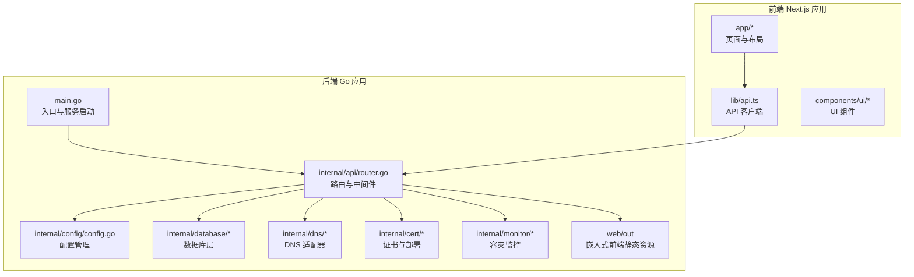
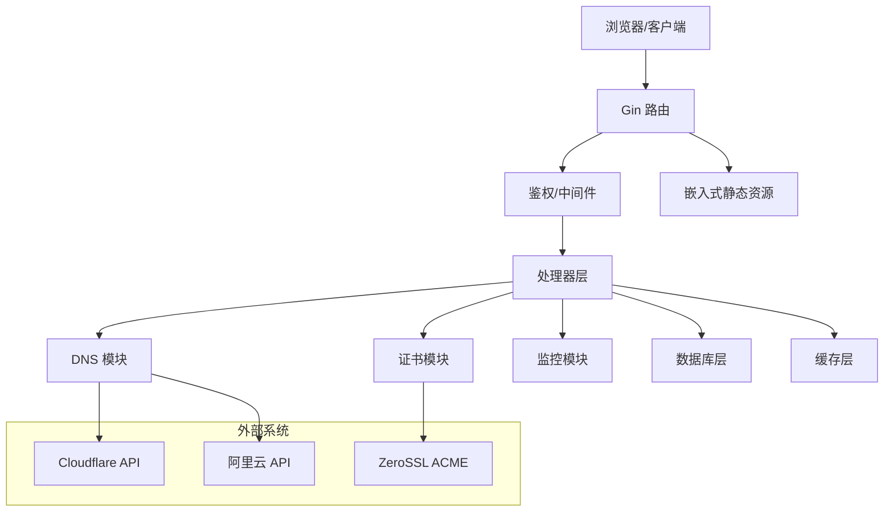
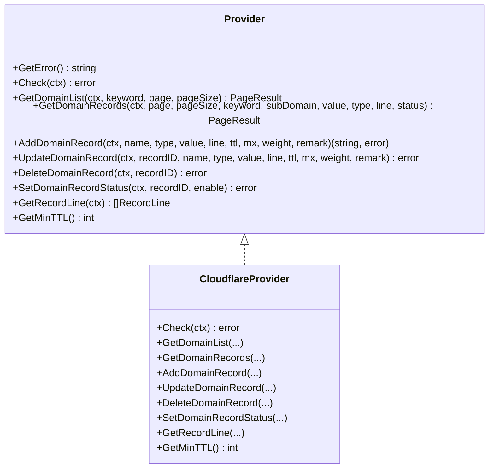
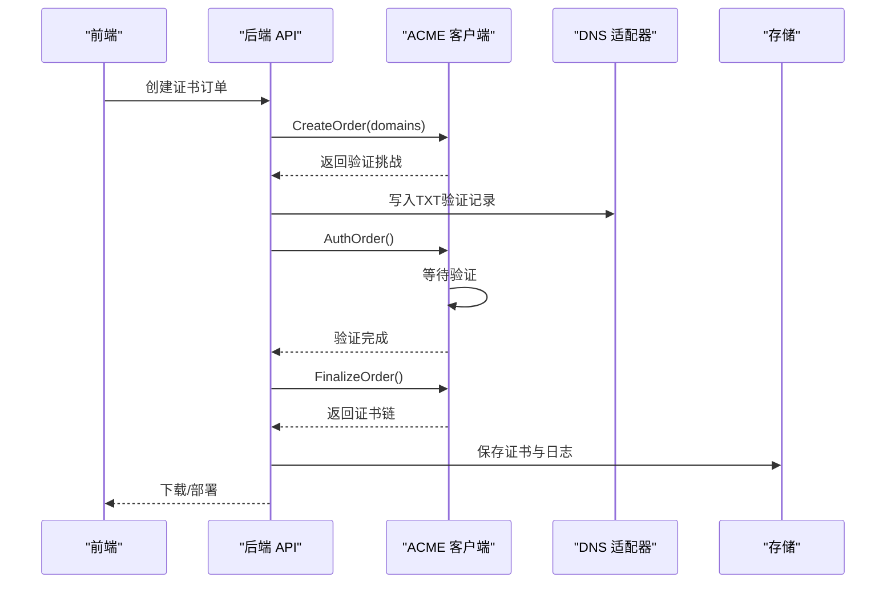
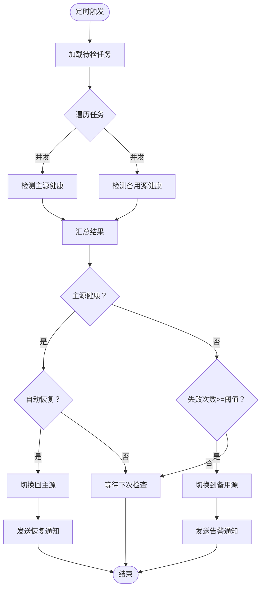
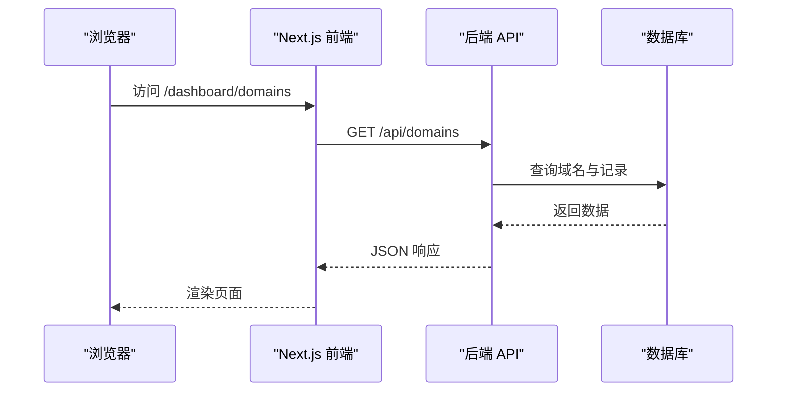
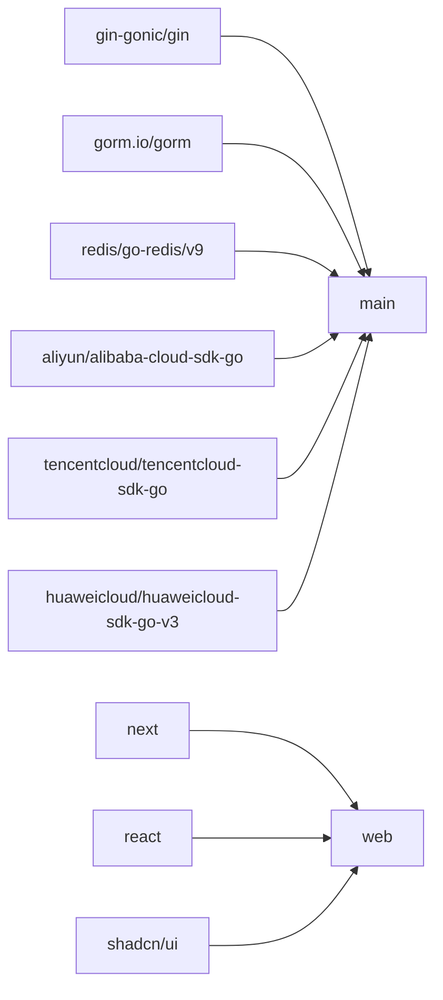

# 项目概述

<cite>
**本文档引用的文件**
- [README.md](file://README.md)
- [main.go](file://main/main.go)
- [router.go](file://main/internal/api/router.go)
- [config.go](file://main/internal/config/config.go)
- [models.go](file://main/internal/models/models.go)
- [interface.go (DNS)](file://main/internal/dns/interface.go)
- [cloudflare.go](file://main/internal/dns/providers/cloudflare/cloudflare.go)
- [interface.go (证书)](file://main/internal/cert/interface.go)
- [acme.go](file://main/internal/cert/acme/acme.go)
- [monitor.go](file://main/internal/monitor/monitor.go)
- [api.ts](file://web/lib/api.ts)
- [layout.tsx](file://web/app/layout.tsx)
- [package.json](file://web/package.json)
- [Dockerfile](file://Dockerfile)
- [go.mod](file://main/go.mod)
</cite>

## 目录
1. [简介](#简介)
2. [项目结构](#项目结构)
3. [核心组件](#核心组件)
4. [架构总览](#架构总览)
5. [详细组件分析](#详细组件分析)
6. [依赖关系分析](#依赖关系分析)
7. [性能考量](#性能考量)
8. [故障排查指南](#故障排查指南)
9. [结论](#结论)
10. [附录](#附录)

## 简介
DNSPlane 是一款现代化的 DNS 管理平台，基于原 PHP 版 dnsmgr 重构为 Go 语言实现。项目提供多平台 DNS 管理、SSL 证书申请与部署、容灾切换、多用户权限管理、现代化 UI 界面等能力。后端采用 Go + Gin 框架，前端基于 Next.js 16，使用 shadcn/ui 构建响应式界面。

- 重构动机与优势
  - 性能与稳定性：Go 的高并发与低 GC 压力适合大规模 DNS/证书/监控场景。
  - 可维护性：模块化设计与清晰的接口抽象，便于扩展新的 DNS/证书提供商。
  - 部署友好：单二进制 + 嵌入式前端静态资源，Docker 化部署简单。
  - 生态兼容：内置 SQLite/MySQL 支持，Redis 可选缓存，完善的中间件与日志体系。

- 核心功能特性
  - 多平台 DNS 管理：支持阿里云、腾讯云、华为云、Cloudflare 等多家厂商适配。
  - 证书生命周期：集成 ACME 协议，支持 Let's Encrypt、ZeroSSL 等，支持 CNAME 验证。
  - 容灾切换：支持 ping/tcp/http/https 健康检查，自动故障切换与恢复。
  - 多用户与权限：支持用户角色、API Key、TOTP 二次验证、OAuth 绑定。
  - 现代化 UI：基于 Next.js 与 shadcn/ui，响应式布局，良好的交互体验。

**章节来源**
- [README.md:1-172](file://README.md#L1-L172)

## 项目结构
项目采用前后端分离的双仓库结构：
- 后端（Go）：位于 main/，包含 API 层、业务模块（DNS、证书、监控）、配置与数据库层、缓存与日志等。
- 前端（Next.js）：位于 web/，包含页面、组件、工具库与构建脚本，构建产物嵌入到后端。

**图表来源**
- [main.go:52-147](file://main/main.go#L52-L147)
- [router.go:14-274](file://main/internal/api/router.go#L14-L274)
- [config.go:82-123](file://main/internal/config/config.go#L82-L123)

**章节来源**
- [README.md:14-40](file://README.md#L14-L40)
- [Dockerfile:1-34](file://Dockerfile#L1-L34)

## 核心组件
- 配置中心
  - 支持 server、database、jwt、proxy、log_cleanup、redis 等配置项，支持默认值与随机密钥生成。
- 数据模型
  - 用户、账户、域名、权限、日志、容灾任务、证书订单/部署、CNAME 代理、定时任务等。
- DNS 适配器
  - Provider 接口统一各厂商 API，支持域名/记录查询、增删改、状态控制、线路与最小 TTL 等。
- 证书与部署
  - Provider 接口统一 ACME 流程，支持注册、下单、验证、签发、吊销、取消；部署适配器支持 SSH/本地/CDN/面板等。
- 容灾监控
  - 周期性健康检查，支持多源并发探测、自动切换/恢复、通知与日志记录。
- API 层
  - Gin 路由分组 /api，鉴权、CORS、日志、审计、签名、API Key 等中间件。
- 前端
  - Next.js 16 应用，shadcn/ui 组件库，响应式布局，API 客户端封装统一请求与鉴权。

**章节来源**
- [config.go:12-161](file://main/internal/config/config.go#L12-L161)
- [models.go:9-357](file://main/internal/models/models.go#L9-L357)
- [interface.go (DNS):40-125](file://main/internal/dns/interface.go#L40-L125)
- [interface.go (证书):49-114](file://main/internal/cert/interface.go#L49-L114)
- [monitor.go:45-114](file://main/internal/monitor/monitor.go#L45-L114)
- [router.go:14-162](file://main/internal/api/router.go#L14-L162)
- [api.ts:9-101](file://web/lib/api.ts#L9-L101)

## 架构总览
后端通过 Gin 路由聚合各模块，嵌入式前端静态资源由路由 NoRoute 分发；数据库支持 SQLite/MySQL，Redis 可选；监控服务独立线程运行，定时扫描容灾任务并异步处理。

**图表来源**
- [main.go:117-127](file://main/main.go#L117-L127)
- [router.go:14-162](file://main/internal/api/router.go#L14-L162)
- [cloudflare.go:17-30](file://main/internal/dns/providers/cloudflare/cloudflare.go#L17-L30)
- [acme.go:36-67](file://main/internal/cert/acme/acme.go#L36-L67)

## 详细组件分析

### DNS 管理模块
- 设计要点
  - Provider 接口抽象：统一域名/记录 CRUD、状态控制、线路查询、最小 TTL 等能力。
  - 适配器注册：通过 init() 注册各厂商适配器，运行时按类型动态选择。
  - Cloudflare 示例：演示认证头设置、分页查询、错误解析等。
- 关键流程
  - 域名列表与记录列表：分页参数透传至第三方 API。
  - 记录变更：新增/更新/删除/状态切换，均调用对应 Provider 方法。
  - 线路与最小 TTL：不同厂商支持差异，通过 Features 标识。

**图表来源**
- [interface.go (DNS):40-86](file://main/internal/dns/interface.go#L40-L86)
- [cloudflare.go:17-51](file://main/internal/dns/providers/cloudflare/cloudflare.go#L17-L51)

**章节来源**
- [interface.go (DNS):40-125](file://main/internal/dns/interface.go#L40-L125)
- [cloudflare.go:138-200](file://main/internal/dns/providers/cloudflare/cloudflare.go#L138-L200)

### 证书管理与部署模块
- 设计要点
  - Provider 接口：注册、下单、验证、签发、吊销、取消；支持 CNAME 验证。
  - ACME 客户端：内置 Let's Encrypt、ZeroSSL、Google、LiteSSL 等目录，支持自定义 ACME。
  - 部署适配：支持 SSH、本地文件、CDN、面板等多种部署方式。
- 关键流程
  - 证书申请：创建订单、生成验证记录、等待验证、签发证书。
  - 部署流程：根据配置将证书写入目标位置或调用 CDN/面板 API。
  - CNAME 代理：为未支持 TXT 验证的域名提供 CNAME 验证方案。

**图表来源**
- [interface.go (证书):49-77](file://main/internal/cert/interface.go#L49-L77)
- [acme.go:36-67](file://main/internal/cert/acme/acme.go#L36-L67)

**章节来源**
- [interface.go (证书):49-114](file://main/internal/cert/interface.go#L49-L114)
- [acme.go:90-124](file://main/internal/cert/acme/acme.go#L90-L124)

### 容灾监控与自动切换
- 设计要点
  - 任务驱动：DMTask 定义主备值、检查类型、频率、阈值、通知等。
  - 并发探测：主源与备用源并发健康检查，支持 ping/tcp/http/https。
  - 智能切换：根据平台能力选择暂停/删除/重建策略，支持 CNAME 解析为 A 记录。
  - 通知机制：邮件/Telegram/Webhook 等多通道通知。
- 关键流程

**图表来源**
- [monitor.go:130-151](file://main/internal/monitor/monitor.go#L130-L151)
- [monitor.go:257-318](file://main/internal/monitor/monitor.go#L257-L318)
- [monitor.go:376-443](file://main/internal/monitor/monitor.go#L376-L443)

**章节来源**
- [monitor.go:45-114](file://main/internal/monitor/monitor.go#L45-L114)
- [monitor.go:320-374](file://main/internal/monitor/monitor.go#L320-L374)

### API 与前端交互
- 设计要点
  - 后端 API 以 /api 为前缀，Bearer Token 认证，公开接口用于安装与验证码。
  - 前端 Next.js 通过 api.ts 封装请求，自动注入 Authorization 头，处理 401 重定向登录。
  - 嵌入式静态资源：后端通过 embedFS 提供前端页面，NoRoute 降级处理动态路由。
- 关键流程

**图表来源**
- [router.go:217-271](file://main/internal/api/router.go#L217-L271)
- [api.ts:33-99](file://web/lib/api.ts#L33-L99)

**章节来源**
- [router.go:14-162](file://main/internal/api/router.go#L14-L162)
- [api.ts:9-101](file://web/lib/api.ts#L9-L101)

## 依赖关系分析
- 后端依赖
  - Web 框架：gin-gonic/gin
  - ORM：gorm.io/gorm + sqlite/mysql 驱动
  - Redis：redis/go-redis/v9
  - 加解密与加密：golang.org/x/crypto、filippo.io/edwards25519
  - DNS/证书 SDK：阿里云、腾讯云、华为云、Cloudflare 等官方 SDK
- 前端依赖
  - Next.js 16、React 19、shadcn/ui、Radix UI、TailwindCSS
  - 通知：@radix-ui/react-*、sonner
  - QRCode、go-captcha-react 等

**图表来源**
- [go.mod:5-28](file://main/go.mod#L5-L28)
- [package.json:12-40](file://web/package.json#L12-L40)

**章节来源**
- [go.mod:1-96](file://main/go.mod#L1-L96)
- [package.json:1-53](file://web/package.json#L1-L53)

## 性能考量
- 并发与资源
  - 容灾监控使用 goroutine 并发探测主/备源，减少整体检查耗时。
  - 任务处理加锁避免重复执行，提升吞吐。
- 数据库与缓存
  - SQLite 默认，支持 MySQL；Redis 可选缓存，降低热点查询压力。
  - 定期维护（清理、VACUUM、索引优化）保障长期运行稳定性。
- 网络与安全
  - HTTP 客户端设置超时与连接池，DNS/证书 API 请求带超时控制。
  - JWT 过期时间可配置，支持 API Key 与 TOTP 二次验证。

[本节为通用指导，无需特定文件来源]

## 故障排查指南
- 常见问题定位
  - 安装与登录：首次访问 /api/install/status 与 /api/install，确认安装状态与管理员账户创建。
  - 认证失败：检查 Authorization 头与 Bearer Token，401 时前端会自动跳转登录。
  - DNS/证书调用失败：查看 Provider.GetError() 与后端日志，确认凭证与网络连通性。
  - 容灾切换异常：检查 DMTask 配置（check_type、timeout、cycle、notify_enabled），查看 DMCheckLog 与 DMLog。
- 日志与清理
  - 操作日志与请求日志分别存储于独立数据库，支持按天清理与统计。
  - 前端可通过 /api/system/log/clean 清理请求日志。

**章节来源**
- [router.go:26-36](file://main/internal/api/router.go#L26-L36)
- [api.ts:59-69](file://web/lib/api.ts#L59-L69)
- [models.go:105-120](file://main/internal/models/models.go#L105-L120)
- [models.go:332-356](file://main/internal/models/models.go#L332-L356)

## 结论
DNSPlane 通过 Go 语言实现高性能、可扩展的 DNS 管理平台，结合 ACME 证书与容灾监控能力，满足企业级多平台 DNS 管理与自动化运维需求。前后端分离与 Docker 化部署降低了运维复杂度，现代化 UI 提升了用户体验。建议在生产环境中启用 Redis 缓存、完善通知配置，并定期进行数据库维护与备份。

[本节为总结，无需特定文件来源]

## 附录

### 快速开始
- 安装依赖
  - 后端：进入 dns/main，执行 go mod tidy
  - 前端：进入 dns/web，执行 bun install 或 npm install
- 构建前端
  - 进入 dns/web，执行 bun run build，产物输出到 ../main/web/out
- 运行后端
  - 进入 dns/main，执行 go run .，服务启动于 http://localhost:8080
- 首次安装
  - 访问 http://localhost:8080，按提示创建管理员账户

**章节来源**
- [README.md:42-75](file://README.md#L42-L75)

### 配置说明
- config.json 关键字段
  - server：host/port/mode/base_url
  - database：driver/host/port/username/password/database/file_path
  - jwt：secret/expire_hour
  - redis：enable/addr/password/db/pool_size/min_idle_conns/key_prefix
  - proxy：enable/url
  - log_cleanup：enable/success_keep_count/error_keep_count/cleanup_interval
- 自动生成与保存
  - 首次加载若无配置文件，将生成随机 JWT 密钥并保存默认配置

**章节来源**
- [README.md:76-96](file://README.md#L76-L96)
- [config.go:82-161](file://main/internal/config/config.go#L82-L161)

### API 接口概览
- 认证与安装
  - POST /api/login、POST /api/install、GET /api/install/status
- 域名与记录
  - GET/POST /api/domains、GET/POST /api/domains/:id/records
- 容灾监控
  - GET/POST /api/monitor/tasks、POST /api/monitor/tasks/:id/switch
- 证书与部署
  - GET/POST /api/cert/orders、GET/POST /api/cert/deploys
- 系统与用户
  - GET/POST /api/system/config、GET/POST /api/users、GET /api/dashboard/stats

**章节来源**
- [README.md:124-148](file://README.md#L124-L148)
- [router.go:23-159](file://main/internal/api/router.go#L23-L159)

### 技术栈与许可证
- 后端技术栈：Go 1.25+、Gin、GORM、SQLite/MySQL、Redis
- 前端技术栈：Next.js 16、React 19、shadcn/ui、TailwindCSS
- 许可证：MIT License

**章节来源**
- [README.md:163-172](file://README.md#L163-L172)
- [go.mod:3](file://main/go.mod#L3)
- [package.json:32](file://web/package.json#L32)